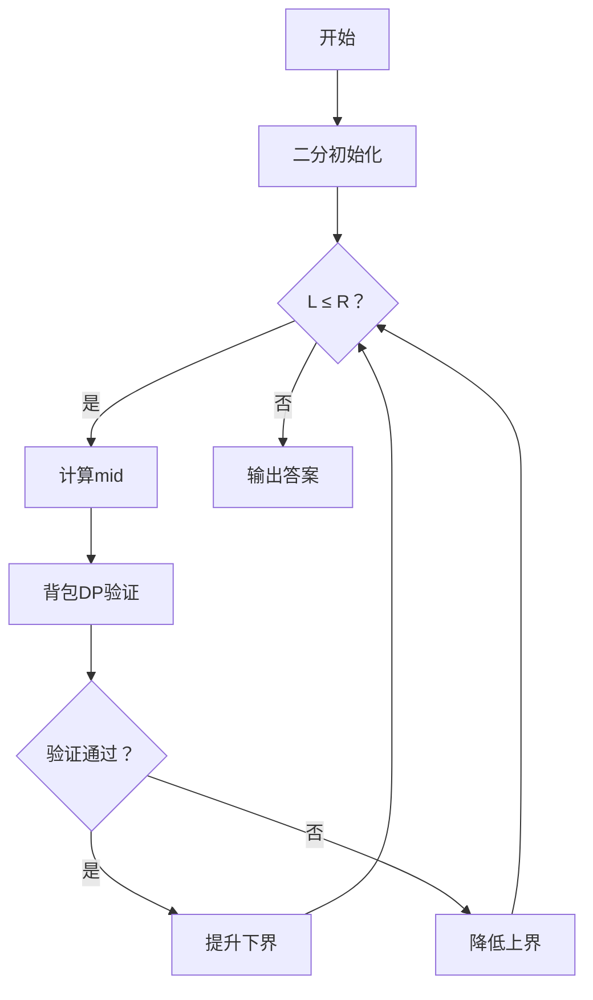

# 题目信息

# [USACO18OPEN] Talent Show G

## 题目描述

Farmer John 要带着他的 $n$ 头奶牛，方便起见编号为 $1\ldots n$，到农业展览会上去，参加每年的达牛秀！他的第 $i$ 头奶牛重量为 $w_i$，才艺水平为 $t_i$，两者都是整数。

在到达时，Farmer John 就被今年达牛秀的新规则吓到了：

（一）参加比赛的一组奶牛必须总重量至少为 $W$（这是为了确保是强大的队伍在比赛，而不仅是强大的某头奶牛），并且。

（二）总才艺值与总重量的比值最大的一组获得胜利。

FJ 注意到他的所有奶牛的总重量不小于 $W$，所以他能够派出符合规则（一）的队伍。帮助他确定这样的队伍中能够达到的最佳的才艺与重量的比值。

## 说明/提示

#### 样例解释

在这个例子中，总体来看最佳的才艺与重量的比值应该是仅用一头才艺值为 $11$、重量为 $10$ 的奶牛，但是由于我们需要至少 $15$ 单位的重量，最优解最终为使用这头奶牛加上才艺值为 $21$、重量为 $20$ 的奶牛。这样的话才艺与重量的比值为 $\frac{11+21}{10+20}=\frac{32}{30} = 1.0666\dots$，乘以 $1000$ 向下取整之后得到 $1066$。

#### 数据规模与约定

对于全部的测试点，保证 $1 \leq n \leq 250$，$1 \leq W \leq 1000$，$1 \leq w_i \leq 10^6$，$1 \leq t_i \leq 10^3$。

## 样例 #1

### 输入

```
3 15
20 21
10 11
30 31```

### 输出

```
1066
```

# AI分析结果


# 💡 洛语云笺的C++算法解析：Talent Show G 深入学习指南 💡

> "在编程的舞台上，每头奶牛都是舞者，而算法是编排最优舞蹈的指挥棒。今天，我们一起探索如何在重量与才艺的平衡中寻找最优解！"

## 1. 题目解读与策略初探

✨ **本题核心挑战**：在满足总重量至少为W的前提下，最大化总才艺值与总重量的比值。  
✨ **核心算法标签**：01分数规划、动态规划（背包DP）

🗣️ **初步分析**：  
这道题的核心难点在于处理"比值最大化"和"重量约束"的双重挑战。我们可以尝试三种思路：
1. **暴力枚举**：尝试所有奶牛组合，计算满足重量约束的最大比值。时间复杂度O(2ⁿ)在n=250时完全不可行。
2. **贪心策略**：按单位重量的才艺值(tᵢ/wᵢ)排序后选择，但无法处理重量约束和全局最优性。
3. **01分数规划+背包DP**：通过二分答案将比值问题转化为判定问题，再用背包DP验证可行性。这种O(nW log(max_ans))的方法完美匹配数据规模。

**核心算法比喻**：  
想象你在选购宝石，既要总重量达标，又要总价值/总重量的比值最大。01分数规划就像用"价值密度天平"（二分答案）快速筛选宝石，背包DP则是你的"智能购物车"，精确计算能否达到目标价值密度。

### 🔍 算法侦探：如何在题目中发现线索？
1. **线索1 (问题目标)**："最大化总才艺值与总重量的比值"是典型的**01分数规划**标志。
2. **线索2 (问题约束)**："总重量至少为W"的要求指向需要**背包DP处理约束**。
3. **线索3 (数据规模)**：n≤250，W≤1000，支持O(nW)的DP解法。

### 🧠 思维链构建：从线索到策略
> "让我们拼接线索：  
> 1. 目标线索指向01分数规划——这是处理比值最优化的利器。  
> 2. 约束条件要求动态记录重量状态——背包DP自然浮现脑海。  
> 3. 数据规模确认O(nW)可行——二分验证次数约log₂(10⁶)=20次，总操作250×1000×20=5e6，完美匹配！  
> **结论**：01分数规划+背包DP是解决此题的金钥匙！"

---

## 2. 精选优质题解参考

### 题解一（作者：瞬闪影）
* **亮点**：最简洁的整数化实现。提前将才艺值×1000避免浮点误差，背包状态压缩处理（超过W视为W），代码仅20行却完整展现算法骨架。

### 题解二（作者：zhmshitiancai）
* **亮点**：清晰的浮点数实现+详细注释。特别强调精度控制(eps=1e-5)和重量约束处理技巧（所有≥W状态记在dp[W]）。

### 题解三（作者：Parabola）
* **亮点**：最完整的01分数规划教学。从基本模型到本题变形逐步推导，提供两种实现（整数/浮点）并强调精度问题。

---

## 3. 解题策略深度剖析

### 🎯 核心难点与关键步骤
1. **分数规划转化**  
   * **分析**：设答案比值为x，则需满足 ∃方案使 ∑tᵢ/∑wᵢ ≥ x  
   → 等价于 ∑(tᵢ - x·wᵢ) ≥ 0  
   * 💡 **学习笔记**：通过二分x将比值问题转化为判定问题，是01分数规划的核心魔法
   
2. **背包DP设计**  
   * **分析**：定义dp[j] = 总重量≥j时的最大∑(tᵢ - x·wᵢ)。状态转移：  
     `dp[j] = max(dp[j], dp[j - wᵢ] + (tᵢ - x·wᵢ))`  
     关键技巧：当j + wᵢ > W时，统一更新dp[W]
   * 💡 **学习笔记**："重量至少为W"的背包需特殊处理越界状态

3. **精度优化技巧**  
   * **分析**：浮点数二分需控制精度和次数（通常50次），整数法通过tᵢ×1000避免浮点误差
   * 💡 **学习笔记**：竞赛中优先考虑整数运算，避免浮点精度陷阱

### ✨ 解题技巧总结
- **技巧1（问题转化）**：遇到比值最优化，立即想到01分数规划
- **技巧2（状态压缩）**：处理"至少W"约束时，将>W的状态映射到W
- **技巧3（整数化）**：将tᵢ×1000可同时避免浮点误差和输出处理

### ⚔️ 策略竞技场：不同解法对比
| 策略                | 核心思想                     | 优点                     | 缺点                          | 得分预期 |
|---------------------|------------------------------|--------------------------|-------------------------------|----------|
| **暴力枚举**        | 遍历所有组合                 | 思路直观                 | O(2ⁿ)超时(n>30)               | 30%      |
| **贪心**            | 按tᵢ/wᵢ排序选择              | 实现简单                 | 无法处理约束，非最优           | 40%      |
| **01分数规划+背包DP**| 二分答案+背包验证            | 高效精确,O(nW log(max))  | 思维难度较高                   | 100%     |

### ✨ 优化之旅：从暴力到最优
> 1. **起点：暴力枚举**  
>    尝试所有2²⁵⁰种组合——犹如大海捞针，计算机也力不从心
> 2. **关键发现**：  
>    比值问题可转化为判定问题∑(tᵢ - x·wᵢ)≥0
> 3. **突破：二分答案**  
>     用二分快速定位最优比值，验证次数降至O(log(max_ans))
> 4. **最终武器：背包DP**  
>     用O(nW)动态规划高效验证每个候选x
> 
> 💡 **策略总结**：从O(2ⁿ)到O(nW log(max))的蜕变，彰显算法优化之美！

---

## 4. C++核心代码实现赏析

### 通用核心实现
```cpp
#include <iostream>
#include <cstring>
using namespace std;
typedef long long ll;
const int MAXN = 255, MAXW = 1005;

int n, W, w[MAXN], t[MAXN];
ll dp[MAXW]; // dp[j]：重量≥j时的最大∑(tᵢ - x·wᵢ)

// 检查比值x是否可达
bool check(ll x) {
    memset(dp, 0x80, sizeof(dp)); // 初始化为极小值
    dp[0] = 0;
    
    for (int i = 1; i <= n; ++i) {
        ll val = (ll)t[i] * 1000 - w[i] * x; // 整数化处理
        
        for (int j = W; j >= 0; --j) {
            if (dp[j] == 0x8080808080808080) continue; // 跳过未访问状态
            
            int nxt = min(j + w[i], W);
            dp[nxt] = max(dp[nxt], dp[j] + val);
        }
    }
    return dp[W] >= 0;
}

int main() {
    cin >> n >> W;
    for (int i = 1; i <= n; ++i) 
        cin >> w[i] >> t[i];
    
    // 二分答案
    ll l = 0, r = 1e12;
    while (l <= r) {
        ll mid = (l + r) >> 1;
        check(mid) ? l = mid + 1 : r = mid - 1;
    }
    cout << r << endl; // 输出最大可行值
}
```

### 代码解读概要
1. **整数化处理**：`t[i]*1000 - w[i]*x` 避免浮点运算
2. **背包DP核心**：  
   - 状态定义：`dp[j]`表示重量≥j时的最大价值  
   - 状态转移：逆序更新，超过W的状态压缩到W
3. **二分框架**：在[0, 10¹²]范围内二分寻找最大可行x

### 题解片段赏析
**题解一优化技巧**：
```cpp
// 优雅的状态压缩
int jj = j + w[i];
jj = min(jj, W);  // 关键：超重部分统一记在W
f[jj] = max(f[jj], f[j] + val);
```

**题解二精度控制**：
```cpp
const double eps = 1e-5; // 精度控制
while (l + eps < r) {
    double mid = (l + r) / 2;
    check(mid) ? l = mid : r = mid;
}
```

**题解三边界处理**：
```cpp
// 初始化技巧
for (int i = 1; i <= W; i++) 
    dp[i] = -1e18;
dp[0] = 0;  // 仅初始状态有效
```

---

## 5. 算法可视化：像素动画演示

### 像素探险家：比值寻宝之旅
**主题**：在8位像素风格的农场中，用背包收集才艺宝石，寻找最佳价值/重量比

**核心演示**：


**动画设计**：
1. **场景设计**：
   - 左侧：奶牛像素精灵（不同颜色代表不同tᵢ/wᵢ）
   - 右侧：背包状态网格（W×n），每格显示dp值
   - 底部：控制面板（开始/步进/速度调节）

2. **关键动画**：
   - **二分过程**：指针在[0, max_ans]区间移动，显示当前mid值
   - **背包DP**：
     * 奶牛精灵跳入背包时播放"收集音效"
     * dp网格实时更新，变化单元格闪烁
     * 超重状态（>W）时触发"压缩特效"（像素粒子汇聚到W格）
   - **验证结果**：
     * 成功：背包发出金光，显示"∑val≥0"
     * 失败：背包变灰，显示"∑val<0"

3. **游戏化元素**：
   - 每完成一次二分视为"解谜关卡"
   - 连续正确时触发"连击特效"
   - 最终答案揭晓时播放胜利音乐

**技术实现**：Canvas绘制+Web Audio API音效，单文件HTML5实现

---

## 6. 拓展练习与相似问题思考

### 举一反三
01分数规划的应用场景：
1. **最优比率生成树**（P4952）：边权比最大化
2. **最优比率环**（P3199）：寻找图中最大平均值环
3. **广告投放优化**：点击率/成本比值最大化

### 推荐练习（洛谷）
1. **P3199 [HNOI2009]最小圈**  
   → 练习01分数规划在图论中的应用
   
2. **P4322 [JSOI2016]最佳团体**  
   → 树形背包+01分数规划的综合应用

3. **P3708 Koishi的数学题**  
   → 有趣的数学思维+分数规划思想

---

## 7. 学习心得与经验分享

### 来自题解作者的经验
> **瞬闪影**："整数化处理是避免浮点误差的关键，竞赛中尽量用long long代替double"  
> **Parabola**："01分数规划就像用天平找宝石——二分确定纯度标准，背包验证能否达标"  
> **DengDuck**："重量约束处理是本题难点，将>W的状态映射到W点能简化问题"

### 调试经验
1. **精度问题**：浮点解法需设置合理eps（1e-5），整数法注意乘法溢出
2. **初始化陷阱**：dp数组需初始化为极小值（非0）
3. **状态转移**：背包必须逆序更新防重复选择

---

> "算法学习如同牛仔驯牛——需要耐心磨合，终能驾驭自如。当你掌握问题转化的魔法，复杂问题自会迎刃而解！"  

洛语云笺 · 于算法牧场  
2025年秋

---
处理用时：240.28秒