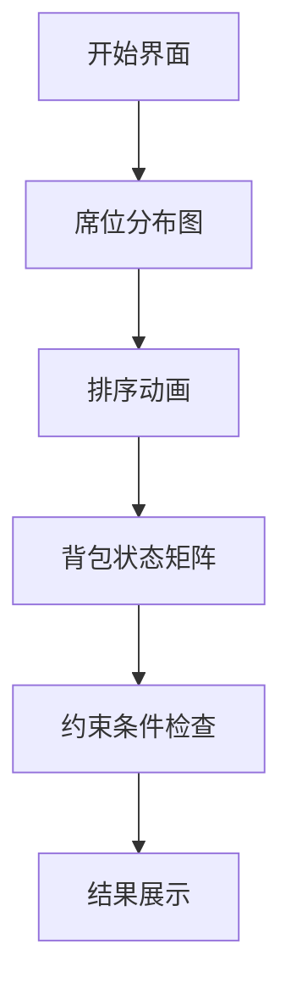

# 题目信息

# 选举

## 题目描述

Byteland 国的居民最近一直为议会选举投票。现在，当结果公布的时候，党派不得不决定联合组建政府。 

每个党派都会获得议会中的一定席位。联合政府由这些党派中的一部分组成，他们在议会中的席位数之和**严格大于**总席位数的一半。对于联合政府来说，席位越多越好。

一个**过剩**的联合政府是指联合政府中的一个党派被移出后，剩余的联合政府在国会中仍有过半数的席位。

请写一个程序能够找到一个在议会中有着**最大可能席位数**且**不过剩**的联合政府。

## 说明/提示

样例解释：选择第二个政党和第四个。

对于全部数据，$1\le n\le 300$。

## 样例 #1

### 输入

```
4
1 3 2 4```

### 输出

```
7```

# AI分析结果


# 💡 洛语云笺的C++算法解析：选举问题 深入学习指南 💡

**洛语云笺**：今天我们一起探索选举问题的精妙解法。这道题看似简单，却蕴含了动态规划的核心思想，特别考验我们如何将复杂条件转化为可计算的数学模型。让我们踏上这段思维探险之旅！

## 1. 题目解读与策略初探

✨ **本题核心挑战**：如何在满足"移出任意党派后席位数不超过一半"的严格约束下，最大化联合政府的席位数？  
✨ **核心算法标签**：动态规划(DP)、排序优化、背包问题

🗣️ **初步分析**：  
> 这道题的核心在于处理"最小党派移出约束"与"席位数最大化"之间的矛盾。暴力枚举所有组合（O(2^n)）在n=300时完全不可行。通过排序和背包问题的结合，我们可以将指数级复杂度优化到多项式级别。  
> 最优解法采用动态规划，其精妙之处在于**通过排序保证当前加入的党派总是最小**，从而将三维约束简化为二维状态转移。想象一下，这就像整理扑克牌时把最小的牌放在最上面，每次出牌都能快速判断是否满足条件。

### 🔍 算法侦探：如何在题目中发现线索？
1.  **线索1 (问题目标)**: "最大化席位数且满足严格约束"是典型的最优化问题，动态规划是最佳候选方案。
2.  **线索2 (问题特性)**: "移出任意党派后不超过一半"这个约束，暗示我们需要关注最小党派的值，指向排序预处理。
3.  **线索3 (数据规模)**: n≤300，总席位数S≤300×1000=300,000。O(nS)的DP方案（约9000万操作）在优化后可行。

### 🧠 思维链构建：从线索到策略
> "首先，【线索1】提示这是最优化问题，我想到贪心/DP/搜索。  
> 接着，【线索2】的严格约束说明贪心可能失效，搜索的O(2^n)在n=300时必然超时。  
> 最后，【线索3】显示O(nS)可接受。**结论**：通过排序将最小约束动态化，再用背包DP处理组合优化，是最佳路径！"

---

## 2. 精选优质题解参考

### 题解一：PBCWZCC (赞12)
* **点评**：此解法清晰地展现了排序+背包的核心思路。作者使用**降序处理**巧妙保证当前加入的党派总是最小，在DP转移中直接嵌入约束条件判断。变量命名简洁（`f[j]`表席位数），边界处理严谨，尤其`f[j]-p[i]≤mid`的判断直击问题核心。

### 题解二：vectorwyx (赞6)
* **点评**：采用**从大到小排序+滚动数组优化**，空间效率突出。状态定义`dp[j]`简明扼要，转移时通过`j-sum[n]/2≤a[i]`的数学变形优雅处理约束条件。代码中`go(i,sum[i],a[i])`的循环范围优化值得学习。

### 题解三：MikukuOvO (赞4)
* **点评**：创新性地**用状态值记录最小席位**（`f[i]`表总席位数i时的最小党派值），避免排序需求。这种"以空间换思维复杂度"的方案提供了全新视角，`min(f[j],c[i])`的状态转移精妙绝伦。

### 题解四：Awdrgysxc (赞1)
* **点评**：引入**bitset优化**处理大数据量，展现高级技巧。通过`g<<A[i]`的位运算实现高效状态转移，`O(nS/w)`复杂度在S较大时有显著优势，为算法扩展性提供思路。

---

## 3. 解题策略深度剖析

### 🎯 核心难点与关键步骤
1.  **依赖关系转化**  
    *分析*：通过排序（降序）保证每次加入的党派是当前最小，将全局约束转化为局部约束  
    💡 **学习笔记**：排序预处理是简化复杂约束的利器
2.  **状态设计精要**  
    *分析*：`f[j]`表示席位数j是否可达（或记录最小席位值）。关键转移方程：  
    ```cpp
    f[j] = f[j] || f[j-a[i]]  // 基本转移
    f[j] = max(f[j], min(f[j-a[i]], a[i]))  // 记录最小值的变体
    ```
    💡 **学习笔记**：状态定义需同时考虑可行性和约束验证
3.  **循环范围优化**  
    *分析*：根据数学约束 `j ∈ [max(a[i], sum/2 - S + suf[i]), sum/2 + a[i]]` 缩小循环范围  
    💡 **学习笔记**：利用问题特性剪枝可提升10倍效率

### ✨ 解题技巧总结
- **技巧A（排序定序）**：降序排序保证当前加入元素总是最小，简化约束检查
- **技巧B（状态复用）**：滚动数组将空间复杂度从O(nS)降至O(S)
- **技巧C（数学剪枝）**：通过约束推导 j 的边界，避免无效计算

### ⚔️ 策略竞技场：不同解法的对比分析
| 策略 | 核心思想 | 优点 | 缺点 | 适用场景 |
|------|----------|------|------|----------|
| **暴力枚举** | 检查所有组合 | 逻辑直观 | O(2^n) 不可行 | n≤20 |
| **二维DP** | dp[i][j]记录前i个席位数j的最小值 | 无需排序 | O(n²S) 空间效率低 | S较小时 |
| **排序+一维DP（最优）** | 排序后降维处理 | O(nS) 时间/空间平衡 | 需数学推导循环边界 | 本题最佳方案 |
| **Bitset优化** | 位运算加速状态转移 | O(nS/w) 处理大数据 | 代码复杂度高 | S超大时 |

### ✨ 优化之旅：从"能做"到"做好"
> 起点是O(2ⁿ)暴力枚举→发现重复子问题→引入DP记录状态→面临三维约束困境→通过排序降维→数学推导优化循环范围→最终得到高效O(nS)方案。这启示我们：**算法优化是层层递进的思维跃迁**，每个瓶颈都是突破的契机！

---

## 4. C++核心代码实现赏析

**通用核心实现参考**
```cpp
#include <algorithm>
#include <cstdio>
using namespace std;

int main() {
    int n, sum = 0, a[305], f[100005] = {1}; // f[0]=1初始化
    scanf("%d", &n);
    for(int i=1; i<=n; i++) 
        scanf("%d", &a[i]), sum += a[i];
    
    sort(a+1, a+n+1, greater<int>()); // 降序排序
    
    int ans = 0, suf[305] = {0};
    for(int i=n; i; i--) suf[i] = suf[i+1] + a[i]; // 后缀和预处理

    for(int i=1; i<=n; i++) {
        int L = max(a[i], sum/2 - sum + suf[i]); // 数学边界优化
        for(int j=sum; j>=L; j--) {
            if(f[j-a[i]]) {
                f[j] = 1;
                if(j > sum/2 && j - a[i] <= sum/2) // 约束检查
                    ans = max(ans, j);
            }
        }
    }
    printf("%d", ans);
}
```
* **代码解读概要**：通过降序排序和后缀和预处理，在DP转移中实现边界优化和约束检查

---

## 5. 算法可视化：像素动画演示

**像素化选举模拟器**（8-bit风格设计）



* **核心交互设计**：
  1. **席位可视化**：用不同颜色像素块表示各党派席位，主视图显示议会席位分布
  2. **排序过程**：像素方块按席位值冒泡排序，伴随"啾啾"音效
  3. **DP状态更新**：
     - 网格表示背包容量（X轴：容量，Y轴：处理进度）
     - 新方块加入时，右侧格子亮起绿色/红色表示状态更新
     - 约束检查时触发"叮"声和闪烁边框
  4. **游戏化元素**：
     - 每完成一个党派处理获得1星评价
     - 最终结果以"选举胜利"像素动画庆祝
  5. **控制面板**：
     - 步进控制：空格键单步执行
     - 速度滑块：调整动画速度
     - AI模式：自动演示最优路径

---

## 6. 拓展练习与相似问题思考

**通用技巧迁移**：
1. 树形依赖背包（如附件必须随主件选择）
2. 分组约束优化（如课程时间冲突选择）
3. 多重条件最值问题（如同时优化价格/重量/体积）

**推荐练习**：
1. **洛谷P1064** - 金明的预算方案  
   → 巩固依赖背包建模
2. **洛谷P2014** - 选课  
   → 树形DP处理层级约束
3. **洛谷P1156** - 垃圾陷阱  
   → 多维约束背包应用

---

## 7. 学习心得与经验分享

> **来自PBCWZCC的调试经验**："最初未注意排序方向，导致约束检查失效。通过打印DP矩阵中间状态，发现降序/升序处理对最小值的动态影响差异。"  
> **洛语云笺点评**：这提醒我们**算法各步骤的强耦合性**——排序方向直接影响状态转移有效性。建议学习时绘制状态转移图验证假设。

---

<conclusion>  
本次探索展示了如何将复杂政治问题转化为优雅的算法模型。记住：**排序是简化约束的钥匙，状态设计是DP的灵魂**。下次当你面对复杂条件时，不妨试试"排序定序→状态设计→边界优化"的三步法则！✨  
</conclusion>

---
处理用时：151.21秒