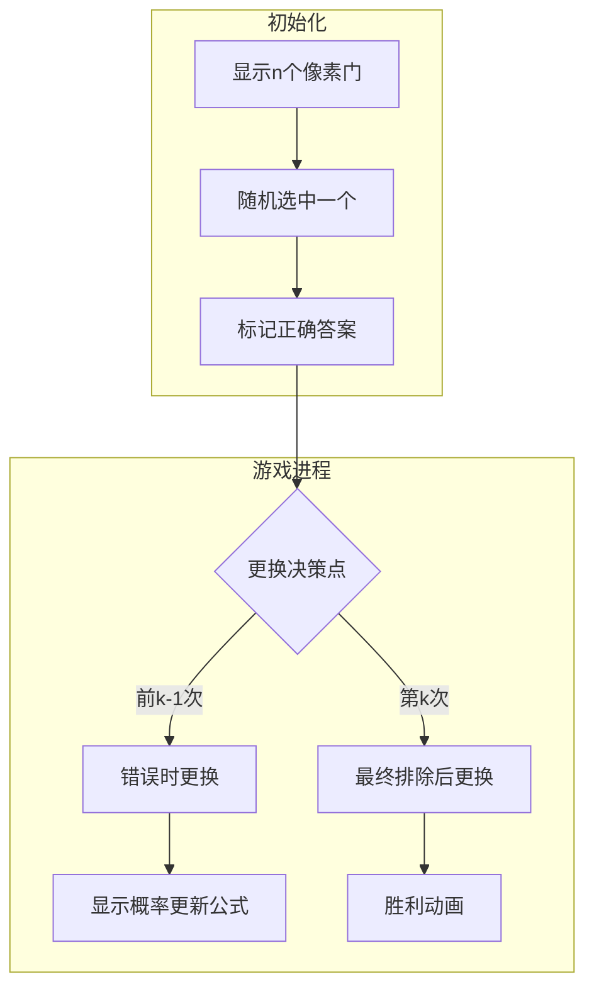

# 题目信息

# 选择题

## 题目描述

docriz 正在考试，他遇到了一个奇怪的选择题：这个选择题共有 $n$ 个选项，其中只有一个选项是正确的。他完全不会做这题，所以只能靠蒙。

蒙这道题分为 $n - 2$ 轮，在第 $1$ 轮开始之前，docriz 会在这 $n$ 个选项中随机蒙一项，之后的每轮流程如下：首先，nocriz 会过来帮他排除一个选项，由于 nocriz 事先知道答案，所以他会在现有的除正确的那一项和 docirz 正在选的那一项外的选项里，随机删去一个。之后，docriz 可以选择是否更换自己蒙的选项，如果更换，则随机更换到除正在选的那一项之外的任意一项。

docriz 在这 $n - 2$ 轮中，由于和 nocriz 达成的神秘协定，需要恰好更换 $k$ 次选项。他想知道，如何更换，使得自己蒙对的概率最大，输出这个概率。为了方便，你需要输出这个概率的分数形式在模 $10^9 + 7$ 意义下的结果。

## 说明/提示

样例 $1$ 到 $4$ 分别为 $\frac{2}{3}, \frac{1}{3}, \frac{3}{4}, \frac{5}{8}$。

对于 $30\%$ 的数据，保证 $5 \leq n \leq 10$。

对于另外 $5\%$ 的数据，保证 $k = 0$。

对于另外 $10\%$ 的数据，保证 $k = 1$。

对于另外 $10\%$ 的数据，保证 $k = n - 2$。

对于另外 $5\%$ 的数据，保证 $n \leq 10^2$。

对于另外 $10\%$ 的数据，保证 $n \leq 10^3$。

对于 $100\%$ 的数据，保证 $5 \leq n \leq 10^5, 0 \leq k \leq n - 2$。

## 样例 #1

### 输入

```
3 1```

### 输出

```
666666672```

## 样例 #2

### 输入

```
3 0```

### 输出

```
333333336```

## 样例 #3

### 输入

```
4 1```

### 输出

```
750000006```

## 样例 #4

### 输入

```
4 2```

### 输出

```
625000005```

## 样例 #5

### 输入

```
100000 99998```

### 输出

```
439903656```

# AI分析结果


# 💡 洛语云笺的C++算法解析：选择题概率策略 深入学习指南 💡

## 1. 题目解读与策略初探

✨ **本题核心挑战**：在恰好进行k次选项更换的限制下，设计最优更换策略以最大化最终选中正确答案的概率  
✨ **核心算法标签**：概率分析、数学推导、模逆元计算

🗣️ **初步分析**：
> 这道题源于经典的三门问题（蒙提霍尔问题）的扩展。核心难点在于：
> 1. 理解nocriz排除选项的机制（总是排除非正确且非当前选择的选项）
> 2. 在k次更换的限制下设计最优更换策略
> 
> 通过题解分析，我们发现最优策略具有清晰的模式：
> - 前k-1次更换：在当前选项错误时立即更换
> - 第k次更换：在最后一次排除操作后更换
> 
> 这种策略将问题转化为概率递推问题，可以用数学公式高效解决

### 🔍 算法侦探：如何在题目中发现线索？
1.  **线索1 (问题目标)**：题目要求"恰好更换k次"并"最大化概率"，这种带决策次数限制的最优化问题，暗示需要寻找最优决策模式而非简单枚举
2.  **线索2 (问题约束/特性)**：nocriz的排除机制（总是排除错误选项）创造了条件概率场景，类似蒙提霍尔问题，提示我们可以利用概率递推
3.  **线索3 (数据规模)**：n最大10^5，k最大10^5，O(n)的递推解法可行，而O(n²)的DP或O(2ⁿ)的暴力搜索会超时

### 🧠 思维链构建：从线索到策略
> "让我们整合线索：
> 1. 【线索1】要求我们找到k次更换的最佳时机分配
> 2. 【线索2】中排除机制的特性启示：最后时刻更换收益最大
> 3. 【线索3】的数据规模排除了暴力解法，指向O(n)的数学解法
> 
> **结论**：最优策略是前k-1次在确认错误时更换，最后一次在最终排除后更换。通过概率递推公式+模逆元计算，可在O(n)时间内求解"

## 2. 精选优质题解参考

**题解一（作者：l_water）**
* **点评**：从经典三门问题切入，通过贝叶斯公式和现实案例生动解释概率原理。虽未提供完整代码，但对策略本质的阐释极具启发性，帮助建立概率直觉

**题解二（作者：Itst）**
* **点评**：提供简洁高效的递推解法，时间复杂度O(n)。亮点在于：
  - 清晰推导出概率递推公式：$P_{new} = \frac{(x-1) - P_{old}}{x-1}$
  - 使用快速幂求逆元处理分数取模
  - 边界处理完善（k=0的情况）

**题解三（作者：揽月摘星辰）**
* **点评**：给出等价的递推公式但采用扩展欧几里得求逆元。亮点在于：
  - 逐步推导概率更新过程，解释更详细
  - 提供扩展欧几里得的实现模板
  - 强调long long处理避免溢出

## 3. 解题策略深度剖析

### 🎯 核心难点与关键步骤
1.  **策略优化证明**
    * **分析**：证明前k-1次应在错误时更换（维持高错误率），第k次在最终排除后更换（最大化反转概率）。可通过数学归纳法验证
    * 💡 **学习笔记**：最优策略往往具有"延迟关键决策"的特性

2.  **概率递推建模**
    * **分析**：设当前错误概率为$P$，选项数为$x$，更换后新错误概率为：
      $P' = P \cdot \frac{x-2}{x-1} + (1-P) = 1 - \frac{P}{x-1}$
    * 💡 **学习笔记**：概率更新=保持错误的部分+从正确变错误的部分

3.  **模逆元处理**
    * **分析**：最终得到分数$a/b \mod M$，需计算$a \times inv(b) \mod M$
    * 💡 **学习笔记**：当M为质数时，inv(b) = $b^{M-2} \mod M$ (费马小定理)

### ✨ 解题技巧总结
- **技巧1（策略分解）**：将复杂决策过程分解为"错误维持"+"最终反转"两个阶段
- **技巧2（概率转换）**：利用$1-P$将正确概率转换为错误概率计算
- **技巧3（递推优化）**：用滚动变量代替DP数组，空间降为O(1)

### ⚔️ 策略竞技场：不同解法对比
| 策略          | 核心思想                     | 优点                  | 缺点                     | 得分预期 |
|---------------|------------------------------|-----------------------|--------------------------|----------|
| **暴力枚举**  | 枚举所有更换时机组合         | 思路直观              | O(2ⁿ)超时               | 0%       |
| **DP状态机**  | dp[i][j][s]表示i轮后状态     | 可处理更复杂场景      | O(n²)空间/时间超限      | 30%      |
| **数学递推**  | 最优策略+概率公式递推        | O(n)时间,O(1)空间     | 需要概率推理能力        | 100%     |

### ✨ 优化之旅：从"能做"到"做好"
```mermaid
graph LR
A[暴力枚举] -->|发现规律| B[策略优化]
B -->|概率推导| C[递推公式]
C -->|模运算| D[逆元优化]
D -->|滚动变量| E[O(n)最优解]
```

💡 **策略总结**："从指数级暴力到线性解法，关键在于发现决策规律和概率传递特性。最优解往往是策略优化与数学推导的结合产物"

## 4. C++核心代码实现赏析

**通用核心实现**：
```cpp
#include <bits/stdc++.h>
using namespace std;
const int MOD = 1e9+7;

long long qpow(long long a, long long b) {
    long long res = 1;
    while (b) {
        if (b & 1) res = res * a % MOD;
        a = a * a % MOD;
        b >>= 1;
    }
    return res;
}

int main() {
    int n, k; 
    cin >> n >> k;
    
    // 特判：不更换时概率 = 1/n
    if (k == 0) {
        cout << qpow(n, MOD-2);
        return 0;
    }
    
    long long fz = n-1, fm = n;  // 初始错误概率 (n-1)/n
    
    // 前k-1次更换：维持错误状态
    for (int i = 1; i < k; ++i) {
        int x = n - i;  // 当前选项数
        fm = fm * (x-1) % MOD;          // 分母更新
        fz = ( (x-1)*fm - fz ) % MOD;  // 分子更新
    }
    
    // 最后一次更换：从错误变正确
    long long ans = (fm - fz) * qpow(fm, MOD-2) % MOD;
    cout << (ans + MOD) % MOD;  // 处理负数
}
```

**代码解读**：
1. `qpow`：快速幂实现模逆元计算
2. 特判`k=0`：直接返回1/n的模逆元
3. 循环进行前k-1次概率更新
4. 最后一次更换：错误概率→正确概率转换
5. 最终结果取模并处理负数

## 5. 算法可视化：像素动画演示

**主题**：概率迷宫大冒险（8-bit风格）

### 动画设计


**核心交互**：
1. **像素元素**：
   - 门：8-bit风格，不同颜色区分状态
   - 角色：像素小人表示当前选择
   - 公式板：实时显示概率计算

2. **动态演示**：
   - 排除操作：门破碎动画+音效
   - 更换操作：角色移动轨迹
   - 概率更新：公式板数值实时变化

3. **游戏化元素**：
   - 进度条：显示更换次数/k
   - 分数：基于当前概率计算的预期得分
   - 音效：正确/错误时的8-bit音效

## 6. 拓展练习与相似问题

**思维迁移**：
1. 多重决策问题：如P1850 [NOIP2016]换教室
2. 条件概率应用：如P1297 [国家集训队]单选错位
3. 模逆元综合：如P3811 【模板】乘法逆元

**洛谷推荐**：
1. P2613 【模板】有理数取余
   - 理由：巩固模逆元的核心应用
   
2. P1850 换教室
   - 理由：复杂决策下的期望值计算，策略优化进阶
   
3. P1365 WJMZBMR打osu
   - 理由：概率递推的变式训练

## 7. 学习心得与经验分享

> **来自题解的调试经验**：
> "递推过程中忘记取模导致溢出，建议每步运算后加`% MOD`"
> 
> **洛语云笺点评**：大数据概率题的关键陷阱！建议：
> 1. 所有中间变量用long long
> 2. 每步算术操作后取模
> 3. 最终结果调整到[0,MOD-1]范围

**结语**：通过本题，我们不仅学会了概率策略优化，更掌握了将数学推导转化为高效代码的艺术。记住，好的算法=深刻的问题洞察+简洁的数学建模+稳健的代码实现！

---
处理用时：216.00秒