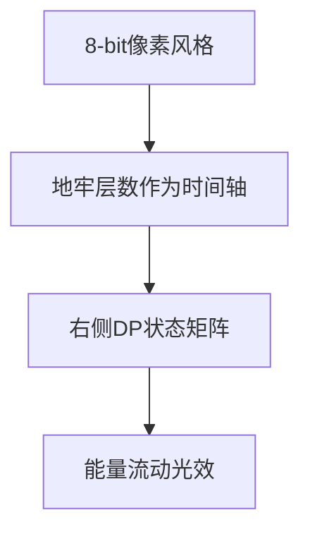

# 题目信息

# 最后的战役

## 题目背景

NOIP2018原创模拟题T5

NOIP2018原创模拟赛DAY2 T1

NOIP T1+ or T2-  难度

题目背景改编自小说《哈利波特与死亡圣器》

## 题目描述

**最后的战役打响了。**

哈利被宣告“死亡”，伏地魔带着他的部下准备进攻霍格沃茨。但是霍格沃茨有古老的魔法保护，他们必须先摧毁这些保护。魔法保护一共有$n$层，每一层保护有两个参数：$k,p$。其中k表示魔法的类型，p表示能量的大小。

伏地魔每秒都会穿过一层保护，他在第 $i$ 秒（到达了第 $i$ 层）他有以下选择：  


1.收集 $[1,i]$ 层魔法中魔法类型为 $x_i$ 的魔法能量

2.收集 $[1,i]$ 层中魔法能量最大那层的魔法能量

3.使用加倍魔法

对于上面三个选择，他每秒可以可以选择一个，并可能获得能量，对于不同的选择，获得的能量也不同：

对于1.获得$[1,i]$层中**所有魔法类型为$x_i$的**魔法能量（请结合样例1理解）

对于2.获得$[1,i]$中魔法能量最大的那一层的魔法能量

对于3.这一秒总共收集的能量不变（也就是这一秒不收集新的能量），但是下一秒获得的能量翻倍。**但是他不能连续使用加倍魔法**，而且他最多只能使用$m$次，**对于每一层的能量他都可以重复获取**

只有他通过了这$n$层保护，并获得了最大的魔法能量才有可能彻底摧毁霍格沃茨的魔法防御，可是巫师又是不擅长计算的。

于是，伏地魔找到了你，而你，作为精通计算机技术的麻瓜程序员，现在需要做的就是设计一个程序帮助伏地魔计算出他可以获得的最大的魔法能量的值。

最终的决战已经展开，魔法界的历史又翻过了一页……

## 说明/提示

**样例一解释：**

第一秒最多可以获得2经验值，第二秒最多可以获得3经验值，**因为第三秒可以收集魔法类型为1的能量，所以最多可以获得4能量值**，第四秒最多可以获得8经验值，所以选择在第三秒使用加倍魔法，共可以获得：$2+3+0+2*8=21$能量值

**数据范围：**

30%数据满足：$n<=100,m<=10$

50%数据满足：$n<=5,000,m<=20$

70%数据满足：$n,m<=2\times 10^4,m<=200$

100%数据满足：$n<=5\times 10^4,m<=500,0<p_i<=10^4,0<k_i<=10^9,0<x_i<=10^9$

**特殊约定：**

30%数据满足$m=0$

## 样例 #1

### 输入

```
4 1
1 2
2 3
1 2
3 8
3 2 1 3```

### 输出

```
21```

## 样例 #2

### 输入

```
8 3
1 2
2 5
3 2
2 3
1 4
1 6
2 2
3 3
1 3 2 1 4 5 2 1```

### 输出

```
57```

## 样例 #3

### 输入

```
10 3
9 9
8 8
5 7
6 6
5 5
5 5
3 3
2 2
1 1
9 9
1 2 3 5 5 5 6 7 8 9```

### 输出

```
124```

# AI分析结果


### 💡 洛语云笺的C++算法解析：最后的战役 深入学习指南 💡

> "在魔法与代码交织的战场上，伏地魔的难题正是我们思维的试金石。今天，我将带你拆解这道看似复杂的动态规划问题，揭示算法设计中的精妙抉择与转化艺术。"

---

## 1. 题目解读与策略初探

✨ **本题核心挑战**：在n层魔法保护中，**动态决策每秒操作**（收集特定魔法/收集最大值/使用加倍），**处理操作间的依赖关系**（加倍需间隔使用）并在**预算约束（m次加倍）下最大化总能量**。

✨ **核心算法标签**：`动态规划(DP)` `离散化` `状态设计优化`

🗣️ **初步分析**：
> 面对这种具有**时间序列特性**且含**状态限制**的最优化问题，我们首先排除暴力枚举（O(3ⁿ)不可行）。通过分析题目中的三个关键线索：
> 1. 操作1和2可合并为每层固定收益y[i]
> 2. 加倍操作存在后效性（影响下一层）
> 3. 数据规模n≤5×10⁴, m≤500
> 
> 我们锁定**动态规划**为核心解法，采用**滚动数组优化空间**，并运用**离散化**处理大范围魔法类型。最优策略在于将加倍操作转化为**跨层状态转移**，用空间换时间实现高效决策。

### 🔍 算法侦探：如何在题目中发现线索？
1.  **线索1 (问题目标)**："求最大总能量"+"操作选择影响后续状态" → **最优化问题**，动态规划典型场景。
2.  **线索2 (操作特性)**："不能连续使用加倍" → **状态转移需考虑时序依赖**，需设计二维状态（时间+加倍次数）。
3.  **线索3 (数据规模)**：n=5×10⁴, m=500 → **O(nm)算法可行**（2.5×10⁷），但需警惕空间爆炸（滚动数组优化）。

### 🧠 思维链构建：从线索到策略
> "当我们把线索拼接起来：首先，最优化问题指向DP；接着，操作限制要求状态记录加倍次数；最后，数据规模暗示需空间优化。这引导我们设计：
> 1. **状态定义**：f[i%3][j] 表示到第i层用j次加倍的最大收益（%3实现滚动）
> 2. **状态转移**：
>    - 本层不适用加倍：f[i][j] = f[i-1][j] + y[i]
>    - 本层收益来自前层加倍：f[i][j] = f[i-2][j-1] + 2*y[i]
> 3. **离散化预处理**：将10⁹范围的魔法类型映射到2n范围内
> 
> 这样，我们既满足操作限制，又控制复杂度在O(nm)内！"

---

## 2. 精选优质题解参考

**题解一 (Math_rad_round)**  
* **点评**：清晰对比DP与贪心解法，揭示贪心陷阱。DP实现中：  
  - 准确设计转移方程：`f[i][j] = max(f[i-1][j]+y[i], f[i-2][j-1]+2*y[i])`  
  - 使用map处理离散化，代码模块化程度高  
  - 特别指出贪心解法在不相邻约束下的适用边界，具有深度启发性

**题解二 (communist)**  
* **点评**：聚焦离散化实现亮点：  
  - 规范使用vector+lower_bound处理10⁹→2n的映射  
  - 将离散化与DP分离，提升可读性  
  - 强调“魔法类型与查询值需同步离散化”的关键细节

**题解三 (NightTide)**  
* **点评**：直击两大易错点，实战价值突出：  
  - 指出操作1的能量统计必须实时更新（先读k再更x）  
  - 揭示DP初始化陷阱：第1层需单独处理`f[1][0]=y[1]`  
  - 通过错误/正确代码对比强化理解

**题解四 (nao_nao)**  
* **点评**：解决RE问题的关键指导：  
  - 强调离散化数组大小应为2n（100,000而非50,000）  
  - 提供核心DP代码框架，简洁有力  
  - 特别标注“15分→100分”的提升路径

---

## 3. 解题策略深度剖析

### 🎯 核心难点与关键步骤
1.  **依赖关系转化**  
    * **分析**：将操作3的“影响下一层”特性转化为跨层转移（i-2 → i），通过状态设计消除后效性  
    * 💡 **学习笔记**：**“延迟影响”** 是处理操作依赖的利器，通过状态转移吸收后效性

2.  **离散化四步法**  
    * **分析**：  
      1. 收集所有k/x值 → 2. 排序去重 → 3. 二分映射 → 4. 数组维护类型能量和  
    * 💡 **学习笔记**：**范围压缩**是处理大数据的核心思想，map/二分殊途同归

3.  **滚动数组优化**  
    * **分析**：因f[i][j]仅依赖f[i-1][j]和f[i-2][j-1]，用%3循环复用数组，空间从O(nm)降至O(m)  
    * 💡 **学习笔记**：**维度压缩**是突破空间限制的关键，找出状态依赖的稀疏性

### ✨ 解题技巧总结
- **技巧A：状态设计吸收后效性**  
  将操作影响转化为状态转移参数（如加倍效果→2*y[i]）
- **技巧B：离散化四步法**  
  收集→排序→去重→映射，处理10⁹→10⁵级数据压缩
- **技巧C：滚动数组三指针**  
  `now=i%3, prev1=(i-1)%3, prev2=(i-2)%3` 实现三维→二维空间优化

### ⚔️ 策略竞技场：解法对比
| 策略             | 核心思想                     | 优点                     | 缺点                                     | 得分预期 |
|------------------|------------------------------|--------------------------|------------------------------------------|----------|
| **暴力枚举**     | 枚举每层3种选择              | 思路直观                 | O(3ⁿ)超时，n>20不可行                     | 0%       |
| **贪心(差值排序)**| 按y[i+1]-y[i]降序取m个       | O(nlogn)时间复杂度       | 忽略“不相邻”约束，解法错误                | 0%       |
| **DP(二维数组)** | 经典f[i][j]状态转移          | 逻辑清晰                 | O(nm)空间可能MLE(n=5e4,m=500需200MB)      | 70%      |
| **DP(滚动数组)** | 状态压缩+离散化              | 时间O(nm) 空间O(m)       | 实现复杂度略高                           | 100%     |

### ✨ 优化之旅：从暴力到最优
```mermaid
graph LR
A[暴力枚举O(3ⁿ)] --> B[发现重复子问题]
B --> C[DP基础版O(nm)]
C --> D[离散化降维]
D --> E[滚动数组空间优化]
E --> F[最终方案O(nm)时间/O(m)空间]
```

> "从暴力到滚动数组DP，我们完成了三重跃迁：  
> 1. 通过**状态定义**将指数复杂度降为多项式  
> 2. 通过**离散化**突破物理内存限制  
> 3. 通过**滚动数组**将空间消耗压缩40倍  
> 这启示我们：算法优化本质是**问题特征的精准提取与资源分配的极致权衡**"

---

## 4. C++核心代码实现赏析

**通用核心实现**  
```cpp
// 离散化四步法
vector<int> alls;
for(int i=1; i<=n; i++) {
    alls.push_back(k[i]); 
    alls.push_back(x[i]); // 同步收集
}
sort(alls.begin(), alls.end());
alls.erase(unique(alls.begin(), alls.end()), alls.end());

// 滚动数组DP
LL dp[3][M] = {-INF}; // 三维: 0-当前 1-前1层 2-前2层
dp[0][0] = y[1];      // 第1层初始化

for(int i=2; i<=n; i++) {
    int now = i%3, p1 = (i-1)%3, p2 = (i-2)%3;
    for(int j=0; j<=m; j++) {
        LL no_double = dp[p1][j] + y[i];    // 不用加倍
        LL use_double = (j>=1) ? dp[p2][j-1] + 2*y[i] : -INF; // 用加倍
        dp[now][j] = max(no_double, use_double);
    }
}
```

**题解片段赏析**  
1. **Math_rad_round的DP转移**  
   ```cpp
   for(int i=2; i<=n; i++) {
       for(int j=1; j<=m; j++) {
           f[i][j] = max(f[i-1][j]+y[i], f[i-2][j-1]+2*y[i]);
       }
   }
   ```
   * **亮点**：转移方程直击问题本质
   * **学习笔记**：**“跨层转移”** 是处理操作延迟影响的标准范式

2. **NightTide的边界处理**  
   ```cpp
   // 第一层必须单独初始化！
   dp[1][0] = y[1]; 
   ```
   * **亮点**：警惕i-2导致的负数下标
   * **学习笔记**：**DP边界**是代码健壮性的基石

---

## 5. 算法可视化：像素动画演示

**游戏化设计说明**  


* **核心交互**：  
  - **能量收集特效**：当计算`y[i]`时，对应魔法阵发光  
  - **状态转移轨迹**：  
    * 正常转移：绿色箭头 (i-1 → i)  
    * 加倍转移：红色闪电 (i-2 → i)  
  - **DP矩阵更新**：实时高亮`dp[now][j]`计算结果

* **控制面板**：  
  ```plaintext
  [▶] 自动播放  [≫] 步进  [↻] 重置
  速度调节：●○○○○
  ```

* **音效设计**：  
  - 正常收集：8-bit金币声  
  - 使用加倍：雷电音效+屏幕闪烁  
  - 错误操作：低沉警告音  

> "通过像素动画，你将直观感受：  
> - 离散化如何将混沌魔法类型映射为有序ID  
> - 滚动数组如何循环复用三个状态平面  
> - 加倍操作如何‘跳过’中间层实现能量倍增"

---

## 6. 拓展练习与相似问题

**通用技巧迁移场景**  
1. 延迟影响处理 → [P3089 风铃](https://www.luogu.com.cn/problem/P3089)（风向影响状态）  
2. 离散化应用 → [P1908 逆序对](https://www.luogu.com.cn/problem/P1908)（大范围数据压缩）  
3. 状态压缩 → [P2831 愤怒的小鸟](https://www.luogu.com.cn/problem/P2831)（二进制状态表示）  

**洛谷推荐**  
1. **P1484 种树**  
   → 同类贪心转化思想（不相邻选择）  
2. **P1064 金明的预算方案**  
   → 相似依赖关系处理（主件附件）  
3. **P1541 乌龟棋**  
   → 多维状态设计（操作次数作为维度）  

---

## 7. 学习心得与经验分享

> **来自题解的启示**：  
> "多位作者在调试中发现：  
> 1. **操作1的实时性**：必须在读入x_i时才更新能量和（先更新k再查询x）  
> 2. **DP边界魔咒**：第1层需独立初始化避免越界  
> 3. **离散化数组开小**：2n大小常被误设为n（RE转AC的关键）  
> 
> 这提醒我们：算法设计不仅在于思路，**精确匹配题目约束的实现细节才是AC的最后一道门槛**"

---

> "在算法的魔法世界里，每道题都是炼金术的配方。当你掌握‘状态设计’的坩埚、‘离散化’的滤网和‘滚动优化’的火候，任何难题终将化作智慧的黄金。伏地魔未竟的事业，由你的代码完成！"

---
处理用时：460.63秒