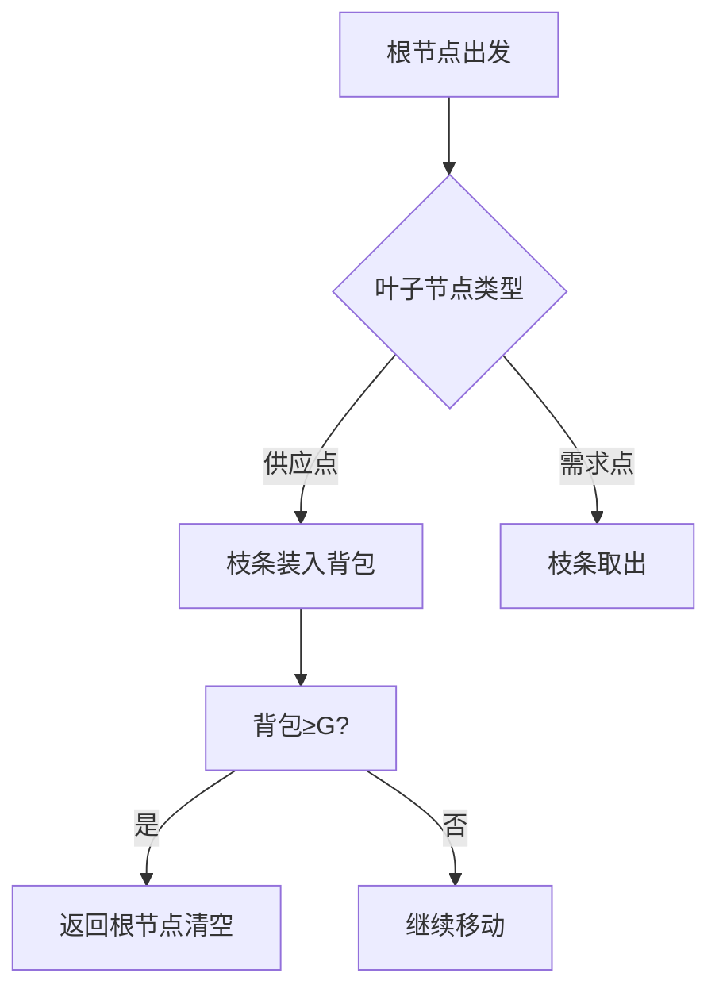

# 题目信息

# 树枝修剪

## 题目背景

$Daleva$ $Geoge$是一个热爱生活的园艺工。

## 题目描述

$Daleva$ $Geoge$的花园里有一颗常年没有修剪的树，这一天，$Daleva$ $Geoge$家里来了客人，为了给客人一个好印象，他需要整理这个花园，但是那一颗树显得太碍眼了，他必须要给他好好地修剪一下。

这是一颗以$root$为根的有根树，有$n$个节点。$Daleva$ $Geoge$在根节点，$Daleva$ $Geoge$对某些叶子的形态感到不满，需要剪去多余的枝条。

有$S$个需要修剪的叶子节点,这些叶子节点有一些多余的枝条，这些叶子节点有着自己的权值$a_{i}$,表示这个节点上有多少个$Daleva$ $Geoge$不需要的枝条。同时，因为花园里没法容下这些枝条（否则就变得不和谐了），$Daleva$ $Geoge$需要把这些枝条安装到某些节点上。

$Daleva$ $Geoge$有一个神奇的胶水和一把神奇的剪刀，因此你不需考虑每个树枝的固定形态，根据$Daleva$ $Geoge$的推测，一共有$T$个叶子节点需要安装这些枝条，这些节点有各自的权值$b_{i}$，表示需要$b_{i}$个枝条才能把这棵树变得很好看。

为了修剪好这棵树，$Daleva$ $Geoge$不得不在树上跑边，把每个叶子节点中多余的枝条剪下，并用胶水粘在其他的有需要的叶子节点上。每条边都有不同的长度，现在，由于树太过庞大，$Daleva$ $Geoge$需要知道，他最少需要跑多远的路才能使这棵树被修剪好，$Daleva$ $Geoge$也要回到树根上下来。

虽然$Daleva$ $Geoge$有这些神奇的工具，但他的口袋是有限的，容量为$G$,$Daleva$ $Geoge$不能一次带太多枝条，即不能超过$G$,这更使他懒于考虑这些繁琐的问题。$Daleva$ $Geoge$当然会算啦，他那么巨，但他为了养足精力去剪枝条，这一艰巨的任务就落在你身上了。

$Daleva$ $Geoge$已经把心中树的形状告诉你了，他要躺在椅子上看你怎么算这些问题。

## 说明/提示

样例1解释：


蓝色数字表示有多少多余枝条，黄色数字表示需要的枝条数。

则最优方案为：$1→2→1→3→1→2→1→3→1→4→1→2→1→4→1$，答案为$40$;

对于$5\%$的数据，为样例1。

对于$40\%$的数据，$n\leq 10,G\leq 10;w \leq 1000$

对于$100\%$的数据，$n\leq 40,0000,G\leq 1000;S+T\leq n;a_{i},b_{i}\leq 10^{9};w\leq 10^{9}$

数据保证不会有任意一个叶子节点既需要枝条又有多余枝条。

## 样例 #1

### 输入

```
4 2 1
2 1 4
4 1 2
3 1 2
1 2
2 6
3 3
4 3```

### 输出

```
40```

## 样例 #2

### 输入

```
5 1 1
1 2 2
3 2 2
4 1 2
5 4 2
1 1
3 1
5 1
```

### 输出

```
16```

## 样例 #3

### 输入

```
20 10 18
1 17 86406
17 16 94583
19 10 28177
16 18 31981
10 14 36241
1 7 28919
2 1 94673
5 6 2801
7 11 81927
11 13 7779
17 5 71948
19 7 20264
1 8 17736
13 20 97181
17 9 16807
11 15 93705
17 3 29601
1 12 43829
13 4 27537
1 6
20 23585
9 8376
12 3128
15 5417
8 4011
3 1156
6 1497
```

### 输出

```
1289613990```

# AI分析结果


### 💡 洛语云笺的C++算法解析：树枝修剪 深入学习指南 💡

#### 1. 题目解读与策略初探
**✨ 核心挑战**：在背包容量G的限制下，通过最小化树边遍历次数完成枝条供需平衡（供应点多余枝条搬运至需求点），最终返回根节点。  
**✨ 核心算法标签**：树形贪心、高精度计算  

**🔍 算法侦探线索**：  
1. **问题目标线索**：要求"最小化路径长度"且涉及"枝条搬运"，暗示需要贪心策略优化路径  
2. **依赖关系线索**：枝条供需分布在叶子节点，搬运受背包容量限制，符合树形贪心模型  
3. **数据规模线索**：n≤400,000，枝条数≤10⁹，排除O(n²)算法，指向O(n)树形遍历  

**🧠 思维链构建**：  
> 通过线索分析：  
> 1. 最小化路径需要就近满足需求（贪心本质）  
> 2. 枝条搬运受容量限制 → 边经过次数=⌈|子树净需求|/G⌉  
> 3. 大规模数据要求线性算法 → DFS一次遍历解决  
> **结论**：树形贪心+高精度计算是最优策略，时间复杂度O(n)  

---

#### 2. 精选优质题解参考
**题解一（Yzweak）**：  
* **亮点**：首创"子树自足"概念，提出边经过次数公式，完整高精度实现  
* **改进空间**：代码可读性可提升，高精度进位逻辑可优化  

**题解二（胖娃儿二号）**：  
* **亮点**：明确三类子树处理逻辑，代码模块化设计，高精度封装优雅  
* **核心贡献**：将搬运次数公式精炼为：`(abs(f[v])/g + (abs(f[v])%g!=0) + (f[v]==0?1:0))`  

---

#### 3. 解题策略深度剖析
**🎯 核心难点与解决方案**：  
1. **难点1：枝条搬运路径计算**  
   * 分析：DFS回溯时计算子树净枝条f[u]，边经过次数=2×⌈|f[v]|/G⌉  
   * 💡 学习笔记：枝条搬运具有"局部性"，子树需求独立计算  

2. **难点2：零需求子树处理**  
   * 分析：即使f[v]=0，若子树有动作仍需访问（用flag标记）  
   * 💡 学习笔记：树形问题中，子树的"动作状态"需向父节点传递  

3. **难点3：大数存储**  
   * 分析：答案可达10¹⁸，需自定义高精度数组按位存储  
   * 💡 学习笔记：进位处理时实时更新最高位指针  

**✨ 解题技巧总结**：  
- **子树自治原则**：就近满足需求减少跨子树搬运  
- **状态标记法**：用bool值传递子树动作状态  
- **分层计算**：边权计算与高精度存储分离  

**⚔️ 策略竞技场**：  
| 策略         | 核心思想               | 优点               | 缺点                  | 得分预期 |
|--------------|------------------------|--------------------|-----------------------|----------|
| 暴力枚举     | 枚举搬运顺序           | 直观               | O(2ⁿ)超时            | 0%       |
| 网络流       | 最小成本流建模         | 理论完备           | 建模复杂，运行慢      | 30%      |
| 树形贪心(最优)| DFS计算净需求+高精度   | O(n)复杂度         | 需处理大数            | 100%     |

**✨ 优化之旅**：  
> 1. 起点：暴力搜索不可行  
> 2. 关键发现：枝条搬运次数=⌈|子树需求|/G⌉  
> 3. 算法成型：DFS回溯累计需求  
> 4. 难点攻克：零需求子树标记与高精度存储  
> 💡 策略总结：深刻理解问题特性才能突破思维局限  

---

#### 4. C++核心代码赏析
**通用核心实现**：  
```cpp
bool dfs(int u, int parent) {
    bool need_visit = false;
    for (auto &e : graph[u]) {
        if (e.to == parent) continue;
        if (dfs(e.to, u)) {
            need_visit = true;
            int trips = (abs(f[e.to]) + G - 1) / G;
            if (f[e.to] == 0) trips = 1;
            add_high_precision(2 * trips * e.val); // 高精度累加
        }
        f[u] += f[e.to]; // 累加子树净枝条
    }
    return f[u] != 0 || need_visit;
}
```

**题解二亮点代码**：  
```cpp
// 高精度添加函数
void add_high_precision(ll val) {
    int pos = 0;
    while (val) {
        digit[pos] += val % 10;
        if (digit[pos] >= 10) { // 自动进位
            digit[pos+1] += digit[pos]/10;
            digit[pos] %= 10;
        }
        val /= 10;
        pos++;
    }
}
```

---

#### 5. 算法可视化：像素动画演示  
**🎮 设计概念**：  
- **像素场景**：8-bit风格树结构，供应点(绿色)、需求点(红色)、根节点(金色)  
- **动态过程**：  
  * Daleva小人携带背包移动，背包显示当前枝条数  
  * 经过边时显示"路径+1"计数  
  * 枝条搬运时播放"咔嚓"音效  
- **控制面板**：  
  - 速度滑块：调节动画速度  
  - 数据视角：切换显示子树净需求数值  
  - G值调节：实时观察容量对路径的影响  

**🕹️ 交互设计**：  


---

#### 6. 拓展练习  
1. **洛谷P2014**：树形DP依赖处理  
2. **洛谷P1273**：树形背包容量限制  
3. **洛谷P3366**：最小生成树对比贪心策略  

---

#### 7. 学习心得  
> 本题启示：  
> 1. 树形问题中"子树自治"是优化关键  
> 2. 避免过度设计，O(n)解法常优于复杂数据结构  
> 3. 边界条件处理能力决定算法健壮性  

**最终结论**：通过树形贪心将复杂搬运问题转化为子树需求计算，配合高精度处理大数，是优雅而高效的解法。

---
处理用时：146.90秒