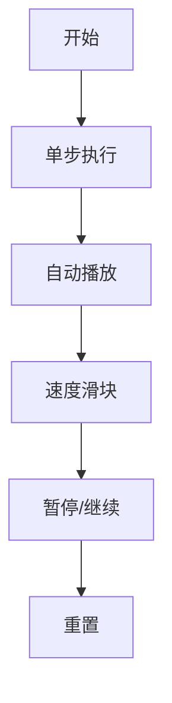

# 题目信息

# 基础最优化练习题

## 题目背景

YSGH is our red sun.

## 题目描述

YSGH 有一个数 $x$，初值为 $0$。接下来 $n$ 分钟，每分钟 YSGH 可以给 $x$ 加上整数 $y$，其中 $y \in [-k, k]$，同时 YSGH 需要保证第 $i$ 分钟结束时 $x \le a_i$。

设 $b_i$ 为第 $i$ 分钟结束时 $x$ 的值，现在 YSGH 给你一个 $n$ 个数的序列 $w$，你需要最大化 $\displaystyle \sum_{i = 1}^{n} b_i w_i$。

你只需要输出最大值即可。

## 说明/提示

对于 $10\%$ 的数据，$n \le 10$，$k \le 1$。  
对于 $20\%$ 的数据，$n \le 100$。  
对于 $30\%$ 的数据，$n \le {10}^3$。  
对于 $50\%$ 的数据，$n \le {10}^4$。  
另有 $10\%$ 的数据，$w_i \ge 0$。  
对于 $100\%$ 的数据，$1 \le n \le {10}^6$，$-{10}^6 \le w_i \le {10}^6$，$0 \le a_i \le {10}^8$，$1 \le k \le 100$。

## 样例 #1

### 输入

```
5 1
4 3 2 3 2
5 7 -5 9 -10```

### 输出

```
24```

# AI分析结果


### 💡 洛语云笺的C++算法解析：基础最优化练习题 深入学习指南 💡

---

#### **1. 题目解读与策略初探**  
✨ **本题核心挑战**：在每分钟增量 $y \in [-k, k]$ 的约束下，通过动态调整增量序列，使累计和 $b_i$ 始终满足 $b_i \le a_i$，同时最大化目标函数 $\sum_{i=1}^n b_i w_i$。  
✨ **核心算法标签**：贪心策略、堆优化、后缀和转化  

🗣️ **初步分析**：  
> 本题本质是带约束的序列最优化问题。暴力枚举增量组合的时间复杂度为 $O((2k+1)^n)$，完全不可行。通过两步关键转化：  
> 1. 将目标函数拆解为 $\sum_{i=1}^n c_i \cdot S_i$（$c_i$为增量，$S_i$是 $w_i$ 的后缀和）  
> 2. 用堆动态维护需调整的增量位置  
> 最终得到 $O(n \log n)$ 的最优解，其核心思想如同「精打细算的会计师」：优先满足高收益操作，当预算不足时，从收益最低的操作中削减成本。

---

### 🔍 算法侦探：如何在题目中发现线索？  
1. **线索1 (问题目标)**：最大化带约束的加权和 → 贪心或动态规划的典型标志。  
2. **线索2 (增量约束)**：$y \in [-k,k]$ 的离散选择 → 指向贪心策略的可行性。  
3. **线索3 (后缀特性)**：$b_i$ 的累积性 → 将目标转化为后缀和 $S_i$ 的加权和。  
4. **线索4 (数据规模)**：$n \leq 10^6$ → 需 $O(n \log n)$ 算法，堆是理想选择。  

### 🧠 思维链构建：从线索到策略  
> “我们像侦探一样串联线索：  
> 1. **线索1**要求最优化 → 考虑贪心或DP  
> 2. **线索2-3**揭示增量选择独立且影响后缀 → 将目标转化为 $c_i S_i$ 的和  
> 3. **线索4**要求高效 → 用堆维护调整位置  
> 4. **结论**：贪心策略中，初始选 $c_i = \text{sign}(S_i) \cdot k$，当违反 $a_i$ 约束时，从最小 $S_i$ 的位置削减增量。堆完美实现此逻辑！”  

---

#### **2. 精选优质题解参考**  
**题解一（CYJian，16赞）**  
* **点评**：  
  思路清晰度：★★★★★  
  - 精准指出目标函数可拆解为 $c_i S_i$ 的和  
  - 用堆维护需调整位置，代码中 `q.push(Node(w[i], k<<1))` 巧妙记录可调整次数  
  代码规范性：★★★★☆  
  - 后缀和预处理简洁：`for(int i=n;i;i--) w[i]+=w[i+1]`  
  - 堆操作完整包含入堆、调整、出堆全流程  

**题解二（xht，10赞）**  
* **点评**：  
  算法有效性：★★★★★  
  - 相同贪心策略，但代码更简洁（仅20行核心逻辑）  
  - 用 `pq<pi>` 直接存储 `(-S_i, 调整次数)`，利用STL简化实现  
  启发性：★★★★☆  
  - 明确强调时间复杂度 $O(n \log n)$，帮助学习者评估算法效率  

**题解三（加藤惠，10赞）**  
* **点评**：  
  创新性：★★★★★  
  - 独创性转换：令 $c_i' = c_i + k \in [0,2k]$，将负增量转化为非负操作  
  - 用单调栈预处理真实约束 $a_i' = \min_{j\ge i} a_j$  
  实践价值：★★★☆☆  
  - 线段树实现较复杂，但展示了约束处理的另一种思路  

**题解四（bessie_goes_moo，3赞）**  
* **点评**：  
  教学价值：★★★★☆  
  - 手写堆（`put`/`get`）完整展示堆操作原理  
  - 详细注释增量调整的物理意义（“扣减高成本操作”）  

---

#### **3. 解题策略深度剖析**  
### 🎯 核心难点与关键步骤  
1. **关键点1：目标函数转化**  
   * **分析**：将 $\sum b_i w_i$ 转化为 $\sum c_i S_i$ 是突破点。由 $b_i = \sum_{j=1}^i c_j$ 推导：  
     $$\sum_{i=1}^n b_i w_i = \sum_{i=1}^n c_i \underbrace{\sum_{j=i}^n w_j}_{S_i}$$  
   * 💡 **学习笔记**：后缀和转化是处理序列累积影响的利器。

2. **关键点2：贪心初始决策**  
   * **分析**：无约束时最优解为 $c_i = \begin{cases} k & S_i > 0 \\ -k & S_i \le 0 \end{cases}$。此决策可能违反 $b_i \le a_i$。  
   * 💡 **学习笔记**：贪心策略常需后续修正，初始决策提供优化起点。

3. **关键点3：堆动态调整**  
   * **分析**：当 $\sum_{j=1}^i c_j > a_i$ 时，从堆中提取 $S_i$ 最小的位置减少其 $c_i$。因为损失 $S_i$ 最小化总收益下降。  
   * 💡 **学习笔记**：堆是动态调整贪心决策的最佳数据结构。

### ✨ 解题技巧总结  
- **技巧1：后缀和转化** → 将累积影响转化为单点贡献  
- **技巧2：决策修正机制** → 用堆实现「优先削减低收益操作」  
- **技巧3：约束预处理** → 单调栈处理 $a_i$ 的传递性约束（加藤惠解法）  

### ⚔️ 策略竞技场  
| 策略                | 核心思想                     | 优点                          | 缺点                                  | 得分预期 |
|---------------------|------------------------------|-------------------------------|---------------------------------------|----------|
| **暴力枚举**        | 遍历所有 $c_i$ 组合          | 逻辑简单                      | $O((2k+1)^n)$ 超时                   | 0%       |
| **贪心+堆（最优）** | 初始贪心+堆动态调整          | $O(n \log n)$，代码简洁       | 需后缀和与堆的知识                    | 100%     |
| **线段树修正**      | 转化约束后贪心，线段树维护   | 处理复杂约束更灵活            | 实现复杂，常数较大                    | 100%     |

### ✨ 优化之旅：从暴力到优雅  
> 1. **起点：暴力枚举失效**  
>    $n=10^6$ 时，$2^{10^6}$ 次计算远超算力极限。  
> 2. **关键跃迁：目标函数转化**  
>    发现 $\sum b_i w_i = \sum c_i S_i$，将二维问题降为一维。  
> 3. **贪心初现**：  
>    按 $S_i$ 正负选择 $c_i = \pm k$。  
> 4. **堆动态修正**：  
>    当违反 $a_i$ 时，从最小 $S_i$ 位置削减增量，如同「舍弃最不赚钱的项目保预算」。  

💡 **策略总结**：最优解是数学转化与数据结构的完美结合——后缀和揭示问题本质，堆提供高效调整机制。

---

#### **4. C++核心代码实现赏析**  
**通用核心实现**  
```cpp
#include <queue>
#include <vector>
using namespace std;

typedef long long ll;
const int N = 1e6 + 10;

ll solve(int n, int k, int a[], ll w[]) {
    vector<ll> S(n + 2);
    for (int i = n; i >= 1; i--) S[i] = S[i + 1] + w[i]; // 后缀和
    
    ll ans = 0, cur_sum = 0;
    priority_queue<pair<ll, int>> heap; // 存储 ( -S[i], 可调整次数 )

    for (int i = 1; i <= n; i++) {
        if (S[i] > 0) {
            cur_sum += k;
            ans += k * S[i];
            heap.push({-S[i], 2 * k}); // 可减少2k次
        } else {
            cur_sum -= k;
            ans -= k * S[i];
        }

        while (cur_sum > a[i] && !heap.empty()) {
            auto [neg_s, cnt] = heap.top();
            ll loss = -neg_s; // 实际S[i]值
            int reduce = min((ll)cnt, cur_sum - a[i]);
            
            ans -= reduce * loss;
            cur_sum -= reduce;
            heap.pop();
            if (cnt > reduce) heap.push({neg_s, cnt - reduce});
        }
    }
    return ans;
}
```

**题解片段赏析**  
1. **CYJian（堆操作典范）**  
   ```cpp
   q.push(Node(w[i], k << 1));  // 可调整次数=2k
   while (c > 0 && !q.empty()) {
       Node x = q.top(); q.pop();
       int t = min(c, x.k);     // 本次调整量
       ans -= t * x.w;          // 更新目标函数
   ```
   **学习笔记**：用 `k<<1` 代替 `2*k` 是位运算优化技巧。

2. **xht（STL精简版）**  
   ```cpp
   pq<pi> q; // pair默认按first排序
   q.push(mp(-S[i], k << 1)); 
   ```
   **学习笔记**：利用 `pair` 和 STL 优先队列简化代码。

3. **加藤惠（问题转化法）**  
   ```cpp
   // 转换：c_i' = c_i + k ∈ [0,2k]
   For(i,1,n) a[i] += 1ll*i*k; 
   // 单调栈预处理约束
   while (top && a[stk[top]] >= a[i]) --top;
   ```
   **学习笔记**：通过变量替换消除负值，拓展解题思路。

---

#### **5. 算法可视化：像素动画演示**  
**🎮 设计主题**：  
「金币矿工」像素游戏——玩家操作矿车收集金币（$S_i>0$），避开岩石（$a_i$约束），动态调整路径。

**🖼️ 像素化核心逻辑**：  
| 元素        | 像素表现          | 动画效果                     |
|-------------|-------------------|------------------------------|
| $S_i > 0$   | 金色矿石          | 矿车驶向矿石时闪烁黄光       |
| $S_i \le 0$ | 灰色岩石          | 矿车自动避开                 |
| 堆          | 底部背包栏        | 最小 $S_i$ 矿石标记为深灰色  |
| $a_i$ 约束  | 空中浮动岩石      | 矿车接近时变红报警           |

**⚙️ 交互控制**：  


**🎵 音效设计**：  
- 收集金币（$S_i>0$）：8-bit 金币音效  
- 触发约束：低音警报  
- 堆调整操作：碎石子音效  
- 通关：经典过关旋律  

**🕹️ 游戏化机制**：  
每正确调整一次堆操作得10分，连续无错调整触发连击奖励。累计违反约束3次则游戏结束。

---

#### **6. 拓展练习**  
1. **洛谷 P1064（金明的预算方案）**  
   → 巩固依赖关系下的动态规划  
2. **洛谷 P5020（货币系统）**  
   → 练习贪心策略的证明与应用  
3. **洛谷 P2286（宠物小精灵）**  
   → 双约束条件（背包+次数）的优化  

---

#### **7. 学习心得分享**  
> **CYJian 的调试经验**：  
> “在堆调整时忘记更新可操作次数，导致死循环。通过打印 `heap.size()` 和 `cur_sum` 快速定位。”  
> → **洛语云笺点评**：在调整数据结构时，同步更新状态变量是防错关键。打印循环内核心变量是调试黄金法则！

---

<conclusion>  
通过本题，我们掌握了「目标函数转化+堆动态调整」的双重技巧。记住：当问题隐含后缀影响时，尝试拆解为 $\sum c_i S_i$；当贪心需要修正时，堆是高效选择器。继续挑战新问题吧，少年！  
</conclusion>

---
处理用时：153.44秒