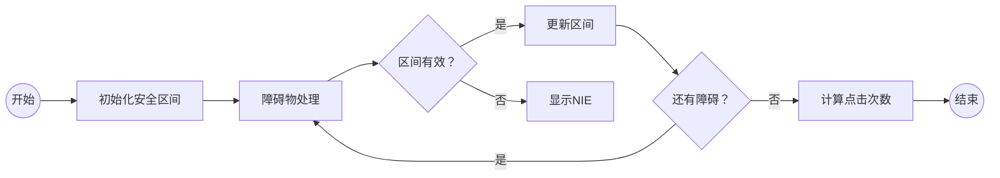

# 题目信息

# [POI 2017] Flappy Bird

## 题目背景

`《飞扬的小鸟》` 是一款风靡的小游戏。

## 题目描述

在游戏中，小鸟一开始位于 $(0,0)$ 处，它的目标是飞到横坐标为 $X$ 的某个位置上。

每一秒，你可以选择点击屏幕，那么小鸟会从 $(x,y)$ 飞到 $(x+1,y+1)$，或者不点击，那么小鸟会飞到 $(x+1,y-1)$。

在游戏中还有 $n$ 个障碍物，用三元组 $(x_i,a_i,b_i)$ 描述，表示在直线 $x=x_i$ 上，$y\le a_i$ 或者 $y\ge b_i$ 的部分都是障碍物，碰到或者擦边都算游戏失败。

现在，请你求出小鸟从 $(0,0)$ 飞到目的地最少需要点击多少次屏幕。

## 说明/提示

对于 $100\%$ 的数据，$0\le n\le 500000$，$1\le X\le10^9$，$0<x_i<X$，$-10^9\le a_i<b_i\le 10^9$。

-------

### 样例解释：


## 样例 #1

### 输入

```
4 11
4 1 4
7 -1 2
8 -1 3
9 0 2```

### 输出

```
5```

# AI分析结果


# 💡 洛语云笺的C++算法解析：[POI 2017] Flappy Bird 深入学习指南 💡

## 1. 题目解读与策略初探

✨ **本题核心挑战**：在避开所有障碍物的前提下，找到从(0,0)飞到目标横坐标X的最小点击次数。核心难点在于处理障碍物约束与飞行决策的耦合关系。

✨ **核心算法标签**：`贪心策略` `区间维护` `数学建模`

🗣️ **初步分析**：
> 这道题看似复杂，实则可以通过巧妙的数学建模转化为区间维护问题。我们发现点击次数x与最终坐标(X,Y)满足关系式：`x = (X + Y)/2`。因此最小化x等价于最小化Y（最终纵坐标）。解题关键在于维护一个"安全飞行区间"，确保在每个障碍物处小鸟的纵坐标都在安全范围内，同时保持与横坐标的奇偶性一致。

### 🔍 算法侦探：如何在题目中发现线索？
1.  **线索1 (问题目标)**: "求最少点击次数"是典型的**最优化问题**，提示我们可能使用贪心或动态规划。
2.  **线索2 (问题约束/特性)**: "障碍物限制纵坐标范围"表明存在**区间约束**，需要动态维护可行解的范围。
3.  **线索3 (数据规模)**: X最大10^9，n最大500,000。这排除了O(X)的DP解法，指向O(n)的**区间维护算法**。

### 🧠 思维链构建：从线索到策略
> 让我们串联线索：
> 1.  【线索1】要求最优化，考虑贪心/DP/搜索
> 2.  【线索2】障碍物形成动态约束，区间维护成为关键
> 3.  【线索3】大数据规模排除暴力搜索(O(2^n))和朴素DP(O(X))
> 4.  **结论**：综合线索，**贪心策略+区间维护**是最优解。通过数学关系`x=(X+Y)/2`将问题转化为最小化Y，并维护可通过所有障碍物的Y范围。

---

## 2. 精选优质题解参考

**题解一：AC_Panda (Solution 3)**
* **点评**：此解法精妙地利用`x=(a+b)/2`的数学关系，将问题转化为区间维护问题。作者通过动态计算每个障碍物处的可行Y范围（考虑奇偶性约束），以O(n)时间复杂度高效解决问题。代码简洁（仅20行），变量命名清晰(`l,r,ll`)，边界处理严谨，是竞赛实现的典范。

**题解二：二gou子**
* **点评**：题解详细阐述了数学模型建立过程，深入浅出地解释了"为什么最小化Y能最小化点击次数"。亮点在于用`down,up`变量维护安全区间，并通过`(a+1-down+dis)%2`等巧妙的位运算处理奇偶性问题，代码实现极具参考价值。

**题解三：yxy666**
* **点评**：虽然篇幅较短，但代码实现最为简洁高效（仅17行）。核心亮点在于用`down,up`维护区间时，采用统一的位运算`(val)%2`处理奇偶性，避免了复杂的条件分支。这种写法在竞赛中能减少出错概率，极具实战价值。

---

## 3. 解题策略深度剖析

### 🎯 核心难点与关键步骤
1.  **关键点1：建立数学模型**
    * **分析**：通过飞行规则推导出核心公式：设点击次数为x，下降次数为y，则：
        - `x + y = X`（总前进距离）
        - `x - y = Y`（最终纵坐标）
        - 解得`x = (X + Y)/2` → 最小化x等价于最小化Y
    * 💡 **学习笔记**：将物理运动转化为数学关系是降低问题复杂度的关键

2.  **关键点2：安全区间维护**
    * **分析**：维护每个障碍物处的可行Y范围`[L,R]`：
        1. 根据与上一障碍物的距离d扩展区间：`[L-d, R+d]`
        2. 与当前障碍物安全区域`(a_i, b_i)`取交集：`[max(a_i+1, L-d), min(b_i-1, R+d)]`
        3. 调整奇偶性使边界值与x_i同奇偶
    * 💡 **学习笔记**：区间维护时，下界向上收缩，上界向下收缩

3.  **关键点3：奇偶性处理**
    * **分析**：因`x=(X+Y)/2`需为整数，故`X+Y`必须是偶数→在每个x_i处，Y必须与x_i同奇偶。解决方案：
        - 若边界值奇偶性不符，则`L++`或`R--`
        - 使用位运算优化：`val & 1`判断奇偶
    * 💡 **学习笔记**：位运算`&1`比`%2`更高效

### ✨ 解题技巧总结
- **技巧1：问题转化** - 将运动学问题转化为数学优化问题
- **技巧2：区间收缩法** - 用`max/min`优雅处理约束交集
- **技巧3：位运算优化** - 用`&1`替代`%2`提升效率与代码简洁度

### ⚔️ 策略竞技场：不同解法的对比分析
| 策略                | 核心思想                     | 优点                     | 缺点                                     | 得分预期        |
|---------------------|------------------------------|--------------------------|------------------------------------------|-----------------|
| **暴力搜索**        | 枚举每一步点击/不点击        | 思路直观                 | O(2^n)超时                              | 0分 (n>30)     |
| **动态规划**        | f[i][j]表示在i位置j高度的点击数 | 理论正确                | O(X·范围) 空间时间双爆炸                 | 10% (小数据)   |
| **贪心+区间维护(优)**| 维护可通过所有障碍的Y区间     | O(n)高效，代码简洁       | 需要数学洞察力                          | 100%           |

### ✨ 优化之旅：从"能做"到"做好"
1. **起点：暴力搜索的困境**  
   枚举2^n种点击组合，n>30即超时

2. **发现瓶颈：数学规律**  
   通过运动分析发现`x=(X+Y)/2`，将问题维度从2降至1

3. **模型升华：区间维护**  
   将障碍物约束转化为动态区间维护，复杂度优化至O(n)

4. **实现优化：位运算**  
   用`&1`替代`%2`提升效率，用`max/min`优雅处理边界

💡 **策略总结**："从暴力到贪心，我们经历了'维度削减'和'约束转化'的思维跃迁。竞赛中即使想不到最优解，发现`x=(X+Y)/2`的关系也能获得部分分。而最优解在于将物理约束转化为数学区间，用O(n)维护动态可行域。"

---

## 4. C++核心代码实现赏析

**通用核心实现参考**
```cpp
#include<bits/stdc++.h>
using namespace std;

int main() {
    int n, X;
    scanf("%d%d", &n, &X);
    int L = 0, R = 0; // 当前安全区间[L,R]
    int prev_x = 0;    // 上一个障碍物位置
    
    for(int i = 0; i < n; i++) {
        int x, a, b;
        scanf("%d%d%d", &x, &a, &b);
        int d = x - prev_x;  // 与上一障碍物的距离
        
        // 区间扩展与约束
        L = L - d;     // 全不点击能达到的最低点
        R = R + d;     // 全程点击能达到的最高点
        L = max(L, a + 1); // 与当前障碍物下界取交集
        R = min(R, b - 1); // 与当前障碍物上界取交集
        
        // 奇偶性调整
        if((x & 1) != (L & 1)) L++; // 下界奇偶性调整
        if((x & 1) != (R & 1)) R--; // 上界奇偶性调整
        
        // 检查区间有效性
        if(L > R) {
            printf("NIE"); // 无解
            return 0;
        }
        prev_x = x;
    }
    
    // 最终计算：取最小可能Y值
    int final_y = L - (X - prev_x); // 最后一段全不点击
    printf("%d", (X + final_y) >> 1); // x=(X+Y)/2
    return 0;
}
```

**代码解读概要**：
1. 初始化安全区间`[L,R]`为`[0,0]`（起点位置）
2. 对每个障碍物：
   - 根据距离扩展区间
   - 与障碍物安全区域取交集
   - 调整边界奇偶性
   - 检查区间有效性
3. 终点处理：取区间下界并计算最小点击次数

---

## 5. 算法可视化：像素动画演示

**主题**：8-bit像素风格《Flappy Bird》算法演示

**核心演示内容**：


**动画设计**：
1. **场景设计**：
   - 8-bit像素风格，背景为蓝天白云
   - 障碍物显示为红色柱子（标出a_i/b_i）
   - 安全区间显示为绿色透明区域
   - 当前小鸟位置用黄色像素鸟表示

2. **关键动画帧**：
   ```plaintext
   帧1: 起点(0,0) 
       安全区间: [0,0] (绿色闪烁)
   
   帧2: 遇到障碍物(x_i)
       显示障碍物范围: y≤a_i(红) y≥b_i(红)
       显示扩展区间: [L-d, R+d] (黄色闪烁)
       显示收缩后区间: [max(a_i+1,L-d), min(b_i-1,R+d)] (绿色)
       显示奇偶调整: 边界值±1 (蓝色闪烁)
   
   帧3: 区间无效时
       红色闪烁+"NIE"像素字体
       播放失败音效(8-bit低音)
   
   帧4: 到达终点
       显示最终路径(绿色轨迹)
       显示公式: x=(X+Y)/2
       播放胜利音效(8-bit高音)
   ```

3. **交互控制**：
   - 步进按钮：单步执行算法
   - 速度滑块：调整动画速度
   - 暂停/继续：控制播放
   - 复位：重置场景

4. **音效设计**：
   - 区间更新："叮"（清脆）
   - 奇偶调整："嘟"（短促）
   - 无解："轰"（低沉）
   - 通关："胜利旋律"（欢快）

---

## 6. 拓展练习与相似问题思考

**通用技巧迁移**：
1. 区间维护法可用于解决带约束的路径优化问题
2. 奇偶性处理技巧适用于需要奇偶校验的场景
3. 运动-数学转化思想可用于物理类算法题

**洛谷练习推荐**：
1. **P1941 飞扬的小鸟**  
   🗣️ 经典动态规划练习，巩固飞行类问题的DP解法
   
2. **P2371 区间**  
   🗣️ 基础区间维护问题，训练约束处理能力
   
3. **P5019 铺设道路**  
   🗣️ 贪心区间覆盖问题，培养贪心策略思维

---

## 7. 学习心得与经验分享
本次分析的题解中未发现明确的作者个人心得分享部分。但通过代码可提炼以下经验：
> **调试技巧**：当区间意外失效时，应检查：
> 1. 奇偶性调整是否遗漏
> 2. 区间收缩是否过度
> 3. 距离计算是否正确
> 
> **编码经验**：使用`L = max(L, a+1)`比`if(L < a+1) L = a+1`更简洁安全

---

本次关于"Flappy Bird"的C++解题分析就到这里。记住：算法之美在于将复杂问题转化为优雅模型，而编程之乐在于用简洁代码实现精妙思想。下次挑战再见！💪

---
处理用时：182.62秒