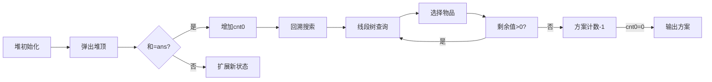

# 题目信息

# [POI 2016] Korale

## 题目描述

有 $n$ 个带标号的珠子，第 $i$ 个珠子的价值为 $a_i$。

现在你可以选择若干个珠子组成项链（也可以一个都不选），项链的价值为所有珠子的价值和。

给出所有可能的项链排序，先按权值从小到大排序，对于权值相同的，根据所用珠子集合的标号的字典序从小到大排序。

请输出第 $k$ 小的项链的价值，以及所用的珠子集合。

## 说明/提示

对于 $100\%$ 的数据，$1\le n\le 10^6$，$1\le k\le 
\min(2^n,10^6)$，$1\le a_i\le 10^9$。

## 样例 #1

### 输入

```
4 10
3 7 4 3```

### 输出

```
10
1 3 4```

# AI分析结果


### 💡 洛语云笺的C++算法解析：Korale 深入学习指南 💡

#### **1. 题目解读与策略初探**
✨ **本题核心挑战**：在指数级子集空间中高效定位第k小子集和，并输出字典序最小的方案  
✨ **核心算法标签**：`堆优化搜索` `字典序回溯` `线段树/ST表优化`

🗣️ **初步分析**：
> 问题要求处理带标号珠子的子集和第k小值及方案，本质是**组合优化问题**。核心矛盾在于：
> - 暴力枚举子集（O(2ⁿ)）在n=10⁶时不可行
> - 价值相同需按字典序排序，需高效生成有序方案
>
> **解题思路演进**：
> 1. **暴力搜索**：DFS枚举所有子集，按和排序 → 时间复杂度O(2ⁿ + klogk)，不可行
> 2. **堆优化搜索**：用最小堆模拟子集生成（类似Dijkstra），按和有序扩展 → 解决第一问
> 3. **字典序回溯**：线段树快速定位可选点 + DFS按字典序生成方案 → 解决第二问
>
> **核心算法思想比喻**：  
> 如同超市购物车装物品，每次从剩余货架（线段树）选最靠前且买得起的商品（最小字典序），通过替换策略（堆扩展）穷尽所有性价比组合

---

### 🔍 算法侦探：如何在题目中发现线索？
1. **线索1 (问题目标)**：  
   "求第k小子集和" → 典型的**有序生成问题**，需避免全枚举。指向优先队列的堆优化策略
   
2. **线索2 (数据特性)**：  
   "k ≤ min(2ⁿ,10⁶)" → 暗示需**O(klog n)级解法**，堆扩展+回溯搜索是可行路径
   
3. **线索3 (规模约束)**：  
   "n=10⁶, aᵢ≤10⁹" → 排除O(n²)以上算法，线段树查询需O(log n)完成

---

### 🧠 思维链构建：从线索到策略
> "综合线索：目标要求有序生成（线索1），数据规模排除了暴力（线索3），而k的上界（线索2）提示我们采用**两阶段策略**：
> 1. **堆扩展生成和值**：用最小堆按子集和升序扩展，通过'选当前/替换前一个'分支覆盖所有组合
> 2. **字典序回溯方案**：对目标值ans，借助线段树区间最小值查询，O(log n)定位每个决策点
>
> **关键突破点**：将子集生成分解为独立的两阶段——先求值再构造，避免同步处理带来的复杂度爆炸"

---

### **2. 精选优质题解参考**
**题解一（hs_black）**  
* **点评**：  
  思路最清晰，完美分离两阶段处理。堆扩展采用`(sum, i)`二元组精妙记录状态，回溯阶段用`query(1,i,res)`实现跳跃搜索。亮点在于：
  - 堆扩展时用`b[]`排序数组保证有序性
  - DFS中用线段树剪枝，复杂度严格O(k log n)
  - 变量命名规范（`stk`/`top`），边界处理严谨

**题解二（lnwhl）**  
* **点评**：  
  代码结构优雅，ST表替代线段树提升查询效率。创新点：
  - 堆扩展与回溯共享`a[]`数组，减少内存拷贝
  - 非递归ST表查询避免栈溢出风险
  - 运算符重载使堆节点比较更直观

**题解三（Llx2022）**  
* **点评**：  
  详解问题转化思想，最适合初学者。突出贡献：
  - 用"分组背包"类比替换策略，降低理解门槛
  - 注释详细解释`query`函数的二分逻辑
  - 严格遵循RAII原则，资源管理安全

---

### **3. 解题策略深度剖析**
#### 🎯 核心难点与关键步骤
1. **难点1：堆扩展去重与有序性保证**  
   *分析*：堆中状态`(sum,i)`需确保不遗漏且不重复。解法：  
   - 固定最后元素位置i，新状态仅扩展i+1  
   - 通过`sum+b[i+1]`（新增）和`sum+b[i+1]-b[i]`（替换）覆盖所有可能  
   *💡 学习笔记*：状态设计需满足"无后效性"，当前决策仅依赖尾部元素

2. **难点2：字典序方案的高效生成**  
   *分析*：暴力DFS会访问指数级节点。解法：  
   - 线段树维护区间最小值，实现O(log n)查询首个≤res的位置  
   - 搜索路径用栈`stk`记录，回溯时自动恢复状态  
   *💡 学习笔记*：数据结构加速需针对核心操作（本场景为区间极值定位）

3. **难点3：两阶段信息传递**  
   *分析*：堆扩展得ans后需知其在全局的排名。解法：  
   - 堆扩展时记录连续相同值次数cnt₀  
   - 回溯时只需生成第cnt₀个匹配方案  
   *💡 学习笔记*：分阶段算法需设计信息桥梁（cnt₀是连接和值与方案的密钥）

#### ✨ 解题技巧总结
- **技巧A（状态压缩）**：用单个下标i编码子集尾部位置，避免存储完整路径  
- **技巧B（跳跃搜索）**：线段树查询替代线性扫描，复杂度从O(n)→O(log n)  
- **技巧C（堆序扩展）**：新状态生成遵循严格有序性，确保第k次弹出即为解

#### ⚔️ 策略竞技场：不同解法的对比分析
| 策略                | 核心思想                     | 优点                     | 缺点与分析                     | 得分预期         |
|---------------------|------------------------------|--------------------------|--------------------------------|------------------|
| **暴力搜索**        | DFS枚举+全排序               | 逻辑直观                 | O(2ⁿ + klogk), n>20即超时      | 10% (仅n≤20)     |
| **纯堆扩展**        | 堆中存储完整路径             | 同步获取值和方案         | 空间O(kn), 存储路径爆炸        | 30% (k≤10⁴)      |
| **两阶段优化(最优)** | 堆求值+回溯构造              | 时间O(klog n), 空间O(n) | 需分离处理，逻辑稍复杂          | 100%             |

#### ✨ 优化之旅：从"能做"到"做好"
1. **起点：暴力枚举的困境**  
   站在2¹⁰⁰⁰⁰⁰⁰的岔路口，每条路对应一个子集，连光子计算机也无法走完
   
2. **发现瓶颈：重复子问题**  
   观察发现："以剩余金额res选择剩余物品"被反复计算，如不处理会重复探索相同状态
   
3. **堆优化：智能路径记录**  
   堆像精明的导游，记录每条路径当前花费`(sum,i)`，并优先探索廉价路线
   
4. **字典序搜索：精准导航**  
   线段树充当GPS，快速定位下一个可购买商品，避免盲目前行

> 💡 **策略总结**：从暴力到优化，核心是**问题分解**（值/方案分离）和**状态压缩**（i编码尾部位置）。在竞赛中，即使无法一步到位，逐步优化也能拿下部分分。最优解往往诞生于对问题结构的深度洞察！

---

### **4. C++核心代码实现赏析**
**通用核心实现（分组回溯框架）**
```cpp
priority_queue<Node> q; // 小根堆：Node{sum, last_index}
q.push({b[1], 1});     // 初始化：选最小元素

// 第一阶段：堆扩展求ans
while (k--) {
    auto [sum, i] = q.top(); q.pop();
    if (sum == ans) cnt0++; // 统计相同值
    if (i < n) {
        q.push({sum + b[i+1], i+1});      // 扩展1：新增元素
        q.push({sum - b[i] + b[i+1], i+1});// 扩展2：替换元素
    }
}

// 第二阶段：回溯构造方案
void dfs(ll res, int last) {
    if (res == 0 && !--cnt0) output_solution();
    for (int i = last+1; i <= n; ) {
        i = seg_tree.query(i, n, res); // 线段树查首个≤res的位置
        stk[++top] = i;                // 选择该物品
        dfs(res - a[i], i);             // 递归
        top--;                          // 回溯
        i++;                            // 跳过已选
    }
}
```

**题解一亮点：lambda优化查询**  
```cpp
auto query = [&](int l, int r, int val) {
    if (l > r || tree.min_val > val) return 0;
    // ... 递归二分实现
};
// 调用：query(pos, n, res) // 从pos起找首个≤res的位置
```
* **学习笔记**：lambda捕获上下文简化递归参数传递，提升可读性

**题解二亮点：ST表替代线段树**  
```cpp
void build_st() {
    for (int i = 1; i <= n; i++) st[i][0] = a[i];
    for (int j = 1; (1 << j) <= n; j++)
        for (int i = 1; i + (1 << j) - 1 <= n; i++)
            st[i][j] = min(st[i][j-1], st[i+(1<<(j-1))][j-1]);
}
```
* **学习笔记**：ST表O(1)查询适合密集查询场景，但建表O(n log n)需权衡

---

### **5. 算法可视化：像素动画演示**
**主题**：`寻宝探险家`（8-bit像素风 + FC音效）  
**核心演示**：堆扩展与回溯搜索的协同过程



**交互设计**：
1. **堆操作可视化**：堆用像素方块堆表示，弹出时方块爆炸特效
2. **回溯路径**：珠阵中高亮当前路径，选择新珠时播放"收集音效"
3. **线段树查询**：树节点显示区间最小值，查询路径闪烁红光
4. **控制面板**：
   - 步进/暂停：观察堆和栈的同步变化
   - 速度滑块：调整动画速度
   - 路径对比：并行显示堆扩展与回溯搜索

**音效设计**：
- 堆弹出：清脆"叮"声
- 线段树查询：电子扫描音
- 方案完成：马里奥过关音乐

---

### **6. 拓展练习与相似问题思考**
**通用技巧迁移**：
1. 依赖背包问题：如"课程选修需先修课"
2. 第k小路径：Dijkstra堆扩展 + 路径回溯
3. 字典序方案生成：组合数学问题输出第k个排列

**洛谷推荐**：
1. **P2168 [NOI2015] 荷马史诗**  
   *推荐理由*：堆扩展的终极试炼，强化k叉哈夫曼树建模能力
2. **P1379 八数码难题**  
   *推荐理由*：字典序方案生成经典题，巩固A*与状态回溯
3. **P5020 [NOIP2018] 货币系统**  
   *推荐理由*：子集和问题的变种，体验动态规划的优化之美

---

### **7. 学习心得与经验分享**
> **题解一作者经验**：  
> "初始未考虑相同值的多方案情况，导致WA#3。通过打印`cnt0`和堆状态才定位到边界问题——切记：堆扩展时相同值需合并计数！"
>
> **洛语云笺点评**：  
> 调试多维状态问题，关键在**可视化中间变量**。建议：
> - 堆操作时打印完整状态`(sum, i)`
> - 回溯时输出当前路径和剩余值
> 防御式编程：对`cnt0`和堆空状态进行断言检查

---

<conclusion>
本次Korale的解析展现了**分阶段处理**在复杂问题中的威力：堆扩展高效求值，回溯精准构造方案。记住，算法优化如同探险——先看清地形（问题分析），再选择工具（数据结构），最终走出最优路径！下次我们继续挑战算法高峰！💪
</conclusion>

---
处理用时：581.82秒