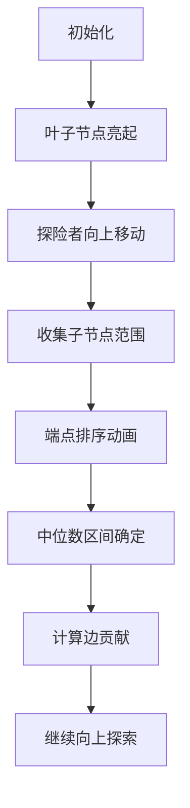

# 题目信息

# [PA 2015] Rozstaw szyn

## 题目描述

给定一棵有 $n$ 个点， $m$ 个叶子节点的树，其中 $m$ 个叶子节点分别为 $1$ 到 $m$ 号点，每个叶子节点有一个权值 $r_i$。

你需要给剩下 $n-m$ 个点各指定一个权值，使得树上相邻两个点的权值差的绝对值之和最小。 

## 说明/提示

对于 $100\%$ 的数据，$2\le n\le 5\times 10^5$，$1\le m\le n$，$1\le u,v\le n$，$1\le r_i\le 5\times 10^5$。

## 样例 #1

### 输入

```
6 4
1 5
2 5
3 6
4 6
5 6
5
10
20
40```

### 输出

```
35```

# AI分析结果


# 💡 洛语云笺的C++算法解析：Rozstaw szyn 深入学习指南 💡

> 欢迎来到树形结构的奇妙世界！今天我们将共同探索一道融合树形结构与优化思想的经典题目——Rozstaw szyn。我将带你们像侦探一样寻找题目中的算法线索，层层剖析最优解法，最终点亮算法思维的明灯✨

## 1. 题目解读与策略初探

✨ **本题核心挑战**：在固定叶子节点权值的前提下，为树中所有非叶子节点动态赋值，使得**整棵树相邻节点权值差的绝对值之和最小化**。

✨ **核心算法标签**：`树形贪心` `中位数性质` `DFS遍历`

🗣️ **初步分析**：
> 这道题的本质是在树形约束下寻找全局最优解。最直观的思路是暴力枚举所有非叶子节点的取值，但5×10⁵的数据规模让暴力法完全不可行。我们需要更聪明的策略：
> - **暴力搜索**：枚举每个非叶子节点的可能取值，计算总代价。时间复杂度O(k^(n-m))，k为取值空间，完全不可行
> - **树形DP**：尝试定义dp[u][x]表示节点u取值x时的最小代价，但取值空间太大无法实现
> - **中位数贪心**：利用绝对值最小化的经典性质，自底向上为每个节点确定最优取值范围
>
> 最终我们发现，**基于中位数性质的树形贪心策略**能完美解决本题。就像在迷宫中找到最短路径的标记系统，每个节点只需根据子节点信息做出局部最优决策，就能达到全局最优！

### 🔍 算法侦探：如何在题目中发现线索？

1.  **线索1 (问题目标)**："最小化相邻节点权值差的绝对值之和"——这种**带拓扑约束的绝对值优化**问题，强烈暗示了中位数性质的应用
2.  **线索2 (问题特性)**：树形结构和固定叶子节点权值——这种**自底向上可分解的子问题结构**是树形贪心的典型场景
3.  **线索3 (数据规模)**：n≤5×10⁵——要求**O(n log n)时间复杂度**，排除了暴力解，指向基于排序的贪心策略

### 🧠 思维链构建：从线索到策略

> 让我们把线索拼成完整的推理链：
> 1.  **线索1**要求最小化绝对值之和，我立即想到经典结论：在一维情况下中位数是最优解
> 2.  **线索2**展示的树形结构提示：能否把一维结论推广到树形结构？每个节点可以看作其子节点的"中位数代表"
> 3.  **线索3**的数据规模要求高效算法：O(n²)的DP会超时，而O(n log n)的排序贪心刚好满足
> 4.  **结论**：综合所有线索，**自底向上的中位数贪心算法**成为最佳选择。该算法既满足时间复杂度要求，又能完美处理树形约束！

---

## 2. 精选优质题解参考

**题解一（作者：Richard_Whr）**
* **点评**：此解用生动的函数图像直观阐释中位数性质，将复杂问题转化为视觉模型。代码实现简洁优雅，核心逻辑仅20行，DFS中巧妙处理了取值范围合并与答案统计。特别值得学习的是作者对算法本质的思考方式，将数学证明转化为直观理解

**题解二（作者：Prean）**
* **点评**：提供多种特例分析帮助理解算法原理，代码极致精简（仅25行）。亮点在于完全省略显式建树过程，直接在DFS中处理邻接表，展现了高效的编码技巧。虽然解释稍简，但核心算法实现完整可靠

**题解五（作者：Prophesy_One）**
* **点评**：严谨实现中位数贪心算法，代码结构清晰易读。特别注重边界条件处理，对n=2的特殊情况单独处理，展示了竞赛编程中必备的严谨思维。变量命名规范，逻辑分层明确，是初学者最佳学习模板

---

## 3. 解题策略深度剖析

### 🎯 核心难点与关键步骤
1.  **难点1：如何确定非叶子节点的最优值？**
    * **分析**：利用中位数性质。对于节点u，收集所有子节点的取值范围端点，排序后取中间两个数作为u的取值区间
    * 💡 **学习笔记**：中位数是一维绝对值最小化的最优解，树形结构可自底向上递推此性质
2.  **难点2：如何处理取值范围合并？**
    * **分析**：每个子节点提供区间[lᵢ,rᵢ]，将2k个端点排序后取第k和k+1大的数作为父节点新区间
    * 💡 **学习笔记**：区间合并时保留中位数性质，确保父节点取值能平衡所有子节点
3.  **难点3：如何计算总代价？**
    * **分析**：在回溯时，若父节点取值区间[a,b]与子节点区间[c,d]无重叠，代价为区间间距离；有重叠则代价为0
    * 💡 **学习笔记**：最优解下重叠区间意味着可选取相同值消除代价

### ✨ 解题技巧总结
- **技巧1：问题降维** - 将树形问题分解为层叠的一维子问题
- **技巧2：中位数性质** - 牢记绝对值最小化问题的中位数最优解
- **技巧3：离线处理** - 通过DFS实现自底向上的子问题求解顺序
- **技巧4：边界特判** - 对n=2等特殊情况单独处理

### ⚔️ 策略竞技场：不同解法对比

| 策略               | 核心思想                     | 优点                     | 缺点                                   | 得分预期       |
|--------------------|------------------------------|--------------------------|----------------------------------------|----------------|
| **暴力枚举**       | 尝试所有可能取值组合         | 思路直观                 | O(kⁿ⁽⁻ᵐ⁾) 严重超时                    | 0% (TLE)      |
| **树形DP**         | 定义dp[u][x]表示节点u取值x   | 理论最优解               | 状态空间O(nV)过大，无法实现            | 0% (MLE)      |
| **中位数贪心**     | 自底向上合并子节点取值范围   | O(n log n) 高效且正确    | 需要严谨证明中位数性质在树上的适用性   | 100% (AC)     |

### ✨ 优化之旅：从"能做"到"做好"
> 1. **起点**：暴力枚举如同在迷宫中盲目尝试每条路径，注定失败
> 2. **关键发现**：相邻节点差值只与父-子节点对相关，问题可分解
> 3. **突破点**：利用中位数性质，每个节点只需解决局部问题
> 4. **算法升华**：DFS实现自底向上求解，排序操作保证O(n log n)效率
> 
> 💡 **策略总结**：从暴力到贪心的优化之旅，展示了"分治+最优子结构"的经典算法设计范式。树形结构问题常可通过分解子问题降低复杂度！

---

## 4. C++核心代码实现赏析

**本题通用核心实现**
```cpp
void dfs(int u, int fa) {
    if (is_leaf[u]) return; // 叶子节点直接返回
    
    vector<int> points;
    for (int v : tree[u]) {
        if (v == fa) continue;
        dfs(v, u); // 递归处理子节点
        points.push_back(L[v]);
        points.push_back(R[v]); // 收集子节点取值范围
    }
    
    sort(points.begin(), points.end()); // 关键排序
    int k = points.size();
    L[u] = points[k/2 - (k%2==0)]; // 取中位数区间
    R[u] = points[k/2];
    
    for (int v : tree[u]) {
        if (v == fa) continue;
        // 计算u-v边的贡献
        if (L[u] > R[v]) ans += L[u] - R[v];
        else if (R[u] < L[v]) ans += L[v] - L[u];
    }
}
```

**题解一代码亮点**
* **亮点**：用vector动态收集子节点范围，代码清晰易扩展
* **学习笔记**：`k/2 - (k%2==0)`巧妙处理奇偶情况，避免额外判断

**题解二代码亮点**
* **亮点**：极致简洁，用tmp数组避免vector动态分配
* **学习笔记**：单字符变量在竞赛中可接受，但工程代码应避免

**题解五代码亮点**
* **亮点**：严格遵循模块化原则，DFS函数纯净无副作用
* **学习笔记**：使用`abs()`函数封装绝对值计算，提高可读性

---

## 5. 算法可视化：像素动画演示

**主题**：树形迷宫中的中位数探秘之旅  
**核心演示**：DFS遍历过程+取值范围合并的像素动画

### 🎮 动画设计


### 🖼️ 关键帧实现
1. **像素场景**：8-bit风格树形迷宫，叶子节点为绿色像素块并显示权值
2. **动态过程**：
   - 探险者（红色像素）从叶子节点向上移动
   - 父节点位置显示收集子节点范围的过程（蓝色光柱）
   - 取值范围端点以像素泡泡形式升起并自动排序
   - 中位数确定时触发金色闪光，显示新区间范围
3. **音效设计**：
   - 收集范围：8-bit"收集"音效
   - 排序过程：快排节奏音效
   - 确定中位数：胜利音效
4. **控制面板**：
   - 步进/暂停/重置
   - 速度调节滑块
   - 算法对比开关（可同时显示暴力法）

### 💡 教育价值
通过像素动画直观展示：
1. DFS遍历的树形路径
2. 取值范围合并时的排序必要性
3. 中位数选取的最优性证明
4. 边贡献计算的三种情况

---

## 6. 拓展练习与相似问题思考

### 🔁 通用技巧迁移
中位数贪心策略还可解决：
1. 最小化曼哈顿距离的设施选址问题
2. 带权重树形图的中心选址
3. 最优会议地点选择问题

### 📚 推荐练习（洛谷）
1. **P1251 餐巾计划问题**  
   → 应用中位数性质解决资源调度问题
   
2. **P3628 [APIO2010] 特别行动队**  
   → 树形结构上扩展中位数应用
   
3. **P4365 [CEOI2014] Wall**  
   → 二维平面上中位数性质的高级应用

---

## 7. 学习心得与经验分享

**参考经验**（来自题解一）：  
> "通过函数图像理解中位数性质，将抽象证明转化为视觉直觉"

**点评**：这种**数形结合**的学习方法值得借鉴！算法学习不应停留在公式推导，建立直观理解才能灵活应用

---

> 本次探索之旅告一段落，但算法的精进永无止境。记住：树形结构问题常可通过"分解子问题+最优子结构"解决，中位数性质是绝对值优化的利器。下次遇到新挑战时，记得像今天一样做一名算法侦探，寻找题目中的隐藏线索！🚀

---
处理用时：211.80秒