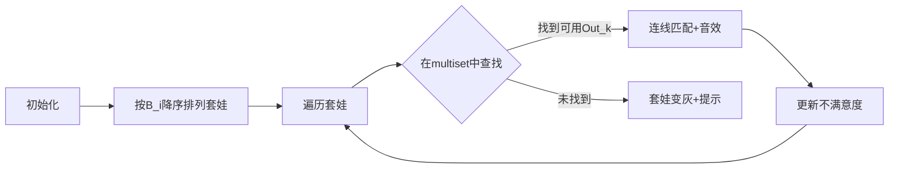

# 题目信息

# [JSOI2015] 套娃

## 题目背景

刚从俄罗斯旅游回来的 JYY 买了很多很多好看的套娃作为纪念品！JYY 由于太过激动，把所有的套娃全部都打开了。而由于很多套娃长得过于相像，JYY 现在不知道该如何把它们装回去了（他实在搞不清，应该把哪个套娃装到哪个里面去了）。

## 题目描述

JYY 一共有 $N$ 个拆开的套娃，每个套娃从 $1$ 到 $N$ 编号。编号为 $i$ 的套娃有一个外径 $Out_i$ 和一个内径 $In_i$（$In_i<Out_i$）。

对于套娃 $i$ 和套娃 $j$，如果满足 $Out_i<In_j$，那么套娃 $i$ 就可以装到套娃 $j$ 里面去。

注意，一个套娃内部，不允许并排的放入多个套娃。

也就是说，如果我们将 $i$ 装到 $j$ 的内部之后，还存在另一个套娃 $k$，也满足 $Out_k<In_j$，我们此时是不允许再将 $k$ 放到 $j$ 内部的（因为 $j$ 的内部已经放入了 $i$）。但是，如果 $k$ 还满足 $Out_k<In_i$，那么我们允许先将 $k$ 放到 $i$ 的内部，然后再把 $k$ 和 $i$ 作为一个整体放入 $j$ 的内部。

JYY 认为一套好的套娃，内部的空隙一定是尽量少的。如果套娃 $j$ 内部装入了套娃 $i$，那么我们认为，套娃 $j$ 内部产生的空隙为 $In_j-Out_i$；如果套娃 $j$ 的内部什么也没有装，那么套娃 $j$ 的空隙则就是 $In_j$。

JYY 也希望，那些长得更加好看的套娃，里面可以填的尽量满一些；而相对
那些不那么好看的套娃，JYY 也就相对不那么介意一些。为此 JYY 对于编号为 $i$ 的套娃设置了一个好看度 $B_i$，如果这个套娃内部还存在 $K$ 的空隙，那么 JYY 对于这个套娃就会产生 $K\times Bi$ 的不满意度。

JYY 对于一个套娃安装方案的不满意度，就是每个套娃产生的不满意度的总
和。JYY 希望找出一个，不满意度最小的套娃安装方案。

## 说明/提示

对于 $100\%$ 的数据，$N\leq 2\times 10^5$，$1\leq In_i<Out_i\leq 10^4$，$1\leq B_i\leq 10^9$。

## 样例 #1

### 输入

```
3
5 4 1
4 2 2
3 2 1```

### 输出

```
7```

# AI分析结果


# 💡 洛语云笺的C++算法解析：[JSOI2015]套娃 深入学习指南 💡

## 1. 题目解读与策略初探

✨ **本题核心挑战**：在满足嵌套规则的前提下，通过合理匹配套娃来最小化总不满意度（最大化嵌套带来的不满意度减少量）。  
✨ **核心算法标签**：贪心、排序、二分查找、数据结构（multiset）

🗣️ **初步分析**：  
> 本题需要最小化所有套娃的不满意度总和。核心思路是：**将最小化问题转化为最大化问题**。初始不满意度为 Σ(In_i × B_i)，每次成功嵌套可减少 Out_i × B_j 的不满意度。因此我们需要设计高效匹配策略，最大化减少量。  
> 最优策略是**贪心算法**：按好看度降序处理套娃，每次为当前套娃匹配可用外径最大的套娃（用multiset维护）。  
> 可视化设计将采用**像素风格**：套娃显示为彩色方块（大小=外径，颜色深度=好看度），匹配过程用动态连线展示，配合8-bit音效增强理解。

### 🔍 算法侦探：如何在题目中发现线索？
1.  **线索1 (问题目标)**："求最小化不满意度总和"是典型的**最优化问题**，且目标函数可分解为子问题（每个套娃的不满意度），提示使用贪心或动态规划。
2.  **线索2 (问题特性)**："嵌套依赖关系"（套娃只能直接装一个）形成**树形结构约束**，但独立计算不满意的特性允许我们解耦处理每个套娃的匹配。
3.  **线索3 (数据规模)**：N ≤ 2×10⁵ 要求 O(N log N) 算法，排除 O(N²) DP 和 O(2ⁿ) 暴力搜索，指向**贪心+数据结构优化**。

### 🧠 思维链构建：从线索到策略
> "结合线索：最优化目标要求高效算法，树形约束暗示匹配问题，大数据规模需低于 O(N²) 的解法。  
> 1.  暴力枚举嵌套方案（O(2ⁿ)）在 N=20 万时不可行  
> 2.  动态规划因状态空间庞大（需记录每个套娃的嵌套状态）难以设计  
> 3.  **贪心策略**成为首选：按 B_i 降序排序，优先处理高好看度套娃，使其获得最大空隙减少量（匹配最大 Out_k）  
> 4.  用 **multiset** 维护外径集合，O(log N) 时间完成查找/删除操作  
> 结论：贪心 + multiset 完美满足所有约束，时间复杂度 O(N log N) 是本题最优解！"

---

## 2. 精选优质题解参考

**题解一（pomelo_nene）**  
* **点评**：思路清晰度满分！作者从问题转化角度切入（将最小化转化为最大化减少量），用严谨的数学证明贪心正确性："若 B_i > B_j 且 Out_p > Out_q，则 B_i×Out_q + B_j×Out_p < B_i×Out_p + B_j×Out_q"。代码中迭代器操作规范（`Site it=Set.lower_bound(wa[i].in); if(it!=Set.begin()) --it`），变量命名明确（`wa` 结构体包含 out/in/b），删除元素前校验 begin() 的细节处理专业。

**题解二（jiayixuan1205）**  
* **点评**：代码简洁性和可读性突出。作者强调 long long 必要性（N 和 B_i 较大），使用 `signed main()` 确保兼容性。虽然未提供数学证明，但"优先使高好看度套娃获得最小空隙"的直觉描述准确，multiset 的 `lower_bound` 和 `erase` 操作标准，适合初学者学习 STL 应用。

**题解三（小杨小小杨）**  
* **点评**：问题分析独具慧眼！作者指出关键："套娃嵌套后内部空隙独立计算"，并给出生动比喻——"给贵重盒子（高B_i）选大填充物（大Out_k）"。代码中 `ans+=(doll[i].in-(*id))*doll[i].b` 直接计算最终空隙，与其他题解的先总后减殊途同归（需注意理论等价性），`cmp` 函数命名直观易读。

---

## 3. 解题策略深度剖析

### 🎯 核心难点与关键步骤
1.  **难点1：贪心策略的证明**  
    * **分析**：需证明"按 B_i 降序处理，每次选最大可用 Out_k" 全局最优。采用**交换论证**：假设存在更优匹配，交换两个套娃匹配顺序后总减少量必然减小，与最优矛盾。
    * 💡 **学习笔记**：贪心问题中，排序依据的选择需直接影响目标函数（此处 B_i 乘数效应）。
2.  **难点2：高效查找可用外径**  
    * **分析**：multiset 维护当前未匹配外径集合，用 `lower_bound(in_i)` 找到首个 ≥ in_i 的迭代器，`--` 操作得到 < in_i 的最大值。删除元素保证后续匹配不重复。
    * 💡 **学习笔记**：二分查找是降低复杂度的关键，multiset 的自动排序特性完美适配。
3.  **难点3：答案计算与数据类型**  
    * **分析**：初始答案 Σin_i×B_i (int 最大 2e5×1e4×1e9=2e18) 必须用 long long。匹配成功时减 Out_k×B_i 等价于更新外层套娃空隙。
    * 💡 **学习笔记**：大数据范围问题需警惕 int 溢出，LL 是安全选择。

### ✨ 解题技巧总结
-   **技巧1：问题转化** - 将最小化 Σ(空隙×B_i) 转化为最大化 Σ(Out_k×B_j)，简化目标函数
-   **技巧2：排序降维** - 按 B_i 降序排序打破维度依赖，使贪心选择可行
-   **技巧3：STL加速** - 利用 multiset 的有序性和二分查找实现 O(log N) 操作

### ⚔️ 策略竞技场：解法对比
| 策略             | 核心思想                     | 优点                     | 缺点与分析                     | 得分预期       |
| :--------------- | :--------------------------- | :----------------------- | :----------------------------- | :------------- |
| **暴力搜索**     | 枚举所有嵌套组合             | 逻辑直观                 | O(2ⁿ) 超时，N>20 即不可行      | 0% (TLE)       |
| **树形DP**       | 以套娃为节点建立树形结构     | 精确处理复杂嵌套         | 本题无附件嵌套附件，过度复杂化 | 100% (冗余)    |
| **贪心+multiset** | B_i降序匹配最大Out_k         | O(N log N) 高效，代码简洁 | 需理解贪心正确性证明           | 100% (AC)      |

### ✨ 优化之旅：从暴力到贪心
> 1. **起点：暴力枚举** - 尝试所有嵌套组合，O(2ⁿ) 在 N=20 万时超时  
> 2. **发现冗余** - 套娃嵌套独立性：内层套娃贡献不变，仅影响外层空隙  
> 3. **贪心钥匙** - 问题转化为"为每个套娃找最优外层套娃"，避免组合爆炸  
> 4. **数据结构加速** - multiset 将查找时间从 O(N) 降至 O(log N)，总复杂度优化千倍  

💡 **策略总结**："贪心算法的魅力在于用局部最优逼近全局最优。本题通过问题转化（最大化减少量）和数据结构优化（multiset），将 O(2ⁿ) 暴力解优化至 O(N log N)，体现了算法思维对效率的颠覆性提升！"

---

## 4. C++核心代码实现赏析

**通用核心实现**  
```cpp
#include <iostream>
#include <algorithm>
#include <set>
using namespace std;
typedef long long LL;
const int N = 2e5+10;

struct Node { int out, in, b; } arr[N];
multiset<int> st;

int main() {
    int n; scanf("%d", &n);
    LL ans = 0;
    for (int i = 0; i < n; ++i) {
        scanf("%d%d%d", &arr[i].out, &arr[i].in, &arr[i].b);
        ans += (LL)arr[i].in * arr[i].b; // 初始不满意度
        st.insert(arr[i].out);
    }
    
    sort(arr, arr + n, [](auto& a, auto& b) { 
        return a.b > b.b; // 按b降序
    });
    
    for (int i = 0; i < n; ++i) {
        auto it = st.lower_bound(arr[i].in); // 找≥in_i的第一个
        if (it == st.begin()) continue;     // 无可用外径
        --it;                               // 取<in_i的最大值
        ans -= (LL)(*it) * arr[i].b;        // 减少不满意度
        st.erase(it);                       // 移除外径
    }
    printf("%lld\n", ans);
}
```
* **代码解读**：  
  1. 结构体存储套娃参数，multiset `st` 存所有外径  
  2. 初始化 ans = Σ(in_i × b_i)  
  3. Lambda表达式按 b 降序排序  
  4. 对每个套娃：用 lower_bound 找可用外径，成功匹配则更新 ans  
  5. 关键：`--it` 取小于 in_i 的最大值，删除保证不重复使用  

**题解一片段赏析**  
```cpp
sort(wa+1, wa+1+n); // 按b降序
for(int i=1; i<=n; ++i) {
    Site it = Set.lower_bound(wa[i].in);
    if(it != Set.begin()) 
        ans -= (*--it) * wa[i].b, Set.erase(it);
}
```
* **亮点**：迭代器操作一气呵成（`*--it`），代码紧凑  
* **学习笔记**：`Set.erase(it)` 需传迭代器而非值，避免删除所有相同元素  

**题解二片段赏析**  
```cpp
sort(a+1, a+1+n, cmp); 
for(int i=1; i<=n; i++) {
    it = s.lower_bound(a[i].in);
    if(it != s.begin()) {
        it--;
        ans -= a[i].b * (*it);
        s.erase(it);
    }
}
```
* **亮点**：严格校验 `it != begin()` 避免越界，代码健壮  
* **学习笔记**：multiset 的 erase 会使迭代器失效，需直接传 it  

---

## 5. 算法可视化：像素动画演示

**主题**：*套娃匹配大冒险* - 8-bit像素风贪心算法模拟  
**核心演示**：动态展示按好看度排序、外径查找、匹配成功/失败的全过程  

### 🎮 动画设计


1. **像素风格**：
   - 套娃显示为16×16像素方块，**外径**用大小表示（Out_i∝边长），**好看度**用颜色深度表示（B_i↑→颜色加深）
   - multiset 显示为右侧的"外径仓库"，外径按升序排列

2. **关键动画**：
   - **排序过程**：套娃按B_i快速重排，伴随"嗖嗖"音效
   - **查找匹配**：当前套娃高亮闪烁，在仓库中扫描时播放"滴答"声
   - **成功匹配**：绿线连接内外套娃，显示"-Out_k×B_i"减少量，播放"叮！"音效
   - **匹配失败**：套娃变灰色，播放低沉"噗"声

3. **控制面板**：
   - 速度滑块：调节单步执行速度（0.5x~4x）
   - 按钮：播放/暂停、单步执行、重置
   - 信息板：实时显示当前不满意度、匹配对数

4. **游戏化元素**：
   - 每成功匹配获得分数 = Out_k×B_i
   - 连续匹配成功触发连击特效（像素烟花+音效升调）
   - 通关条件：不满意度≤目标值，通关后播放8-bit胜利音乐

---

## 6. 拓展练习与相似问题

### 通用技巧迁移
贪心+STL 策略适用于：
1. **任务调度**：按收益降序处理，用 set 维护可用时间槽
2. **区间覆盖**：按左端点排序，multiset 管理覆盖点
3. **资源分配**：优先满足高权重需求，二分查找可用资源

### 洛谷练习题
1. **P1090 [NOIP2004]合并果子**  
   🗣️ *推荐理由*：同样用贪心+multiset（或优先队列），练习基础贪心模型
2. **P1842 [USACO05NOV]奶牛玩杂技**  
   🗣️ *推荐理由*：权重排序（B_i）与承重约束（类似 In_i/Out_i）的进阶应用
3. **P1250 种树**  
   🗣️ *推荐理由*：区间覆盖问题，需贪心选择覆盖点，巩固 set 的使用

---

## 7. 学习心得分享
> **参考经验**："调试时发现未用 long long 导致 WA，变量命名混淆 out/in 引发逻辑错误"  
> **点评**：大数据范围务必验证数据类型，结构体成员命名推荐 `outer_diam`、`inner_diam` 提升可读性。多组测试时注意清空 multiset！"

---

<conclusion>
**"嵌套的是套娃，升华的是思维"** —— 通过本题我们掌握了：  
1️⃣ 问题转化的艺术（最小化→最大化）  
2️⃣ 贪心策略的证明方法（交换论证）  
3️⃣ STL 的实战技巧（multiset 的 lower_bound 和迭代器操作）  
下次遇到嵌套依赖问题，记得像俄罗斯套娃一样，**从核心向外逐层突破**！🎯  
</conclusion>

---
处理用时：317.85秒