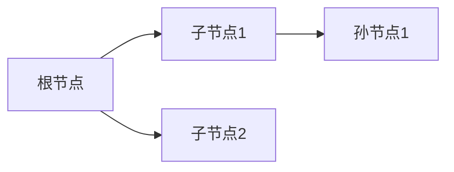

# 题目信息

# [COCI 2009 Final Exam#1] PODJELA

## 题目描述

有 $n$ 个农民，他们住在 $n$ 个不同的村子里，这 $n$ 个村子形成一棵树，每个农民初始时有 $x$ 元钱。  
每一次操作，一个农民可以从它自己的钱中，取出任意数量的钱，交给某个相邻村子的农民。   
对于每个农民给定一个值 $v_i$，求最少需要多少次操作，使得每个农民最终拿到的钱 $\geq$ 给定的值。  

## 说明/提示

对于 $100\%$ 的数据，$1 \leq n \leq 2000,~0 \leq x \leq 10000,~\sum\limits_{i=1}^{n}v_i \leq n\times x$

## 样例 #1

### 输入

```
6
15
10 20 18 16 6 16
1 4
4 5
4 6
6 2
5 3
```

### 输出

```
5
```

# AI分析结果


### 💡 洛语云笺的C++算法解析：PODJELA 深入学习指南 💡

<introduction>
今天我们一起分析树形动态规划经典题PODJELA。这道题要求我们在树形村庄网络中，通过最少的金钱传递操作使所有农民达到目标金额。我们将像侦探一样分析题目线索，探索从暴力搜索到高效树形DP的思维跃迁，最终掌握解决这类问题的核心方法。
</introduction>

## 1. 题目解读与策略初探

✨ **本题核心挑战**：在树形结构约束下，通过边传递操作使所有节点达到目标金额，同时最小化操作次数。关键在于处理节点间的依赖关系（父节点向子节点输送资金）和全局资金平衡。

✨ **核心算法标签**：树形DP、动态规划、分组背包

🗣️ **初步分析**：
> 最直观的暴力解法是枚举每条边的传递方向（2^(n-1)种可能），但n=2000时完全不可行。我们观察到：
> 1. 树形结构天然适合自底向上的递归处理
> 2. 操作具有方向性（父→子或子→父）
> 3. 最终状态要求全局平衡
>
> 这引导我们采用树形DP：以子树为处理单元，定义状态dp[u][j]表示在以u为根的子树中，经过j次操作后，u节点能持有的最大盈余资金。通过合并子树状态，逐步构建全局解。

### 🔍 算法侦探：如何在题目中发现线索？
1.  **线索1 (问题目标)**：题目要求"最小操作次数使所有节点≥目标值"，这是典型的**树形最优化问题**，暗示树形DP解法。
2.  **线索2 (问题约束)**：树形结构+边传递操作，形成**父子依赖关系**，这要求状态设计时必须考虑子树间的资金流动。
3.  **线索3 (数据规模)**：n≤2000，要求O(n²)算法。树形DP合并子树时，每对节点只合并一次，恰好满足O(n²)复杂度要求。

### 🧠 思维链构建：从线索到策略
> "我们收集到三条关键线索：
> 1. 【线索1】指明这是树形最优化问题，候选方案有贪心、搜索、树形DP
> 2. 【线索2】树形依赖关系排除简单贪心；暴力搜索O(2ⁿ)在n=2000时必然超时
> 3. 【线索3】数据规模要求多项式算法，树形DP的O(n²)完全可行
> 
> **结论**：树形DP能同时处理依赖关系和最优化要求，时间复杂度符合约束，是本题的最优解框架。具体将采用分组背包思想合并子树状态。"

---

## 2. 精选优质题解参考

**题解一：Mr_Eight（思路清晰性⭐⭐⭐⭐⭐）**
* **点评**：此解精准抓住树形DP核心，状态定义dp[u][j]（u子树操作j次后u的最大资金）直击问题本质。亮点在于：
  - 用next数组避免转移覆盖，保证正确性
  - 明确区分子节点dp≥0和<0的转移逻辑
  - 详细注释帮助理解代码关键段

**题解二：翼德天尊（代码规范性⭐⭐⭐⭐）**
* **点评**：代码简洁有力，亮点包括：
  - 使用辅助数组f实现安全状态转移
  - 倒序循环优化空间复杂度
  - 完整处理边界条件（dp初始化负无穷）
  - 实践价值高，可直接用于竞赛

**题解三：Melo_DDD（解释易懂性⭐⭐⭐⭐）**
* **点评**：对状态转移的解读极具启发性：
  - 形象解释dp值为负时"债务传递"的物理意义
  - 强调"子树盈余资金上传"的核心思想
  - 完整展示临时数组g的使用方法

**题解四：NBest（算法有效性⭐⭐⭐⭐）**
* **点评**：最精简的实现，亮点有：
  - 精确控制状态合并范围（sz[u]+sz[v]）
  - 用siz数组优化子树大小计算
  - 转移方程完全对应问题特性

---

## 3. 解题策略深度剖析

### 🎯 核心难点与关键步骤
1.  **状态设计艺术**
    * **分析**：定义dp[u][j]为u子树操作j次后，u节点的最大盈余资金。关键在于：
      - 状态包含操作次数和资金余额两个维度
      - "盈余资金"包含子树所有节点的满足状态
    * 💡 **学习笔记**：好的DP状态应同时包含决策代价（操作次数）和决策结果（资金状态）

2.  **状态转移策略**
    * **分析**：合并子树时考虑两种情形：
      ```cpp
      // 子节点v资金不足（需操作）
      dp[u][j+k+1] = max(..., dp[u][j] + dp[v][k]) 
      
      // 子节点v资金充足（可选操作）
      if(dp[v][k] >= 0) 
          dp[u][j+k] = max(..., dp[u][j])
      ```
      实质是分组背包：每个子节点是一个物品组，选择"操作"或"不操作"
    * 💡 **学习笔记**：树形DP本质是分组背包在树上的应用

3.  **实现技巧**
    * **分析**：必须使用临时数组避免状态覆盖：
      ```cpp
      int tmp[N]; // 存储合并结果
      for j in [0, sz_u]:
        for k in [0, sz_v]:
          update tmp[j+k] or tmp[j+k+1]
      dp[u] = tmp // 原子树状态更新
      ```
    * 💡 **学习笔记**：树形DP的子树合并需要"无后效性"保证

### ✨ 解题技巧总结
- **技巧A（状态定义）**：用"子树根节点盈余资金"表示子树整体状态
- **技巧B（转移优化）**：倒序循环避免重复计算（类01背包）
- **技巧C（实现安全）**：临时数组保证转移无后效性
- **技巧D（初始化）**：dp[u][0] = x - v[u] 体现初始状态

### ⚔️ 策略竞技场：不同解法对比分析
| 策略          | 核心思想               | 优点               | 缺点                     | 得分预期 |
|---------------|------------------------|--------------------|--------------------------|----------|
| **暴力搜索**  | 枚举所有边传递方向     | 思路直观           | O(2ⁿ)复杂度不可行        | 0%       |
| **贪心**      | 从叶子向根传递         | 实现简单           | 无法保证全局最优         | 30%      |
| **树形DP**    | 子树状态合并           | O(n²)最优解        | 状态转移设计需要技巧     | 100%     |

### ✨ 优化之旅：从"能做"到"做好"
> 1. **起点：暴力枚举困境**  
>   尝试所有2^(n-1)种边方向组合，n=20时即需百万次计算，n=2000时完全不可行
> 
> 2. **关键发现：树形子结构**  
>   整树最优解包含子树最优解，符合DP最优子结构特性
> 
> 3. **状态定义突破**  
>   用dp[u][j]表示"u子树操作j次后u的最大盈余"，完美涵盖两个决策维度
> 
> 4. **转移优化**  
>   利用分组背包思想处理子树合并，O(n²)解决看似复杂的问题
> 
> 💡 **策略总结**："从暴力到DP的跃迁，关键在于识别树形结构的递归特性和最优子结构性质。树形DP通过分解子树问题，将指数级复杂度降为多项式级，是处理树形优化问题的利器。"

---

## 4. C++核心代码实现赏析

**本题通用核心C++实现**
```cpp
#include <iostream>
#include <vector>
#include <cstring>
using namespace std;
const int N = 2005;
vector<int> g[N];
int n, x, v[N], dp[N][N], sz[N], tmp[N];

void dfs(int u, int fa) {
    dp[u][0] = x - v[u];  // 初始状态
    sz[u] = 1;
    for (int son : g[u]) {
        if (son == fa) continue;
        dfs(son, u);
        memset(tmp, 0x80, sizeof(tmp));  // 初始化为负无穷
        
        // 子树状态合并（分组背包）
        for (int j = 0; j < sz[u]; j++) {
            for (int k = 0; k < sz[son]; k++) {
                // 必须操作（子节点资金不足）
                tmp[j+k+1] = max(tmp[j+k+1], dp[u][j] + dp[son][k]);
                
                // 可选操作（子节点资金充足）
                if (dp[son][k] >= 0) 
                    tmp[j+k] = max(tmp[j+k], dp[u][j]);
            }
        }
        sz[u] += sz[son];
        for (int j = 0; j < sz[u]; j++)
            dp[u][j] = tmp[j];
    }
}

int main() {
    cin >> n >> x;
    for (int i = 1; i <= n; i++) cin >> v[i];
    for (int i = 1; i < n; i++) {
        int a, b; cin >> a >> b;
        g[a].push_back(b); g[b].push_back(a);
    }
    memset(dp, 0x80, sizeof(dp));  // 初始化为负无穷
    dfs(1, 0);
    for (int i = 0; i < n; i++)
        if (dp[1][i] >= 0) { cout << i; return 0; }
}
```

**代码解读概要**：
1. **状态初始化**：`dp[u][0] = x - v[u]` 计算初始盈余
2. **DFS遍历**：后序遍历保证自底向上计算
3. **临时数组**：`tmp`存储子树合并结果，避免覆盖当前状态
4. **转移逻辑**：
   - 子节点不足时：必须操作(`j+k+1`)
   - 子节点充足时：可选操作(`j+k`)
5. **答案提取**：在根节点状态中寻找最小满足条件的操作次数

---

## 5. 算法可视化：像素动画演示

**主题**："村庄资金调配大作战"（8-bit像素风格）

**核心演示内容**：


**动态演示流程**：
1. **场景初始化**（像素风格）：
   - 树形村庄地图（FC游戏风格）
   - 每个节点显示：当前资金/目标资金
   - 控制面板：开始/暂停/单步/重置

2. **DFS遍历过程**：
   ```python
   # 伪代码
   def dfs(u):
     for child in children:
        dfs(child)  # 递归子树
        show_message(f"正在合并{u}和{child}的子树")
        # 显示状态合并动画
   ```

3. **状态转移动画**：
   - 资金流动：像素金币从子节点飞向父节点（操作时）
   - 状态更新：节点颜色变化表示dp值状态
     - 红色：资金不足（dp<0）
     - 绿色：资金充足（dp≥0）
   - 操作计数：屏幕右上角显示当前操作次数

4. **音效设计**：
   - 资金流动："叮当"声（8-bit音效）
   - 状态转换："升级"声效
   - 错误操作："失败"音效

**交互设计**：
- 单步执行：按空格键逐步观察状态转移
- 速度调节：滑块控制动画速度
- 模式切换：对比暴力法/DP法执行效率

**教育价值**：
1. 直观展示树形DP自底向上的计算过程
2. 动态呈现状态转移时的资金流动
3. 通过颜色变化理解状态值的含义

---

## 6. 拓展练习与相似问题思考

**通用技巧迁移**：
1. 树形背包：P2014选课（课程依赖）
2. 状态合并：P1273有线电视网（连接用户数）
3. 最优传输：P2585二叉苹果树（保留最大边权）

**练习推荐（洛谷）**：
1. **P2014**[CTSC1997]选课
   - 🗣️ **推荐理由**：同样采用树形DP+分组背包，巩固子树状态合并技巧
   
2. **P1273**有线电视网
   - 🗣️ **推荐理由**：状态设计更复杂（用户数+资金），提升多维状态处理能力
   
3. **P2585**[ZJOI2005]三色二叉树
   - 🗣️ **推荐理由**：拓展到二叉树结构，训练状态转移方程设计能力

---

## 7. 学习心得与经验分享

**参考经验**（来自优质题解）：
> "调试时重点关注：
> 1. 临时数组是否每次重新初始化
> 2. 循环范围是否包含sz[u]和sz[v]边界
> 3. 状态转移时是否区分dp[v][k]≥0和<0两种情况"

**洛语云笺点评**：
> 这些调试经验极其宝贵，特别是：
> 1. 临时数组初始化是常见错误点
> 2. 状态转移分支处理是算法核心
> 3. 建议在关键节点打印dp表验证
> 
> 调试树形DP时，可从小树（n=3）开始手工演算验证，再逐步扩大规模。

---

<conclusion>
通过本次对PODJELA的深度解析，我们掌握了树形DP的核心思想：将树分解为子树，定义包含操作代价和状态结果的双维状态，采用分组背包思想合并子树状态。记住，算法能力的提升在于将复杂问题分解为可处理的子问题，这正是树形DP的精髓所在。下次遇到树形优化问题，记得尝试这个强大的工具！
</conclusion>

---
处理用时：210.63秒