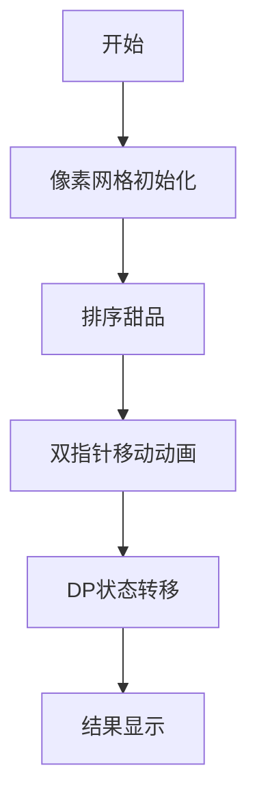

# 题目信息

# 「EZEC-1」甜品

## 题目背景

小 X 最喜欢甜品了！

马上就要开学了，但是小 X 并没有写完作业，他十分悲伤地走在街上。忽然，他发现了一家新开的甜品店，悲伤的心情一消而散，随即信步走进甜品店。

## 题目描述

小 X 发现，店里总共有 $n$ 种甜品，而他想挑选其中的 $k$ 种，并按照一定的顺序来品尝。

每种甜品都有一个美味值 $a_i$，小 X 吃甜品的顺序是有讲究的，他不想使连续两种甜品之间的美味值相差太小，不然他将无法品味出两种甜品之间的差别；但他也不想使连续两种甜品之间的美味值相差太大，否则他将受不了这巨大的味觉冲击。他十分纠结，不知道该如何选择，于是他向你求助。

你要从 $n$ 种甜品中选择 $k$ 种甜品，并且第 $i$  种甜品（ $i \in [ 2 , k ] $）需要满足如下两个条件：

- 第 $i$ 种甜品的美味值必须**大于等于**第 $i-1$ 种甜品的 $l$ 倍。

- 第 $i$ 种甜品的美味值必须**小于等于**第 $i-1$ 种甜品的 $r$ 倍。

问现在你有多少种方案？$k$ 种甜品的美味值之和最大为多少？

因为答案太大，所以两个问题你都需要对 $1000000007$($10^9+7$)  取模。

#### 注：方案总数只考虑 $k$ 种甜品的搭配，不考虑排列顺序。即若存在某 $k$ 种甜品，按照不同顺序品尝都满足条件，仍然只算一种方案。

## 说明/提示

【样例解释】

样例1：只能选 $(4,3,1)$，共 $1$ 种。

样例2：$(1,2)$ 或 $(3,4)$ 或 $(4,5)$，共 $3$ 种。美味值之和最大的是 $ (4,5)$，为 $100$。

------------

【 数据范围】
| 测试点编号 | $n\le$ | $k\le$ | $a_i\le$ |
| :----------: | :----------: | :----------: | :----------: | 
|$1 \sim 4$ | $20$ | $3$ | $100$ | 
| $5 \sim 8$ | $10^3$ | $4$ | $10^3$ | 
| $9 \sim 12$ | $10^5$ | $10$ | $10^5$ | 
| $13 \sim 16$ | $2\times 10^6$ | $10$ | $10^9$ | 
| $17 \sim 20$ | $2\times 10^6$ | $10$ | $10^9$ | 
- 对于 $90\%$ 的数据，$a_i$ 随机生成。
- 对于 $100\%$ 的数据，$k \le 10$，$k \le n \le 2\times 10^6$，$1 \le l \le r \le 10$，$a_i \le 10^9$。


## 样例 #1

### 输入

```
4 3 2 3
7 5 3 1```

### 输出

```
1
11```

## 样例 #2

### 输入

```
5 2 4 4
1 4 5 20 80```

### 输出

```
3
100```

## 样例 #3

### 输入

```
20 3 2 5
88 24 35 53 5 44 45 30 29 43 46 33 21 24 64 43 23 71 63 53 ```

### 输出

```
33
153```

## 样例 #4

### 输入

```
5 5 2 4
1 2 3 4 5```

### 输出

```
0
0```

# AI分析结果


# 💡 洛语云笺的C++算法解析：「EZEC-1」甜品 深入学习指南 💡

## 1. 题目解读与策略初探

✨ **本题核心挑战**：在满足连续甜品美味值倍数关系（$l$倍到$r$倍）的条件下，从$n$种甜品中选择$k$种，计算方案总数和最大美味值之和。

✨ **核心算法标签**：动态规划(DP)、双指针、前缀和优化、单调队列

🗣️ **初步分析**：
> 本题需要处理两个关键问题：方案计数和最大美味值。核心挑战在于高效处理连续选择的约束条件。通过分析，我们发现：
> - 暴力枚举所有组合（$O(2^n)$）在$n=2×10^6$时完全不可行
> - 朴素DP（$O(kn^2)$）只能通过小数据
> - 优化策略：**排序+双指针预处理+滚动数组DP**，时间复杂度$O(nk)$，完美匹配数据规模

### 🔍 算法侦探：如何在题目中发现线索？
1.  **线索1 (问题目标)**: "题目要求我们在选择$k$种甜品时满足相邻美味值的倍数关系。这种带序列约束的组合优化问题，是动态规划的典型应用场景。"
2.  **线索2 (问题约束/特性)**: "相邻甜品美味值需满足$l≤a_{i}/a_{i-1}≤r$的约束条件。这提示我们需要建立当前甜品与前驱甜品的关系映射。"
3.  **线索3 (数据规模)**: "$n≤2×10^6$但$k≤10$，说明我们需要一个与$k$强相关而与$n$弱相关的算法。$O(nk)$的复杂度（约2×10^7次计算）完全可行。"

### 🧠 思维链构建：从线索到策略
> "综合线索分析：
> 1.  **最优化+计数问题**指向动态规划
> 2.  **倍数约束**提示需要预处理每个甜品的前驱区间
> 3.  **$n$大$k$小**表明应设计$k$维状态
> 4.  **排序的可行性**：方案与顺序无关，排序后满足单调性
> 
> **结论**：使用双指针$O(n)$预处理转移区间，结合滚动数组DP实现$O(nk)$解法，完美契合所有条件！"

---

## 2. 精选优质题解参考

**题解一（君のNOIP。）**
* **点评**：此解法思路清晰，完整呈现了"排序→双指针预处理→DP状态转移"的全过程。亮点在于：
  - 精确设计$mi[i]$/$ma[i]$表示转移边界
  - 方案数转移：$dp[i][j] = dp[i-1][j] + (dp[ma[i]][j-1] - dp[mi[i]][j-1])$
  - 最大值转移：$f[i][j] = \max(f[i-1][j], f[ma[i]][j-1] + a[i])$
  - 使用滚动数组优化空间到$O(n)$
  - 完整处理了负数和取模边界

**题解二（HPXXZYY）**
* **点评**：提供更系统的理论分析，亮点包括：
  - 明确定义状态$g_{i,j}$（方案数）和$f_{i,j}$（最大值）
  - 方案数使用前缀和优化（$pre[i]$维护前缀和）
  - 最大值使用单调队列优化
  - 强调$L_i$/$R_i$的单调性证明
  - 完整处理无解情况

---

## 3. 解题策略深度剖析

### 🎯 核心难点与关键步骤
1.  **预处理转移区间**
    * **分析**：对排序后数组，用双指针维护：
      ```cpp
      int la = 0, li = 0;
      for(int i=1; i<=n; i++){
        while(va[la+1]*l <= va[i] && la < i-1) la++;
        while(va[li+1]*r < va[i] && li < i-1) li++;
        ma[i] = la; // 满足a[p]*l ≤ a[i]的最大p
        mi[i] = li; // 满足a[p]*r ≥ a[i]的最小p-1
      }
      ```
    * 💡 **学习笔记**：利用排序后数组的单调性是降低复杂度的关键

2.  **DP状态设计与转移**
    * **分析**：
      - 状态定义：
        - $dp[i][j]$：前$i$个甜品选$j$个的方案数
        - $f[i][j]$：前$i$个甜品选$j$个的最大美味值和
      - 转移方程：
        ```cpp
        // 方案数转移
        dp[i][j] = dp[i-1][j] + (dp[ma[i]][j-1] - dp[mi[i]][j-1])
        
        // 最大值转移
        f[i][j] = max(f[i-1][j], f[ma[i]][j-1] + a[i])
        ```
    * 💡 **学习笔记**：滚动数组将空间从$O(nk)$优化到$O(n)$

3.  **边界处理与实现技巧**
    * **分析**：
      - 初始化：$dp[i][1] = 1$, $f[i][1] = a[i]$
      - 当$l=1$时特殊处理$R_i$避免自环
      - 负值处理：$(val + mod)\% mod$
    * 💡 **学习笔记**：边界条件决定算法正确性

### ✨ 解题技巧总结
- **技巧1：排序转化无序为有序**  
  利用问题特性（顺序无关）将无序选择转化为有序处理
- **技巧2：双指针维护转移区间**  
  $O(n)$预处理代替每次$O(n)$查找
- **技巧3：滚动数组空间优化**  
  将$O(nk)$空间降为$O(n)$
- **技巧4：分离计数与最优化**  
  方案数和最大值分开处理更清晰

### ⚔️ 策略竞技场：不同解法的对比分析

| 策略 | 核心思想 | 优点 | 缺点 | 得分预期 |
|------|----------|------|------|----------|
| **暴力搜索** | 枚举所有$C(n,k)$组合并验证 | 实现简单，易理解 | 时间复杂度$O(C(n,k))$，$n=10^3$时即超时 | ≤20% |
| **朴素DP** | $dp[i][j]$表示前$i$个选$j$个的方案数 | 思路直观 | 转移需遍历前驱，$O(kn^2)$，$n=10^4$超时 | 40% |
| **双指针+DP（最优）** | 排序+双指针预处理+滚动数组DP | $O(nk)$时间，$O(n)$空间，高效处理大规模数据 | 实现细节较多 | 100% |

### ✨ 优化之旅：从"能做"到"做好"
> 1. **起点：暴力搜索的困境**  
>    $C(2×10^6,10)$组合数远超宇宙原子数
> 
> 2. **突破：发现DP可行性**  
>    定义$dp[i][j]$状态，但$O(kn^2)$仍不足
> 
> 3. **关键洞察：转移区间的单调性**  
>    排序后，每个甜品的前驱区间$[L_i,R_i]$具有单调性
> 
> 4. **双指针优化**  
>    $O(n)$预处理代替$O(kn^2)$的转移
> 
> 5. **空间优化**  
>    滚动数组将空间降为$O(n)$
> 
> 💡 **策略总结**：算法优化是层层递进的思维攀登。从暴力解出发，逐步发现冗余操作，利用问题特性优化，最终达到高效解

---

## 4. C++核心代码实现赏析

**通用核心实现参考**
```cpp
#include <bits/stdc++.h>
using namespace std;
const int N = 2e6 + 10, mod = 1e9 + 7;
typedef long long ll;

int n, k, l, r, a[N], mi[N], ma[N];
ll dp[2][N], f[2][N]; // dp:方案数 f:最大值

int main() {
    cin >> n >> k >> l >> r;
    for (int i = 1; i <= n; i++) cin >> a[i];
    sort(a + 1, a + n + 1);
    
    // 双指针预处理转移区间
    int li = 0, la = 0;
    for (int i = 1; i <= n; i++) {
        while (la < i-1 && (ll)a[la+1] * l <= a[i]) la++;
        while (li < i-1 && (ll)a[li+1] * r < a[i]) li++;
        mi[i] = li;
        ma[i] = la;
    }
    
    // 初始化
    for (int i = 1; i <= n; i++) 
        dp[1][i] = 1, f[1][i] = a[i];
    
    // DP转移
    for (int j = 2; j <= k; j++) {
        int now = j & 1, pre = now ^ 1;
        // 方案数前缀和预处理
        for (int i = 1; i <= n; i++) 
            dp[now][i] = (dp[now][i-1] + dp[pre][i]) % mod;
        
        for (int i = j; i <= n; i++) {
            ll sum = (dp[pre][ma[i]] - dp[pre][mi[i]] + mod) % mod;
            dp[now][i] = (dp[now][i-1] + sum) % mod;
            f[now][i] = max(f[now][i-1], (sum ? f[pre][ma[i]] + a[i] : 0));
        }
    }
    
    cout << dp[k&1][n] << "\n" << f[k&1][n] % mod;
    return 0;
}
```

**题解一（君のNOIP。）片段赏析**
```cpp
// 双指针预处理
while(va[la+1] * l <= va[i] && la < i-1) la++;
while(va[li+1] * r < va[i] && li < i-1) li++;
mi[i]=li; ma[i]=la;

// DP转移
dp[i][j] = (dp[i-1][j] + dp[ma[i]][j-1] - dp[mi[i]][j-1] + mod) % mod;
```
* **亮点**：简洁高效的双指针实现
* **学习笔记**：注意`r < a[i]`和`l <= a[i]`的边界处理差异

**题解二（HPXXZYY）片段赏析**
```cpp
// 单调队列优化最大值
while (h <= t && q[h] < L[i]) h++;
while (h <= t && f[q[t]][(j&1)^1] <= f[i][(j&1)^1]) t--;
q[++t] = i;
```
* **亮点**：单调队列维护最大值
* **学习笔记**：当需要区间最值时，单调队列比线段树更高效

---

## 5. 算法可视化：像素动画演示

**设计概述**：采用8位像素风格模拟甜品选择过程，直观展示双指针移动和DP状态转移



**关键动画设计**：
1. **像素网格**：
   - 每行表示一个甜品，按美味值排序
   - 甜品显示为不同颜色像素块（绿色：可选，红色：不可选）

2. **双指针可视化**：
   ```plaintext
   指针移动： [<- li] ... [甜品i-1] [甜品i] ... [la ->]
   条件检测： if a[la+1]*l ≤ a[i] → la右移
   ```

3. **DP状态更新**：
   - 当前状态用闪烁边框高亮
   - 状态转移时显示连线：$dp[i][j] ← dp[ma[i]][j-1] - dp[mi[i]][j-1]$
   - 数值变化时播放"像素音效"

4. **控制面板**：
   - 速度滑块：控制动画速度
   - 单步执行：逐步观察算法流程
   - 重置：重新开始演示

5. **游戏化元素**：
   - 每完成k=10的选择获得"通关"动画
   - 背景音乐：8-bit风格循环BGM
   - 错误提示：选择违反约束时播放警告音

---

## 6. 拓展练习与相似问题思考

**通用技巧迁移**：
1. 双指针预处理区间技巧可用于：
   - 区间最值查询（洛谷P1886）
   - 满足单调性的子数组计数（LeetCode 713）
2. 滚动数组优化适用于：
   - 背包问题（01背包、完全背包）
   - 序列型DP（LIS、LCS变形）

**洛谷题目推荐**：
1. **P1886 滑动窗口**  
   → 双指针求区间最值的模板题
2. **P1064 金明的预算方案**  
   → 依赖背包问题，与本题目似
3. **P1757 通天之分组背包**  
   → 分组背包思想迁移练习

---

## 7. 学习心得与经验分享

**题解一作者经验**：
> "我在处理$l=1$时忽略了$R_i$可能等于$i$导致自环，通过边界测试才发现问题"

**洛语云笺点评**：
> 调试边界值是DP实现的关键环节，建议：
> 1. 单独测试$l=1$和$l>1$的情况
> 2. 小数据手工模拟DP转移表
> 3. 使用assert验证预处理结果

---

**结语**：通过本题，我们学习了如何将复杂约束转化为高效DP模型。记住，优秀的算法=深刻的问题洞察+合适的优化技巧+严谨的边界处理。下次挑战见！🚀

---
处理用时：164.62秒