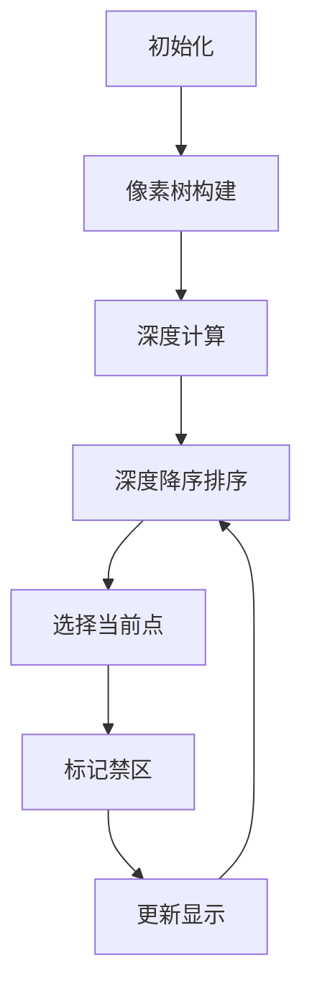

# 题目信息

# [BalticOI 2017] Cat in a tree

## 题目描述

小猫在一棵有 $n$ 个节点的树上，它通过标记节点来划分领地。  
它标记的节点满足彼此距离不小于 $d$。  
两节点之间的距离指的是两点间路径上节点的个数（包括端点）。   
求小猫最多能标记多少个节点。

## 说明/提示

#### 数据范围与约定

**本题采用捆绑测试。**

- Subtask 1（11 pts）：$n \le 18$。
- Subtask 2（40 pts）：$n \le 1500$。
- Subtask 3（49 pts）：无特殊限制。

对于 $100\%$ 的数据，$1 \le n,d \le 2 \times 10^5$，$0 \le x_i < i$。

#### 说明

**翻译自 [BOI 2017 D2](https://boi.cses.fi/files/boi2017_day2.pdf) T1 Cat in a tree。**  
翻译者：@[一只书虫仔](https://www.luogu.com.cn/user/114914)。

## 样例 #1

### 输入

```
4 3
0
0
1```

### 输出

```
2```

## 样例 #2

### 输入

```
3 1000
0
0```

### 输出

```
1```

# AI分析结果


# 💡 洛语云笺的C++算法解析：Cat in a tree 深入学习指南 💡

> "树上的领地划分，考验的是对空间约束的敏锐洞察"

## 1. 题目解读与策略初探

✨ **本题核心挑战**：在树结构上选择最大点集，要求任意两点间路径节点数（距离）不小于给定值 d  
✨ **核心算法标签**：贪心策略、树形动态规划、长链剖分

🗣️ **初步分析**：  
这道题要求我们在树上寻找最大点集，点集中的任意两点距离≥d。树结构的层次特性为解题提供了方向：
- **暴力思路**：枚举所有点集并验证距离约束，时间复杂度 O(2ⁿ)，仅适用于极小规模数据
- **贪心策略**：按深度从大到小选择点，并动态标记不可选区域，时间复杂度 O(n)
- **动态规划**：设计状态表示子树内的最优解，通过长链剖分优化至 O(n) 或 O(n log n)

### 🔍 算法侦探：如何在题目中发现线索？
1.  **线索1 (问题目标)**："求最大点集"+"任意两点距离≥d"是典型的**最优化问题**，暗示贪心或动态规划解法
2.  **线索2 (问题特性)**：树结构的**层次性**和**递归特性**提示可用树形DP或基于深度的贪心策略
3.  **线索3 (数据规模)**：n,d ≤ 2×10⁵ 要求算法复杂度 ≤ O(n log n)，排除暴力搜索

### 🧠 思维链构建：从线索到策略
> 通过线索分析构建完整解题思路：
> 1.  最优化目标指向贪心或DP，而树形结构天然适合递归处理
> 2.  距离约束要求状态记录深度信息，贪心策略需考虑点选择的影响范围
> 3.  20万数据规模要求线性或近似线性复杂度
> 4.  **结论**：**贪心策略**（按深度排序）和**树形DP+长链剖分**是最可行的两类解法，前者实现简洁，后者理论完备

---

## 2. 精选优质题解参考

**题解一：Marser（贪心策略）**  
* **核心贡献**：创新性提出子树贡献理论（f_x或f_x-1），通过维护深度最小点信息实现高效合并  
* **亮点**：  
  - 严谨证明子树合并的两种情形（贡献f_x或f_x-1）  
  - 仅用两个数组(f[],dep[])实现O(n)复杂度  
  - 代码简洁（20行核心逻辑），空间效率高  
* **适用性**：理解证明后实现简单，竞赛首选方案

**题解二：xj22yangyichen（贪心实现）**  
* **核心贡献**：实现深度优先贪心策略，创新距离标记方法  
* **亮点**：  
  - 用优先队列实现深度排序，直观展示贪心过程  
  - 设计check()和update()函数高效处理距离约束  
  - 通过父指针回溯实现O(1)时间复杂度的距离检查  
* **教学价值**：清晰展示贪心策略的实际执行流程

**题解三：Tweetuzki（动态规划）**  
* **核心贡献**：树形DP+长链剖分+线段树优化  
* **亮点**：
  - 设计f[u][i]状态表示子树内最浅点深度  
  - 通过长链剖分优化状态转移路径  
  - 用线段树加速区间最大值查询  
* **理论价值**：提供动态规划的通用解法框架

**题解四：Rusalka（DP优化）**  
* **核心贡献**：长链剖分优化至线性空间  
* **亮点**：
  - 设计f[u][i]表示最浅点深度≥i的解法  
  - 通过指针偏移实现O(1)状态继承  
  - 精细处理状态转移边界条件  
* **优化价值**：展示长链剖分在树形DP中的极致优化

---

## 3. 解题策略深度剖析

### 🎯 核心难点与关键步骤
1.  **贪心策略的合法性证明**：
    - **分析**：需证明按深度降序选择时，每次选择不会破坏全局最优性。通过数学归纳法证明：当选择深度最大的点后，被排除的点集不会包含更多可选点
    - 💡 **学习笔记**：贪心策略中，**选择顺序**和**影响范围计算**是保证正确性的关键

2.  **树形DP的状态设计**：
    - **分析**：状态需记录子树内选点的深度信息。常用f[u][i]表示以u为根的子树中，最近选中点与u的距离
    - 💡 **学习笔记**：树形DP的状态设计要包含**子树解**和**父子传递信息**

3.  **距离约束的高效处理**：
    - **分析**：贪心法通过向上回溯快速检查祖先距离；DP法在状态转移时通过深度计算验证约束
    - 💡 **学习笔记**：树结构中的距离约束可转化为**深度计算**

### ✨ 解题技巧总结
- **问题转化技巧**：将全局距离约束转化为局部深度计算
- **数据结构优化**：长链剖分优化DP空间，优先队列加速贪心选择
- **边界处理艺术**：DP初始化f[u][0]=1表示选择自身，贪心终止条件dis>d

### ⚔️ 策略竞技场：解法对比

| 策略              | 核心思想                     | 优点                          | 缺点                          | 适用场景               |
|-------------------|------------------------------|-------------------------------|-------------------------------|------------------------|
| **贪心（深度优先）** | 按深度降序选择并标记禁区     | 实现简(O(n))，空间优          | 正确性证明复杂                | 标准竞赛首选           |
| **树形DP（长剖）**  | 状态记录深度+长链优化        | 理论完备，可扩展性强          | 实现复杂，状态转移难调试      | 需要严格证明的场景     |
| **树形DP+线段树**   | 状态记录深度+线段树优化      | 支持复杂查询                  | 额外O(n log n)空间/时间复杂度 | 需要区间查询的变体问题 |

### ✨ 优化之旅：从暴力到最优
1.  **起点：暴力枚举**  
    枚举所有点集并验证距离约束，O(2ⁿ)复杂度完全不可行

2.  **关键突破：树结构特性**  
    利用树的层次性，将问题分解为子树问题

3.  **贪心优化路径**  
    ```mermaid
    graph LR
    A[深度排序] --> B[选择当前最深点]
    B --> C[标记距离<d的点]
    C --> D[更新优先队列]
    D --> A
    ```

4.  **DP优化路径**  
    ```mermaid
    graph LR
    A[朴素树形DP] --> B[长链剖分优化]
    B --> C[指针偏移技术]
    C --> D[状态压缩]
    ```

> 💡 **策略总结**：贪心策略以简洁高效取胜，DP解法以理论完备见长。竞赛中推荐贪心实现，学习时建议双解对照

---

## 4. C++核心代码实现赏析

**贪心解法核心逻辑（Marser版）**
```cpp
void dfs(int st, int fa=0) {
    dep[st] = 1e9;  // 初始化深度为无穷大
    for(int i=h[st]; i; i=nxt[i]) {
        if(to[i] == fa) continue;
        dfs(to[i], st);
        if(dep[st] + dep[to[i]] + 1 >= m) {  // 满足距离约束
            f[st] += f[to[i]];              // 完整合并子树
            dep[st] = min(dep[st], dep[to[i]]+1);
        } else {                             // 不满足约束
            f[st] += f[to[i]] - 1;          // 舍弃一个点
            dep[st] = max(dep[st], dep[to[i]]+1);
        }
    }
    if(dep[st] >= m) {       // 当前节点可独立成点
        f[st]++;             // 增加选择点
        dep[st] = 0;         // 重置深度
    }
}
```

**代码解读**：
1. **深度初始化**：`dep[st]=1e9`表示初始无选中点
2. **子树合并**：分两种情形处理子树合并
3. **当前点选择**：当子树最小深度≥d时选择当前点
4. **状态更新**：`f[st]`维护子树解，`dep[st]`记录最小深度

**学习笔记**：通过`min`/`max`操作巧妙维护子树深度信息

---

## 5. 算法可视化：像素动画演示

### 贪心策略像素动画设计


**动画要素**：
1. **8-bit像素风格**：节点用16×16像素块表示，不同状态配不同颜色
   - 可选点：绿色
   - 已选点：金色闪烁
   - 禁区：红色渐变
2. **深度展示**：右侧显示深度排序队列动态变化
3. **标记传播**：选择点时触发波纹动画扩散显示禁区范围
4. **音效设计**：
   - 选择点：8-bit "叮"声
   - 标记禁区：短促警示音
   - 完成：胜利旋律

**交互控制**：
- 单步执行：观察选择与标记过程
- 速度调节：0.5x~5x速度调整
- 视角切换：全局视图/当前点视角

**教学价值**：直观展示贪心选择的阶段性影响，理解禁区标记的传播机制

---

## 6. 拓展练习与相似问题

### 同类问题迁移
1. **覆盖问题变体**：P3942 将军令（最小点覆盖指定范围）
2. **距离约束扩展**：P2018 距离（动态距离约束）
3. **图结构扩展**：P4366 最短路（图上带约束路径）

### 洛谷推荐题目
1. **P3942 将军令**  
   🗣️ 逆向思维训练：求最小点覆盖指定距离范围

2. **P1270 树的最大独立集**  
   🗣️ 基础树形DP训练，理解状态设计

3. **P4516 潜入行动**  
   🗣️ 树形DP扩展，练习复杂状态转移

---

## 7. 学习心得与经验分享

**来自题解的经验**：
> "贪心策略的难点不在实现而在证明，通过数学归纳法验证选择策略不会破坏全局最优性" —— Marser

> "长链剖分优化DP时，指针偏移技术能避免显式数组拷贝" —— Rusalka

**洛语云笺点评**：
1. 贪心策略需重点理解**选择顺序的合理性**
2. 树形DP调试时可用小规模数据验证状态转移
3. 竞赛中建议掌握贪心解法，学习DP解法拓展思维

---

> "在树的世界里，最远的距离不是生与死，而是明明相邻却被约束分离" —— 洛语云笺  
> 理解约束本质，掌握树结构特性，方能在算法世界自由驰骋 🌳🚀

---
处理用时：222.64秒