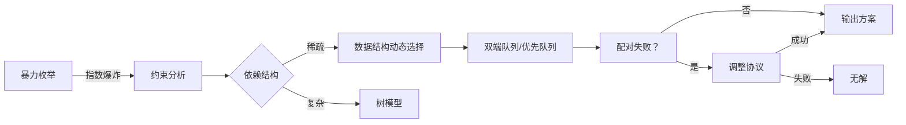
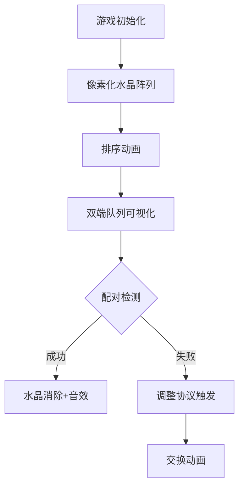

# 题目信息

# 「SWTR-6」Snow Mountain

## 题目背景

**题目背景与解题无关。**

**题目描述最下方有简化版题意。**

天空中飘着雪，放眼望去白茫茫一片。小 A 拿着地图，四处探寻着。

突然，只见前方有一个洞穴。出于好奇心，小 A 走了进去。

洞穴里黑漆漆一片，一眼望不到尽头。道路的两旁尽是白骨，显然，这是曾经来这里探险的人们的残骸。小 A 打了一个冷颤。

这时，小 A 留意到了地上的一张纸片。打开来一看，上面竟写着：

$$\texttt{Please contact lydsy2012@163.com!}$$

## 题目描述

> 洞穴里有一些水晶，每个水晶有一个能量值 $a_i$。**能量值有大有小，但不会相同。** 这些神秘的水晶上附着邪恶势力的灵魂。现在你的任务是摧毁这些水晶，并让它们释放出的邪恶能量能量尽可能小。
> 
> 你可以选择两个未被摧毁的水晶 $i,j$，将它们摧毁并释放出 $\min(a_i,a_j)\times k$ 的邪恶能量。其中 $k$ 表示这是第 $k$ 次摧毁。
> 
> 不过有一些**无序**水晶对 $(x,y)$，如果你将它们一并摧毁，就会发生强大的共振导致山洞倒塌，使你葬身其中！

带着这张纸片，小 A 来到了山洞的尽头，果然发现了 $n$ 个水晶（$n$ 为偶数）。正如纸片上所说，每个水晶都有一个能量值 $a_i$。

对这些水晶进行一番观察，小 A 发现了一个规律：每个水晶 $i$ 在**所有能量值比它大**的水晶中，只会和**最多一个**发生共振，记其编号为 $x_i$。

现在小 A 知道了 $a_i,x_i$，你能帮助他求出摧毁这些水晶释放出邪恶能量之和的最小值吗？无法摧毁输出 $\texttt{-1}$。否则先输出最小值，再输出摧毁方案。

若摧毁方案有多种，输出任意一种即可。

- 需要注意的是，摧毁后水晶编号不会发生改变。

---

简化版题意：

给定两个长为 $n\ (2|n)$ 的序列 $a,x$，满足 $a_i$ 互不相同且如果 $x_i \neq -1$，那么 $a_{x_i}>a_i$。

现在需要进行 $\frac{n}{2}$ 次删除操作：选择两个未被删除的数 $a_i,a_j$ 满足 $x_i\neq j$ 且 $x_j\neq i$，并用 $\min(a_i,a_j)\times k$ 的代价将这两个数从序列 $a$ 中删去（删除后剩余元素下标不变），其中 $k$ 表示这是第 $k$ 次删除。

求删除所有数的最小代价与方案。无解输出 $\texttt{-1}$。若方案有多种，输出任意一种即可。

## 说明/提示

**「样例 3 说明」**

无法摧毁所有水晶，因为水晶 $4$ 无法被摧毁。

**「数据范围与约定」**

**本题采用捆绑测试。**

- Subtask 1（5 points）：$n=2$；
- Subtask 2（20 points）：$n \leq 10$；
- Subtask 3（15 points）：$x_i=-1$；
- Subtask 4（20 points）：$n\leq 3\times 10^3$；
- Subtask 5（15 points）：$a_i$ 升序排列，即 $a_i<a_{i+1}\ (1\leq i<n)$；
- Subtask 6（24 points）：无特殊限制。
- Subtask 7（1 point）：hack 数据。

对于 $100\%$ 的数据，$2 \leq n \leq 5 \times 10^5$，$1 \leq a_i \leq 10^9$。  
保证 $n$ 为偶数且 $a_i$ 互不相同。  
保证答案不超过 $2^{63}-1$。

**「帮助/提示」**

请注意 IO 优化。

**「Special Judge」**

**本题使用 SPJ。**

**请认真阅读输出格式。** 输出格式有误可能导致 UKE。

若你的输出的第一行与答案的第一行不同，你将获得本测试点的 $0\%$ 分数。

若无解且第一行相同，你将获得本测试点的 $100\%$ 分数。

若有解且第一行相同，但方案有误，你将获得本测试点的 $60\%$ 分数。

若有解且第一行相同，方案正确，你将获得本测试点的 $100\%$ 分数。

另附 `checker` 与 `testlib.h`。

百度网盘链接：[link](https://pan.baidu.com/s/1Tk-8-UiLzCpOuPVuoCcbbQ)，提取码：b7eg。

## 样例 #1

### 输入

```
4
1 4 2 3
3 -1 -1 2```

### 输出

```
4
3 2
1 4```

## 样例 #2

### 输入

```
4
5 7 1 3
-1 -1 1 1```

### 输出

```
7
1 2
3 4```

## 样例 #3

### 输入

```
4
1 9 4 5
4 -1 4 2```

### 输出

```
-1```

# AI分析结果


# 💡 洛语云笺的C++算法解析：「SWTR-6」Snow Mountain 深入学习指南 💡

## 1. 题目解读与策略初探

✨ **本题核心挑战**：在满足水晶共振约束（无序对不能同时摧毁）的前提下，找到摧毁顺序使总代价最小（每次代价为 min(a_i,a_j)×k，k为操作次序）。  
✨ **核心算法标签**：贪心、排序、双端队列/优先队列、调整策略  

🗣️ **初步分析**：  
> 本题本质是带约束的最小化加权和问题。最优策略需同时满足：  
> 1. **贪心原则**：让较小能量值的水晶在后期操作中被消除（乘更大的k）  
> 2. **规避共振**：动态处理水晶间的禁止配对关系  
>  
> 解题路径演进：  
> - **暴力枚举**：尝试所有配对组合 → 指数级复杂度不可行  
> - **无约束贪心**：排序后前/后半段配对 → 无法处理共振约束  
> - **动态规避**：用数据结构维护可配对选项 → 本题主流解法  
> - **调整策略**：当最后配对失败时重组已有方案 → 保证解的存在性  

### 🔍 算法侦探：如何在题目中发现线索？
1.  **线索1 (问题目标)**："求摧毁水晶的最小代价"——这是典型的**加权最优化问题**，且代价计算方式（min(a_i,a_j)×k）强烈提示**贪心排序**的可能性。
2.  **线索2 (问题特性)**："每个水晶最多与一个更大能量水晶共振"——这种**稀疏约束关系**提示我们可以通过**动态维护可选项**（双端队列/优先队列）规避冲突。
3.  **线索3 (数据规模)**：n≤5×10⁵——要求O(n log n)算法。排序O(n log n) + 双端队列/优先队列操作O(n)完全可行，暴力O(2ⁿ)绝对超时。

### 🧠 思维链构建：从线索到策略
> "综合线索：  
> 1. 最优化目标指向贪心排序（线索1）  
> 2. 稀疏约束暗示可用数据结构动态选择配对（线索2）  
> 3. 大规模数据排除了暴力解法（线索3）  
>  
> **结论**：采用**排序预处理**+**双端队列/优先队列动态配对**的核心策略。当最终配对受阻时，启用**调整协议**重组部分配对。若调整失败则无解。"

---

## 2. 精选优质题解参考

**题解一：sfmmdm（赞20）**  
* **点评**：此解创新性地引入`cnt`计数器（统计比当前水晶小的禁止配对数量），用优先队列动态选择后半段水晶。亮点在于特殊处理"锁定所有前半段"的后半段水晶：优先用最小前半段与之配对，避免全局阻塞。代码中`flag`分类处理常规/极端场景，边界处理严谨，具有工业级鲁棒性。

**题解二：a___（赞13）**  
* **点评**：采用双指针从大到小枚举前半段，动态选择最大合法后半段配对。亮点在于设计四级调整协议：当最终配对失败时，通过拆解已有配对进行重组。实现中`p1`,`p2`指针维护待选区，`ans`数组记录配对，逻辑清晰。特别值借鉴的是其调整策略的完备性证明。

**题解三：lyhqwq（赞0）**  
* **点评**：最简洁的实现典范。核心是双端队列存储后半段，通过头尾试探避开共振。亮点在于调整策略中寻找"可交换对"时优先选择更小的后半段值（`a[p[i]].v<a[p[pos]].v`），保证调整后代价增量最小。虽代码精简但关键决策点均有完备处理。

---

## 3. 解题策略深度剖析

### 🎯 核心难点与关键步骤
1.  **依赖关系的动态维护**  
    * **分析**：共振约束要求配对时实时排除禁止组合。优质题解均用数据结构维护可选集合：sfmmdm用优先队列按`cnt`排序；a___和lyhqwq用双端队列支持头尾双通路检测。  
    * 💡 **学习笔记**：约束稀疏时，动态维护候选集比预先建图更高效。

2.  **贪心顺序的保持**  
    * **分析**：最优解需同时满足：①小能量值集中于后期操作 ②不违反共振约束。当二者冲突时，题解采用"调整协议"：lyhqwq在已配对中寻找交换对；a___启用多级重组策略。  
    * 💡 **学习笔记**：当最优性条件与可行性冲突时，局部调整优于全局重构。

3.  **无解的精确判断**  
    * **分析**：无解当且仅当存在水晶与所有可能配对冲突。sfmmdm通过`cnt==n-1`检测；a___通过四级调整全失败判定。核心原理是图论中的"隔离点"存在性。  
    * 💡 **学习笔记**：无解判定应作为算法结束条件，避免无效计算。

### ✨ 解题技巧总结
- **技巧A（双数据结构维护）**：用排序数组保持贪心顺序+队列/堆实现动态选择
- **技巧B（调整优于重构）**：当最后一步配对失败，仅在已配对中寻找重组方案
- **技巧C（代价最小化调整）**：交换时选择后半段能量值更小的对（lyhqwq解法）

### ⚔️ 策略竞技场：不同解法的对比分析
| 策略                | 核心思想                     | 优点                     | 缺点                     | 得分预期       |
|---------------------|------------------------------|--------------------------|--------------------------|----------------|
| **暴力搜索**        | 枚举所有配对组合             | 逻辑直观                 | O(2ⁿ)超时               | 0分（TLE）     |
| **无约束贪心**      | 排序后前后半段直接配对       | O(n log n)               | 忽略约束导致错误         | 随机部分分     |
| **动态规避（主流）**| 队列/堆动态选择合法配对      | 保证最优性+可行性        | 需要处理最后配对失败     | 100%           |
| **树形结构分析**    | 将约束建模为树               | 可处理更复杂依赖         | 本题过度设计             | 100%（冗余）   |

### ✨ 优化之旅：从"能做"到"做好"


💡 **策略总结**：从暴力到优化的核心跃迁在于发现"稀疏约束允许动态选择"，而调整策略的引入解决了贪心路径上的最后一公里问题。这启示我们：最优算法=问题特征洞察+数据结构赋能+灵活调整机制。

---

## 4. C++核心代码实现赏析

**本题通用核心C++实现参考**  
```cpp
#include <bits/stdc++.h>
using namespace std;
const int N=5e5+5;
struct Node { int a, x, id; } v[N];
vector<pair<int,int>> ans;

int main() {
    // 输入与预处理
    int n; cin >> n;
    for(int i=1; i<=n; i++) cin >> v[i].a;
    for(int i=1; i<=n; i++) cin >> v[i].x;
    for(int i=1; i<=n; i++) v[i].id = i;

    // 按能量值排序
    sort(v+1, v+n+1, [](Node &p, Node &q){ return p.a < q.a; });

    // 双端队列存储后半段
    deque<int> dq;
    for(int i=n/2+1; i<=n; i++) dq.push_back(i);

    // 前半段配对
    for(int i=1; i<=n/2; i++) {
        if(v[i].x != v[dq.back()].id) {
            ans.push_back({i, dq.back()});
            dq.pop_back();
        } else if(v[i].x != v[dq.front()].id) {
            ans.push_back({i, dq.front()});
            dq.pop_front();
        } else {
            // 调整协议（详见题解）
        }
    }
    // 输出处理
}
```

**题解一片段赏析**  
```cpp
// 优先队列按cnt排序
priority_queue<Node> pq; 
for(int i=n/2+1; i<=n; i++) pq.push(v[i]);

while(!pq.empty()) {
    Node t = pq.top();
    if(v[i].x != t.id) { // 可安全配对
        ans.push_back({i, t.id});
        pq.pop();
    } else {
        // 特殊处理锁定全场的点
    }
}
```
**学习笔记**：用`cnt`量化冲突风险，优先处理高风险点，避免后期阻塞。

**题解二片段赏析**  
```cpp
// 四级调整协议
if(调整条件1) {
    swap(pair1, pair2);
} else if(调整条件2) {
    // 重组配对链
} // ...共四级处理
```
**学习笔记**：分层处理异常情况，每层专注一类问题，保证代码清晰度。

---

## 5. 算法可视化：像素动画演示

* **主题**："水晶矿工大冒险"（8-bit像素风）  
* **核心演示**：动态展示排序后水晶列，配对过程中的双端队列操作和调整协议  



**关键交互设计**：  
1. **动态队列**：后半段水晶显示为像素方块队列，头/尾用箭头高亮  
2. **配对检测**：当前尝试配对时，共振约束线显示为红色闪电（配对角显示绿/红光）  
3. **调整协议**：启用调整时，屏幕分屏显示原方案与新方案对比  
4. **音效系统**：  
   - 配对成功：8-bit金币声  
   - 共振冲突：短促警报声  
   - 调整启用：齿轮转动声  

**技术实现**：  
- 用Canvas绘制排序后水晶列（不同能量值对应不同颜色）  
- 双端队列可视化：数组+头尾指针动态渲染  
- 状态同步：每步操作后高亮当前操作的水晶并更新数据结构视图  

---

## 6. 拓展练习与相似问题思考

* **通用技巧迁移**：  
  1. 稀疏约束处理：P1230（时间安排）  
  2. 动态选择配对：P1969（建筑抢修）  
  3. 调整策略应用：P4053（修车）  

* **洛谷推荐**：  
  1. **P1541** 乌龟棋 - 练习状态设计与动态维护  
  2. **P2123** 皇后游戏 - 强化排序贪心与调整策略  
  3. **P4053** 修车 - 动态选择+调整协议的进阶应用  

---

## 7. 学习心得与经验分享
> **sfmmdm的经验**："当实现较复杂时，先用小规模数据模拟执行流程，验证`cnt`计算和队列操作的正确性。"  
> **洛语云笺点评**：调试此类问题可增加轨迹输出：  
> ```cpp
> cerr << "Step " << k << ": pair (" << i << "," << j << ") cnt=" << cnt[j];  
> ```

---

"算法之美在于洞察问题本质后的优雅解决。愿你在每一次水晶配对中，都能找到最优的人生组合！" 💎

---
处理用时：153.78秒