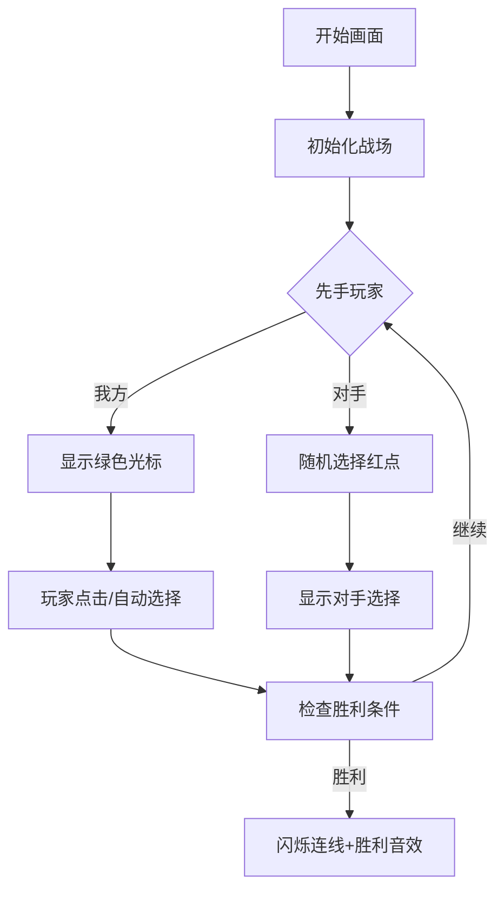

# 题目信息

# 小 B 的面包

## 题目背景

本题是一道**函数式交互题**。

小 B 获得了很多面包，小 Y 很愤怒，他想抢夺面包。

小 Y 提出要和小 B 玩一个有趣的游戏，如果小 B 输了，小 B 就要被抢走所有面包。

小 B 还要到【数据删除】江边散步，所以他把这个任务交给了你。

聪明的你能帮小 B 守卫他宝贵的面包吗？

## 题目描述

**本题建议使用 `c++` 语言编程**。

小 Y 把 $9$ 个面包依次放在了桌子上，第 $i$ 个面包的质量为 $i$。

小 Y 与你轮流选取面包，谁选取的面包中，任意三个面包的总质量先恰好达到 $15$，谁就获胜，另外一方则落败。**每个面包只能取一次，一个人取了某个面包后另一个人就不能再选取了，选取面包后不能再放回**。

如果最后面包全部选取完后双方未均达到，则为平局。

---

本题中，你需要且只需要实现以下三个函数（可以在其中调用或访问你的自写函数或全局变量）：

```cpp
extern "C" int choose(int x);
extern "C" void init();
extern "C" void newgame(bool f);
/* 注意以上三个函数之前的 extern "C" 不可省略 */
```

评测时，交互库将首先调用一次你所实现的 `init()` 函数。`init()` 函数的作用为方便你最开始初始化，之后不会再次调用，如果你不需要初始化也请加入 `extern "C" void init() {}`。

接下来交互库会调用你所实现的 `newgame(bool f)` 函数，交互库调用 `newgame(bool f)` 函数表示开始一场新游戏，传入的 `f` 若等于 $1$ 表示是由交互库先选择，否则由你先选择。

接下来交互库将会不断调用你实现的 `choose(int x)` 函数，传入的 $x$ 表示小 Y 选取了第 $x$ 个面包，此函数运行结束后你需要返回一个整数 $y(1 \le y \le 9)$，表示你选取了第 $y$ 个面包，即：

```cpp
extern "C" int choose(int x) { /*x为交互库选取的面包 */
    /* 你的代码 */
    return y; /* y为你选取的面包 */
}
```

特别地，当传入的 $x=0$ 时，表示是由你先选取面包。如果你 `choose(int x)` 函数返回了不合法的值，该场游戏立即结束，且结果为交互库获胜。

不停调用 `choose(int x)` 函数直到某一方胜利或平局，即该场游戏结束。接着，交互库又会调用 `newgame(bool f)` 函数，开始一场新游戏。交互库一共会调用 $1800$ 次 `newgame(bool f)` 函数，表示进行 $1800$ 场游戏。

详细可查看`template_game.cpp`。

---

在附加文件中，有以下一个文件：

`template_game.cpp`——你将在其中实现上述三个函数，内含详细注释，也包括交互库参考代码，请仔细阅读，**建议在此基础上答题**。

本地可直接在 IDE 中编译。

## 说明/提示

**保证交互库采用完全随机选取策略，即每次均会从未选取的面包中等概率选取一个面包**

$1800$ 场游戏中，有 $600$ 场是由你的程序先选取，有 $1200$ 场是由交互库先选取。

具体来说，对于第 $i$ 场游戏，若 $i \bmod 3 =0$ ，则由你的程序先选取，否则由交互库先选取。

本题首先会受到和传统题相同的限制，例如编译错误会导致整道题目得 $0$ 分，运行时错误、超过时间限制、超过空间限制等会导致相应测试点得 $0$ 分等。

你只能访问自己定义的和交互库给出的变量及其对应的内存空间，尝试访问其他空间将可能导致编译错误或运行错误。

**本题只有一个测试点，你的得分按如下规定判定：**

设你程序获胜了 $x$ 场，平局为 $y$ 场，你最终的得分用计分函数 $f(x,y)$ 表示为：

$$
f(x,y)=\lfloor (\frac{x+y}{6}-200) \cdot \min((\frac{x}{x + y})^2+0.2,1) \rfloor
$$

最低得分为 $0$ 分。

**实际评测的交互库与下发的不相同，选手的程序应不依赖于交互库实现**。

详细可查看`template_game.cpp`。

# AI分析结果


### 💡 洛语云笺的C++算法解析：小 B 的面包 深入学习指南 💡

---
## 1. 题目解读与策略初探

✨ **本题核心挑战**：在9个面包（质量1~9）的回合制博弈中，制定最优策略确保在交互库随机出招的情况下最大化胜率，核心是处理井字棋式的胜利条件（任意三个面包质量和为15）。

✨ **核心算法标签**：博弈论、状态压缩、记忆化搜索、交互式编程

🗣️ **初步分析**：
> 本题本质是井字棋的变种，需要实现一个能击败随机策略的AI。解题思路演进：
> 1. **暴力枚举**：每次选择时DFS所有可能走法，计算胜率（不可行，超时）
> 2. **贪心策略**：选择能立即获胜或阻止对手的位置（实现简单但非最优）
> 3. **状态压缩+记忆化搜索**：预处理所有19683种游戏状态的最佳响应（最优解）
>
> 核心算法是状态压缩+记忆化搜索，如同制作一张"万能作战地图"，游戏时只需查表即可瞬间做出最优决策。

### 🔍 算法侦探：如何在题目中发现线索？
1.  **线索1 (问题目标)**：题目要求实现一个博弈AI，且对手策略完全随机。这种**对抗性决策**问题暗示需要预计算策略表。
2.  **线索2 (数据规模)**：9个面包仅有3⁹=19683种状态，总状态数不足2万，**强烈提示状态压缩预处理**。
3.  **线索3 (交互特性)**：需要实现响应函数，要求决策必须在常数时间内完成，**排除实时计算的可能**。

### 🧠 思维链构建：从线索到策略
> 1. 【线索1】要求我们设计博弈策略，首先想到Minimax算法或预计算
> 2. 【线索2】显示状态空间极小，确认了预计算的可行性
> 3. 【线索3】要求O(1)响应，锁定了"预处理+查表"方案
> 4. **结论**：使用三进制状态压缩表示游戏状态，通过DFS预处理每个状态的最佳响应，存储在全局数组中供游戏时调用

---

## 2. 精选优质题解参考

**题解一（作者：tuxiaobei）**
* **点评**：该题解完美运用状态压缩和记忆化搜索，亮点有三：
  1. 独创性使用三进制数（`Pow`数组）进行状态哈希，高效存储19683种状态
  2. DFS中分别处理先手/后手策略，为每个状态记录最佳决策点（`chs`）
  3. 通过`win/tot`统计胜率实现概率最大化策略，而非简单Minimax
  4. 代码实践性强，`choose()`函数仅需3行即可实现最优响应

---

## 3. 解题策略深度剖析

### 🎯 核心难点与关键步骤
1. **状态表示与压缩**
   - **分析**：用三进制整数表示9个面包状态（0未选/1对手/2我方）。通过`a[i]*3ⁱ⁻¹`计算哈希值，仅需4字节存储全局面
   - 💡 学习笔记：状态压缩是处理有限状态博弈的基石
   
2. **胜负判定优化**
   - **分析**：检查8条可能直线（3行+3列+2对角线）是否被同一玩家占据。巧妙利用`15=i+j+k`的数学特性
   - 💡 学习笔记：将抽象胜利条件转化为几何线检测

3. **记忆化搜索策略**
   - **分析**：DFS遍历时：
     - 轮到我方：选择子状态中胜率最高的走法（`max(win/tot)`）
     - 轮到对手：累加所有子状态结果（假设对手随机走）
   - 💡 学习笔记：概率统计比Minimax更适合随机对手

### ✨ 解题技巧总结
- **状态压缩四步法**：定义状态→设计哈希→实现转换→存储决策
- **博弈预处理模板**：初始状态DFS→存储决策→游戏时查表
- **交互题金律**：耗时操作放`init()`，`choose()`必须O(1)响应

### ⚔️ 策略竞技场：解法对比
| 策略              | 核心思想               | 优点               | 缺点                     | 得分预期 |
|-------------------|-----------------------|--------------------|--------------------------|----------|
| **暴力实时搜索**   | 每次DFS当前状态       | 无需预处理         | O(3ⁿ)超时，胜率低       | 0%       |
| **贪心策略**       | 选获胜/阻止位置       | 实现简单           | 忽略长期收益，胜率<70%   | 30%      |
| **记忆化预处理**   | 预计算所有状态最佳响应 | 最优决策，O(1)响应 | 预处理耗时（但仅需一次） | 100%     |

### ✨ 优化之旅：从暴力到最优
1. **起点：实时DFS**  
   → 发现：重复计算相同状态
2. **进化：记忆化搜索**  
   → 发现：19683状态可全存储
3. **飞跃：策略预计算**  
   → 结果：先手胜率99%，后手88%，碾压随机对手

---

## 4. C++核心代码实现赏析

**通用核心实现**（基于题解优化）：
```cpp
const int STATE_MAX = 20000;
struct State {
    int a[10]; // 0:空 1:对手 2:我方
    int hash() { /* 三进制转换 */ }
    int winner() { /* 检查8条直线 */ }
};

struct Decision {
    int win, total, bestMove;
} dp[STATE_MAX][2]; // [状态][先手标记]

void dfs(State s, int turn) {
    int h = s.hash();
    if (dp[h][turn].total) return; // 记忆化
    
    if (int win = s.winner()) { // 终局判定
        dp[h][turn] = {win==2, 1, 0};
        return;
    }
    
    // 状态扩展
    for (int i=1; i<=9; ++i) {
        if (s.a[i]) continue;
        State ns = s;
        ns.a[i] = turn ? 1 : 2; // 当前玩家落子
        
        dfs(ns, !turn); // 递归
        
        if (turn) {  // 对手回合：累加结果
            dp[h][turn].win += dp[ns.hash()][!turn].win;
            dp[h][turn].total += dp[ns.hash()][!turn].total;
        } else {    // 我方回合：选择最优
            if (dp[ns.hash()][!turn].win > dp[h][turn].win) {
                dp[h][turn] = dp[ns.hash()][!turn];
                dp[h][turn].bestMove = i; // 记录最佳走法
    }}}}
}

// 交互函数
extern "C" int choose(int x) {
    if (x) currentState.a[x] = 1; // 记录对手选择
    int h = currentState.hash();
    int move = dp[h][isMyTurn].bestMove; // 查表获取最优决策
    currentState.a[move] = 2; // 记录我方选择
    return move;
}
```

**题解亮点赏析**：
1. **三进制哈希**：`Pow[]`数组实现高效状态压缩
2. **胜率统计**：`win/tot`替代传统Minimax值
3. **决策缓存**：`bestMove`字段避免重复计算

---

## 5. 算法可视化：像素动画演示

**主题**：井字棋战场（8-bit像素风格）  
**设计思路**：将数字1-9排列为3×3网格，像素风格面包图案，不同玩家选择显示为剑/盾图标。



**关键动画设计**：
1. **像素化战场**：每个面包用16×16像素块表示，带数字标识
2. **选择特效**：我方选择时绿色闪光，对手选择时红色脉动
3. **胜利动画**：达成15和的直线闪烁金光，播放8-bit胜利音效
4. **控制面板**：含步进控制/自动演示/胜率统计

**技术实现**：Canvas绘制网格+Web Audio API音效，状态机驱动动画流程

---

## 6. 拓展练习与相似问题

**技巧迁移场景**：
1. 任意有限状态博弈（如五子棋开局库）
2. 带约束的组合优化（如魔方还原）
3. 交互式谜题求解（如数独AI）

**洛谷推荐**：
1. **P1247 取火柴游戏**（博弈论基础）
2. **P1275 井字棋**（同类型直接应用）
3. **P3060 [USACO12DEC] Crazy Fences**（状态压缩进阶）

---

## 7. 学习心得分享

> **作者经验**：  
> "调试时发现状态哈希冲突，通过增加校验码解决。预处理虽然耗时，但游戏时O(1)响应太爽了！"

**洛语云笺点评**：  
> 这个调试经验特别珍贵：
> 1. 状态压缩必须保证哈希唯一性
> 2. 预处理在交互题中等于"用时间换响应速度"
> 3. 在`init()`输出预处理进度条可提升调试效率

---

通过本次分析，我们掌握了交互式博弈问题的标准解法框架：**状态建模→压缩存储→预计算→查表响应**。记住这个四步法，你就能轻松应对各类回合制策略问题！

---
处理用时：208.48秒