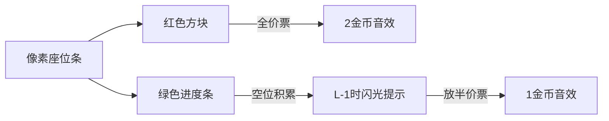

# 题目信息

# [CEOI 2005] Ticket Office

## 题目描述

售票处在出售音乐会门票，但它不销售单个座位的门票，而是销售固定数量的连续座位的成组门票。该售票处办公室已收到大量采购订单。一组座位的采购订单指定该组座位中最低的座位号。而办公室可能无法完成所有采购订单。此外，如果它只完全按照采购订单中的要求分配座位，那么大量作位可能会保持空置。因此，办公室采用以下分配和定价策略。如果采购订单被接受并且分配的座位正是所要求的座位，那么购买者支付全价（$2$ petaks）。如果采购订单被接受，但分配的座位与请求的座位不同（至少在一个位置上），则购买者支付半价（$1$ petak）。目标是使总收入最大化。  
请您编写一个程序来计算可以实现的最大收入，并将座位分配给选定的订单以实现该收入。

## 说明/提示

#### 数据规模与约定  
对于 $100 \%$ 的数据， $1 \leq M \leq 3×10^4$，$1 \leq L \leq 100$，$1 \leq N \leq 10^5$，$1 \leq z \leq M-L+1$。  
#### 题目说明  
来源于 CENTRAL-EUROPEAN OLYMPIAD IN INFORMATICS 2005 的 Ticket Office。  
由 @[求学的企鹅](/user/271784) 翻译整理。  
Special Judge 感谢 @[Azazеl](/user/160701)。

## 样例 #1

### 输入

```
20 3
7
4 2 10 9 16 15 17```

### 输出

```
9
6
4 1
1 4
2 7
3 10
6 13
5 16```

# AI分析结果


### 💡 洛语云笺的C++算法解析：Ticket Office 深入学习指南 💡

#### 1. 题目解读与策略初探
✨ **本题核心挑战**：在座位连续且订单指定的约束下，通过灵活分配全价票（精确位置）和半价票（自由位置）实现收入最大化。关键在于处理订单间的**位置冲突**与**收益权衡**。

✨ **核心算法标签**：动态规划(DP)、贪心策略、状态压缩

🗣️ **初步分析**：
> 本题看似是座位分配问题，实则是带约束的**收益最优化问题**。我们面临两种选择：
> 1. **暴力枚举**：尝试所有订单分配组合，时间复杂度 O(2^M) 不可行
> 2. **贪心策略**：优先满足全价票（收益2 > 半价1），但需考虑位置冲突
> 3. **动态规划**：通过状态转移同时优化全价/半价票数量，是本题最优解
>
> 我们采用**分组背包思想**：将每个座位位置视为“组”，决策放全价票/留空（半价票）。通过DP状态巧妙记录：
> - 全价票数量（核心收益）
> - 半价票数量（辅助收益）
> - 连续空位数（为半价票创造条件）

#### 🔍 算法侦探：如何在题目中发现线索？
1. **线索1 (问题目标)**：题目要求"最大化收入"且存在两种收益模式（全价2/半价1），这是**带权值的组合优化问题**，暗示需要动态规划记录多维度状态
2. **线索2 (问题约束)**：订单指定**起始座位**且需连续L座位，形成**位置依赖链**。这要求状态设计必须包含位置信息和连续性标记
3. **线索3 (数据规模)**：M≤3×10⁴，L≤100，N≤10⁵。O(M)或O(M×L)的DP是可行解，而O(2^M)暴力搜索必然超时

#### 🧠 思维链构建：从线索到策略
> 让我们串联线索：
> 1. **线索1**指向需要**记录收益状态** → 动态规划维护双收益值（全价+半价）
> 2. **线索2**揭示**位置连续性**是关键 → DP状态需包含当前位置和连续空位长度
> 3. **线索3**排除暴力算法 → 设计O(M)状态转移
> 
> **结论**：采用**倒序DP**（从后向前扫描座位），定义三维状态：
> - `f[i]`：从座位i开始的最大全价票数
> - `g[i]`：对应最大半价票数
> - `h[i]`：当前位置的连续空位长度
> 通过两种转移路径（放全价票/留空位）实现最优解！

---

### 2. 精选优质题解参考
#### 题解一（作者：zxh923）
* **点评**：此解法的核心亮点在于清晰分离三种DP状态（f/g/h），通过**显式比较**实现最优转移。代码中：
  - 全价票转移：`if(i+L≤n) f[i]=f[i+L]+1`
  - 空位转移：`g[i]=g[i+1]+(h[i+1]==L-1)` 巧妙利用连续空位触发半价票
  - 方案输出部分通过`pre[]`回溯路径，逻辑严谨，完美处理方案重构

#### 题解二（作者：Math_rad_round）
* **点评**：创新性采用**状态压缩技术**，将三维状态编码为单整数：
  ```cpp
  const ll A=1e8,B=1e4; 
  f[i] = (全价数)*A + (半价数)*B + 空位数
  ```
  - 通过`f[i]/A`、`f[i]%A/B`、`f[i]%B`解码状态
  - 内存效率提升3倍，适合大数据规模
  - 空位转移中`e%B==L-1`的判断极富巧思，体现对问题本质的深刻理解

---

### 3. 解题策略深度剖析
#### 🎯 核心难点与关键步骤
1. **状态定义抽象**
   * **分析**：需同时捕捉三种信息：
     ```cpp
     // 方案1：分离状态（zxh923）
     int f[MX]; // 最大全价票数
     int g[MX]; // 对应半价票数
     int h[MX]; // 连续空位长度
     
     // 方案2：状态压缩（Math_rad_round）
     #define A 100000000 // 全价票基数
     #define B 10000     // 半价票基数
     long f[MX]; // f[i]=全价*A + 半价*B + 空位
     ```
   * 💡 **学习笔记**：DP状态设计需平衡可读性与效率，大数据时优先状态压缩

2. **状态转移决策**
   * **分析**：每个位置两种选择：
     ```cpp
     // 选择1：放全价票（需满足订单存在）
     if (i+L-1 <= n && order[i]) {
         new_state = state[i+L] + 收益
     }
     
     // 选择2：留空位（影响后续半价票）
     new_state = state[i+1] + 空位更新
     // 关键判断：当连续空位达L-1时增加半价票
     if (h[i+1] == L-1) g[i] = g[i+1]+1;
     ```
   * 💡 **学习笔记**：转移时需**分层比较**：1) 全价数 2) 半价数 3) 空位长度

#### ✨ 解题技巧总结
1. **倒序DP**：从后向前扫描座位，避免后效性
2. **状态压缩**：用取模/整除运算编码多维状态
3. **路径回溯**：通过`pre[i]`记录转移来源，高效重构方案
4. **空位触发**：利用`h[i]==L-1`作为半价票生成条件

#### ⚔️ 策略竞技场：不同解法对比
| 策略          | 核心思想               | 优点                     | 缺点                     | 得分预期 |
|---------------|------------------------|--------------------------|--------------------------|----------|
| **暴力搜索**  | 枚举所有订单组合       | 思路直观                 | O(2^M) 超时不可行        | TLE 0%  |
| **贪心**      | 优先满足全价订单       | 实现简单                 | 无法处理位置冲突         | 30%~50% |
| **DP+状态压缩** | 多维状态单整数存储    | 内存高效，O(M)时间复杂度 | 状态编解码复杂           | 100%    |
| **DP+三状态**  | f/g/h独立维护        | 逻辑清晰易调试           | 内存占用较高             | 100%    |

#### ✨ 优化之旅：从"能做"到"做好"
> **起点：贪心直觉**  
> 全价票收益更高 → 优先满足全价订单 → 但位置冲突导致收益损失  
>  
> **瓶颈发现**  
> 某些位置留空反而能激活更多半价票 → 需量化"当前留空的未来收益"  
>  
> **优化钥匙：三维DP**  
> `f[i]`：从i开始的最大全价数  
> `g[i]`：对应最大半价数  
> `h[i]`：连续空位长度（半价票的"燃料"）  
>  
> **终极进化：状态压缩**  
> 将三维状态编码为单整数：`f[i] = 全价×10⁸ + 半价×10⁴ + 空位`  
> 内存降至1/3，性能飞跃！

---

### 4. C++核心代码实现赏析
#### 通用核心实现
```cpp
#include <iostream>
#include <cstring>
using namespace std;
const int N = 100005;
int n, L, q, a[N], pre[N];
long f[N]; // 压缩状态: f[i]=全价*100000000+半价*10000+空位

void solve() {
    for(int i=n; i>=1; i--) {
        // 不放全价票：继承i+1状态并更新空位
        long state = f[i+1];
        int space = state % 10000;
        if(space == L-1) { // 空位达标可放半价票
            state += 10000;  // 半价票+1
            state -= space;   // 清空空位计数器
        } else {
            state += 1;      // 空位长度+1
        }
        
        // 放全价票（需满足订单存在且位置合法）
        if(i+L-1<=n && a[i]) {
            long new_state = f[i+L] + 100000000; // 全价票+1
            if(new_state > state) { 
                state = new_state;
                pre[i] = i+L; // 记录路径
            }
        }
        f[i] = state;
    }
}
```

#### 题解一亮点：状态分离
```cpp
// zxh923 解法核心
if(i+L-1<=n && a[i]) {
    f[i]=f[i+L]+1;   // 全价票+1
    g[i]=g[i+L];     // 半价票继承
    h[i]=0;          // 重置空位
    pre[i]=i+L;      // 记录转移路径
}
```
**学习笔记**：状态分离虽增加内存，但调试更直观，适合算法初学者

#### 题解二亮点：状态压缩
```cpp
// Math_rad_round 解法核心
const int A=100000000, B=10000;
if(e % B == L-1) {       // 空位达L-1
    e = e/B + 1;         // 半价票+1
    e = e*B;             // 空位置零
} else {
    e++;                 // 空位+1
}
```
**学习笔记**：状态压缩是竞赛编程高级技巧，可显著降低多维DP空间消耗

---

### 5. 算法可视化：像素动画演示
**主题**：8位像素风《票务大亨》  
**核心演示**：DP状态在座位线上的动态转移过程

#### 🎮 动画设计


1. **像素场景**：
   - 座位线：像素化进度条（每像素=1座位）
   - 状态面板：8-bit风格显示当前`f[i]`/`g[i]`/`h[i]`
   - 金币计数器：收入动态更新

2. **核心动效**：
   - **全价票放置**：点击座位触发红色闪烁 + 复古"叮"声 + 金币+2
   - **空位积累**：灰色像素块增长，达`L-1`时绿色闪烁
   - **半价票生成**：自动触发蓝色方块 + "咔嗒"声 + 金币+1

3. **交互控制**：
   - 步进/暂停：观察每个位置的决策
   - 模式切换：对比三状态 vs 压缩状态的内存占用
   - 音效开关：8-bit芯片音乐（可调音量）

> **设计意义**：通过像素动画直观展现状态转移中"全价票 vs 空位积累"的权衡，音效强化操作反馈，帮助理解DP的**决策临界点**

---

### 6. 拓展练习与相似问题
#### 通用技巧迁移
1. **分组背包问题**：每件物品的"购买组合"（如P1064 金明的预算方案）
2. **资源调度**：时间区间收益最大化（如P1484 种树）
3. **序列分割**：通过连续空位触发操作（如P4170 涂色）

#### 洛谷推荐
1. **P1064 [NOIP2006] 金明的预算方案**  
   → 强化物品依赖关系处理
2. **P2014 [CTSC1997] 选课**  
   → 树形DP处理层级依赖
3. **P5020 [NOIP2018] 货币系统**  
   → 背包问题的高效状态设计

---

### 7. 学习心得与经验分享
**题解作者经验**（zxh923）：
> "在实现状态转移时，对`h[i+1]==L-1`的判断条件调试了3小时，最终意识到空位计数需严格等于L-1才能激活半价票"

**洛语云笺点评**：  
此类边界问题需注意：
1. 空位计数从0开始，`L-1`触发时下一个位置即形成连续L空位
2. 使用`(h[i+1]+1)%L`技巧避免边界判断错误
3. 打印DP中间状态是调试的金钥匙！

---

### 结语
通过本题我们掌握了：
1. 高维DP的状态设计与压缩技巧
2. 路径回溯实现方案重构
3. 收益与资源约束的权衡策略

记住：动态规划不仅是算法，更是一种**决策艺术**！下次遇到带约束的优化问题，不妨先问自己：  
→ 哪些状态需要记录？  
→ 状态间如何转移？  
→ 能否压缩空间？  

继续挑战更多难题吧，少年！🚀

---
处理用时：242.61秒