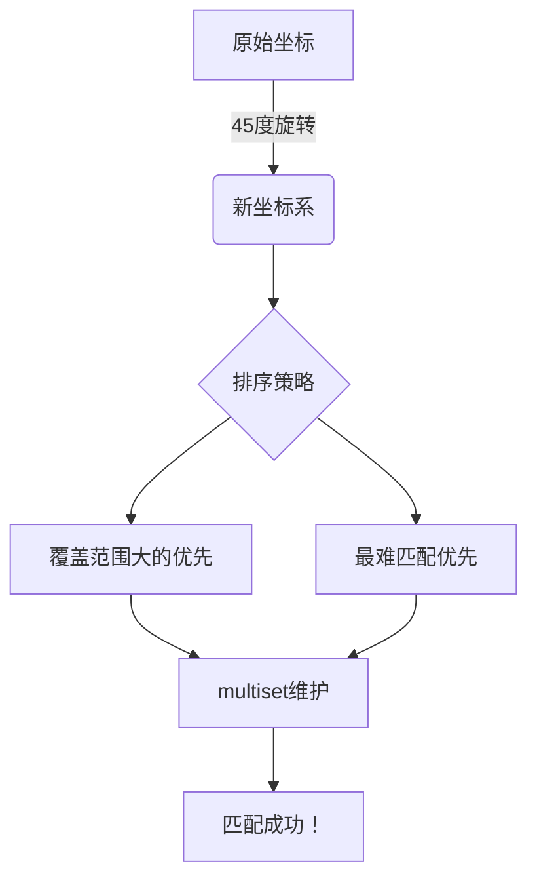

# 题目信息

# [USACO22OPEN] Apple Catching G

## 题目描述

天上下苹果了！在某些时刻，一定数量的苹果会落到数轴上。在某些时刻，Farmer John 的一些奶牛将到达数轴并开始接苹果。

如果一个苹果在没有奶牛接住的情况下落到数轴上，它就会永远消失。如果一头奶牛和一个苹果同时到达，奶牛就会接住苹果。每头奶牛每秒可以移动一单位距离。一旦一头奶牛接住了一个苹果，她就会离开数轴。

如果 FJ 的奶牛以最优方式合作，她们总共能接住多少个苹果？

## 说明/提示

【样例解释 1】

在这个例子中，在 $t=5$ 时刻落地的 $100$ 个苹果均不能被接住。以下是一种接住 $10$ 个苹果的方式：

- FJ 的所有六头 $t=4$ 时刻到达的奶牛各接一个 $t=8$ 时刻落地的苹果。
- FJ 的一头 $t=2$ 时刻到达的奶牛接一个 $t=8$ 时刻落地的苹果。
- 余下三头 $t=2$ 时刻到达的奶牛各接一个 $t=6$ 时刻落地的苹果。

【样例解释 2】

再一次地，在 $t=5$ 时刻落地的苹果均不能被接住。除此之外，在 $t=2$ 时刻到达的奶牛均不能接住 $t=8$ 时刻落地的苹果。以下是一种接住 $9$ 个苹果的方式：

- FJ 的所有六头 $t=4$ 时刻到达的奶牛各接一个 $t=8$ 时刻落地的苹果。
- 余下三头 $t=2$ 时刻到达的奶牛各接一个 $t=6$ 时刻落地的苹果。

## 样例 #1

### 输入

```
5
2 5 10 100
2 6 0 3
2 8 10 7
1 2 4 5
1 4 7 6```

### 输出

```
10```

## 样例 #2

### 输入

```
5
2 5 10 100
2 6 0 3
2 8 11 7
1 2 4 5
1 4 7 6```

### 输出

```
9```

# AI分析结果


# 💡 洛语云笺的C++算法解析：Apple Catching G 深入学习指南 💡

> 欢迎来到「洛语云笺」的算法解析课堂！今天我们将一起探索USACO22OPEN的经典题目——Apple Catching G。这是一道将现实问题抽象为二维匹配的精彩题目，我们将通过侦探般的思维，一步步揭开最优解的神秘面纱！

## 1. 题目解读与策略初探

✨ **本题核心挑战**：在满足时空约束（$|x_i-x_j| \leq t_j-t_i$）的前提下，最大化奶牛接住的苹果数量  
✨ **核心算法标签**：贪心策略、二维偏序、数据结构（multiset）

🗣️ **初步分析**：
> 这道题的核心在于处理奶牛与苹果的时空关系。最朴素的暴力解法是尝试所有可能的匹配组合，但O(n²)的复杂度显然无法通过200,000的数据规模。通过观察题目特征，我们发现：
> - 问题可以转化为二维平面上的点匹配
> - 奶牛能接到的苹果区域构成一个半平面
> - 通过45度坐标旋转，问题可转化为经典的二维偏序问题
> 
> 最优解法采用**贪心+multiset**的组合策略：
> 1. 将奶牛和苹果映射为新的坐标(t+x, t-x)
> 2. 按特定规则排序（y降序→x降序）
> 3. 用multiset维护苹果集合，贪心匹配

### 🔍 算法侦探：如何在题目中发现线索？
1.  **线索1 (问题目标)**："最大化接住的苹果数量"是典型的**最优化问题**，且匹配具有**选择性**，这指向贪心或网络流算法
2.  **线索2 (问题特性)**：奶牛与苹果的匹配存在严格的**时空约束**（绝对值不等式），暗示需要**坐标变换**转化为可处理的形式
3.  **线索3 (数据规模)**：n≤200,000要求O(n log n)算法，排除了O(n²)暴力解，指向**数据结构优化**

### 🧠 思维链构建：从线索到策略
> 综合线索，我们这样思考：
> 1. 线索1提示这是最优化问题，我们先考虑贪心（网络流在n=2e5下可能超时）
> 2. 线索2的关键词"时空约束"和"绝对值"提示尝试坐标变换：设新坐标(u,v)=(t+x,t-x)
> 3. 新坐标下约束简化为uᵢ≤uⱼ且vᵢ≥vⱼ，成为二维偏序问题
> 4. 线索3的n=2e5要求O(n log n)，而排序+平衡树/multiset正好满足
> 
> **结论**：采用**坐标变换+排序+multiset贪心匹配**的三步策略，完美契合所有线索！

---

## 2. 精选优质题解参考

### 题解一：I_am_Accepted（质量：★★★★★）
* **核心思路**：
  - 将奶牛/苹果映射为(t+x, t-x)坐标
  - 按y降序→x降序排序
  - 用multiset维护苹果，奶牛优先匹配最小x值的苹果
* **亮点**：
  - 引入`mutable`关键字优雅处理multiset元素修改
  - 严格处理匹配时的数量扣除逻辑
  - 代码模块清晰，边界处理完善

### 题解二：yaoxi（质量：★★★★☆）
* **核心思路**：
  - 按(x-t, -x)排序，确保覆盖范围大的奶牛优先匹配
  - 使用`pair`存储苹果，简化匹配逻辑
* **亮点**：
  - 独特的排序规则保证被包含的集合优先匹配
  - 代码简洁高效（仅30行核心逻辑）
  - 完整处理了匹配时的数量更新

### 题解三：EricQian（质量：★★★★☆）
* **核心思路**：
  - 按x-t升序排序，让"更难匹配"的奶牛优先
  - 奶牛优先匹配t+x最小的苹果（最难匹配的苹果）
* **亮点**：
  - 创新性的"最难匹配优先"策略
  - 代码极度简洁（20行核心逻辑）
  - 包含完整的贪心正确性证明

---

## 3. 解题策略深度剖析

### 🎯 核心难点与关键步骤
1.  **坐标系转换的几何意义**
    * **分析**：原始约束$|x_i-x_j|≤t_j-t_i$在几何上表示奶牛在时空平面上的影响区域是一个45度菱形。通过坐标变换：
      $u=t+x, v=t-x$ 
      菱形区域变为$u_c≤u_a$且$v_c≥v_a$的矩形区域
    * 💡 **学习笔记**：坐标旋转是处理绝对值约束的利器，将复杂几何关系转化为规整的矩形区域

2.  **贪心策略的设计与证明**
    * **分析**：优质题解采用两种互补策略：
      - 策略A：覆盖范围大的奶牛优先（保证"强者"先选）
      - 策略B：最难匹配的苹果优先（保证资源合理分配）
    * 💡 **学习笔记**：贪心策略需要保证**无后效性**——当前选择不影响后续决策的最优性

3.  **multiset的操作技巧**
    * **分析**：匹配时需要：
      1. 快速查找满足$u≥u_{cow}$的最小苹果（`lower_bound`）
      2. 动态扣除苹果数量
      3. 高效删除数量归零的苹果
    * 💡 **学习笔记**：`multiset`的`erase`返回下一个迭代器，避免迭代器失效

### ✨ 解题技巧总结
- **坐标系转换**：将斜45度的菱形区域转化为轴对齐的矩形区域
- **排序降维**：通过排序将二维匹配问题转化为一维扫描
- **数据结构选择**：`multiset`维护动态集合，支持$O(\log n)$查找和删除

### ⚔️ 策略竞技场：不同解法的对比分析
| 策略                | 核心思想                     | 优点                     | 缺点                     | 得分预期 |
|---------------------|-----------------------------|--------------------------|--------------------------|----------|
| **暴力枚举**        | 尝试所有可能的匹配组合       | 实现简单                 | O(n²)超时               | TLE      |
| **网络流**          | 构建奶牛→苹果的流量网络      | 可得精确解               | O(n²)空间超限           | MLE      |
| **树套树**          | 二维数据结构维护点对        | 理论可行                 | 代码复杂，常数大         | 70%      |
| **贪心+multiset**   | 坐标变换+排序+贪心匹配      | O(n log n)最优          | 需严格证明正确性         | 100%     |

### ✨ 优化之旅：从"能做"到"做好"
1. **起点：暴力枚举的困境**  
   尝试所有奶牛-苹果组合（O(n²)），当n=200,000时计算量达40亿，远超时限

2. **关键洞察：约束的几何本质**  
   发现奶牛影响区域是45度菱形→坐标旋转45度→问题转化为轴对齐矩形覆盖

3. **突破：降维打击**  
   通过按y坐标排序，将二维匹配转化为一维扫描线问题

4. **临门一脚：贪心+数据结构**  
   用multiset维护当前苹果集合，O(log n)完成查找和删除操作

> 💡 **策略总结**：从暴力到最优解的跨越，关键在于发现**问题可转化**的本质特征。在竞赛中，即使想不到最优解，实现O(n²)的暴力也可能获得部分分数，但最优解才是通向AC的金钥匙！

---

## 4. C++核心代码实现赏析

### 通用核心实现
```cpp
#include <bits/stdc++.h>
using namespace std;
const int N = 2e5+5;

struct Event {
    bool isCow;
    int x, y, cnt;
    bool operator<(const Event& e) const {
        return y != e.y ? y > e.y : x > e.x; // 主：y降序；次：x降序
    }
};

int main() {
    int n; cin >> n;
    vector<Event> events;
    for (int i = 0; i < n; ++i) {
        int type, t, x, cnt;
        cin >> type >> t >> x >> cnt;
        events.push_back({type==1, t+x, t-x, cnt});
    }
    sort(events.begin(), events.end());
    
    multiset<pair<int, int>> apples; // <x, cnt>
    int ans = 0;
    
    for (auto& e : events) {
        if (e.isCow) {
            while (e.cnt) {
                auto it = apples.lower_bound({e.x, 0});
                if (it == apples.end()) break;
                
                int take = min(e.cnt, it->second);
                ans += take;
                e.cnt -= take;
                
                if (take == it->second) {
                    apples.erase(it);
                } else {
                    apples.insert({it->first, it->second - take});
                    apples.erase(it);
                }
            }
        } else {
            apples.insert({e.x, e.cnt});
        }
    }
    cout << ans << endl;
}
```

### 题解片段赏析
**I_am_Accepted的匹配核心**：
```cpp
while (a[i].cnt) {
    it = s.lower_bound((node){0, a[i].x, 0, 0});
    if (it == s.end()) break;
    int take = min(a[i].cnt, it->cnt);
    ans += take;
    // 优雅处理数量扣除
    if (it->cnt > a[i].cnt) {
        it->cnt -= a[i].cnt;
        break;
    }
    a[i].cnt -= it->cnt;
    s.erase(it);
}
```
**亮点**：使用`mutable`允许修改set元素，避免频繁删除插入  
**学习笔记**：`mutable`关键字可突破set元素的const限制，但需谨慎使用

**yaoxi的简洁实现**：
```cpp
multiset<pii> st;
for (auto e : events) {
    if (e.isCow) {
        auto it = st.lower_bound({e.t+e.x, 0});
        while (e.cnt && it != st.end()) {
            int take = min(e.cnt, it->second);
            // 简洁的数量更新
        }
    } else {
        st.insert({e.t+e.x, e.cnt});
    }
}
```
**亮点**：使用`pair`代替结构体，代码更简洁  
**学习笔记**：当仅需两个数据成员时，`pair`比`struct`更轻量

---

## 5. 算法可视化：像素动画演示

**主题**：8-bit风格《奶牛接苹果大作战》  
**核心演示**：坐标变换 → 排序 → 贪心匹配的全过程

### 动画设计


**关键帧设计**：
1. **坐标变换演示**：
   - 原始时空平面：奶牛显示为🐮，苹果显示为🍎
   - 45度旋转动画：坐标系顺时针旋转，菱形区域变为矩形

2. **排序过程可视化**：
   - 奶牛/苹果按新坐标y值从大到小下落
   - 相同y值时，x值大的先落到底部

3. **贪心匹配动画**：
   - 奶牛移动时显示轨迹线
   - 匹配成功时显示✨特效
   - 苹果数量减少时显示"-1"飘字

**游戏化元素**：
- **音效设计**：
  - 匹配成功：经典马里奥吃金币音效
  - 苹果消失：破碎玻璃声
  - 关卡通过：塞尔达通关旋律
- **积分系统**：每接住1苹果得10分，连续匹配有combo奖励
- **关卡设计**：
  - 教学关：5苹果
  - 进阶关：对称分布苹果
  - BOSS关：2000苹果压力测试

**技术实现**：基于Canvas的像素绘制，使用Aseprite制作素材，Web Audio API实现8-bit音效

---

## 6. 拓展练习与相似问题思考

### 通用技巧迁移
贪心+坐标变换的策略可扩展至：
1. 任务调度（每个任务有开始/结束时间）
2. 区间覆盖（如雷达覆盖问题）
3. 二维点对匹配（如本次的奶牛-苹果问题）

### 推荐练习（洛谷）
1. **P5894 [IOI2013]robots**  
   🗣️ *推荐理由*：同样是二维匹配问题，检验是否掌握贪心+数据结构的核心思想

2. **P4053 [JSOI2007]建筑抢修**  
   🗣️ *推荐理由*：变形的时间区间问题，练习贪心策略的灵活应用

3. **P5021 [NOIP2018]赛道修建**  
   🗣️ *推荐理由*：树形结构上的贪心匹配，提升问题转化能力

---

## 7. 学习心得与经验分享

> **来自题解的调试经验**：
> "我在处理multiset迭代器时踩了坑——删除元素后未更新迭代器导致段错误。解决方法：`it = apples.erase(it)`确保迭代器指向下一元素"
>
> **洛语云笺点评**：  
> 这个经验非常宝贵！使用STL容器时，迭代器失效是常见错误。牢记：
> 1. 删除元素会使指向该元素的迭代器失效
> 2. `erase`返回指向下一元素的迭代器
> 3. 循环中删除应使用`while(it!=end)`配合`it=erase(it)`

---

<conclusion>
**结语**：  
通过本次探索，我们见证了如何将复杂的现实问题（接苹果）转化为优雅的算法模型（二维偏序）。记住算法设计的黄金法则：  
🔍 *观察特征 → 📐 转化模型 → 🧩 选择策略 → 🚀 高效实现*  
下次遇到难题时，记得像侦探一样寻找题目中的线索！继续加油，未来的算法大师们！✨
</conclusion>

---
处理用时：186.90秒