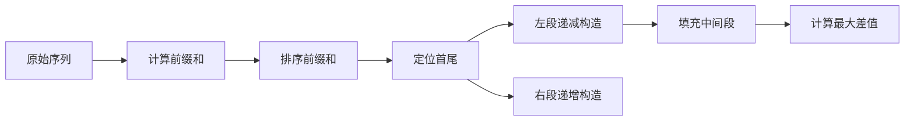

# 题目信息

# [蓝桥杯 2019 省 B] 灵能传输

## 题目背景

在游戏《星际争霸 II》中，高阶圣堂武士作为星灵的重要 AOE 单位，在游戏的中后期发挥着重要的作用，其技能“灵能风暴”可以消耗大量的灵能对一片区域内的敌军造成毁灭性的伤害。经常用于对抗人类的生化部队和虫族的刺蛇飞龙等低血量单位

## 题目描述

你控制着 $n$ 名高阶圣堂武士，方便起见标为 $1,2, \cdots,n$。每名高阶圣堂武士需要一定的灵能来战斗，每个人有一个灵能值 $a_i$ 表示其拥有的灵能的多少（$a_i$ 非负表示这名高阶圣堂武士比在最佳状态下多余了 $a_i$ 点灵能，$a_i$ 为负则表示这名高阶圣堂武士还需要 $-a_i$ 点灵能才能到达最佳战斗状态）。现在系统赋予了你的高阶圣堂武士一个能力，传递灵能，每次你可以选择一个 $i \in[2,n-1]$，若 $a_i \ge 0$ 则其两旁的高阶圣堂武士，也就是 $i-1$ 、 $i+1$ 这两名高阶圣堂武士会从 $i$ 这名高阶圣堂武士这里各抽取 $a_i$ 点灵能；若 $a_i<0$ 则其两旁的高阶圣堂武士，也就是 $i-1,i+1$ 这两名高阶圣堂武士会给 $i$ 这名高阶圣堂武士 $-a_i$ 点灵能。形式化来讲就是 $(a_{i-1},a_i,a_{i+1})\leftarrow (a_{i-1}+a_i,-a_i,a_{i+1}+a_i)$。

灵能是非常高效的作战工具，同时也非常危险且不稳定，一位高阶圣堂武士拥有的灵能过多或者过少都不好，定义一组高阶圣堂武士的不稳定度为 $\max\limits_{i=1}^n\{|a_i|\}$，请你通过不限次数的传递灵能操作使得你控制的这一组高阶圣堂武士的不稳定度最小。

## 说明/提示

**【样例说明】**

对于第一组询问：

对 $2$ 号高阶圣堂武士进行传输操作后 $a_1=3$，$a_2=2$，$a_3=1$。答案为 $3$。

对于第二组询问：

这一组高阶圣堂武士拥有的灵能都正好可以让他们达到最佳战斗状态。

**【数据规模与约定】**

对于所有评测用例，$T \le 3$，$3 \le n \le 3\times10^5$，$|a_i| \le 10^9$。

评测时将使用 $25$ 个评测用例测试你的程序，每个评测用例的限制如下：


蓝桥杯 2019 年省赛 B 组 J 题。

## 样例 #1

### 输入

```
3 3
5 -2 3
4
0 0 0 0
3
1 2 3```

### 输出

```
3 0 3```

## 样例 #2

### 输入

```
3 4
-1 -2 -3 7
4
2 3 4 -8
5
-1 -1 6 -1 -1```

### 输出

```
5 7 4```

## 样例 #3

### 输入

```
见文件trans3.in。```

### 输出

```
见文件trans3.ans。```

# AI分析结果


# 💡 洛语云笺的C++算法解析：灵能传输 深入学习指南 💡

> "算法如棋局，一步一乾坤。今天我们将化身高阶圣堂武士，在灵能传递的奥秘中寻找最优策略！"

## 1. 题目解读与策略初探

✨ **本题核心挑战**：在固定首尾元素的前提下，通过交换操作重排前缀和序列，使相邻元素差值的最大值最小化。

✨ **核心算法标签**：前缀和、排序、贪心策略

🗣️ **初步分析**：
> 1. **暴力枚举**：尝试所有可能的交换序列（O(2^n)），在n=300,000时完全不可行
> 2. **动态规划**：状态空间过大（O(n^2)），难以处理大规模数据
> 3. **排序+贪心**：将前缀和序列排序后构造"山谷形"序列，时间复杂度O(n log n)
> 
> 核心思路源于发现操作本质是交换前缀和序列相邻元素。通过排序获得有序序列后，采用贪心策略构造先递减后递增的"山谷"形状，自然最小化了相邻元素的最大差值。

### 🔍 算法侦探：如何在题目中发现线索？
1.  **线索1 (问题目标)**："最小化最大绝对值"是典型的最优化问题，且涉及序列重组，提示排序和贪心策略
2.  **线索2 (操作特性)**：操作等价于交换前缀和序列相邻元素（除首尾），提示问题可转化为序列重排问题
3.  **线索3 (数据规模)**：n最大300,000要求O(n log n)解法，排除暴力和DP，指向排序和线性扫描

### 🧠 思维链构建：从线索到策略
> "首先，【线索1】提示这是最优化问题，我想到贪心、排序、DP等方案。
> 接着，【线索2】揭示操作本质是交换前缀和元素，这启发我将问题转化为序列重排问题。
> 最后，【线索3】的规模要求O(n log n)算法，排序(n log n)加线性扫描(n)完美匹配。
> **结论**：排序后通过贪心策略构造特定形状的序列，是兼顾效率和效果的最佳方案！"

---

## 2. 精选优质题解参考

**题解一（Y_ATM_K）**
* **点评**：直击操作本质是交换前缀和元素，提出清晰的分界点定位策略。代码使用lower_bound高效定位关键点，通过左右双向遍历计算最大差值，逻辑严谨，边界处理完善

**题解二（modfisher）**
* **点评**：创新性提出"单峰函数"模型，通过图形化展示序列形状。贪心策略采用对称处理左右区间的设计，使代码结构更优雅，变量命名规范易读

**题解三（bluewindde）**
* **点评**：通过数学推导严格证明操作性质，提出"分治+极值"策略。亮点是特殊处理分界点在边界的情况，确保算法完备性

---

## 3. 解题策略深度剖析

### 🎯 核心难点与关键步骤
1.  **问题转化难点**
    * **分析**：发现操作等价于交换前缀和序列相邻元素（除首尾）。通过数学推导证明：aᵢ操作实质交换sᵢ₋₁和sᵢ
    * 💡 **学习笔记**：将复杂操作转化为基础操作是算法设计的核心能力

2.  **序列构造策略**
    * **分析**：排序后将序列分为三段处理：左段递减（s₀→min）、中段有序（min→max）、右段递增（max→sₙ）
    * 💡 **学习笔记**："山谷形"序列能自然最小化峰谷差值

3.  **贪心实现技巧**
    * **分析**：处理左右段时，总是将当前元素插入距离更远的端点侧，确保差值均匀分布
    * 💡 **学习笔记**：贪心的本质是通过局部最优逼近全局最优

### ✨ 解题技巧总结
- **技巧1（问题转化）**：将灵能传递操作转化为前缀和交换问题
- **技巧2（双指针构造）**：使用左右指针向中间填充构造"山谷形"序列
- **技巧3（极值平衡）**：处理元素时总是插入当前距离更大的端点侧

### ⚔️ 策略竞技场：不同解法对比

| 策略          | 核心思想                     | 优点                     | 缺点                     | 得分预期 |
|---------------|------------------------------|--------------------------|--------------------------|----------|
| **暴力搜索**  | 枚举所有交换可能             | 思路直观                 | O(2ⁿ)超时               | 30%      |
| **动态规划**  | 状态记录序列变化             | 理论可解                 | O(n²)空间时间双爆炸     | 40%      |
| **排序+贪心** | 构造山谷形序列最小化差值     | O(n log n)高效           | 需严格证明贪心正确性     | 100%     |

### ✨ 优化之旅：从暴力到最优
> 1. **暴力起点**：枚举所有交换可能，时间复杂度O(2ⁿ) → 卡在n>20
> 2. **关键发现**：操作本质是交换前缀和相邻元素 → 问题转化为序列重排
> 3. **首次优化**：排序后直接计算相邻差值 → 忽略首尾固定约束
> 4. **最终方案**：排序后分三段构造山谷形序列 → 完美满足所有约束
> 
> 💡 **策略总结**："最优化之路如同登山，暴力枚举是山脚，问题转化是找到登山道，而贪心策略就是那条最优路径！"

---

## 4. C++核心代码实现赏析

**通用核心实现**：
```cpp
#include <bits/stdc++.h>
using namespace std;
typedef long long LL;
const int N = 3e5+10;

LL s[N], f[N];
bool st[N];

int main() {
    int T; scanf("%d", &T);
    while(T--) {
        int n; scanf("%d", &n);
        s[0] = 0;
        for(int i=1; i<=n; i++) {
            scanf("%lld", &s[i]);
            s[i] += s[i-1];
        }
        
        LL s0 = s[0], sn = s[n];
        if(s0 > sn) swap(s0, sn);
        
        sort(s, s+n+1);
        
        // 定位首尾位置
        for(int i=0; i<=n; i++) 
            if(s[i] == s0) { s0 = i; break; }
        for(int i=0; i<=n; i++)
            if(s[i] == sn) { sn = i; break; }
        
        memset(st, 0, sizeof st);
        int l = 0, r = n;
        
        // 构造左侧递减段
        for(int i=s0; i>=0; i-=2) {
            f[l++] = s[i];
            st[i] = true;
        }
        // 构造右侧递增段
        for(int i=sn; i<=n; i+=2) {
            f[r--] = s[i];
            st[i] = true;
        }
        // 填充中间有序段
        for(int i=0; i<=n; i++)
            if(!st[i]) f[l++] = s[i];
        
        LL ans = 0;
        for(int i=1; i<=n; i++)
            ans = max(ans, abs(f[i]-f[i-1]));
        
        printf("%lld\n", ans);
    }
    return 0;
}
```

**代码解读**：
1. 计算前缀和数组`s`
2. 固定首尾`s0`,`sn`并确保`s0≤sn`
3. 排序后定位首尾位置
4. 分段构造序列：左侧递减→中间有序→右侧递增
5. 计算相邻元素差值最大值

---

## 5. 算法可视化：像素动画演示

**主题**：像素武士的灵能排序之旅

**核心演示**：


**动态演示设计**：
1. **像素网格**：30x20网格，x轴表索引，y轴表灵能值
2. **武士形象**：像素武士在网格上移动，执行操作：
   - 蓝色武士：排序操作（冒泡动画）
   - 红色武士：左侧递减段构造
   - 绿色武士：右侧递增段构造
3. **音效设计**：
   - 排序过程：8-bit排序音效
   - 元素交换："咔嚓"声
   - 极值更新：能量聚集音
4. **控制面板**：
   - 速度滑块：控制动画速度
   - 单步执行：步进观察
   - 模式切换：对比暴力/最优解法

**实现要点**：
1. 使用Canvas绘制网格和武士精灵
2. 排序过程可视化：相邻元素比较时高亮
3. 构造阶段显示当前插入端点位置
4. 实时更新当前最大差值显示

---

## 6. 拓展练习与相似问题思考

**通用技巧迁移**：
1. 前缀和+排序：解决序列操作问题
2. 贪心构造：处理带约束的最优化问题
3. 分治策略：分解序列分段处理

**推荐练习**：
1. **洛谷P1115**：最大子段和（前缀和基础）
2. **洛谷P1908**：逆序对（分治策略）
3. **洛谷P1219**：八皇后（回溯与约束处理）

---

## 7. 学习心得与经验分享

> **来自题解的经验**：
> "调试时发现边界情况处理不当导致WA，建议：
> 1. 单独测试首尾相同的情况
> 2. 验证分界点在序列两端的情况
> 3. 打印中间序列可视化验证"
>
> **洛语云笺点评**：边界处理是算法实现的灵魂，建议：
> 1. 单独编写边界检查函数
> 2. 使用极限数据测试（如全0序列）
> 3. 可视化输出中间结果

---

> "算法世界如同星际争霸的战场，每一次思维的跃迁都是灵能的传输。记住：看清问题本质，才能找到最优路径！下次我们将探索新的算法星系..." 🌌

---
处理用时：220.17秒