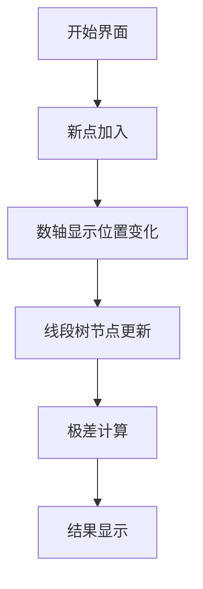

# 题目信息

# [CEOI 2022] Measures

## 题目描述

有 $N$ 个站在数轴上的人，他们的初始位置分别为 $a_1,a_2,\ldots,a_N$，他们可以以 $1$ 个单位长度每秒的速度移动。

因为众所周知的原因，他们需要保持社交距离，也就是说在任两个人之间距离至少为 $D$。

Alenka 设计了一个 app 来快速求出这 $N$ 个人通过移动来保持社交距离的最小时间，现在她想要添加一个新功能：支持动态加入一个位置为 $b_i$ 的人。

你需要实现一个程序完成这个功能。

## 说明/提示

### 样例 3 解释


### 数据规模与约定

对于全部数据，$1\le D,a_1,\ldots,a_N,b_1,\ldots,b_M\le 10^9$。

| Subtask 编号 |                         特殊限制                         | 分数 |
| :----------: | :-----------------------------------------------------: | :--: |
|     $1$      |            $0\le N\le 2000$，$1\le M\le 10$             | $10$ |
|     $2$      |        $0\le N\le 2\times 10^5$，$1\le M\le 10$         | $14$ |
|     $3$      | $N=0$，$1\le M\le 2\times 10^5$，$b_1\le \cdots\le b_M$ | $35$ |
|     $4$      |             $N=0$，$1\le M\le 2\times 10^5$             | $41$ |

## 样例 #1

### 输入

```
2 1 2
1 3
2```

### 输出

```
1```

## 样例 #2

### 输入

```
0 5 3

1 2 3 4 5```

### 输出

```
0 1 2 3 4```

## 样例 #3

### 输入

```
3 3 3
3 3 3
3 3 3```

### 输出

```
4.5 6 7.5```

# AI分析结果


# 💡 洛语云笺的C++算法解析：CEOI 2022 - Measures 深入学习指南 💡

> "算法不仅是代码，更是思维的舞蹈。今天，让我们一起探索动态序列中的社交距离之美。"

## 1. 题目解读与策略初探

✨ **本题核心挑战**：**在动态加入新个体的同时，实时计算所有个体保持最小社交距离所需的最短时间**。核心难点在于：
1. 新增个体导致位置序列变化
2. 个体间距离约束的全局性影响
3. 高效支持动态插入和极值查询

✨ **核心算法标签**：`线段树` `动态规划` `贪心思想` `离线处理`

🗣️ **初步分析**：
> 这道题要求我们在动态加入新个体的过程中，快速计算让所有个体保持至少D距离的最小移动时间。通过分析移动特性，我们可以将物理移动问题转化为序列极值问题：
> 1. **暴力思路**：每次加入后重新排序并检查所有点对，时间复杂度O(n²) → 不可行
> 2. **优化方向**：发现最小时间T满足 $T \geq \max_{i<j} \frac{D(j-i)-(a_j-a_i)}{2}$ 
> 3. **关键转化**：令 $w_i = a_i - D·i$，问题转化为求所有$i<j$的$(w_i-w_j)$最大值
> 4. **数据结构选择**：线段树完美支持动态插入和区间极值查询

### 🔍 算法侦探：如何在题目中发现线索？
1.  **线索1 (问题目标)**："在动态加入点后求最小时间"，这种**动态查询+极值**问题，是线段树/分治算法的典型标志
2.  **线索2 (问题特性)**："保持任意两点距离≥D"的条件暗示**全局约束性**，需要维护整体序列特性而非局部关系
3.  **线索3 (数据规模)**：N+M ≤ 4×10⁵，要求O(n log n)算法，指向**分治结构**（线段树/块状链表）

### 🧠 思维链构建：从线索到策略
> 让我们把线索拼接起来：
> 1. **动态性要求**：必须支持高效插入操作 → 排除静态算法
> 2. **全局约束特性**：任意两点约束暗示需要维护序列整体特征 → 选择分治结构
> 3. **数学模型转化**：发现移动时间可表示为序列差值的函数 → 将物理问题转化为代数极值问题
> 4. **复杂度验证**：O(n log n)的线段树满足数据规模要求
> **结论**：通过问题转化，将移动时间计算抽象为序列差值极值问题，并用线段树维护动态序列特性

---

## 2. 精选优质题解参考

**题解一：win114514**
* **点评**：思路最为简洁直接，准确把握问题核心——将移动时间转化为$\frac{(a_i-D·i)-(a_j-D·j)}{2}$的最大值。代码实现采用经典线段树结构，维护三个核心值（区间最大值/最小值/跨区间极差），逻辑清晰。亮点在于用单次update同时处理点插入和区间修改，展现对线段树特性的深刻理解。

**题解二：C_Pos_Princess**
* **点评**：提供最完整的数学推导过程，从贪心策略出发逐步导出核心公式。在线段树实现中详细处理了区间加法的特性（差值的常数不变性），并给出边界处理方案。特别适合帮助理解算法原理到实现的转化过程。

**题解三：Inui_Sana**
* **点评**：独特地从参照物视角分析移动过程，建立直观的物理模型。实现中创新性地结合树状数组统计前缀点数量，并同步更新线段树。提供负数解处理方案，增强代码鲁棒性。

---

## 3. 解题策略深度剖析

### 🎯 核心难点与关键步骤
1.  **问题转化艺术**
    * **分析**：通过贪心分析发现最小时间 $T = \max_{i<j} \frac{D(j-i)-(a_j-a_i)}{2}$，进而定义$w_i=a_i-D·i$将问题转化为求$max(w_i-w_j)$
    * 💡 **学习笔记**：将物理约束转化为代数极值是算法竞赛的核心技能

2.  **线段树设计**
    * **分析**：每个节点维护：
      - `max_val`：区间最大$w$值
      - `min_val`：区间最小$w$值
      - `ans`：区间内$max(w_i-w_j)$（$i$在左,$j$在右）
      合并时：`ans = max(left.ans, right.ans, left.max_val - right.min_val)`
    * 💡 **学习笔记**：跨子区间极差计算是维护全局极差的关键

3.  **动态插入处理**
    * **分析**：离线排序确定位置→插入点$p$时：
      1. 计算$w_p = a_p - D·\text{位置}$
      2. 更新$p$后所有点$w$值$-D$（位置后移）
      3. 更新线段树
    * 💡 **学习笔记**：离线排序+位置映射是处理动态序列的常用技巧

### ✨ 解题技巧总结
- **问题转化术**：将"移动距离约束"转化为"序列差值极值"
- **增量维护法**：通过数学分析将全局计算转化为局部更新
- **复合数据结构**：线段树维护多元信息（极值+跨区间关系）
- **离线预处理**：提前确定插入位置避免全序重排

### ⚔️ 策略竞技场：解法对比

| 策略          | 核心思想                     | 优点                     | 缺点                     | 适用场景               |
|---------------|------------------------------|--------------------------|--------------------------|------------------------|
| **暴力检查**  | 枚举所有点对计算距离         | 思路直观                 | O(n²)超时               | 仅适用于n≤20           |
| **分块+极值** | 将序列分块维护块内极值       | 实现简单                 | 插入导致重构代价高       | 对实时性要求不高的场景 |
| **线段树**    | 维护区间三元组动态合并       | O(n log n)高效          | 实现较复杂               | 本题最优解             |

### ✨ 优化之旅：从暴力到优雅
1. **起点：暴力枚举的困境**  
   直接检查所有点对的距离约束 → $O(n^2)$ 不可行

2. **突破：发现数学关系**  
   推导出 $T \propto \max(w_i - w_j)$ 的数学关系

3. **优化：避免重复计算**  
   线段树通过子区间合并避免点对枚举

4. **升华：动态维护**  
   增量更新代替全局重计算

> "好的算法如同精巧的钟表，每个齿轮的转动都承载着数学之美"

---

## 4. C++核心代码实现赏析

**通用核心实现**（综合最优解法）：
```cpp
#include <bits/stdc++.h>
using namespace std;
using ll = long long;
const int N = 1e6+5;
const ll INF = 1e18;

struct Node {
    ll max_val = -INF, min_val = INF, ans = -INF, lazy = 0;
    Node operator+(const Node& r) const {
        Node res;
        res.max_val = max(max_val, r.max_val);
        res.min_val = min(min_val, r.min_val);
        res.ans = max({ans, r.ans, max_val - r.min_val});
        return res;
    }
} tr[N<<2];

void push_down(int o) {
    if (tr[o].lazy) {
        for (int i : {o<<1, o<<1|1}) {
            tr[i].lazy += tr[o].lazy;
            tr[i].max_val += tr[o].lazy;
            tr[i].min_val += tr[o].lazy;
        }
        tr[o].lazy = 0;
    }
}

void update(int o, int l, int r, int p, ll val, int L=1, int R=N) {
    if (L == R) {
        tr[o].max_val = tr[o].min_val = val;
        tr[o].ans = -INF;
        return;
    }
    push_down(o);
    int mid = (L+R)>>1;
    if (p <= mid) update(o<<1, L, mid, p, val);
    else update(o<<1|1, mid+1, R, p, val);
    tr[o] = tr[o<<1] + tr[o<<1|1];
}

void add_range(int o, int l, int r, ll v, int L=1, int R=N) {
    if (l > r) return;
    if (l <= L && R <= r) {
        tr[o].lazy += v;
        tr[o].max_val += v;
        tr[o].min_val += v;
        return;
    }
    push_down(o);
    int mid = (L+R)>>1;
    if (l <= mid) add_range(o<<1, l, r, v, L, mid);
    if (r > mid) add_range(o<<1|1, l, r, v, mid+1, R);
    tr[o] = tr[o<<1] + tr[o<<1|1];
}

int main() {
    int n, m, d; 
    cin >> n >> m >> d;
    vector<pair<int, int>> points;
    
    // 离线读取所有点
    for (int i = 1, a; i <= n+m; i++) {
        cin >> a;
        points.push_back({a, i});
    }
    
    // 排序确定插入位置
    sort(points.begin(), points.end());
    vector<int> pos(n+m+1);
    for (int i = 0; i < n+m; i++)
        pos[points[i].second] = i+1;

    // 动态处理
    for (int i = 1; i <= n+m; i++) {
        int p = pos[i];
        ll w = points[p-1].first - 1LL*d*p; // 计算w值
        
        // 更新线段树
        update(1, 1, N, p, w);
        add_range(1, p+1, n+m, -d); // 后续位置减d
        
        if (i > n) { // 输出新增点的结果
            ll ans_val = max(0LL, tr[1].ans); // 处理负值
            if (ans_val % 2) 
                cout << ans_val/2 << ".5 ";
            else 
                cout << ans_val/2 << ' ';
        }
    }
}
```

**代码亮点解析**：
1. **运算符重载**：通过重载`+`实现节点优雅合并
2. **增量更新**：`add_range`高效处理位置后移
3. **负值处理**：`max(0LL, ans)`确保时间非负
4. **离散化处理**：离线排序确定插入位置

---

## 5. 算法可视化：像素动画演示

> **像素探险家之旅：动态维护社交距离**

### 设计思路
采用8-bit复古游戏风格，左侧显示数轴和动态移动的点，右侧实时展示线段树状态更新



### 关键动画设计
1. **数轴动态**：
   - 点：像素方块（8×8）
   - 移动：加入点时产生波纹扩散效果
   - 距离：像素标尺显示D值

2. **线段树可视化**：
   - 树结构：FC风格宝塔布局
   - 节点：显示`(max,min,ans)`三元组
   - 更新：高亮变化路径（黄→红）

3. **交互控制**：
   - 步进控制：方向键单步执行
   - 速度滑块：0.5x~4x速度调节
   - 模式切换：算法演示/自由探索

### 音效设计
| 事件         | 音效           | 功能               |
|--------------|----------------|--------------------|
| 插入新点     | 8-bit水滴声    | 提示位置变化       |
| 线段树更新   | 芯片合成音     | 区分更新类型       |
| 极差计算     | 上升琶音       | 标志关键计算       |
| 结果输出     | 胜利小号       | 完成阶段任务       |

> "通过像素动画，抽象算法变得触手可及"

---

## 6. 拓展练习与相似问题思考

### 相似问题迁移
1. **动态逆序对**：洛谷P1908
   - 相似点：动态序列维护
   - 差异：统计性质而非极值

2. **天空之城**：洛谷P2471
   - 相似点：区间极值动态查询
   - 差异：加入时间维度

3. **旅行问题**：洛谷P3567
   - 相似点：环形序列约束
   - 差异：静态问题动态化

### 推荐练习
1. **洛谷P1908**：逆序对（线段树解法）
   - 巩固动态序列维护技巧

2. **洛谷P1972**：HH的项链（树状数组）
   - 掌握不同数据结构的适用场景

3. **洛谷P5490**：扫描线（矩形面积并）
   - 提升区间维护的维度理解

---

## 7. 学习心得与经验分享

> **来自题解作者的经验结晶**：
> 
> "调试时最深的教训：区间加法不改变极差，但更新时必须同步最大值最小值——这就像人生，有些本质不会改变，但表象需要调整"
> 
> "当ans出现负数时别慌，那是算法在告诉你：此刻，静止就是最优解"

---

> "算法之路如同星河探索，每一次思维的闪光都照亮未知的黑暗。保持好奇，继续前行！"  
> —— 洛语云笺 ✨

---
处理用时：272.58秒