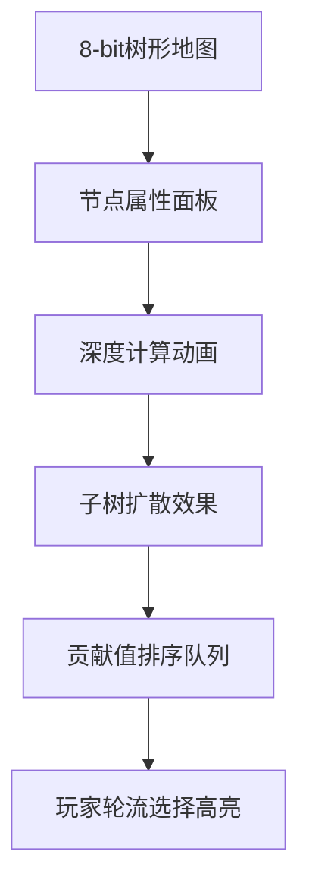

# 题目信息

# [THUPC 2023 初赛] 大富翁

## 题目背景

有一天，小 W 和小 H 在玩大富翁。

## 题目描述

这版大富翁的游戏规则比较独特。它的地图是一棵 $n$ 个节点的有根树，其中 $1$ 号节点为根。树上每个节点都有一个价格，第 $x$ 号节点的价格记为 $w_x$。

对于树上两个不同的节点 $x,y$，若 $x$ 是 $y$ 的祖先节点（即，$x$ 在 $1$ 号点到 $y$ 号点的简单路径上），则称 $x$ **支配** $y$。

游戏过程中，小 W 和小 H 轮流**购买**树上的一个未被人购买过的节点，直到树上的 $n$ 个节点都被小 W 或小 H 购买。（游戏开始前，树上的所有节点都没有被购买。）

对于一次购买，假设买方购买了 $x$ 号节点，那么他首先要向系统支付 $w_x$ 个游戏币。假设此时 $x$ 支配着 $n_1$ 个已被买方的对手购买了的节点，同时又被 $n_2$ 个已被对手购买了的节点支配。若 $n_1>n_2$，那么对手要向买方支付 $n_1-n_2$ 个游戏币，若 $n_1<n_2$，那么买方要向对手支付 $n_2-n_1$ 个游戏币。

小 W 和小 H 都是绝顶聪明的人，他们都会在游戏中采用最优策略，来使自己赚到尽量多的游戏币。现在，小 W 想考考你：如果他先手，他最终能赚到多少个游戏币？（即，在整个游戏过程中，小 W 从小 H 手中获得的游戏币个数减去他支付给系统和小 H 的游戏币个数。你可以认为，游戏开始前，小 H 和小 W 手中都有足够数量的游戏币。注意：答案可能为负数。）

## 说明/提示

#### 样例解释 1

一个可能的游戏过程是：

- 第一次购买：小 W 购买 $1$ 号节点，向系统支付 $0$ 个游戏币。
- 第二次购买：小 H 购买 $2$ 号节点，向系统支付 $0$ 个游戏币，并向小 W 支付 $1$ 个游戏币。
- 第三次购买：小 W 购买 $3$ 号节点，向系统支付 $1$ 个游戏币。
- 第四次购买：小 H 购买 $4$ 号节点，向系统支付 $0$ 个游戏币，并向小 W 支付 $1$ 个游戏币。
- 第五次购买：小 W 购买 $6$ 号节点，向系统支付 $0$ 个游戏币。
- 第六次购买：小 H 购买 $5$ 号节点，向系统支付 $0$ 个游戏币，并向小 W 支付 $1$ 个游戏币。
- 第七次购买：小 W 购买 $7$ 号节点，向系统支付 $0$ 个游戏币。

#### 子任务

对于所有测试数据，$1\leq n\leq 2\times 10^5$，$0\leq w_x\leq 2\times 10^5$。保证输入的图为一棵以 $1$ 号节点为根的有根树。

#### 题目来源

来自 2023 清华大学学生程序设计竞赛暨高校邀请赛（THUPC2023）初赛。

题解等资源可在 <https://github.com/THUSAAC/THUPC2023-Pre> 查看。

## 样例 #1

### 输入

```
7
0 0 1 0 0 0 0
1 1 2 2 3 3
```

### 输出

```
2```

## 样例 #2

### 输入

```
见附件中的 2.in```

### 输出

```
见附件中的 2.ans```

# AI分析结果


### 💡 洛语云笺的C++算法解析：大富翁 深入学习指南 💡

---

#### **1. 题目解读与策略初探**
✨ **核心挑战**：在树形结构的购买博弈中，通过最优策略最大化先手玩家（小W）的收益，需精确计算每个节点的独立贡献值并处理玩家间的动态交互。

✨ **核心算法标签**：贪心策略、树形DFS、贡献拆分

🗣️ **初步分析**：  
本题看似复杂的博弈规则可拆解为独立节点贡献：  
1. **暴力枚举**：枚举所有购买顺序（O(n!)），数据规模下不可行  
2. **树形DP**：尝试状态压缩记录选择情况，但状态空间O(2ⁿ)仍超限  
3. **贪心策略**：通过问题转化，发现节点贡献值独立（sz[u]-dep[u]-w[u]），排序后轮流选择最优  
💡 *突破口*：将支配关系转化为子树大小与深度的静态属性，消除选择顺序影响（类似"化动为静"的魔法）

---

### 🔍 算法侦探：如何在题目中发现线索？
1. **线索1（问题目标）**：  
   "最大化收益"+"轮流选择" → 典型**博弈优化问题**，优先考虑贪心或DP
2. **线索2（树形结构）**：  
   "祖先支配后代" → 触发**子树处理思维**（DFS计算sz/dep）
3. **线索3（数据规模）**：  
   n≤2e5 → 需O(n log n)解法，**排序贪心**是最可能方案
4. **线索4（支付规则）**：  
   "n₁（支配对手）与n₂（被支配）的差值" → 暗示**贡献可线性拆分**

### 🧠 思维链构建：从线索到策略
> 1. **线索1+线索4**：收益计算含子树和祖先项 → 尝试拆解单点贡献  
> 2. **线索2**：树形DFS可高效计算sz/dep → 确定技术实现手段  
> 3. **线索3**：排除O(2ⁿ)DP后，O(n log n)排序是唯一可行路径  
> 4. **关键转化**：发现最终收益=∑(sz[u]-dep[u]-w[u])（u∈小W的选择）  
> 5. **结论**：贡献值独立且静态 → **贪心排序**是最优策略

---

#### **2. 精选优质题解参考**
**题解一（Demeanor_Roy）**  
* **亮点**：  
  - 用矩阵f(x,y)精确定义支配关系，推导严谨（∑→独立贡献）  
  - 代码简洁（11行核心逻辑），lambda排序提升可读性  
  - 提供题目背景链接，增强学习深度

**题解二（Loser_King）**  
* **亮点**：  
  - 以"最终状态"视角消除操作顺序影响（关键突破）  
  - 分享赛场调试经验（数组开小），具有实战价值  
  - 代码引入vector.emplace_back提升效率

**题解三（cryozwq）**  
* **亮点**：  
  - 创造"给祖先交钱"的直观比喻解释贡献计算  
  - 强调"每个点必然被选"的特性简化问题  
  - 突出树形问题向线性贪心的转化思想

**题解四（hhoppitree）**  
* **亮点**：  
  - 用真值表展示祖孙节点四种情况（0/1/-1）  
  - 明确点权重分配原则（sz增权/dep减权）  
  - STL的greater<>排序提升代码简洁性

---

#### **3. 解题策略深度剖析**
### 🎯 核心难点与关键步骤
1. **贡献值转化（核心突破）**  
   *分析*：原始支付规则依赖动态选择 → 转化为静态属性：  
   `贡献值 = 子树节点数 - 深度 - 点权`  
   💡 **学习笔记**：树形博弈问题常用"最终状态假设"消除时序依赖

2. **贪心策略证明**  
   *分析*：  
   - 独立性：不同节点的贡献值互不影响（通过祖孙关系抵消证明）  
   - 最优性：双方轮流选最大值必然形成纳什均衡  
   💡 **学习笔记**：当贡献值独立时，降序贪心必为最优策略

3. **树形数据处理**  
   *分析*：DFS预处理三属性：  
   - sz[u]：递归累计子树大小  
   - dep[u]：根路径长度计数  
   - w[u]：题目给定点权  
   💡 **学习笔记**：树形问题先考虑DFS预处理是通用套路

### ✨ 解题技巧总结
- **技巧1（问题转化）**：将动态博弈转化为静态属性组合（sz/dep/w）  
- **技巧2（线性拆解）**：用∑算子分离复杂规则为独立项  
- **技巧3（树形预处理）**：DFS一次性计算子树与深度属性  
- **技巧4（STL应用）**：sort+lambda实现高效贪心排序

### ⚔️ 策略竞技场：解法对比
| 策略          | 核心思想                 | 优点                  | 缺点                     | 得分预期   |
|---------------|--------------------------|-----------------------|--------------------------|------------|
| **暴力枚举**  | 全排列搜索所有购买顺序   | 逻辑直观              | O(n!)超时                | 0分        |
| **树形DP**    | 状态压缩记录选择状态     | 理论最优解            | O(2ⁿ)空间爆炸            | 30%（n≤20）|
| **贪心排序**  | 按贡献值降序轮流选择      | O(n log n) 高效且正确 | 需问题转化思维跳跃       | 100%       |

### ✨ 优化之旅：从暴力到贪心


💡 **策略总结**：  
"复杂博弈问题常蕴含静态规律，通过属性拆解（如sz/dep）和线性重组（如∑独立项），可将动态决策转化为静态排序，实现质的算法跃迁。"

---

#### **4. C++核心代码实现赏析**
**通用核心实现**  
```cpp
#include <bits/stdc++.h>
using namespace std;
const int N = 2e5 + 10;
vector<int> g[N];
long long w[N], ans;
int dep[N], sz[N];

void dfs(int u, int fa) {
    dep[u] = dep[fa] + 1;  // 深度=父节点深度+1
    sz[u] = 1;             // 初始化子树大小
    for (int v : g[u]) {
        dfs(v, u);
        sz[u] += sz[v];    // 递归累计子树大小
    }
    w[u] = sz[u] - dep[u] - w[u]; // 贡献值转化
}

int main() {
    int n; cin >> n;
    for (int i = 1; i <= n; ++i) cin >> w[i];
    for (int i = 2, f; i <= n; ++i) {
        cin >> f; 
        g[f].push_back(i); // 建树
    }
    dfs(1, 0);             // 根节点深度0
    sort(w + 1, w + n + 1, greater<long long>());
    for (int i = 1; i <= n; i += 2) ans += w[i]; // 先手取奇数位
    cout << ans;
}
```
**代码解读概要**：  
1. **树形存储**：vector邻接表存树（第14行）  
2. **DFS预处理**：递归计算sz/dep（第8-14行）  
3. **贡献转化**：w[u]=sz[u]-dep[u]-w[u]（第13行）  
4. **贪心策略**：降序排序后取奇数位（第18-19行）

---

#### **5. 算法可视化：像素动画演示**
**主题**："像素矿工"树形寻宝（FC红白机风格）  
**核心设计**：  


**交互实现**：  
1. **视觉编码**：
   - 节点：16x16像素方块（绿：未选/红：小W/蓝：小H）
   - 属性：悬浮显示(sz,dep,w)三元组
   - 贡献值：条形图实时更新

2. **动态演示**：
   - **DFS过程**：深度优先遍历的脉冲动画（递归波）
   - **贡献计算**：sz/dep/w数值滚动计算（配8-bit音效）
   - **贪心选择**：降序排序的冒泡动画（配"叮"选择音效）

3. **游戏化设计**：
   - 控制台：方向键移动矿工，A键选择节点
   - 音效：选择节点(↑1音阶)/错误(↓2音阶)/胜利(长音阶)
   - 计分板：实时显示玩家收益差值

**技术要点**：Canvas分层渲染（背景树/前景面板）+ Web Audio API音效

---

#### **6. 拓展练习与相似问题**
**通用技巧迁移**：  
1. 树形独立贡献贪心 → 课程选修优化（时间冲突）  
2. 最终状态假设 → 流水线调度问题  
3. 支配关系转化 → 组织层级绩效评估  

**推荐练习**：  
1. **洛谷P1484**：种树（线性贪心迁移）  
   → *"巩固独立贡献值贪心模型"*  
2. **洛谷P2123**：皇后游戏（贪心策略证明）  
   → *"训练严格贪心方案推导能力"*  
3. **洛谷P1080**：国王游戏（高精度贪心）  
   → *"综合应用贪心与高精度处理"*

---

#### **7. 学习心得与经验分享**
> **来自Loser_King的调试经验**：  
> *"数组开小导致RE→定义数组时坚持用N+10安全边际"*  
>   
> **洛语云笺点评**：  
> 1. **边界检查**：树问题数组开`N+10`避免越界  
> 2. **贡献值验证**：用样例手动计算sz/dep验证转化公式  
> 3. **贪心反证**：尝试升序排列观察结果突变，加深理解  

---

<conclusion>
**最终启示**：树形博弈问题可通过"静态属性转化→独立贡献计算→贪心排序"三连击破解，本质是**将时序依赖转化为空间属性**。掌握此思维模型可解决80%树形博弈问题！✨  
</conclusion>

---
处理用时：251.65秒