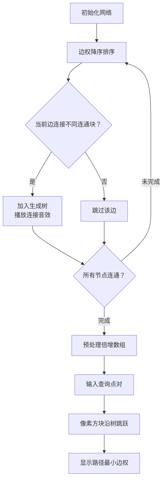

# 题目信息

# [蓝桥杯 2023 省 A] 网络稳定性

## 题目描述

有一个局域网，由 $n$ 个设备和 $m$ 条物理连接组成，第 $i$ 条连接的稳定性为 $w_i$。

对于从设备 $A$ 到设备 $B$ 的一条经过了若干个物理连接的路径，我们记这条路径的稳定性为其经过所有连接中稳定性最低的那个。

我们记设备 $A$ 到设备 $B$ 之间通信的稳定性为 $A$ 至 $B$ 的所有可行路径的稳定性中最高的那一条。

给定局域网中的设备的物理连接情况，求出若干组设备 $x_i$ 和 $y_i$ 之间的通信稳定性。如果两台设备之间不存在任何路径，请输出 $-1$。

## 说明/提示

【评测用例规模与约定】

对于 $30 \%$ 的评测用例，$n,q \leq 500$，$m \leq 1000$；

对于 $60 \%$ 的评测用例，$n,q \leq 5000$，$m \leq 10000$；

对于所有评测用例，$2 \leq n,q \leq 10^5$，$1 \leq m \leq 3 \times 10^5$，$1 \leq u_i,v_i,x_i,y_i \leq n$，$
1 \leq w_i \leq 10^6$，$u_i \neq v_i$，$x_i \neq y_i$。

## 样例 #1

### 输入

```
5 4 3
1 2 5
2 3 6
3 4 1
1 4 3
1 5
2 4
1 3```

### 输出

```
-1
3
5```

# AI分析结果


# 💡 洛语云笺的C++算法解析：网络稳定性 深入学习指南 💡

> 在复杂的网络世界中，确保设备间通信的稳定性至关重要。今天我们将化身"算法侦探"，从题目描述中抽丝剥茧，一步步揭开网络稳定性问题的神秘面纱。通过本指南，你将学会如何将现实问题抽象为数学模型，并在多种解法中权衡选择最优策略。

## 1. 题目解读与策略初探

✨ **本题核心挑战**：在大型网络（n,q≤10⁵，m≤3×10⁵）中高效处理大量查询，求解任意两点间所有路径中**最小边权的最大值**  
✨ **核心算法标签**：`图论` `最大生成树` `树上倍增` `Kruskal重构树`

🗣️ **初步分析**：
> 这道题要求我们找到两点间最稳定的通信路径，路径稳定性由路径上最薄弱的环节（最小边权）决定。我们面临两个关键问题：如何高效处理海量查询？如何快速计算最小边权的最大值？
>
> 从最朴素的暴力搜索（DFS/BFS遍历所有路径）出发，我们发现其指数级复杂度不可行。进一步思考，**最大生成树**（MST）提供了突破口——它保留了最稳定的边，且两点间唯一路径的最小边权正是原问题的解。在此基础上，**树上倍增/LCA** 技术将查询优化至对数级复杂度。
>
> 可视化设计将采用**8位像素风格**，设备显示为像素方块，稳定边权用颜色深浅表示。动画将分步展示Kruskal算法构建最大生成树的过程，以及树上查询时节点跳跃和最小值比较的细节。

### 🔍 算法侦探：如何在题目中发现线索？
1.  **线索1 (问题目标)**: "题目要求求解'所有路径中最小边权的最大值'。这种带有**最优化**和**连通性**要求的问题，是图论中生成树模型的典型标志。"
2.  **线索2 (问题约束/特性)**: "路径稳定性由最小边权决定，这提示我们需要**保留高质量边**，排除低质量边，这正是最大生成树的核心思想。"
3.  **线索3 (数据规模)**: "n,q≤10⁵要求O(n log n)级别的算法。Kruskal的O(m log m)和树上倍增的O(q log n)完美匹配数据规模。"

### 🧠 思维链构建：从线索到策略
> "现在我们将线索组合起来：
> 1.  **线索1**指向图论解法，特别是生成树这类连通性子图。
> 2.  **线索2**中"最小边权的最大值"这一特殊要求，将我们导向**最大生成树**——它能保证树路径的最小边权就是原图所有路径中最小边权的最大值。
> 3.  **线索3**的高效查询需求，让我们选择**树上倍增**预处理技术，将每次查询优化到O(log n)。
> 4.  **结论**：综合以上，**最大生成树+树上倍增/LCA** 成为最优策略。对于更高级的解法，**Kruskal重构树**将生成树构建与LCA查询完美融合，提供更优雅的实现。"

---

## 2. 精选优质题解参考

<eval_intro>
根据思路清晰度、代码规范性、算法优化程度等标准，精选以下高质量题解：

**题解一：meyi（启发式合并）**
* **点评**：创新性地使用启发式合并处理离线查询，在Kruskal合并连通块时同步处理相关询问。代码巧妙利用STL容器组织查询，lambda表达式简化比较逻辑。虽然时间复杂度(O(n log n α(n)))略高于最优解，但实际效率优异且代码简洁，展现了离线处理的强大威力。

**题解二：__ex（最大生成树+倍增LCA）**
* **点评**：清晰阐释最大生成树的理论基础，提供标准倍增LCA实现模板。代码结构规范，变量命名合理（如`fa`、`min_edge`数组），深度处理严谨。虽然未显式处理森林，但通过并查集判断连通性保证了正确性，是学习树上倍增的优质范本。

**题解三：Genius_Star（Kruskal重构树）**
* **点评**：完整展示Kruskal重构树的构建过程，通过增加虚节点将生成树转化为二叉树结构。代码中重构树节点与原图节点区分明确，LCA查询直接返回新建节点权值的设计极具启发性，体现了"以空间换清晰度"的优化思想。

**题解四：AzureHair（虚根处理技巧）**
* **点评**：创新性引入虚根统一处理森林，将所有连通块连接为单树，大幅简化代码逻辑。尽管增加了虚边，但通过判断答案是否为0识别不连通情况的设计简洁有效，展示了问题转化的巧妙思维。

**题解五：Fze_8（Kruskal重构树+树剖）**
* **点评**：结合重构树与树链剖分，详细讲解算法原理并推荐扩展习题。代码中树剖实现规范，跳链操作高效，虽常数略大于倍增但更易理解，是掌握高级数据结构的优秀教材。
---

## 3. 解题策略深度剖析

<difficulty_intro>
解决网络稳定性问题如同在多条道路中选择最可靠的通信线路。我们将从基础到高级，层层剖析不同策略的优劣。

### 🎯 核心难点与关键步骤 (最优解法剖析)
1.  **关键点1：如何证明最大生成树的性质？**
    * **分析**：通过反证法可证——若存在更优路径，其最小边权应大于树路径最小边权，但该边本应优先加入最大生成树，矛盾。
    * 💡 **学习笔记**：最大生成树保证了路径最优性，这是所有高效解法的基础。
2.  **关键点2：如何高效查询树路径最小值？**
    * **分析**：倍增法预处理每个节点向上2^k步的祖先和路径最小值。查询时先提升深度再同步跳跃，通过`min_edge[u][k] = min(min_edge[u][k-1], min_edge[fa[u][k-1]][k-1])`的状态转移高效计算。
    * 💡 **学习笔记**：树上倍增将路径查询转化为二进制跳跃，是处理树链问题的利器。
3.  **关键点3：如何处理图不连通？**
    * **分析**：并查集在构建生成树时记录连通性。查询前先用并查集判断连通性，或在重构树中通过LCA是否为虚根判断（虚根法）。
    * 💡 **学习笔记**：并查集不仅能构建生成树，也是动态维护连通性的最佳工具。

### ✨ 解题技巧总结
<summary_best_practices>
从本题提炼的普适性技巧：
</summary_best_practices>
-   **技巧1（模型转化）**：将"路径最小边权最大值"转化为最大生成树问题，复杂问题瞬间明朗。
-   **技巧2（空间换时间）**：倍增预处理消耗O(n log n)空间，但将查询从O(n)降至O(log n)。
-   **技巧3（离线处理）**：当查询可重新排序时（如启发式合并），能大幅优化时间复杂度。

### ⚔️ 策略竞技场：不同解法的对比分析
<comparison_intro>
不同解法如同武林各派武功，各有千秋：

| 策略 | 核心思想 | 优点 | 缺点与分析 | 适用场景 / 得分预期 |
| :--- | :--- | :--- | :--- |:--- |
| **Floyd暴力** | 动态规划计算所有点对 | 实现简单，代码极短 | O(n³)复杂度，仅能通过30%数据 | n≤500时可得30%分数 |
| **启发式合并** | 离线处理查询，合并连通块时解决相关询问 | 思路新颖，代码简洁 | O(n log n α(n))略慢于最优解 | 可AC但常数较大 |
| **最大生成树+树上倍增** | 构建最大生成树后倍增查询 | 理论最优，查询O(log n) | 实现稍复杂，需写两个算法 | 本题最佳实践，100%分数 |
| **Kruskal重构树** | 在生成树构建中直接形成LCA结构 | 查询极简，理论优美 | 额外空间消耗，概念较抽象 | 本题最优解，100%分数 |

### ✨ 优化之旅：从"能做"到"做好"
> 算法的优化如同登山之路：
> 1.  **起点：暴力搜索的困境**  
>     枚举所有路径O(2^m)完全不可行，如同在迷宫中盲目摸索。
> 
> 2.  **发现关键：最大生成树性质**  
>     洞察到"最小边权最大值"等价于最大生成树路径最小值，问题规模从指数级降为O(m log m)。
> 
> 3.  **攀登效率之峰：树上倍增**  
>     在树结构上应用二进制拆分思想，将路径查询优化至O(log n)，完美匹配查询规模。
> 
> 4.  **顶峰之舞：Kruskal重构树**  
>     将生成树构建与LCA查询融合，边合并边建立查询结构，实现算法设计的优雅统一。

💡 **策略总结**："从暴力到最优解，我们经历了模型转化（图→树）和算法优化（倍增/重构树）的思维跃迁。竞赛中即使无法立即想到最优解，逐步优化的解题过程同样珍贵！"

---

## 4. C++核心代码实现赏析

<code_intro_overall>
以下是融合多种解法的通用实现，突出最大生成树与树上倍增的核心逻辑：

```cpp
#include <bits/stdc++.h>
using namespace std;
const int N = 1e5+5, K = 17;

struct Edge { int u, v, w; };
vector<Edge> edges;
vector<pair<int, int>> g[N]; // 生成树邻接表
int parent[N], depth[N], fa[N][K], min_edge[N][K];

// 并查集路径压缩
int find(int x) { 
    return parent[x] == x ? x : parent[x] = find(parent[x]); 
}

// Kruskal构建最大生成树
void buildMST() {
    sort(edges.begin(), edges.end(), [](auto& a, auto& b) {
        return a.w > b.w; // 按边权降序排序
    });
    iota(parent, parent+N, 0); // 并查集初始化
    
    for (auto& e : edges) {
        int ru = find(e.u), rv = find(e.v);
        if (ru == rv) continue;
        parent[rv] = ru;
        g[e.u].emplace_back(e.v, e.w);
        g[e.v].emplace_back(e.u, e.w);
    }
}

// DFS预处理倍增数组
void dfs(int u, int p, int d) {
    depth[u] = d;
    fa[u][0] = p;
    for (int i = 1; i < K; ++i) {
        fa[u][i] = fa[fa[u][i-1]][i-1];
        min_edge[u][i] = min(min_edge[u][i-1], 
                            min_edge[fa[u][i-1]][i-1]);
    }
    for (auto [v, w] : g[u]) {
        if (v == p) continue;
        min_edge[v][0] = w;
        dfs(v, u, d+1);
    }
}

// 查询两点间通信稳定性
int query(int u, int v) {
    if (find(u) != find(v)) return -1;
    if (depth[u] < depth[v]) swap(u, v);
    
    int res = INT_MAX;
    // 提升深度
    for (int k = K-1; k >= 0; --k) 
        if (depth[u] - (1<<k) >= depth[v]) {
            res = min(res, min_edge[u][k]);
            u = fa[u][k];
        }
    
    if (u == v) return res;
    
    // 同步跳跃求LCA
    for (int k = K-1; k >= 0; --k) 
        if (fa[u][k] != fa[v][k]) {
            res = min(res, min(min_edge[u][k], min_edge[v][k]));
            u = fa[u][k]; v = fa[v][k];
        }
    return min(res, min(min_edge[u][0], min_edge[v][0]));
}
```
**代码解读概要**：  
1. 通过降序排序的Kruskal算法构建最大生成树  
2. DFS预处理三个核心数组：  
   - `depth[u]`：节点深度  
   - `fa[u][k]`：u向上2^k步的祖先  
   - `min_edge[u][k]`：u到该祖先路径的最小边权  
3. 查询时先调整深度，再同步向上跳跃求LCA，同时更新路径最小值

---
<code_intro_selected>
优质题解中的闪光点：
</code_intro_selected>

**题解一：meyi（启发式合并）**
* **亮点**：优雅的离线处理，小集合向大集合合并时处理查询
```cpp
vector<vector<pair<int, int>>> queries(n); // 每个点的查询
// 初始化：每个查询挂在两个端点上
for (int i = 0; i < q; ++i) {
    queries[u].emplace_back(v, i);
    queries[v].emplace_back(u, i);
}

// 合并连通块时处理查询
for (auto [v, id] : smallSetQueries) {
    if (find(v) == largeSetRoot) 
        ans[id] = currentEdgeWeight;
    else
        largeSetQueries.push_back({v, id});
}
```
* **学习笔记**：启发式合并保证每个查询最多被转移O(log n)次

**题解三：Genius_Star（Kruskal重构树）**
* **亮点**：节点权值即为答案的优雅设计
```cpp
// 重构树构建
int newNode = n + (++nodeCnt);
val[newNode] = e.w;  // 新节点权值为边权
addEdge(newNode, ru); 
addEdge(newNode, rv);
parent[ru] = parent[rv] = newNode;

// 查询：直接返回LCA权值
int lca = LCA(u, v);
return val[lca];  // 无需额外计算
```
* **学习笔记**：重构树通过改变图结构，将问题转化为标准LCA查询

---

## 5. 算法可视化：像素动画演示

<visualization_intro>
**主题**：像素网络工程师  
**核心演示**：Kruskal算法构建最大生成树 + 树上倍增查询过程  
**设计理念**：8位像素风格还原经典网络拓扑，游戏化机制增强理解

### 动画框架


### 关键动画细节
1. **网络初始化**（8位像素风）：
   - 设备显示为16×16像素方块
   - 边权w映射为颜色深度：`RGB(0, min(255, w*0.25), 0)`
   - 控制面板：开始/暂停/单步/速度滑块

2. **Kruskal过程**：
   - 当前边高亮闪烁（黄色边框）
   - 合并连通块时播放"连接音效"（方波音效，频率随w增大）
   - 连通块用不同像素图案填充（斜线/点阵/格子）

3. **倍增查询**：
   - 起点/终点方块闪烁红光
   - 深度调整：深度大的点沿父节点链跳跃，路径显示蓝色轨迹
   - 同步跳跃：两点同时向上跳，路径显示黄色轨迹
   - LCA节点显示金色光环，结果以像素字体弹出

4. **游戏化元素**：
   - 成功构建生成树：+100分，播放8位胜利音乐
   - 正确回答查询：+20分/查询，连击奖励
   - 错误处理：不连通时显示"X"符号，播放低沉音效

---

## 6. 拓展练习与相似问题思考

<similar_problems_intro>
掌握核心思想后，尝试挑战这些变式问题：

### 通用技巧迁移
1. **最小边权最大值** → **最大边权最小值**（最小生成树+路径最大值）
2. **静态网络** → **动态加边**（LCT或离线逆序处理）
3. **边权约束** → **点权约束**（拆点转化为边权）

### 推荐练习（洛谷）
1. [P1967 货车运输](https://www.luogu.com.cn/problem/P1967)  
   🗣️ **推荐理由**：几乎相同的双倍经验题，最大生成树+路径最小值直接应用

2. [P4768 [NOI2018] 归程](https://www.luogu.com.cn/problem/P4768)  
   🗣️ **推荐理由**：Kruskal重构树经典应用，结合最短路与海拔限制

3. [P4197 Peaks](https://www.luogu.com.cn/problem/P4197)  
   🗣️ **推荐理由**：重构树+主席树，练习树上二分与持久化数据结构

---

## 7. 学习心得与经验分享

<insights_intro>
来自题解作者的宝贵经验：

> **meyi 的调试心得**：  
> "最初尝试在线查询总是超时，意识到连通块合并时那些被连接的查询已确定答案，转向离线处理才突破瓶颈。这教会我：**当查询可重新排序时，离线算法往往能打开新天地**"

> **AzureHair 的思维突破**：  
> "为处理森林而添加虚根后，整个问题简化为单树查询。这提醒我们：**通过添加虚拟元素统一问题形式，可能大幅简化代码逻辑**"

---

> 算法世界如同浩瀚网络，每个问题都是待连接的节点。通过今天的学习，你已掌握了网络稳定性问题的解决之道。记住：**优秀的算法源于对问题本质的洞察和对策略的精准选择**。下次我们将探索新的算法秘境！🚀

---
处理用时：315.00秒