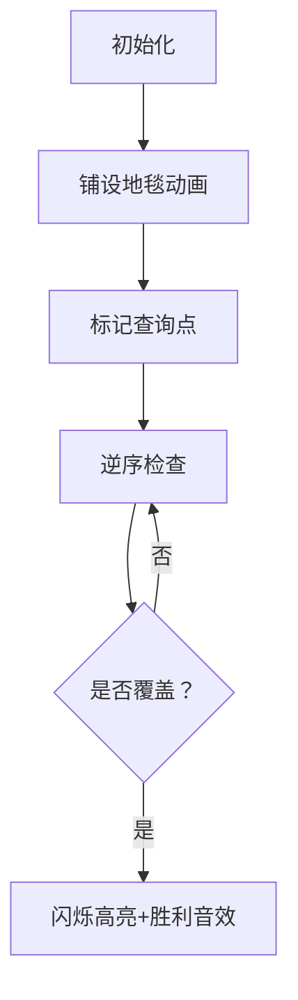

# 题目信息

# [NOIP 2011 提高组] 铺地毯

## 题目描述

为了准备一个独特的颁奖典礼，组织者在会场的一片矩形区域（可看做是平面直角坐标系的第一象限）铺上一些矩形地毯。一共有 $n$ 张地毯，编号从 $1$ 到 $n$。现在将这些地毯按照编号从小到大的顺序平行于坐标轴先后铺设，后铺的地毯覆盖在前面已经铺好的地毯之上。

地毯铺设完成后，组织者想知道覆盖地面某个点的最上面的那张地毯的编号。注意：在矩形地毯边界和四个顶点上的点也算被地毯覆盖。


## 说明/提示

【样例解释 1】

如下图，$1$ 号地毯用实线表示，$2$ 号地毯用虚线表示，$3$ 号用双实线表示，覆盖点 $(2,2)$ 的最上面一张地毯是 $3$ 号地毯。


【数据范围】

对于 $30\%$ 的数据，有 $n \le 2$。  
对于 $50\%$ 的数据，$0 \le a, b, g, k \le 100$。  
对于 $100\%$ 的数据，有 $0 \le n \le 10^4$, $0 \le a, b, g, k \le {10}^5$。   

noip2011 提高组 day1 第 $1$ 题。

## 样例 #1

### 输入

```
3
1 0 2 3
0 2 3 3
2 1 3 3
2 2
```

### 输出

```
3
```

## 样例 #2

### 输入

```
3
1 0 2 3
0 2 3 3
2 1 3 3
4 5```

### 输出

```
-1```

# AI分析结果


# 💡 洛语云笺的C++算法解析：铺地毯 深入学习指南 💡

## 1. 题目解读与策略初探

✨ **本题核心挑战**：在大量地毯（n≤10⁴）覆盖的平面坐标系中，高效确定覆盖指定点的最上层地毯编号  
✨ **核心算法标签**：模拟、枚举、贪心优化  

🗣️ **初步分析**：
> 这道题看似简单，但暗藏陷阱：直接开二维数组记录每个点会被地毯覆盖会因空间太大（10⁵×10⁵网格）导致MLE。我们需要更聪明的策略：
> 1. **暴力解法**：尝试用二维数组记录每个点对应的地毯编号（空间O(N²)，不可行）
> 2. **正序模拟**：存储每张地毯参数，正序检查覆盖关系（时间O(n)可行但未优化）
> 3. **逆序贪心**：利用"后铺地毯在上"特性逆序检查，找到即停（最优解）
> 
> 核心难点在于**如何避免空间爆炸**同时**利用问题特性优化时间**。逆序查找如同翻看叠放的纸张——直接从最上层开始检查，效率最高！

### 🔍 算法侦探：如何在题目中发现线索？
1.  **线索1 (问题目标)**: "求覆盖点的最上面地毯"暗示结果取决于地毯铺设顺序，后出现的优先级更高  
2.  **线索2 (数据特性)**: 单个查询点 + 矩形边界条件（包含边角）提示无需存储整个平面  
3.  **线索3 (数据规模)**: n≤10⁴ 说明O(n)算法可行（约10⁴次计算），但坐标范围10⁵排除了二维数组  

### 🧠 思维链构建：从线索到策略
> 让我们串联线索：
> 1. 【线索1】要求找"最上层"地毯 → 最后铺设的地毯优先级最高  
> 2. 【线索2】单个查询点 → 只需判断该点是否在各地毯范围内  
> 3. 【线索3】大数据范围 → 必须抛弃O(N²)思路  
> 4. **结论**：采用**逆序遍历**策略！从最后一张地毯向前检查，首次覆盖点时立即返回。这就像从叠放文件的顶部开始翻找，效率远超从底层查起  

---

## 2. 精选优质题解参考

**题解一：谁懂谁伤心（逆序优化）**  
* **点评**：直击问题核心，利用逆序查找实现"找到即停"的优化。代码用`a[j][0]`和`b[j][0]`存储地毯边界，逻辑清晰。亮点在于循环从`i=n`开始递减，完美匹配"后铺优先"特性  

**题解二：Vct14（结构体逆序）**  
* **点评**：采用结构体组织地毯数据提高可读性，预处理右下角坐标`(c,d)`加速判断。逆序循环配合`return 0`提前退出，避免冗余计算  

**题解三：WsW_（栈模拟）**  
* **点评**：创新性用栈模拟地毯叠放顺序，`s.size()`直接获取地毯编号。虽实际效率与逆序数组相当，但提供了"后进先出"的形象化思维角度  

---

## 3. 解题策略深度剖析

### 🎯 核心难点与关键步骤
1.  **数据结构选择**  
    * **分析**：放弃二维数组，改用四个一维数组或结构体存储地毯参数（左上角+长宽）。空间复杂度从O(N²)降至O(n)  
    * 💡 **学习笔记**：当坐标范围远大于有效对象数量时，用对象集合代替网格映射是通用技巧  

2.  **覆盖判断优化**  
    * **分析**：判断点(x,y)在矩形内的标准：  
      `a≤x≤a+g && b≤y≤b+k`  
      预处理右下角坐标可减少循环内计算量  
    * 💡 **学习笔记**：将重复计算（如a+g）提前处理，是优化循环的常见手段  

3.  **逆序贪心实现**  
    * **分析**：从`i=n`递减遍历，首次命中时：  
      - 立即记录答案`ans=i`  
      - `break`跳出循环（关键优化点）  
    * 💡 **学习笔记**：利用问题特性的提前终止策略，可大幅降低平均时间复杂度  

### ✨ 解题技巧总结
- **空间优化**：用O(n)存储代替O(N²)网格（n<<N时必备技能）  
- **逆序思维**：当优先级与输入顺序相反时，逆序遍历往往高效  
- **预处理加速**：在循环外计算重复表达式（如矩形右下角）  

### ⚔️ 策略竞技场：解法对比
| 策略          | 核心思想               | 优点               | 缺点                 | 得分预期 |
|---------------|------------------------|--------------------|----------------------|----------|
| **暴力二维数组** | 网格记录每点地毯编号   | 直观              | 空间O(N²)必MLE      | 0%       |
| **正序枚举**    | 存地毯参数，正序检查   | 空间O(n)          | 必须遍历全部地毯     | 100%     |
| **逆序贪心**    | 从后向前查，命中即停   | 平均时间最优       | 无显著缺点           | 100%     |
| **栈模拟**     | 栈存储地毯，后进先出   | 形象展示覆盖顺序   | 额外栈空间           | 100%     |

### ✨ 优化之旅：从暴力到优雅
> 1. **起点：二维数组陷阱**  
>    试图创建10⁵×10⁵网格 → 400MB内存 → MLE惨败  
>   
> 2. **转折：降维思考**  
>    发现只需回答单点查询 → 放弃存储整个平面  
>   
> 3. **突破：顺序反转**  
>    利用"后铺优先"特性 → 逆序查找实现"找到即停"  
>   
> 4. **升华：数据结构优化**  
>    结构体封装地毯参数 → 代码更易读可维护  
> 
> 💡 **策略总结**："最优化往往源于对问题本质的洞察。本题中，将‘从底层查起’转为‘从顶层搜索’，思维角度的微小转变带来效率的飞跃提升！"

---

## 4. C++核心代码实现赏析

**通用逆序贪心实现**  
```cpp
#include <iostream>
using namespace std;

struct Carpet { int a,b,g,k; };
const int MAXN = 10010;
Carpet carpets[MAXN];

int main() {
    int n; cin >> n;
    for(int i=1; i<=n; i++)
        cin >> carpets[i].a >> carpets[i].b >> carpets[i].g >> carpets[i].k;
    
    int x,y,ans=-1; cin >> x >> y;
    for(int i=n; i>=1; i--) {  // 逆序关键
        if(x >= carpets[i].a && x <= carpets[i].a+carpets[i].g 
        && y >= carpets[i].b && y <= carpets[i].b+carpets[i].k) {
            ans = i;
            break;  // 找到即停
        }
    }
    cout << ans;
}
```
* **代码解读概要**：  
  1. 结构体存储地毯参数（左上角+长宽）  
  2. 逆序遍历（`i=n`→`1`）  
  3. 判断点是否在矩形内：检查坐标区间包含关系  
  4. `break`确保首次命中后立即退出  

**题解片段赏析：WsW_（栈模拟）**  
```cpp
stack<node> s;  // 栈存储地毯
while(!s.empty()){
    node t=s.top();
    if(t.sx<=mx&&t.ex>=mx&&t.sy<=my&&t.ey>=my){
        cout<<s.size();  // 栈大小即地毯编号
        return 0;
    }
    s.pop();
}
```
* **亮点**：用栈的LIFO特性自然表达"后铺在上"  
* **学习笔记**：栈大小`s.size()`巧妙对应地毯编号，省去计数器  

---

## 5. 算法可视化：像素动画演示

**主题**：《地毯叠叠乐》8-bit像素风模拟  
**核心演示**：地毯铺设顺序与逆序查找过程  

### 🎮 动画设计


**关键交互**：  
1. **像素风格**：  
   - 坐标系：16色网格（仿FC游戏）  
   - 地毯：半透明色块（新地毯覆盖旧地毯）  
   - 查询点：闪烁红像素  

2. **动态过程**：  
   - 铺设阶段：地毯按编号顺序下落并叠放  
   - 查询阶段：镜头聚焦查询点，从顶层地毯开始逐层"掀开"检查  

3. **游戏化元素**：  
   - 音效：地毯放置（"噗"声），命中（"叮!"胜利音）  
   - 控制台：调速滑块+单步执行  
   - 过关动画：显示答案时像素烟花庆祝  

**设计意义**：通过"掀地毯"操作具象化逆序查找，用游戏机制强化"后铺优先"概念  

---

## 6. 拓展练习与相似问题思考

**通用技巧迁移**：  
1. **逆序处理**：适用于优先级与时间顺序相反的场景（如版本控制、图层覆盖）  
2. **空间压缩**：当数据范围 >> 有效对象数时，用对象集合替代网格映射  
3. **覆盖判断**：矩形/圆形覆盖检测是游戏开发的常见需求  

**洛谷题目推荐**：  
1. **P1056 排座椅**  
   🗣️ 同类空间优化：在网格通道选择问题中避免二维数组  
2. **P1496 火烧赤壁**  
   🗣️ 强化区间覆盖判断能力（多区间合并）  
3. **P1886 滑动窗口**  
   🗣️ 深化逆序思维在单调队列中的应用  

---

## 7. 学习心得与经验分享

> **来自题解的智慧**：  
> - 智子："开二维数组爆内存的教训提醒我们，要时刻关注数据范围"  
> - 谁懂谁伤心："逆序查找就像直接翻开最上层文件，避免无用功"  
>  
> **洛语云笺总结**：调试此类问题时，可先小规模测试铺设顺序：  
> 1. 打印每张地毯的坐标范围  
> 2. 手动计算查询点应被哪些地毯覆盖  
> 3. 验证程序输出是否符合预期覆盖顺序  

---

<conclusion>
掌握空间优化与逆序思维，即可优雅解决地毯覆盖问题。记住：好算法往往诞生于对问题本质的洞察！下次挑战再见！🚀  
</conclusion>

---
处理用时：180.45秒