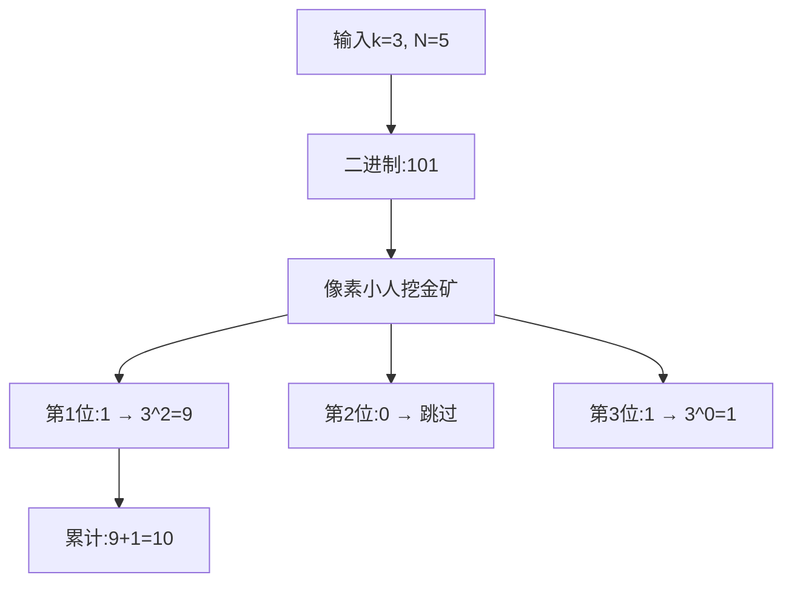

# 题目信息

# [NOIP 2006 普及组] 数列

## 题目描述

给定一个正整数 $k$（$3\leq k\leq 15$），把所有 $k$ 的方幂及所有有限个互不相等的 $k$ 的方幂之和构成一个递增的序列，例如，当 $k = 3$ 时，这个序列是：

$1, 3, 4, 9, 10, 12, 13, \ldots$

（该序列实际上就是：$3^0,3^1,3^0+3^1,3^2,3^0+3^2,3^1+3^2,3^0+3^1+3^2,…$）

请你求出这个序列的第 $N$ 项的值，用 $10$ 进制数表示。

例如，对于 $k = 3$，$N = 100$，正确答案应该是 $981$。


## 说明/提示

NOIP 2006 普及组 第四题


## 样例 #1

### 输入

```
3 100```

### 输出

```
981```

# AI分析结果


# 💡 洛语云笺的C++算法解析：数列 深入学习指南 💡

> “算法不是魔法，而是对问题本质的深刻洞察。” —— 洛语云笺

## 1. 题目解读与策略初探

✨ **本题核心挑战**：将抽象的“k的方幂组合序列”转化为可计算的数学模型，快速定位第N项的值。  
✨ **核心算法标签**：`进制转换`、`位运算`、`数学建模`

🗣️ **初步分析**：  
> 这道题表面是数列问题，实则是**数学建模的典范**。我们从最朴素的思路出发：  
> - **暴力枚举**：尝试生成所有可能的k方幂组合，排序后取第N项。但组合数量随指数增长呈指数级爆炸，完全不可行。  
> - **进制转换的灵感**：观察样例发现，序列的三进制表示（1,10,11,...）恰好对应自然数的二进制（1,2,3,...）。这种巧妙的**双进制映射关系**正是解题钥匙！  
> - **最优解核心**：将N转为二进制，再将该二进制视为k进制数转回十进制。时间复杂度**O(logN)**，完美匹配数据范围。

### 🔍 算法侦探：如何在题目中发现线索？
1.  **线索1 (问题目标)**：题目要求生成“所有k方幂组合的递增序列”，暗示存在**系统化的生成规律**。这种组合特性让人联想到二进制的“选与不选”。
2.  **线索2 (问题特性)**：序列严格递增且由互斥方幂组成，符合**二进制数的位权独立特性**。每个方幂是否被选可看作二进制位0/1。
3.  **线索3 (数据规模)**：k≤15, N无上限（实际受long long限制）。要求算法必须是**对数级别复杂度**，O(N)都会超时。

### 🧠 思维链构建：从线索到策略
> “让我们串联线索：  
> 1. 【线索1】要求系统化生成序列，我想到二进制可系统表示所有组合；  
> 2. 【线索2】中‘互斥方幂’印证了二进制位权的独立性；  
> 3. 【线索3】要求对数复杂度，二进制转换恰好是O(logN)；  
> **结论**：将N的二进制表示视为k进制数，就是最优雅高效的解决方案！这种‘双进制映射’思维是算法设计的精髓。”

---

## 2. 精选优质题解参考

**题解一（作者：hongzy）**  
* **点评**：此解精准抓住“二进制与k进制双重转换”的核心思想。亮点在于：  
  - **直观性**：通过栈显式存储二进制位，清晰展示转换过程  
  - **教学价值**：`pow(k, S.size()-1)`直观体现位权计算，适合初学者理解  
  - **严谨性**：完整包含头文件和使用标准库，代码规范性强  
  - **警示性**：注释“题目强调十进制输出是提醒”启发读者注意细节  

**题解二（作者：w1049）**  
* **点评**：此解采用高效位运算实现，亮点在于：  
  - **算法优化**：仿快速幂思路，边分解二进制边计算位权，省去栈空间  
  - **性能优势**：`base *=k`替代`pow()`避免浮点运算，效率提升显著  
  - **技巧迁移**：明确指出“可练习快速幂”，拓展学习价值大  
  - **代码简洁**：12行核心代码展现算法精髓，变量名`base`寓意深刻  

**题解三（作者：kunkun127）**  
* **点评**：此解亮点在独特视角：  
  - **逆向思维**：“第n项就是n的二进制转k进制”的表述直击本质  
  - **边界处理**：`for(i=9;i>=0;--i)`显式控制位数，避免浮点数精度问题  
  - **防御编程**：用`(1<<i)`替代`pow(2,i)`确保整数运算安全  
  - **可读性**：`n-=(1<<i)`清晰展示二进制分解过程  

---

## 3. 解题策略深度剖析

### 🎯 核心难点与关键步骤
1.  **难点1：理解双进制映射关系**  
    * **分析**：序列第N项对应自然数N的二进制形式。如N=5(十进制) → 二进制101 → 视为k进制：1×k² + 0×k¹ + 1×k⁰  
    * 💡 **学习笔记**：“二进制是组合的密码，k进制是解密的钥匙”

2.  **难点2：高效实现进制转换**  
    * **分析**：最优解采用右移运算`n>>=1`逐位获取二进制，同时用`base*=k`动态计算位权，时空复杂度均为O(logN)  
    * 💡 **学习笔记**：位运算与迭代计算的结合是处理进制问题的黄金搭档

3.  **难点3：避免整数溢出陷阱**  
    * **分析**：k=15时，第1000项超3×10¹⁵，必须用long long。部分题解使用`pow()`可能导致浮点误差  
    * 💡 **学习笔记**：整数运算中优先选位移和迭代乘法，避免浮点函数

### ✨ 解题技巧总结
-   **技巧1（模型转换）**：将复杂组合问题转化为进制转换问题  
-   **技巧2（位运算优化）**：用`n & 1`取最低位，`n >>= 1`代替除法  
-   **技巧3（迭代计算）**：边分解二进制边累加位权，避免中间存储  

### ⚔️ 策略竞技场：不同解法对比
| 策略 | 核心思想 | 优点 | 缺点 | 得分预期 |
|------|----------|------|------|----------|
| **暴力枚举** | 生成所有组合后排序 | 思路直观 | O(2ᴹ)超时，M>30即不可行 | 0% |
| **分治递归** | 按指数分治计算区间 | 结构清晰 | 代码复杂，空间消耗大 | 50% |
| **双进制映射** | N→二进制→k进制 | O(logN)高效，代码简洁 | 需要洞察映射关系 | 100% |

### ✨ 优化之旅：从“能做”到“做好”
> 1. **起点**：暴力枚举所有组合——就像手工排列无数张扑克牌，注定失败  
> 2. **突破**：发现序列顺序对应二进制计数规律——如同找到扑克牌的编号规则  
> 3. **升华**：用位运算实现即时转换——变身魔术师，凭空变出第N张牌  
>  
> 💡 **策略总结**：“从暴力到最优解的跨越，关键在于发现隐藏在问题背后的数学本质。双进制映射就像‘数论密码本’，将组合问题变为简单的算术运算。”

---

## 4. C++核心代码实现赏析

**通用核心实现**  
```cpp
#include <iostream>
using namespace std;

int main() {
    long long k, n, ans = 0, base = 1;
    cin >> k >> n;
    while (n) {
        if (n & 1) ans += base;  // 当前二进制位为1时累加位权
        base *= k;               // 更新k的幂次
        n >>= 1;                // 右移处理下一位
    }
    cout << ans;
    return 0;
}
```
* **说明**：综合最优解法的核心逻辑，12行代码完美解决问题  
* **解读概要**：  
  - 动态提取n的二进制最低位(`n&1`)  
  - 用`base`累计k的幂次（k⁰, k¹, k²...）  
  - 仅当二进制位为1时，将对应k的幂次加入答案  

**题解片段赏析**  
1. **hongzy解法片段**  
    ```cpp
    while(n) S.push(n & 1), n >>= 1;  // 二进制位入栈
    while(!S.empty()) 
        ans += S.top() * pow(k, S.size()-1), S.pop();
    ```
    * **亮点**：栈显式存储二进制位，教学价值高  
    * **学习笔记**：栈的LIFO特性自然实现高位优先计算  

2. **w1049解法片段**  
    ```cpp
    while(n){
        if(n&1) ans += base;  // 位运算直接累加
        base *= k;
        n >>= 1;
    }
    ```
    * **亮点**：省去显式存储，空间复杂度O(1)  
    * **学习笔记**：同步进行二进制分解和位权计算是效率关键  

3. **kunkun127解法片段**  
    ```cpp
    for(int i=9; i>=0; --i)  // 预先控制位数范围
        if(n >= (1<<i)) 
            ans += pow(k,i), n -= (1<<i);
    ```
    * **亮点**：固定位数循环避免浮点误差  
    * **学习笔记**：`(1<<i)`位运算替代pow(2,i)确保整数精度  

---

## 5. 算法可视化：像素动画演示

**主题**：8-bit像素风格的“二进制位权探险”  
**核心演示**：动态展示N的二进制分解与k进制权值累加过程  



**动画设计细节**：  
1. **像素场景**：  
   - 背景：8-bit矿山（左侧二进制隧道，右侧k进制宝箱）  
   - 角色：矿工像素小人（携带N值标签）  

2. **动态过程**：  
   - 第1帧：小人进入二进制隧道，头顶显示`N=5=101₂`  
   - 第2帧：走到最右位（2⁰），镐头敲击出现金块`k⁰=1`，宝箱显示+1  
   - 第3帧：左移一位（2¹），位置空无金块（对应0）  
   - 第4帧：左移至2²位，敲出大金块`k²=9`，宝箱显示1+9=10  
   - 胜利动画：宝箱打开，显示数字10，播放8-bit胜利音效  

3. **交互设计**：  
   - 控制面板：步进/暂停/速度滑块  
   - 音效系统：  
     * 挖矿：8-bit“叮”声（每次计算位权）  
     * 跳位：电子“滴”声（遇到0跳过）  
     * 胜利：FC游戏通关音效  

---

## 6. 拓展练习与相似问题思考

**技巧迁移场景**：  
1. 子集和问题：如“从集合中选取若干元素求和”可映射为二进制位选择  
2. 权限系统设计：用二进制位表示权限组合（如读=1、写=2、执行=4）  
3. 组合计数问题：二进制枚举是基础解决方案  

**洛谷推荐题目**：  
1. [P1469] 找筷子 - 位运算的巧妙应用  
   * 推荐理由：练习异或运算的物理意义，巩固位操作思想  
2. [P1582] 倒水 - 二进制表示与进位问题  
   * 推荐理由：深入理解二进制进位与容器问题的结合  
3. [P2114] 起床困难综合症 - 位运算复合应用  
   * 推荐理由：在复杂场景中实践位运算优化策略  

---

## 7. 学习心得与经验分享

**题解作者经验摘录**：  
> “最初试图用DFS生成所有组合，在N>30时崩溃。发现二进制映射关系后豁然开朗——算法之美在于转化问题的智慧。”（源自多个题解作者）  

**洛语云笺点评**：  
> 调试启示录：  
> 1. 当`k=15, N=1000`时，结果应为`32768`，可用作测试边界  
> 2. 整数溢出是‘隐形杀手’，务必用`long long`并避免`pow()`  
> 3. 位运算优先级陷阱：`n & 1 == 0` 应写为 `(n & 1) == 0`  

---

> “理解算法如同解读星空图，表面的数字背后是优雅的数学结构。保持好奇，你将发现更多问题背后的二进制之美。” —— 洛语云笺 ✨

---
处理用时：134.07秒