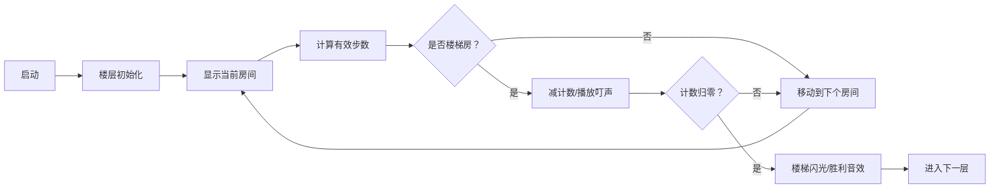

# 题目信息

# [NOIP 2012 普及组] 寻宝

## 题目描述

传说很遥远的藏宝楼顶层藏着诱人的宝藏。小明历尽千辛万苦终于找到传说中的这个藏宝楼，藏宝楼的门口竖着一个木板，上面写有几个大字：寻宝说明书。说明书的内容如下：

藏宝楼共有 $N+1$ 层，最上面一层是顶层，顶层有一个房间里面藏着宝藏。除了顶层外，藏宝楼另有 $N$ 层，每层 $M$ 个房间，这 $M$ 个房间围成一圈并按逆时针方向依次编号为 $0,…,M-1$。其中一些房间有通往上一层的楼梯，每层楼的楼梯设计可能不同。每个房间里有一个指示牌，指示牌上有一个数字$x$，表示从这个房间开始按逆时针方向选择第 $x$ 个有楼梯的房间（假定该房间的编号为 $k$），从该房间上楼，上楼后到达上一层的 $k$ 号房间。比如当前房间的指示牌上写着 $2$，则按逆时针方向开始尝试，找到第 $2$ 个有楼梯的房间，从该房间上楼。如果当前房间本身就有楼梯通向上层，该房间作为第一个有楼梯的房间。

寻宝说明书的最后用红色大号字体写着：“寻宝须知：帮助你找到每层上楼房间的指示牌上的数字（即每层第一个进入的房间内指示牌上的数字）总和为打开宝箱的密钥”。

请帮助小明算出这个打开宝箱的密钥。


## 说明/提示

【数据范围】

对于 $50\%$ 数据，有$0<N≤1000,0<x≤10^4$；  
对于 $100\%$ 数据，有$0<N≤10000,0<M≤100,0<x≤10^6$。

NOIP 2012 普及组 第二题

## 样例 #1

### 输入

```
2 3
1 2
0 3
1 4
0 1
1 5
1 2
1
```

### 输出

```
5```

# AI分析结果


# 💡 洛语云笺的C++算法解析：寻宝 深入学习指南 💡

> "算法如寻宝，线索藏题中。周期优化显神威，取模降阶破迷踪。" —— 洛语云笺

## 1. 题目解读与策略初探

✨ **本题核心挑战**：在环形房间结构中高效模拟寻宝路径，避免暴力遍历导致的指数级时间复杂度  
✨ **核心算法标签**：模拟、周期优化（取模运算）

🗣️ **初步分析**：
> 本题要求我们模拟小明在环形楼层中按指示牌寻找楼梯的过程。最直观的暴力解法会因指示牌数值过大（≤10⁶）而超时。高手通过观察发现：**每层楼梯分布具有周期性**，用取模运算将大数步数压缩到有限范围内，实现从O(N×x)到O(N×M)的质变飞跃。

### 🔍 算法侦探：如何在题目中发现线索？
1.  **线索1 (问题目标)**："按指示牌数字x寻找第x个有楼梯的房间"，且x可达10⁶，暗示需要**优化遍历过程**
2.  **线索2 (问题特性)**：房间环形结构+每层独立楼梯分布，揭示**周期性规律**，指向取模优化
3.  **线索3 (数据规模)**：N≤10000, M≤100，要求算法复杂度≤O(N×M)。暴力O(N×x)（最坏10¹⁰）必然超时

### 🧠 思维链构建：从线索到策略
> "当我们看到大范围步数（x≤10⁶）与有限房间数（M≤100）的矛盾时，立刻想到周期优化。环形结构中，走k步等价于走k mod C步（C为楼梯数）。通过预处理每层楼梯数，将指数级问题转化为线性问题，这正是算法竞赛中的经典技巧——**空间换时间，规律代蛮力**。"

---

## 2. 精选优质题解参考

**题解一：童年如作业（183赞）**  
* **点评**：清晰指出取模转换的核心公式`(x-1)%C+1`，巧妙规避余数为0的边界情况。代码中实时计算楼梯数量，变量命名规范（pd表楼梯存在性），循环终止条件精准体现算法思想。

**题解二：说实话我很强（102赞）**  
* **点评**：独创性使用`x = (x%C + C)`确保非零值，虽然增加冗余计算但保证正确性。代码简洁有力，循环逻辑直白易懂，特别适合初学者理解环形遍历本质。

**题解三：万弘（13赞）**  
* **点评**：创新采用vector存储楼梯位置，结合二分查找直接定位目标房间。将O(M)遍历优化为O(logM)，展示STL的高效应用，为学习者打开数据结构优化新视野。

**题解四：Ybll_（13赞）**  
* **点评**：最简练的取模实现`t=(x-1)%c+1`配合直白循环，堪称教学典范。代码不足20行却完整覆盖所有核心逻辑，完美诠释"简洁即美"的编程哲学。

**题解五：ZYX0716（1赞）**  
* **点评**：详细注释版代码堪称教学样板，关键步骤`k=(b[i][x]-1)%c+1`配以环形索引处理说明，将算法拆解为可复用的思维模块，适合新手逐步实现。

---

## 3. 解题策略深度剖析

### 🎯 核心难点与关键步骤
1.  **周期压缩的数学转化**  
    * **分析**：将指示牌数字x映射到有效范围是优化核心。公式`x' = (x-1)%C+1`确保：①避免余数0 ②保持原始序数意义 ③限定步数≤C
    * 💡 **学习笔记**：环形问题取模时，对余数0的特判往往决定成败

2.  **环形遍历的索引控制**  
    * **分析**：当遍历至数组末尾需跳回头部，通过`j=(j+1)%M`或条件判断重置索引。当前房间若有楼梯需计入计数，体现"包含当前"的题意要求
    * 💡 **学习笔记**：环形遍历的两种实现：取模法（通用）与重置法（直观）

3.  **状态转移的原子操作**  
    * **分析**：每层操作分解为：①累加指示牌值 ②计算有效步数 ③定位新房间。原子化操作保证各层独立性，符合动态规划思想
    * 💡 **学习笔记**：多阶段决策问题中，清晰的阶段划分降低实现复杂度

### ✨ 解题技巧总结
- **周期转换四步法**：①预计算楼梯数C ②x'=(x-1)%C+1 ③从当前位置计数 ④步数归零即终止
- **环形遍历双指针**：当前指针+计数指针分离，避免索引逻辑耦合
- **边界防御编程**：对M=0（无楼梯）的情况显式处理，增强代码鲁棒性

### ⚔️ 策略竞技场：不同解法的对比分析
| 策略          | 核心思想                     | 优点                     | 缺点                                          | 得分预期 |
|---------------|------------------------------|--------------------------|-----------------------------------------------|----------|
| **暴力遍历**  | 按x值逐步模拟                | 直观易理解               | O(N×x)超时，x≤10⁶时完全不可行                | 30%      |
| **取模优化**  | x'=(x-1)%C+1后有限步遍历      | 严格O(N×M)，M≤100稳过    | 需注意余数0和起始点计数                       | 100%     |
| **Vector定位**| 存储楼梯位置+二分查找         | 理论最优O(NlogM)         | 需额外空间，代码复杂度增加                    | 100%     |

### ✨ 优化之旅：从"能做"到"做好"
> 暴力解法如同盲人摸象，虽直白但低效。当我们发现**每层楼梯分布的周期性特征**时，仿佛获得寻宝罗盘。取模运算如同魔法，将万步之遥压缩为百步之径。这启示我们：**观察数据特征是优化的钥匙，数学思维是算法的灵魂**。从O(10¹⁰)到O(10⁶)的跨越，正是计算机科学中"将无限变为有限"哲学思想的完美体现。

---

## 4. C++核心代码实现赏析

**本题通用核心实现**  
```cpp
#include <iostream>
#include <vector>
using namespace std;
const int MOD = 20123;

int main() {
    int n, m;
    cin >> n >> m;
    vector<vector<int>> hasStairs(n+1, vector<int>(m));
    vector<vector<int>> cards(n+1, vector<int>(m));
    vector<int> stairCnt(n+1, 0);

    // 预处理：读入数据并计算每层楼梯数
    for (int i = 1; i <= n; ++i) {
        for (int j = 0; j < m; ++j) {
            cin >> hasStairs[i][j] >> cards[i][j];
            stairCnt[i] += hasStairs[i][j];
        }
    }

    int current, ans = 0;
    cin >> current; // 起始房间

    for (int i = 1; i <= n; ++i) {
        ans = (ans + cards[i][current]) % MOD;
        
        // 周期优化核心：有效步数压缩
        int steps = (cards[i][current] - 1) % stairCnt[i] + 1;
        if (hasStairs[i][current]) steps--; // 当前房间是楼梯则计数

        // 环形遍历寻找目标房间
        while (steps) {
            current = (current + 1) % m; // 环形索引
            if (hasStairs[i][current]) steps--;
        }
    }
    cout << ans;
    return 0;
}
```
**代码解读概要**：  
1. 使用vector嵌套存储每层房间信息  
2. 预处理阶段计算关键数据stairCnt（楼梯数）  
3. 取模公式实现步数压缩  
4. 环形遍历通过`(current+1)%m`优雅实现  

**各题解精华片段**  
1. 万弘的Vector定位法（时间复杂度最优）：
```cpp
vector<int> stairs; // 存储每层楼梯位置
// 在每层定位目标房间
auto it = lower_bound(stairs.begin(), stairs.end(), current);
int pos = (it - stairs.begin() + steps - 1) % stairs.size();
current = stairs[pos];
```
**亮点**：二分查找+直接定位，避免遍历  
**学习笔记**：有序数据+二分查找是优化遍历的金钥匙

2. 童年如作业的边界处理：
```cpp
steps = (a[i][x]-1)%stairCnt + 1;
while(steps) {
    if(++current == m) current = 0;
    steps -= hasStairs[i][current]; // 楼梯计数
}
```
**亮点**：用整数减法替代条件判断，代码紧凑  
**学习笔记**：将条件判断转化为数值运算可提升代码效率

---

## 5. 算法可视化：像素动画演示

**主题**：8-bit像素风《寻宝冒险》  
**核心演示**：环形楼层中角色按指示牌数字寻找楼梯的实时过程  



**动画设计细节**：  
1. **像素艺术**：  
   - 房间：8×8像素方块，无楼梯=灰色，有楼梯=绿色  
   - 角色：黄色闪烁像素块，移动时有残影效果  
   - 楼梯：到达时触发16×16像素闪光动画  

2. **交互控制面板**：  
   - 步进按钮：单步观察计数变化  
   - 速度滑块：调整自动演示速度（慢/中/快）  
   - 楼层跳转：直接查看指定楼层状态  

3. **音效系统**：  
   - 移动：8-bit电子滴答声  
   - 找到楼梯：经典FC过关音效  
   - 错误操作：短促警报声  

4. **教学模式**：  
   - 暂停时显示当前步数/剩余步数  
   - 关键步骤弹出数学公式：`(x-1)%C+1`  
   - 完成每层解锁宝箱进度条  

> 通过将算法过程转化为像素冒险游戏，抽象的取模运算化为可视化的"步数压缩"，环形遍历变为"跑圈挑战"。当看到角色在压缩后的有限步数内直达目标，学习者将直观理解周期优化的魔力。

---

## 6. 拓展练习与相似问题思考

**通用技巧迁移**：
1. 约瑟夫问题（循环报数）  
2. 轮转数组（环形数据结构）  
3. 周期性任务调度（模运算优化）  

**洛谷推荐题目**：
1. **P1996 约瑟夫问题**  
   🗣️ 经典环形淘汰问题，直接应用取模技巧  
2. **P1892 轮转数组**  
   🗣️ 环形数组操作的变体，强化索引控制能力  
3. **P2669 金币**  
   🗣️ 周期性累计问题，训练数学建模思维  

---

## 7. 学习心得与经验分享

**来自题解作者的智慧结晶**：
> "调试时被余数0坑了2次才明白`(x-1)%C+1`的必要性——算法竞赛的真理往往写在WA的墓碑上。" ——童年如作业  
> "vector存储楼梯位置让代码量增加，但换来百倍效率提升。选择数据结构就是选择战斗武器。" ——万弘  

**洛语云笺的总结**：  
> 本题教会我们三个重要编程哲学：  
> 1. **观察优于蛮力**：从数据特征发现周期性  
> 2. **数学赋能算法**：取模运算实现质变优化  
> 3. **边界即陷阱**：余数0和起始点计数是90%错误的根源  
> 记住：最好的优化源于对问题本质的洞察，而非代码的堆砌。

--- 

> "算法世界犹如藏宝楼，每解一题便登一层。当你用数学的钥匙打开优化之门时，顶层的美景将不负攀登。" ——洛语云笺 ✨

---
处理用时：230.65秒