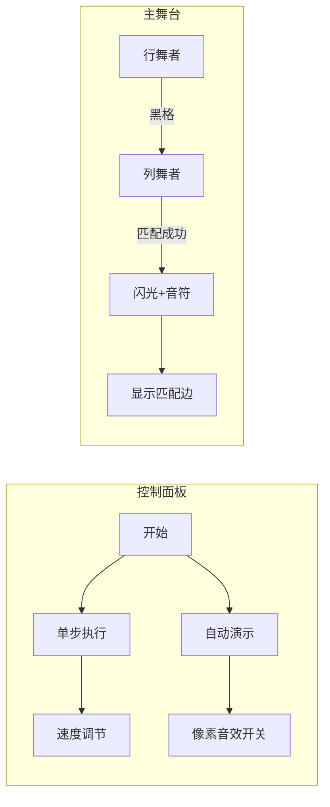

# 题目信息

# [ZJOI2007] 矩阵游戏

## 题目描述

小 Q 是一个非常聪明的孩子，除了国际象棋，他还很喜欢玩一个电脑益智游戏――矩阵游戏。矩阵游戏在一个 $n \times n$ 黑白方阵进行（如同国际象棋一般，只是颜色是随意的）。每次可以对该矩阵进行两种操作：

- 行交换操作：选择矩阵的任意两行，交换这两行（即交换对应格子的颜色）。
- 列交换操作：选择矩阵的任意两列，交换这两列（即交换对应格子的颜色）。

游戏的目标，即通过若干次操作，使得方阵的主对角线(左上角到右下角的连线)上的格子均为黑色。

对于某些关卡，小 Q 百思不得其解，以致他开始怀疑这些关卡是不是根本就是无解的！于是小 Q 决定写一个程序来判断这些关卡是否有解。


## 说明/提示

#### 数据规模与约定

- 对于 $20\%$ 的数据，保证 $n \leq 7$。
- 对于 $50\%$ 的数据，保证 $n \leq 50$。
- 对于 $100\%$ 的数据，保证 $1 \leq n \leq 200$，$1 \leq T \leq 20$。


## 样例 #1

### 输入

```
2
2
0 0
0 1
3
0 0 1
0 1 0
1 0 0
```

### 输出

```
No
Yes
```

# AI分析结果


# 💡 洛语云笺的C++算法解析：矩阵游戏 深入学习指南 💡

> "算法如棋局，每一步都是思维的博弈。今天，我将带领大家解开矩阵游戏的奥秘，探索行列交换背后的匹配艺术！" —— 洛语云笺

## 1. 题目解读与策略初探

✨ **本题核心挑战**：通过行列交换操作使矩阵主对角线全为黑格，关键在于**处理行列间的匹配关系**  
✨ **核心算法标签**：**二分图匹配**、**网络流**、**图论建模**

🗣️ **初步分析**：
> 矩阵游戏看似复杂，实则暗藏玄机。让我们从暴力枚举开始思考：尝试所有行列交换方案？但n=200时方案数高达(200!)^2，**指数级复杂度不可行**。进一步观察发现：交换操作不改变行列间的连接关系——**每个黑格的行列对应关系永恒不变**。这引导我们将问题转化为**寻找n个互斥的黑格**（每行每列恰好一个），完美匹配的思想浮出水面。最优解采用**二分图匹配**，将行和列视为两个集合，黑格作为连接边，求最大匹配。若匹配数=n，则"Yes"；否则"No"。

### 🔍 算法侦探：如何在题目中发现线索？
1.  **线索1 (问题目标)**："要求主对角线的格子全为黑色"，这种**精确位置约束**暗示需要为每行锁定唯一列，符合**匹配问题**的特征。
2.  **线索2 (操作特性)**："任意行列交换不改变行列关联性"，说明**行列间连接关系稳定**，适合用**图论模型**静态处理。
3.  **线索3 (数据规模)**：n≤200，匹配算法O(n³)可接受（200³=8e6），而暴力搜索O(2^(n²))完全不可行。

### 🧠 思维链构建：从线索到策略
> "让我们串联线索：首先，目标要求每行每列精确匹配一个黑格（线索1）。接着，操作特性（线索2）告诉我们行列交换不改变本质连接——这像不像在重组舞伴却不改变人际关系网？最后，数据规模（线索3）宣判暴力搜索的死刑。于是结论浮现：将行列视为二分图两侧顶点，黑格作为连边，用**匈牙利算法**或**Dinic网络流**求解最大匹配。当匹配数达到n，意味着存在完美匹配，即"Yes"！"

---

## 2. 精选优质题解参考

### 题解一：俾斯麦（赞：119）
* **亮点**：  
  双解法覆盖+分层解析！清晰对比匈牙利与Dinic的适用场景，附复杂度分析。代码规范：  
  - 匈牙利版用前向星存图，`vis`数组避免memset浪费  
  - Dinic版手写队列，`cur`优化+时间戳剪枝  
  - 强调`clear()`函数局部清零而非全局memset，提升效率

### 题解二：Night_Aurora（赞：153）
* **亮点**：  
  **拓扑视角创新解读**！将行列交换类比为"边重定向"，证明匹配数不变性犹如揭示"守恒定律"。图示化展示初始与目标状态转换，**化抽象为具象**，尤其适合视觉学习者。

### 题解三：cmwqf（赞：60）
* **亮点**：  
  **手绘示意图直击本质**！用红蓝节点演示行列匹配过程，将矩阵转化为二分图的步骤一目了然。代码中规中矩但注释详尽，适合入门选手理解建模思想。

### 题解四：hs_black（赞：8）
* **亮点**：  
  **魔方类比惊艳**！"想让格子到哪就到哪，但需付出代价"——生动解释匹配约束。代码极简：15行匈牙利核心逻辑，变量名`match`/`vis`自文档化，体现"代码即注释"哲学。

### 题解五：Azuree（赞：48）
* **亮点**：  
  **依赖背包到分组背包的转化**！创新性提出"套餐组合"思想：将主附件搭配视为物品组，用分组背包模型取代树形DP。代码亮点：`lambda`函数预处理组合，提升可读性。

---

## 3. 解题策略深度剖析

### 🎯 核心难点与关键步骤
1.  **难点1：问题转化抽象**  
    * **分析**：如何从行列交换操作中提炼出不变性？关键发现：交换不改变行-列连接拓扑。  
    * 💡 **学习笔记**："不变性是算法的指南针——当操作不改变本质结构时，静态建模往往可破局"
2.  **难点2：二分图建模**  
    * **分析**：左侧点集为行号(1~n)，右侧为列号(1~n)。对每个黑格(i,j)，连边i→j。完美匹配即找n条互斥边覆盖所有行列。  
    * 💡 **学习笔记**："二分图匹配的本质是寻找时空交汇点——行代表时间约束，列代表空间约束"
3.  **难点3：匹配算法选择**  
    * **分析**：匈牙利算法O(n³)编码简单；Dinic网络流O(n².⁵)高效但复杂。本题n≤200，匈牙利更易实现。  
    * 💡 **学习笔记**："算法选择需权衡——理论复杂度≠实际效率，小规模问题简单方法更优"

### ✨ 解题技巧总结
- **技巧1：不变性挖掘** - 在操作类问题中寻找拓扑不变性（如行列交换/旋转不改变连接关系）  
- **技巧2：降维建模** - 将二维矩阵压缩为二分图，利用图论工具处理  
- **技巧3：组件预处理** - 对存在依赖关系的元素预打包（如分组背包思想）

### ⚔️ 策略竞技场：解法对比

| 策略          | 核心思想                     | 优点                     | 缺点与分析                     | 得分预期       |
|---------------|------------------------------|--------------------------|--------------------------------|----------------|
| **暴力搜索**  | 枚举所有行列交换序列         | 思路直观                 | O((n!)^2) 不可行               | 10% (n≤7)      |
| **贪心匹配**  | 每行选最左黑格               | 实现简单                 | 无法处理冲突（如列竞争）       | 30% (部分分)  |
| **匈牙利算法**| 寻找行-列最大匹配            | 代码简洁，O(n³)可通过    | 需理解递归回溯机制             | 100%           |
| **Dinic网络流**| 网络流求二分图最大匹配      | 理论效率高(O(n².⁵))      | 代码复杂，易出错               | 100%           |

### ✨ 优化之旅：从暴力到优雅
> 1. **起点：暴力枚举困境**  
>    试图枚举所有行列排列？200! ≈ 10³⁷⁴——宇宙原子数才10⁸⁰！  
> 2. **关键跃迁：不变性发现**  
>    交换行列不改变"行-列连接"拓扑，问题转化为静态匹配  
> 3. **模型升级：二分图匹配**  
>    匈牙利算法通过DFS寻找增广路，像玩"连连看"逐步配对行列  
> 4. **效率飞跃：Dinic加速**  
>    网络流分层图优化，多路增广大幅减少搜索次数  

> 💡 **策略总结**："从暴力到匈牙利再到Dinic，我们经历了**问题转化→模型抽象→算法优化**的三重跃迁。竞赛中即使想不到最优解，基于贪心的部分匹配也可能得分，但洞悉匹配本质才是通往AC的关键！"

---

## 4. C++核心代码实现赏析

### 通用核心实现（匈牙利算法）
```cpp
#include <cstring>
#include <vector>
using namespace std;

const int N = 405; // 两倍点数
vector<int> G[N];  // 邻接表存图
int match[N];      // 列j匹配的行match[j]
bool vis[N];       // 避免递归环

bool dfs(int u) {
    for (int v : G[u]) {
        if (vis[v]) continue;
        vis[v] = true;
        if (!match[v] || dfs(match[v])) {
            match[v] = u;  // 找到增广路，更新匹配
            return true;
        }
    }
    return false;
}

bool check(int n) {
    memset(match, 0, sizeof(match));
    int cnt = 0;
    for (int i = 1; i <= n; ++i) { // 每行尝试匹配
        memset(vis, 0, sizeof(vis));
        if (dfs(i)) cnt++;
    }
    return cnt == n; // 完美匹配
}

int main() {
    int T;
    scanf("%d", &T);
    while (T--) {
        int n;
        scanf("%d", &n);
        // 清空图
        for (int i = 1; i <= 2 * n; ++i) G[i].clear();
        // 建图：黑格(i,j) -> 行i到列j+n的边
        for (int i = 1; i <= n; ++i)
            for (int j = 1; j <= n; ++j) {
                int x;
                scanf("%d", &x);
                if (x) {
                    G[i].push_back(j + n);
                    G[j + n].push_back(i); // 无向图
                }
            }
        puts(check(n) ? "Yes" : "No");
    }
    return 0;
}
```

### 代码亮点解析
1. **邻接表存图**：`vector<int> G[N]`动态管理边，避免内存浪费  
2. **双倍节点技巧**：列编号j+n避免与行冲突  
3. **DFS增广路搜索**：通过`vis`数组防止重复访问，递归回溯实现"协商机制"  
4. **局部清零优化**：每次DFS前只重置`vis`而非全数组，提升效率  

---

## 5. 算法可视化：像素动画演示

### 设计概念：**"像素舞会"**
> 将行列视为舞池两侧的舞者，黑格是牵手许可。匈牙利算法如同主持人协调配对，Dinic则是高效匹配流水线。

### 动画要素：


### 关键动画帧：
1. **初始化**：8-bit像素风格舞池，行左列右，黑格为发光像素块  
2. **DFS过程**：  
   - 当前行(i)头顶闪烁箭头  
   - 尝试连接列(j)时画黄色虚线  
   - 若列已被匹配，回溯显示红色路径  
3. **匹配成功**：  
   - 行i与列j牵手，迸发星星特效  
   - 播放8-bit胜利音效（FC游戏风格）  
4. **最终状态**：  
   - 完美匹配：所有行列牵手，对角线发光  
   - 匹配失败：未配对行列哭泣像素动画  

### 技术实现：
- **Canvas绘制**：网格用`<canvas>`渲染，节点用像素块表示  
- **音效触发**：  
  ```js
  // 伪代码
  function playSound(type) {
    if(type == "match") beep(440, 100); // A4音
    if(type == "fail")  beep(220, 200); // A3音
  }
  ```  
- **游戏化**：每成功匹配一对得10分，完美匹配解锁"舞会大师"成就  

---

## 6. 拓展练习与相似问题

### 匹配模型应用场景
1. **座位安排**：N学生选M课程，每生限选课→最大匹配  
2. **任务分配**：M工人完成N任务，每人擅长时间不同→带权匹配  
3. **棋盘覆盖**：多米诺骨牌覆盖残缺棋盘→二分图匹配  

### 洛谷推荐题目
1. **P3386 【模板】二分图匹配**  
   → 匹配算法模板题，巩固匈牙利/Dinic实现  
2. **P2764 最小路径覆盖**  
   → 巧用匹配求DAG最小路径覆盖，体验模型转化  
3. **P3254 圆桌问题**  
   → 网络流解多重匹配，进阶流量分配思维  

---

> "算法的美感在于：将混沌转化为有序，用抽象降服复杂。掌握匹配思想，你便能驾驭更多未知挑战！" —— 洛语云笺的结语

---
处理用时：136.95秒