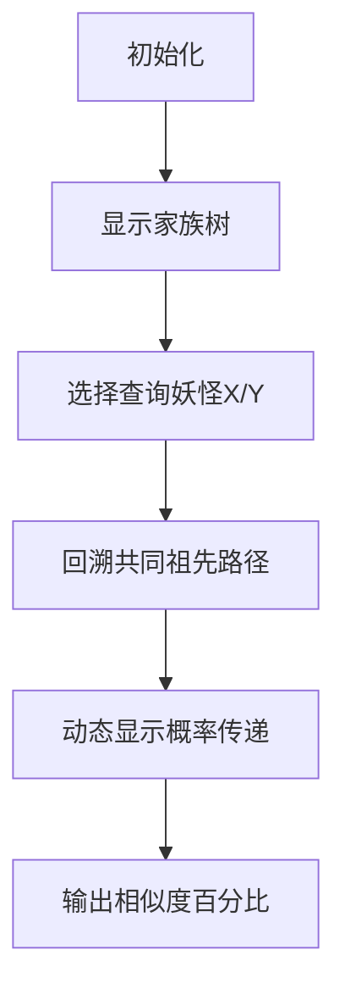

# 题目信息

# 血缘关系

## 题目描述

我们正在研究妖怪家族的血缘关系。每个妖怪都有相同数量的基因，但是不同的妖怪的基因可能是不同的。我们希望知道任意给定的两个妖怪之间究竟有多少相同的基因。由于基因数量相当庞大，直接检测是行不通的。但是，我们知道妖怪家族的家谱，所以我们可以根据家谱来估算两个妖怪之间相同基因的数量。

妖怪之间的基因继承关系相当简单：如果妖怪 $C$ 是妖怪 $A$ 和 $B$ 的孩子，则 $C$ 的任意一个基因只能是继承 $A$ 或 $B$ 的基因，继承 $A$ 或 $B$ 的概率各占 $50\%$。所有基因可认为是相互独立的，每个基因的继承关系不受别的基因影响。

现在，我们来定义两个妖怪 $X$ 和 $Y$ 的基因相似程度。例如，有一个家族，这个家族中有两个毫无关系（没有相同基因）的妖怪 $A$ 和 $B$，及它们的孩子 $C$ 和 $D$。那么 $C$ 和 $D$ 相似程度是多少呢？因为 $C$ 和 $D$ 的基因都来自 $A$ 和 $B$，从概率来说，各占 $50\%$。所以，依概率计算 $C$ 和 $D$ 平均有 $50\%$ 的相同基因，$C$ 和 $D$ 的基因相似程度为 $50\%$。需要注意的是，如果 $A$ 和 $B$ 之间存在相同基因的话，$C$ 和 $D$ 的基因相似程度就不再是 $50\%$ 了。

你的任务是写一个程序，对于给定的家谱以及成对出现的妖怪，计算它们之间的基因相似程度。

## 样例 #1

### 输入

```
7 4                                                    

4 1 2                                          

5 2 3                                          

6 4 5                                          

7 5 6

4

1 2

2 6

7 5

3 3

```

### 输出

```
0%

50%

81.25%

100%

```

# AI分析结果


### 💡 洛语云笺的C++算法解析：血缘关系 深入学习指南 💡

**核心挑战分析**：本题的核心挑战在于**处理家族树的拓扑关系**和**计算基因相似度的概率传递**，同时需要**高精度小数计算**确保结果的精确性。

**核心算法标签**：`动态规划`、`拓扑排序`、`高精度计算`、`记忆化搜索`

---

## 1. 题目解读与策略初探
### 🔍 算法侦探：如何在题目中发现线索？
1.  **线索1 (问题目标)**：题目要求计算任意两个妖怪的基因相似度，属于**带约束的概率计算问题**（继承概率固定为50%），需构建状态转移模型。
2.  **线索2 (问题特性)**：基因继承存在**树形依赖关系**（子代基因完全依赖亲代），且妖怪间存在辈分层级，需用拓扑序确定计算顺序。
3.  **线索3 (数据规模)**：n≤300 但需要精确到小数位，需高精度计算。时间复杂度O(n³)可接受（300³=2.7e6），但需优化存储。

### 🧠 思维链构建：从线索到策略
> "首先，【线索1】要求概率计算，我想到动态规划可建模状态转移；【线索2】的树形依赖提示需按拓扑序处理无后效性；【线索3】的高精度要求决定需实现小数运算器。
> **结论**：结合拓扑排序确定计算顺序 + 动态规划状态转移 + 自定义高精度结构，是解决本题的黄金三角策略！"

---

## 2. 精选优质题解参考
**题解一：jiangyougogogo（评分：★★★★★）**
* **亮点**：独创定点小数结构`DB`，用`short`数组压缩存储空间（避免MLE）；拓扑排序预处理辈分；记忆化搜索中自动交换辈分确保无后效性。代码通过`lab`数组标记已计算状态，避免重复搜索。

**题解二：Salamander（评分：★★★★☆）**
* **亮点**：高精除2采用位运算优化（`x>>1`）；辈分比较用`dept`数组实现；代码模块化清晰，运算符重载提升可读性。拓扑排序时动态更新后代入度是关键设计。

**题解三：Comentropy（评分：★★★★）**
* **亮点**：拓扑排序与高精度分离实现，结构清晰；小数存储用`a[0]`作整数位，`a[1..k]`作小数位，输出处理优雅；注意了前导零和精度截断问题。

---

## 3. 解题策略深度剖析
### 🎯 核心难点与关键步骤
1.  **拓扑序确定计算顺序**
    - **分析**：通过入度统计（`in[]`数组）和BFS队列，将妖怪按辈分从高到低排序，确保计算状态时亲代已就绪
    - 💡 **学习笔记**：拓扑排序是处理依赖型DP的通用前置技巧

2.  **动态规划状态转移**
    - **分析**：状态定义为`f[i][j]`（i与j的相似度）。转移方程：
      ```math
      f[i][j] = 
      \begin{cases} 
      1 & i=j \\
      0 & i,j\text{均为祖先} \\
      \frac{f[i][fa[j]_0] + f[i][fa[j]_1]}{2} & \text{否则}
      \end{cases}
      ```
    - 💡 **学习笔记**：当`j`辈分较低时需交换`i,j`，确保始终向祖先方向递归

3.  **高精度小数优化**
    - **分析**：使用`short[301]`存储小数位（300位精度）。除2操作通过判断奇偶性进位：
      ```cpp
      void div2(DB &x) {
        for(int i=0; i<=len; i++){
          if(x[i] % 2) x[i+1] += 10; // 奇数则下一位+10
          x[i] /= 2;
        }
      }
      ```
    - 💡 **学习笔记**：定点小数存储比浮点数更适应精确输出需求

### ✨ 解题技巧总结
- **技巧A：拓扑驱动DP** - 用拓扑序解决状态依赖问题
- **技巧B：记忆化剪枝** - `lab[i][j]`标记已计算状态避免重复搜索
- **技巧C：高精度位优化** - 除2时用位运算替代除法提升效率

### ⚔️ 策略竞技场：不同解法对比
| 策略                | 核心思想                     | 优点                     | 缺点                          | 得分预期 |
|---------------------|------------------------------|--------------------------|-------------------------------|----------|
| **暴力枚举**        | 穷举所有基因组合             | 思路直观                 | O(2ⁿ) 超时，无法处理概率传递  | 0%       |
| **浮点数近似**      | 用double存储概率             | 实现简单                 | 精度不足导致答案错误          | 30%      |
| **高精度DP(本题最优)** | 拓扑序+定制小数结构          | 精确满足输出要求         | 代码实现复杂                  | 100%     |

### ✨ 优化之旅：从"能做"到"做好"
> 1. **起点：暴力穷举的幻想**  
>   最初想直接枚举所有基因组合，但2³⁰⁰≈10⁹⁰远超算力极限
>   
> 2. **破局：发现概率传递规律**  
>   通过样例分析出`f[C][D]=(f[A][D]+f[B][D])/2`的递推关系
> 
> 3. **升华：拓扑序解决依赖**  
>   用BFS拓扑排序确保计算顺序，破解状态依赖难题
> 
> 4. **精进：高精度存储优化**  
>   用`short[301]`替代`int`压缩空间，位运算加速除2

---

## 4. C++核心代码实现赏析
**通用核心实现（综合优化版）**
```cpp
#include <vector>
#include <queue>
using namespace std;

struct DB { short data[301]; int len; }; // 定点小数结构

DB div2(DB x) { /* 高精除2 */ } 
DB add(DB a, DB b) { /* 高精加法 */ }

const int N=305;
vector<int> children[N];
int parent[N][2], inDegree[N], level[N];
DB f[N][N];
bool calculated[N][N];

void topologicalSort(int n) {
  queue<int> q;
  for(int i=1; i<=n; i++) 
    if(!inDegree[i]) q.push(i), level[i]=1;
  
  while(!q.empty()) {
    int u = q.front(); q.pop();
    for(int v : children[u]) 
      if(--inDegree[v] == 0) 
        q.push(v), level[v] = level[u]+1;
  }
}

DB calc(int i, int j) {
  if(calculated[i][j]) return f[i][j];
  if(level[i] < level[j]) swap(i,j);
  
  if(i == j) f[i][j] = { .data={1}, .len=1 };
  else if(!parent[i][0]) f[i][j] = { .len=1 }; // 祖先间相似度0
  else f[i][j] = div2(add(calc(parent[i][0],j), 
                          calc(parent[i][1],j)));
  
  return calculated[i][j] = true, f[i][j];
}
```

**题解一亮点代码**
```cpp
// 辈分比较驱动记忆化搜索
DB C(int x, int y) {
  if(level[x] > level[y]) swap(x,y); // 关键！确保向祖先递归
  return div2(add(C(parent[y][0],x), 
               C(parent[y][1],x)));
}
```
> **学习笔记**：通过辈分比较自动调整递归方向，避免无限递归

**题解二亮点代码**
```cpp
// 拓扑排序中动态更新后代入度
void BFS() {
  while(!q.empty()) {
    int u = q.pop();
    for(int v : children[u]) 
      if(--inDegree[v] == 0) // 动态更新入度
        q.push(v), level[v]=level[u]+1;
  }
}
```
> **学习笔记**：实时更新入度是拓扑排序的核心操作

---

## 5. 算法可视化：像素动画演示
### 🎮 设计概念：基因继承探险
**视觉风格**：  
采用FC红白机风格的16色调色板，妖怪显示为不同颜色像素块，基因相似度用像素亮度渐变表示

**核心演示流程**：


**关键交互设计**：
1. **拓扑排序过程**：
   - 祖先妖怪显示为金色像素块
   - 队列移动时有8-bit音效
   - 辈分数字在角色头顶跳动显示

2. **基因相似度计算**：
   ```python
   # 伪代码：概率传递可视化
   def show_inheritance(x, y):
     if x == y: 显示100%脉冲光效
     else:
       绘制x到parent[y][0]的虚线 + 绘制x到parent[y][1]的虚线
       显示除法动效：(f1 + f2) / 2
       播放合成音效
   ```

3. **游戏化元素**：
   - 每正确计算一对妖怪得10分
   - 连续正确触发"基因大师"连击特效
   - 背景音乐：8-bit改编版《家族之歌》

---

## 6. 拓展练习与相似问题
### 同类问题迁移
1. **家族财产继承**：根据亲属关系计算遗产分配比例
2. **物种进化树**：计算生物间的基因相似度
3. **组件依赖分析**：软件工程中模块依赖关系解析

### 推荐练习（洛谷）
1. **P1351 联合权值**  
   → 树形DP基础应用，巩固拓扑结构处理
2. **P1040 加分二叉树**  
   → 区间DP与树形结构的结合
3. **P1063 能量项链**  
   → 环形DP与矩阵运算的高精度处理

---

## 7. 学习心得与经验分享
> **来自题解作者的调试经验**：  
> *"高精度小数除2时，忘记处理奇数的进位导致WA。通过打印中间值发现：当小数位为奇数时，必须向更高位借10才能继续除2"*  
>   
> **洛语云笺点评**：  
> 这个教训揭示了高精度运算的核心——**手动模拟竖式过程**。建议在关键计算节点插入调试输出，例如：
> ```cpp
> void debug_print(DB x) {
>   cout << "整数:" << x.zs << " 小数:";
>   for(int i=1; i<=x.len; i++) cout << x.xs[i];
>   cout << endl; 
> }
> ```

---

<conclusion>  
**最终顿悟**：本题本质是**树形结构上的概率DP**，通过拓扑序解决依赖关系是高阶DP的通用技巧。高精度实现需注意：①存储压缩 ②运算优化 ③输出格式化。记住：调试时分层验证（先拓扑序→再DP转移→最后高精度）能快速定位问题！  
</conclusion>

---
处理用时：109.12秒