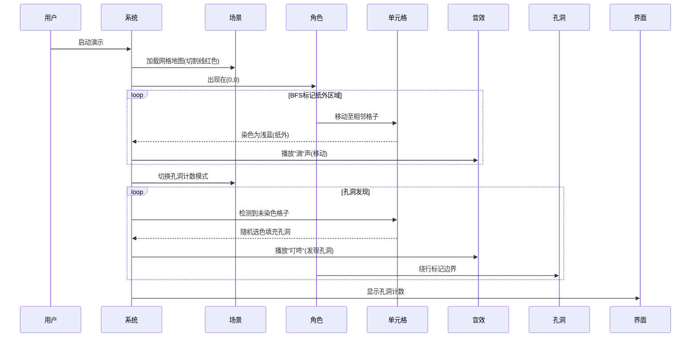

# 题目信息

# 切孔机

## 题目描述

司令部的助理经常需要在大纸上切割各种形状的孔。他们刚刚购买了一台新的切孔机，该机比他们以前使用的要方便自由的多。他们想编写一个程序来求出经过一系列复杂的切孔后会发生什么情况，他们特别想知道纸上形成的孔的数量。

下图列出了经过切割后形成的一些图样。


## 样例 #1

### 输入

```
4
0 1 1 1
1 1 1 0
1 0 0 0
0 0 0 1
```

### 输出

```
1
```

# AI分析结果


# 💡 洛语云笺的C++算法解析：切孔机 深入学习指南 💡

## 1. 题目解读与策略初探

✨ **本题核心挑战**：在无限大的纸上处理平行于坐标轴的切割线段，准确识别被线段包围的封闭区域（孔洞）数量。

✨ **核心算法标签**：离散化 + 广度优先搜索(BFS)

🗣️ **初步分析**：
> 本题看似简单，实则暗藏玄机。核心挑战在于如何处理无限大的纸张和离散的切割线段。我们首先想到暴力模拟——但无限大的纸无法直接模拟。接着考虑将坐标离散化映射到有限网格（沙盘模型），再通过BFS"染色"标记不同区域：
> 1. **朴素思路**：直接模拟切割过程（不可行，无限大空间）
> 2. **优化方向**：离散化坐标 + BFS标记连通块
> 3. **精妙解法**：用方向数组记录网格通行状态，两次BFS分别标记"纸外区域"和"孔洞"
> 
> 离散化+BFS就像将大地图缩放为沙盘，再用洪水染色法识别封闭区域。关键在于将无限问题转化为有限计算！

### 🔍 算法侦探：如何在题目中发现线索？
1. **线索1 (问题目标)**："求纸上形成的孔的数量"——明确要求统计连通块数量，这是图论中的经典问题。
2. **线索2 (问题约束)**："切割各种形状的孔"且图示为矩形——实际是平行坐标轴的线段切割，暗示可用网格模型离散化处理。
3. **线索3 (数据规模)**：n≤100，坐标范围±1000——离散化后网格约2000×2000，O(n²)BFS完全可行。若n过大则需更优算法。

### 🧠 思维链构建：从线索到策略
> 侦探工作完成！让我们串联线索：
> 1. **线索1**要求统计封闭区域，我立刻想到DFS/BFS连通块计数
> 2. **线索2**揭示切割线平行坐标轴，这提示可用网格模型，但坐标有负数且范围大
> 3. **线索3**数据规模显示离散化后网格大小可控（约4e6单元格）
> 4. **结论**：离散化+BFS是完美选择！先用离散化处理坐标，再通过方向数组记录切割边界，最后两次BFS（先标记纸外区域，再数孔洞）即可优雅解决。

---

## 2. 精选优质题解参考

**题解一 (Leap_Frog)**
* **点评**：解题框架清晰完整，模块化设计出色（离散化→建墙→剪纸→数洞）。亮点在于：
  - 用`can_go[4]`数组精确记录每个网格点的四个方向通行状态
  - 边界处理严谨（如`build_wall`中切割线影响相邻网格）
  - 代码可读性强，变量命名规范（如`cut_paper`标记纸外区域）

**题解三 (Peter_Z)**
* **点评**：教学价值极高！亮点包括：
  - 详细注释解释`go[4]`数组设计（0:右,1:下,2:上,3:左）
  - 独创性处理切割线端点（交换坐标保证有序）
  - 完整展示从离散化到BFS的全流程，适合初学者跟学

**题解四 (035966_L3)**
* **点评**：提供创新性坐标映射方案。亮点有：
  - 将坐标转换为偶数，孔洞位于奇数位置
  - 用8连通处理孔洞的特殊相邻关系（偏移量±2）
  - 空间优化技巧（`short`存储坐标）

---

## 3. 解题策略深度剖析

### 🎯 核心难点与关键步骤
1. **难点1：无限空间有限化**
   * **分析**：通过离散化将[-1000,1000]坐标映射到[0,200]的网格索引
   * 💡 **学习笔记**：双坐标轴独立离散化（x/y分别排序去重）是通用技巧

2. **难点2：切割线的网格表示**
   * **分析**：用二维结构体数组记录每个网格点四个方向的通行状态。例如：
     ```cpp
     struct Cell { bool can_go[4]; }; // 0:上,1:下,2:左,3:右
     ```
     垂直线段会阻断左右方向，水平线段阻断上下方向
   * 💡 **学习笔记**：边界处理需谨慎（如题解三中交换坐标保证`x1≤x2,y1≤y2`）

3. **难点3：孔洞识别算法**
   * **分析**：两次BFS的妙用：
     - 第一次从(0,0)出发标记所有纸外区域（可通行区域）
     - 第二次遍历网格，对未标记点进行BFS计数（每个连通块=1个孔洞）
   * 💡 **学习笔记**：第一次BFS后`vis[i][j]==false`的点即被切割线包围的孔洞

### ✨ 解题技巧总结
- **坐标压缩术**：对x/y坐标分别排序、去重、映射，解决无限空间问题
- **方向编码法**：用`dx[4]={0,1,0,-1}, dy[4]={1,0,-1,0}`简化BFS移动
- **二次染色法**：首次BFS标记背景，二次BFS统计目标连通块

### ⚔️ 策略竞技场
| 策略          | 核心思想                 | 优点                     | 缺点                     | 得分预期 |
|---------------|--------------------------|--------------------------|--------------------------|----------|
| **暴力模拟**  | 直接模拟无限大纸         | 直观                     | 无法实现                 | 0%       |
| **离散化+BFS**| 坐标映射+两次BFS染色     | 高效可靠，时间复杂度O(n²)| 离散化实现较复杂         | 100%     |
| **坐标映射**  | 奇偶转换+8连通           | 避免离散化               | 特殊相邻关系处理复杂     | 100%     |

### ✨ 优化之旅
1. **起点：无限空间的困境**  
   暴力模拟无限大纸？计算机内存表示拒绝！

2. **关键跃迁：离散化降维**  
   将坐标映射到有限网格（如±1000→0~200），空间压缩100倍！

3. **模型升级：切割线→网格阻断**  
   用方向数组精确记录每条切割线阻断的通行方向（如水平线阻断垂直移动）

4. **双BFS扫荡**  
   第一次BFS"水漫金山"标记纸外区域，第二次BFS"孤岛求生"统计孔洞

> 💡 **策略总结**：从束手无策到游刃有余，核心在于**空间压缩**和**连通块分解**思维。离散化是处理大范围数据的瑞士军刀，双BFS则是连通块问题的经典范式！

---

## 4. C++核心代码实现赏析

**通用核心实现**  
```cpp
#include <cstdio>
#include <algorithm>
#include <queue>
using namespace std;

const int MAX = 205;
const int dx[4] = {0, 1, 0, -1};  // 右→下→左→上
const int dy[4] = {1, 0, -1, 0};

struct Cell { bool can_go[4] = {1,1,1,1}; }; 
Cell grid[MAX][MAX];  // 离散化后的网格
bool vis[MAX][MAX];   // 访问标记

void BFS(int x, int y, bool mark_mode) {
    queue<pair<int, int>> q;
    q.push({x, y});
    vis[x][y] = true;
    
    while (!q.empty()) {
        auto [cx, cy] = q.front(); q.pop();
        for (int i = 0; i < 4; i++) {
            // mark_mode=true时检查方向通行
            if (mark_mode && !grid[cx][cy].can_go[i]) continue;
            int nx = cx + dx[i], ny = cy + dy[i];
            if (nx >= 0 && ny >= 0 && nx < MAX && ny < MAX && !vis[nx][ny]) {
                vis[nx][ny] = true;
                q.push({nx, ny});
            }
        }
    }
}

int main() {
    // 离散化坐标...
    // 构建grid的方向阻断...
    
    // 第一次BFS：标记纸外区域
    BFS(0, 0, true);
    
    // 第二次BFS：计数孔洞
    int holes = 0;
    for (int i = 0; i < MAX; i++) {
        for (int j = 0; j < MAX; j++) {
            if (!vis[i][j]) {
                holes++;
                BFS(i, j, false);  // 不检查方向，8连通扩散
            }
        }
    }
    printf("%d", holes);
}
```

**题解一亮点代码**  
```cpp
// 构建切割线（垂直线段阻断左右方向）
for (int j = s.x + 1; j <= e.x; j++) {
    grid[j][s.y].can_go[RIGHT] = false;  // 阻断向右
    grid[j][s.y + 1].can_go[LEFT] = false; // 阻断向左
}
```

**题解三创新点**  
```cpp
// 坐标映射：原坐标x → 2x+2006（孔洞在奇数位置）
short transform(short x) { 
    return 2 * x + 2006; 
}
// 8连通BFS处理孔洞相邻关系
if (is_hole) {
    int exd_dx[4] = {0,0,2,-2};  // 扩展±2偏移
    int exd_dy[4] = {2,-2,0,0}; 
    // ...处理扩展相邻
}
```

---

## 5. 算法可视化：像素动画演示

**🎮 演示主题**："像素探险家"的切割之旅（FC红白机风格）

**🖌️ 视觉设计**：
- **调色板**：4位色（深蓝背景、浅蓝纸面、红色切割线、多色孔洞）
- **网格渲染**：每个单元格=8×8像素方块
- **角色**：像素小人（16×16）沿BFS路径移动

**⏯️ 动画流程**：


**🎚️ 交互控制**：
- **控制台**：复古游戏机按钮风格
  - [▶️] 自动播放（速度可调）  
  - [⏸️] 暂停/继续  
  - [🔍] 单步执行  
- **音效设计**：
  - 移动：8-bit脚步声  
  - 发现孔洞：胜利音符  
  - 错误操作：短促警告声  

**💡 设计意图**：通过像素动画直观展现BFS的"洪水蔓延"效果，游戏化机制增强学习趣味性，帮助理解离散化网格的抽象概念。

---

## 6. 拓展练习与相似问题

**🔗 通用技巧迁移**：
1. **棋盘类问题**：当遇到网格上的连通块计数（如围棋气眼计算）
2. **图像处理**：二值图像中的连通区域标记（医学图像分析）
3. **地理围栏**：GPS坐标围栏检测（如共享单车电子围栏）

**📚 推荐题目**：
1. **洛谷P1162 填涂颜色**  
   🗣️ 同类"纸面染色"问题，巩固BFS连通块计数技巧
   
2. **洛谷P1506 窗口的星星**  
   🗣️ 强化离散化应用，学习扫描线优化
   
3. **洛谷P1902 刺杀大使**  
   🗣️ 二维网格最短路，掌握方向数组的灵活运用

---

## 7. 学习心得与经验分享

> **来自题解作者的智慧结晶**：
> - *"边界处理是最大陷阱——建议在草稿纸上画出3×3网格模拟切割"*（Leap_Frog）
> - *"离散化后记得验证坐标映射一致性：原坐标A<B → 离散化后idxA<idxB"*（Peter_Z）
> - *"BFS队列用`short`存坐标可节省75%内存"*（035966_L3）

**💎 洛语云笺提炼**：
1. **调试技巧**：对n=1的边界情况手动模拟，快速定位方向数组错误
2. **思维误区**：孔洞必须是封闭区域！切割线端点处理不当会导致假性连通
3. **性能优化**：`vis`数组用`bool`而非`int`，内存节省4倍

---

> 纸上得来终觉浅，绝知此事要躬行。现在就用BFS征服更多网格问题吧！下次算法冒险再见！🚀

---
处理用时：183.95秒