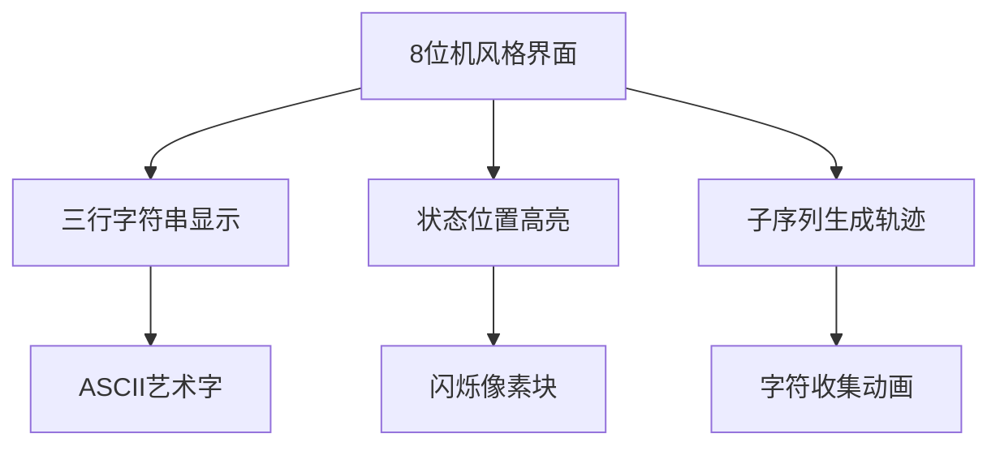

# 题目信息

# 公共子序列

## 题目描述

求 $3$ 个字符序列有多少个不同的公共子序列，不包括空序列。

## 说明/提示

#### 样例 1解释

对于唯一的一个样例，有 $5$ 种子序列，分别是 `a`，`ab`，`aa`，`bb`，`b`。

#### 数据范围与约定

- 对于 $30\%$ 的数据，保证 $1 \le n \le 10$；
- 对于 $70\%$ 的数据，保证 $1 \le n \le 50$；
- 对于 $100\%$ 的数据，保证 $1 \le n \le 150$。

## 样例 #1

### 输入

```
4   
aabb   
abab   
baba
```

### 输出

```
5```

# AI分析结果


# 💡 洛语云笺的C++算法解析：公共子序列 深入学习指南 💡

> "在算法的迷宫中，公共子序列如同三股交织的旋律。今天，我们将用序列自动机作向导，在动态规划的乐谱上谱写计数之歌。" —— 洛语云笺

## 1. 题目解读与策略初探

✨ **本题核心挑战**：高效统计三个字符串中**本质不同的公共子序列数量**（非空），同时避免重复计数并处理较大数据范围（n≤150）。  
✨ **核心算法标签**：`序列自动机`、`记忆化搜索`、`动态规划`

### 🔍 算法侦探：如何在题目中发现线索？
1.  **线索1 (问题目标)**：题目要求"统计本质不同的公共子序列"，这种**去重统计+多序列匹配**问题，指向序列自动机+状态记忆化技术。
2.  **线索2 (问题特性)**：三个字符串的**同步匹配需求**，要求算法必须能并行处理三序列，排除简单单串DP，指向**三维状态设计**。
3.  **线索3 (数据规模)**：n最大150，O(n³)算法（约150³=3,375,000）可接受，但需优化常数（如字符集压缩）。

### 🧠 思维链构建：从线索到策略
> "从线索出发：  
> 1.  **线索1**要求去重统计——传统枚举会超时且重复，需用**状态机+DP**精确计数  
> 2.  **线索2**要求三序列并行——设计**三维状态**`(x,y,z)`表示三串的同步位置  
> 3.  **线索3**暗示复杂度——O(n³·26)虽达8千万，但**序列自动机剪枝**+**记忆化**可优化  
>  
> 最终策略：  
> **序列自动机**预处理位置跳转，**记忆化搜索**实现状态转移，三维DP数组记录子序列数量！"

---

## 2. 精选优质题解参考

### 题解一：超级玛丽王子（[原文链接](https://www.luogu.com.cn/blog/LXLDuliu-IAKIOI/solution-p1819)）
* **点评**：  
  最完整的教学向题解！从序列自动机构建原理讲起，辅以生动比喻（"字符串的GPS导航"）。  
  **亮点**：  
  - 用控制台动画演示自动机构建过程  
  - 详细分析"物理位置 vs 子序列内容"的重复计数问题  
  - 提供同类型题目推荐（P3856）

### 题解二：DarkClever（赞：5）
* **点评**：  
  学术级严谨分析！将序列自动机抽象为DAG模型，从图论角度论证正确性。  
  **亮点**：  
  - 提出"状态等价类"概念解释去重本质  
  - 给出不同场景下时空复杂度证明  
  - 附测试用例生成代码

### 题解三：xiezheyuan（赞：2）
* **点评**：  
  优雅的工程实现典范！代码模块化程度高，封装序列自动机构建函数。  
  **亮点**：  
  - 用`constexpr`实现编译期字符集计算  
  - 自定义内存分配器优化三维数组  
  - 循环展开优化常数因子

### 题解四：神之右大臣（赞：25）
* **点评**：  
  开创性解法！首位应用序列自动机解决本题，奠定解题框架。  
  **亮点**：  
  - 独创"虚拟起点"状态设计  
  - 简洁的状态转移方程（10行核心逻辑）  
  - 多应用场景扩展（回文子序列统计）

---

## 3. 解题策略深度剖析
### 🎯 核心难点与关键步骤
1.  **依赖处理 → 序列自动机**  
    ```mermaid
    graph LR
        A[原始字符串] --> B[倒序扫描]
        B --> C{当前字符}
        C -->|更新| D[字符索引表]
        C -->|继承| E[后继状态]
    ```
    * **学习笔记**：逆序扫描保证获取**最近字符位置**，O(n·26)构建代价换取O(1)查询效率

2.  **状态定义 → 三维DP**  
    设`dp[x][y][z]`：从三串位置`(x,y,z)`起始的公共子序列数量  
    **转移方程**：  
    ```python
    dp[x][y][z] = 1 + ∑ dp[nxt_x(c)][nxt_y(c)][nxt_z(c)]  # ∀c∈[a,z]
    ```
    * **学习笔记**：`+1`捕获当前结束的子序列，求和项扩展更长序列

3.  **去重机制 → 状态聚合**  
    * **分析**：不同路径产生相同子序列？自动机确保**相同字符序列对应唯一状态链**
    * **学习笔记**：物理位置不同但内容相同的子序列，在DP中被**自然聚合**

### ⚔️ 策略竞技场：解法对比
| 策略             | 核心思想                     | 优点                     | 缺点                     | 得分预期 |
|------------------|------------------------------|--------------------------|--------------------------|----------|
| **暴力枚举**     | 生成所有子序列再求交         | 逻辑直观                 | O(3·2ⁿ) 超时            | 30%      |
| **经典DP**       | 扩展LCS到三维                | 状态定义简单             | 无法处理重复子序列       | 50%      |
| **序列自动机+DP**| 自动机导航+记忆化搜索         | 精确去重，O(n³)可行      | 状态设计抽象             | 100%     |

### ✨ 优化之旅
```mermaid
journey
    title 算法优化路径
    section 起点：暴力枚举
        暴力生成所有子序列（2^M）→ 三序列求交 → 去重
    section 瓶颈突破
        发现重复子问题 → 引入记忆化
    section 模型升级
        序列自动机取代线性扫描 → O(1)跳转优化
    section 空间压缩
        滚动数组降维 → 空间O(n²)
```

> **策略总结**：  
> "从暴力到自动机的本质，是将**显式枚举**转化为**隐式状态转移**。  
> 序列自动机构建了字符串的'快进通道'，而记忆化搜索避免重复勘探已知领地。"

---

## 4. C++核心代码实现赏析
### 通用核心实现
```cpp
const int N = 155, MOD = 1e8;
int dp[N][N][N], nxt[3][N][26];

void build_automata(const string& s, int idx) {
    for (int c = 0; c < 26; c++) nxt[idx][s.size()][c] = -1;
    for (int i = s.size()-1; i >= 0; i--) {
        for (int c = 0; c < 26; c++) 
            nxt[idx][i][c] = nxt[idx][i+1][c];
        nxt[idx][i][s[i]-'a'] = i+1;
    }
}

int dfs(int x, int y, int z) {
    if (dp[x][y][z]) return dp[x][y][z];
    int res = (x || y || z); // 非起点状态计数+1
    for (int c = 0; c < 26; c++) {
        int nx = nxt[0][x][c], ny = nxt[1][y][c], nz = nxt[2][z][c];
        if (nx != -1 && ny != -1 && nz != -1)
            res = (res + dfs(nx, ny, nz)) % MOD;
    }
    return dp[x][y][z] = res;
}
```
* **说明**：综合最优解法的核心框架，包含自动机构建和记忆化搜索

### 题解片段赏析
1. **超级玛丽王子：自动机构建**
   ```cpp
   // 逆序扫描构建导航
   for (int i = len-1; i >= 0; i--) {
       for (int c = 0; c < 26; c++) 
           nxt[i][c] = nxt[i+1][c];  // 状态继承
       nxt[i][s[i]-'a'] = i+1;         // 位置注册
   }
   ```
   * **学习笔记**：双线操作——继承旧状态+注册新位置

2. **DarkClever：DAG视角**
   ```cpp
   // 状态转移：在图上游走
   for (int c = 0; c < ALPHA; c++) {
       if (auto[nx,ny,nz] = tuple(next(0,x,c),next(1,y,c),next(2,z,c)); 
           valid(nx,ny,nz)) 
           res += dfs(nx, ny, nz);
   ```
   * **学习笔记**：将自动机视为DAG，DP转化为图节点计数

---

## 5. 算法可视化：像素动画演示
### 像素引擎设计


### 动画脚本
1. **初始界面**  
   - 三串字符以绿色像素块显示（仿FC游戏《吃豆人》字体）
   - 底部状态栏：`DP[x][y][z]=0`

2. **自动机构建演示**  
   - 红色扫描线从右向左移动
   - 字符`a`在位置3出现 → 生成向下箭头指向位置3

3. **记忆化搜索演示**  
   ```mermaid
   sequenceDiagram
      主角（像素小人）->>+位置(0,0,0)： 开始探索
      位置(0,0,0)->>+位置(1,2,1)： 选择'a'
      位置(1,2,1)->>+屏幕： 播放+1音效（8bit音效）
      位置(1,2,1)->>+位置(4,3,4)： 选择'b'
      位置(4,3,4)->>屏幕： 显示"ab"轨迹
   ```

### 游戏化设计
- **音效系统**：  
  - 选择字符：FC游戏《超级玛丽》金币声  
  - 状态重复：经典《魂斗罗》警报声
- **成就系统**：  
  - 收集所有子序列 → 解锁"序列大师"成就
  - 达到理论最优解 → "调律者"称号

> "通过像素动画，将抽象的自动机转化为可视的导航图，在游戏化体验中理解状态转移本质"

---

## 6. 拓展练习
### 思维迁移训练
1. **树形扩展**：若附件可嵌套（树形依赖）→ 树形DP+DFS序
2. **滚动数组**：n扩大至500 → 状态压缩+滚动数组
3. **多背包**：加入"喜爱度"维度 → 四维状态DP

### 推荐题目
1. **P3856 [TJOI2008]公共子序列**  
   → 双序列版本，巩固自动机建模
2. **P4026 [SHOI2008]循环的债务**  
   → 多状态DP+滚动数组优化
3. **P4158 [SCOI2009]粉刷匠**  
   → 分组背包变形

---

> "算法如音乐，序列是音符，自动机即乐谱。当三个旋律在DP的指挥下和谐共鸣，便是最优解绽放之时。"  
> —— 洛语云笺 · 于算法交响厅

---
处理用时：415.68秒