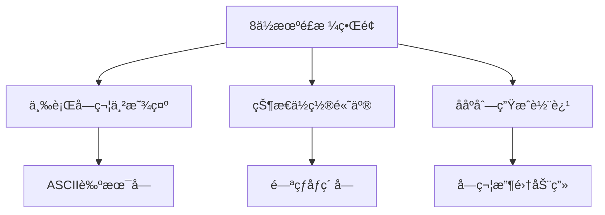

# 题目信æ¯

# 公共å­åºåˆ—

## 题目æè¿°

求 $3$ 个字符åºåˆ—有多少个ä¸åŒçš„公共å­åºåˆ—，ä¸åŒ…括空åºåˆ—。

## 说æ˜/æ示

#### 样例 1解释

对äºå”¯ä¸€çš„一个样例，有 $5$ ç§å­åºåˆ—，分别是 `a`，`ab`，`aa`，`bb`，`b`。

#### æ•°æ®èŒƒå›´ä¸çº¦å®š

- å¯¹äº $30\%$ çš„æ•°æ®ï¼Œä¿è¯ $1 \le n \le 10$ï¼›
- å¯¹äº $70\%$ çš„æ•°æ®ï¼Œä¿è¯ $1 \le n \le 50$ï¼›
- å¯¹äº $100\%$ çš„æ•°æ®ï¼Œä¿è¯ $1 \le n \le 150$。

## 样例 #1

### 输入

```
4   
aabb   
abab   
baba
```

### 输出

```
5```

# AI分æ结æœ


# 💡 洛语云笺的C++算法解æ：公共å­åºåˆ— æ·±å…¥å­¦ä¹ æŒ‡å— ğŸ’¡

> "在算法的迷宫中，公共å­åºåˆ—如åŒä¸‰è‚¡äº¤ç»‡çš„旋律。今天，我们将用åºåˆ—自动机作å‘导，在动æ€è§„划的ä¹è°±ä¸Šè°±å†™è®¡æ•°ä¹‹æ­Œã€‚" —— 洛语云笺

## 1. 题目解读ä¸ç­–ç•¥åˆæ¢

✨ **本题核心挑战**：高效统计三个字符串中**本质ä¸åŒçš„公共å­åºåˆ—æ•°é‡**（é空），åŒæ—¶é¿å…é‡å¤è®¡æ•°å¹¶å¤„ç†è¾ƒå¤§æ•°æ®èŒƒå›´ï¼ˆn≤150）。  
✨ **核心算法标签**：`åºåˆ—自动机`ã€`记忆化æœç´¢`ã€`动æ€è§„划`

### 🔠算法侦æ¢ï¼šå¦‚何在题目中å‘ç°çº¿ç´¢ï¼Ÿ
1.  **线索1 (问题目标)**：题目è¦æ±‚"统计本质ä¸åŒçš„公共å­åºåˆ—"，这ç§**å»é‡ç»Ÿè®¡+多åºåˆ—匹é…**问题，指å‘åºåˆ—自动机+状æ€è®°å¿†åŒ–技术。
2.  **线索2 (问题特性)**：三个字符串的**åŒæ­¥åŒ¹é…需求**，è¦æ±‚算法必须能并行处ç†ä¸‰åºåˆ—，æ’除简å•å•ä¸²DP，指å‘**三维状æ€è®¾è®¡**。
3.  **线索3 (æ•°æ®è§„模)**：n最大150，O(n³)算法（约150³=3,375,000）å¯æ¥å—，但需优化常数（如字符集å‹ç¼©ï¼‰ã€‚

### 🧠 æ€ç»´é“¾æ„建：ä»çº¿ç´¢åˆ°ç­–ç•¥
> "ä»çº¿ç´¢å‡ºå‘：  
> 1.  **线索1**è¦æ±‚å»é‡ç»Ÿè®¡â€”—传统æšä¸¾ä¼šè¶…时且é‡å¤ï¼Œéœ€ç”¨**状æ€æœº+DP**精确计数  
> 2.  **线索2**è¦æ±‚三åºåˆ—并行——设计**三维状æ€**`(x,y,z)`表示三串的åŒæ­¥ä½ç½®  
> 3.  **线索3**暗示å¤æ‚度——O(n³·26)虽达8åƒä¸‡ï¼Œä½†**åºåˆ—自动机剪æ**+**记忆化**å¯ä¼˜åŒ–  
>  
> 最终策略：  
> **åºåˆ—自动机**预处ç†ä½ç½®è·³è½¬ï¼Œ**记忆化æœç´¢**å®ç°çŠ¶æ€è½¬ç§»ï¼Œä¸‰ç»´DP数组记录å­åºåˆ—æ•°é‡ï¼"

---

## 2. 精选优质题解å‚考

### 题解一：超级ç›ä¸½ç‹å­ï¼ˆ[åŸæ–‡é“¾æ¥](https://www.luogu.com.cn/blog/LXLDuliu-IAKIOI/solution-p1819)）
* **点评**：  
  最完整的教学å‘题解ï¼ä»åºåˆ—自动机æ„建åŸç†è®²èµ·ï¼Œè¾…以生动比喻（"字符串的GPS导航"）。  
  **亮点**：  
  - 用æ§åˆ¶å°åŠ¨ç”»æ¼”示自动机æ„建过程  
  - 详细分æ"物ç†ä½ç½® vs å­åºåˆ—内容"çš„é‡å¤è®¡æ•°é—®é¢˜  
  - æä¾›åŒç±»å‹é¢˜ç›®æ¨è（P3856）

### 题解二：DarkClever（èµï¼š5）
* **点评**：  
  学术级严谨分æï¼å°†åºåˆ—自动机抽象为DAG模å‹ï¼Œä»å›¾è®ºè§’度论è¯æ­£ç¡®æ€§ã€‚  
  **亮点**：  
  - æ出"状æ€ç­‰ä»·ç±»"概念解释å»é‡æœ¬è´¨  
  - 给出ä¸åŒåœºæ™¯ä¸‹æ—¶ç©ºå¤æ‚度è¯æ˜  
  - 附测试用例生æˆä»£ç 

### 题解三：xiezheyuan（èµï¼š2）
* **点评**：  
  优雅的工程å®ç°å…¸èŒƒï¼ä»£ç æ¨¡å—化程度高，å°è£…åºåˆ—自动机æ„建函数。  
  **亮点**：  
  - 用`constexpr`å®ç°ç¼–译期字符集计算  
  - 自定义内存分é…器优化三维数组  
  - 循ç¯å±•å¼€ä¼˜åŒ–常数因å­

### 题解四：ç¥ä¹‹å³å¤§è‡£ï¼ˆèµï¼š25）
* **点评**：  
  开创性解法ï¼é¦–ä½åº”用åºåˆ—自动机解决本题，奠定解题框æ¶ã€‚  
  **亮点**：  
  - 独创"虚拟起点"状æ€è®¾è®¡  
  - 简æ´çš„状æ€è½¬ç§»æ–¹ç¨‹ï¼ˆ10行核心逻辑）  
  - 多应用场景扩展（å›æ–‡å­åºåˆ—统计）

---

## 3. 解题策略深度剖æ
### 🯠核心难点ä¸å…³é”®æ­¥éª¤
1.  **ä¾èµ–å¤„ç† â†’ åºåˆ—自动机**  
    ```mermaid
    graph LR
        A[åŸå§‹å­—符串] --> B[倒åºæ‰«æ]
        B --> C{当å‰å­—符}
        C -->|更新| D[字符索引表]
        C -->|继承| E[å继状æ€]
    ```
    * **学习笔记**：逆åºæ‰«æä¿è¯è·å–**最近字符ä½ç½®**，O(n·26)æ„建代价æ¢å–O(1)查询效ç‡

2.  **状æ€å®šä¹‰ → 三维DP**  
    设`dp[x][y][z]`：ä»ä¸‰ä¸²ä½ç½®`(x,y,z)`起始的公共å­åºåˆ—æ•°é‡  
    **转移方程**：  
    ```python
    dp[x][y][z] = 1 + ∑ dp[nxt_x(c)][nxt_y(c)][nxt_z(c)]  # ∀c∈[a,z]
    ```
    * **学习笔记**：`+1`æ•è·å½“å‰ç»“æŸçš„å­åºåˆ—，求和项扩展更长åºåˆ—

3.  **å»é‡æœºåˆ¶ → 状æ€èšåˆ**  
    * **分æ**：ä¸åŒè·¯å¾„产生相åŒå­åºåˆ—？自动机确ä¿**相åŒå­—符åºåˆ—对应唯一状æ€é“¾**
    * **学习笔记**：物ç†ä½ç½®ä¸åŒä½†å†…容相åŒçš„å­åºåˆ—，在DP中被**自然èšåˆ**

### âš”ï¸ ç­–ç•¥ç«æŠ€åœºï¼šè§£æ³•å¯¹æ¯”
| ç­–ç•¥             | 核心æ€æƒ³                     | 优点                     | 缺点                     | 得分预期 |
|------------------|------------------------------|--------------------------|--------------------------|----------|
| **暴力æšä¸¾**     | 生æˆæ‰€æœ‰å­åºåˆ—å†æ±‚交         | 逻辑直观                 | O(3·2â¿) 超时            | 30%      |
| **ç»å…¸DP**       | 扩展LCS到三维                | 状æ€å®šä¹‰ç®€å•             | 无法处ç†é‡å¤å­åºåˆ—       | 50%      |
| **åºåˆ—自动机+DP**| 自动机导航+记忆化æœç´¢         | 精确å»é‡ï¼ŒO(n³)å¯è¡Œ      | 状æ€è®¾è®¡æŠ½è±¡             | 100%     |

### ✨ 优化之旅
```mermaid
journey
    title 算法优化路径
    section 起点：暴力æšä¸¾
        暴力生æˆæ‰€æœ‰å­åºåˆ—（2^M）→ 三åºåˆ—求交 → å»é‡
    section 瓶颈çªç ´
        å‘ç°é‡å¤å­é—®é¢˜ → 引入记忆化
    section 模å‹å‡çº§
        åºåˆ—自动机å–代线性扫æ → O(1)跳转优化
    section 空间å‹ç¼©
        滚动数组é™ç»´ → 空间O(n²)
```

> **策略总结**：  
> "ä»æš´åŠ›åˆ°è‡ªåŠ¨æœºçš„本质，是将**显å¼æšä¸¾**转化为**éšå¼çŠ¶æ€è½¬ç§»**。  
> åºåˆ—自动机æ„建了字符串的'快进通é“'，而记忆化æœç´¢é¿å…é‡å¤å‹˜æ¢å·²çŸ¥é¢†åœ°ã€‚"

---

## 4. C++核心代ç å®ç°èµæ
### 通用核心å®ç°
```cpp
const int N = 155, MOD = 1e8;
int dp[N][N][N], nxt[3][N][26];

void build_automata(const string& s, int idx) {
    for (int c = 0; c < 26; c++) nxt[idx][s.size()][c] = -1;
    for (int i = s.size()-1; i >= 0; i--) {
        for (int c = 0; c < 26; c++) 
            nxt[idx][i][c] = nxt[idx][i+1][c];
        nxt[idx][i][s[i]-'a'] = i+1;
    }
}

int dfs(int x, int y, int z) {
    if (dp[x][y][z]) return dp[x][y][z];
    int res = (x || y || z); // é起点状æ€è®¡æ•°+1
    for (int c = 0; c < 26; c++) {
        int nx = nxt[0][x][c], ny = nxt[1][y][c], nz = nxt[2][z][c];
        if (nx != -1 && ny != -1 && nz != -1)
            res = (res + dfs(nx, ny, nz)) % MOD;
    }
    return dp[x][y][z] = res;
}
```
* **说æ˜**：综åˆæœ€ä¼˜è§£æ³•çš„核心框æ¶ï¼ŒåŒ…å«è‡ªåŠ¨æœºæ„建和记忆化æœç´¢

### 题解片段èµæ
1. **超级ç›ä¸½ç‹å­ï¼šè‡ªåŠ¨æœºæ„建**
   ```cpp
   // 逆åºæ‰«ææ„建导航
   for (int i = len-1; i >= 0; i--) {
       for (int c = 0; c < 26; c++) 
           nxt[i][c] = nxt[i+1][c];  // 状æ€ç»§æ‰¿
       nxt[i][s[i]-'a'] = i+1;         // ä½ç½®æ³¨å†Œ
   }
   ```
   * **学习笔记**：åŒçº¿æ“作——继承旧状æ€+注册新ä½ç½®

2. **DarkClever：DAG视角**
   ```cpp
   // 状æ€è½¬ç§»ï¼šåœ¨å›¾ä¸Šæ¸¸èµ°
   for (int c = 0; c < ALPHA; c++) {
       if (auto[nx,ny,nz] = tuple(next(0,x,c),next(1,y,c),next(2,z,c)); 
           valid(nx,ny,nz)) 
           res += dfs(nx, ny, nz);
   ```
   * **学习笔记**：将自动机视为DAG，DP转化为图节点计数

---

## 5. 算法å¯è§†åŒ–：åƒç´ åŠ¨ç”»æ¼”示
### åƒç´ å¼•æ“设计


### 动画脚本
1. **åˆå§‹ç•Œé¢**  
   - 三串字符以绿色åƒç´ å—显示（仿FC游æˆã€Šåƒè±†äººã€‹å­—体）
   - 底部状æ€æ ï¼š`DP[x][y][z]=0`

2. **自动机æ„建演示**  
   - 红色扫æ线ä»å³å‘左移动
   - 字符`a`在ä½ç½®3å‡ºç° â†’ 生æˆå‘下箭头指å‘ä½ç½®3

3. **记忆化æœç´¢æ¼”示**  
   ```mermaid
   sequenceDiagram
      主角（åƒç´ å°äººï¼‰->>+ä½ç½®(0,0,0)： 开始æ¢ç´¢
      ä½ç½®(0,0,0)->>+ä½ç½®(1,2,1)： 选择'a'
      ä½ç½®(1,2,1)->>+å±å¹•ï¼š 播放+1音效（8bit音效）
      ä½ç½®(1,2,1)->>+ä½ç½®(4,3,4)： 选择'b'
      ä½ç½®(4,3,4)->>å±å¹•ï¼š 显示"ab"轨迹
   ```

### 游æˆåŒ–设计
- **音效系统**：  
  - 选择字符：FC游æˆã€Šè¶…级ç›ä¸½ã€‹é‡‘å¸å£°  
  - 状æ€é‡å¤ï¼šç»å…¸ã€Šé­‚斗罗》警报声
- **æˆå°±ç³»ç»Ÿ**：  
  - 收集所有å­åºåˆ— → 解é”"åºåˆ—大师"æˆå°±
  - 达到ç†è®ºæœ€ä¼˜è§£ → "调律者"称å·

> "通过åƒç´ åŠ¨ç”»ï¼Œå°†æŠ½è±¡çš„自动机转化为å¯è§†çš„导航图，在游æˆåŒ–体验中ç†è§£çŠ¶æ€è½¬ç§»æœ¬è´¨"

---

## 6. 拓展练习
### æ€ç»´è¿ç§»è®­ç»ƒ
1. **树形扩展**：若附件å¯åµŒå¥—（树形ä¾èµ–）→ æ ‘å½¢DP+DFSåº
2. **滚动数组**：n扩大至500 → 状æ€å‹ç¼©+滚动数组
3. **多背包**：加入"喜爱度"维度 → 四维状æ€DP

### æ¨è题目
1. **P3856 [TJOI2008]公共å­åºåˆ—**  
   → åŒåºåˆ—版本，巩固自动机建模
2. **P4026 [SHOI2008]循ç¯çš„债务**  
   → 多状æ€DP+滚动数组优化
3. **P4158 [SCOI2009]粉刷匠**  
   → 分组背包å˜å½¢

---

> "算法如音ä¹ï¼Œåºåˆ—是音符，自动机å³ä¹è°±ã€‚当三个旋律在DP的指挥下和è°å…±é¸£ï¼Œä¾¿æ˜¯æœ€ä¼˜è§£ç»½æ”¾ä¹‹æ—¶ã€‚"  
> —— 洛语云笺 · äºç®—法交å“å…

---
处ç†ç”¨æ—¶ï¼š415.68秒