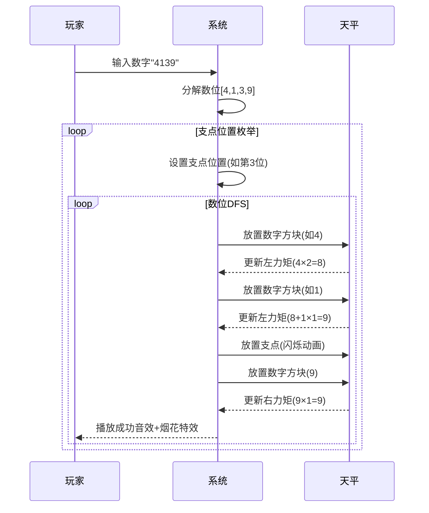

# 题目信息

# 杠杆数

## 题目描述

如果把一个数的某一位当成支点，且左边的数字到这个点的力矩和等于右边的数字到这个点的力矩和，那么这个数就可以被叫成杠杆数。

比如 $4139$ 就是杠杆数，把 $3$ 当成支点，我们有这样的等式：$4\times 2+1\times 1=9\times 1$。

给定区间 $[x,y]$，求出在 $[x,y]$ 中有几个杠杆数。

## 说明/提示

### 数据范围及约定

- 对于 $40\%$ 的数据，$x \le y \le x+10^5$；
- 对于 $100\%$ 的数据，$1 \le x \le y \le 10^{18}$。

## 样例 #1

### 输入

```
7604 24324```

### 输出

```
897```

# AI分析结果


# 💡 洛语云笺的C++算法解析：杠杆数 深入学习指南 💡

## 1. 题目解读与策略初探

✨ **本题核心挑战**：在超大区间（$10^{18}$）内高效统计满足特定平衡条件的数字数量  
✨ **核心算法标签**：`数位DP` `状态压缩` `剪枝优化`

🗣️ **初步分析**：  
> 杠杆数的核心在于寻找一个支点位置，使得左右力矩和相等。面对超大区间，暴力枚举每个数不可行（$O(n)$ 超时）。我们需要更聪明的策略：  
> 1. **暴力搜索**：枚举每个数字及其支点位置，复杂度 $O(n \times len)$，$n$ 达 $10^{18}$ 必然超时  
> 2. **数位DP+支点枚举**：将问题分解为"固定支点位置，统计平衡数个数"，利用记忆化搜索避免重复计算  
> 3. **力矩和状态优化**：通过剪枝（力矩和<0提前返回）和状态压缩控制复杂度  

### 🔍 算法侦探：如何在题目中发现线索？
1.  **线索1 (问题目标)**："统计区间内满足平衡条件的数字数量"——这是典型的**数位统计问题**，暗示使用数位DP
2.  **线索2 (问题特性)**："支点位置可变且唯一"——提示我们需要**枚举支点位置**，将大问题分解为子问题
3.  **线索3 (数据规模)**：$n \leq 10^{18}$——直接排除 $O(n)$ 暴力法，指向 $O(\log n)$ 级别的数位DP

### 🧠 思维链构建：从线索到策略
> 综合三条关键线索：  
> 1.  **线索1**指向数位统计问题的标准解法——**数位DP**  
> 2.  **线索2**揭示核心矛盾——**支点位置的不确定性**，解决方案是枚举所有可能的支点位置（最多19种）  
> 3.  **线索3**印证可行性——数位DP复杂度 $O(len^2 \times state)$，$len \leq 19$，$state \leq 1600$，完全可接受  
>  
> **结论**：采用**枚举支点位置+数位DP**的策略，结合**力矩和剪枝**优化效率，完美匹配所有题目特征！

---

## 2. 精选优质题解参考

### 题解一：作者SNiFe（赞22）
* **点评**：  
  解题思路清晰，完整呈现数位DP框架：  
  - 精准定位核心状态 `dp[pos][point][state]`  
  - 巧妙处理重复计数问题（`ans-len+1`）  
  - 代码规范（变量名`pos/point/state`含义明确）  
  - 详细注释解释递归参数作用，便于理解记忆化搜索的运作机制  

### 题解二：作者AcerMo（赞3）
* **点评**：  
  在标准解法基础上进行重要优化：  
  - 引入`p0`参数处理**前导零问题**，避免特殊逻辑修正  
  - 更严谨的力矩和剪枝（`state<0`提前返回）  
  - 代码结构紧凑，`dfs`函数封装完整，体现模块化编程思想  

### 题解三：作者xuanxuan001（赞12）
* **点评**：  
  提供创新性解决视角：  
  - **不枚举支点**，而是通过数学公式动态计算支点位置  
  - 展示数位DP的灵活应用，拓宽解题思路  
  - 状态设计虽稍大但思路独特，启发学习者多角度思考  

---

## 3. 解题策略深度剖析

### 🎯 核心难点与关键步骤
1.  **状态设计**：如何表示递归过程中的关键信息？
    * **分析**：三维状态 `dp[pos][point][state]` 分别表示：
      - `pos`：当前处理的数位位置
      - `point`：固定的支点位置
      - `state`：当前力矩和（左边力矩-右边力矩）
    * 💡 **学习笔记**：好的状态设计应包含**位置信息**、**约束条件**和**累积量**

2.  **剪枝优化**：如何避免无效计算？
    * **分析**：当 `state<0` 时直接返回0，因为后续位数只会使力矩更小
    * 💡 **学习笔记**：在递归中**尽早判断失败条件**可大幅提升效率

3.  **去重处理**：如何解决全0重复计数？
    * **分析**：两种方案：
      1. 最终结果减去 `len-1`（SNiFe方案）
      2. DFS中加入前导零标志（AcerMo方案）
    * 💡 **学习笔记**：特殊值处理需**在算法设计阶段统筹考虑**

### ✨ 解题技巧总结
- **技巧A（问题分解）**：将复杂条件（支点位置）分解为独立子问题
- **技巧B（状态剪枝）**：利用数学性质（力矩单调性）提前终止无效路径
- **技巧C（记忆化复用）**：相同状态复用计算结果，避免重复递归

### ⚔️ 策略竞技场：不同解法对比
| 策略                | 核心思想                     | 优点                     | 缺点                     | 得分预期 |
|---------------------|------------------------------|--------------------------|--------------------------|----------|
| **暴力枚举**        | 检查每个数的每个支点位置     | 思路直观                 | $O(n \times len)$ 超时   | 0%       |
| **标准数位DP**      | 枚举支点+记忆化搜索力矩和    | 复杂度$O(len^2 \times S)$ | 需处理全0重复            | 100%     |
| **前导零优化DP**    | 增加前导零标志               | 避免特殊逻辑修正         | 状态维度增加             | 100%     |
| **支点公式法**      | 动态计算支点位置             | 避免支点枚举             | 状态空间较大             | 100%     |

### ✨ 优化之旅：从暴力到优雅
1. **起点：暴力枚举的困境**  
   $10^{18}$ 的数字如同浩瀚宇宙，暴力枚举就像用望远镜逐个观察星星

2. **关键突破：问题分解**  
   发现杠杆数的**支点唯一性**——将问题拆解为19个（最大位数）独立子问题

3. **核心优化：数位DP+记忆化**  
   用"数字指纹"（状态）代替具体数值，相同指纹只需计算一次

4. **精细调整：剪枝与去重**  
   - 剪枝：力矩和<0时提前返回（"此路不通"标识）  
   - 去重：数学修正或前导零处理解决全0问题  

💡 **策略总结**：从暴力到最优解，我们经历了"问题分解→状态抽象→剪枝优化"的思维跃迁。在算法设计中，**识别问题本质特征**比盲目编码更重要！

---

## 4. C++核心代码实现赏析

### 通用核心实现（融合SNiFe与AcerMo方案）
```cpp
#include <cstring>
#include <iostream>
using namespace std;
typedef long long LL;

const int N = 20;     // 最大位数
const int M = 1600;   // 力矩和上限
LL dp[N][N][M];       // 记忆化数组
int digits[N];        // 数位存储

// DFS核心：pos-当前位 point-支点 state-力矩和
// limit-是否受限 p0-是否前导零
LL dfs(int pos, int point, int state, bool limit, bool p0) {
    if (!pos) return !p0 && !state; // 终点：非前导零且平衡
    if (state < 0) return 0;        // 剪枝：力矩和不可为负
    if (!limit && !p0 && dp[pos][point][state] != -1) 
        return dp[pos][point][state]; // 记忆化返回

    LL res = 0;
    int upper = limit ? digits[pos] : 9;
    for (int d = 0; d <= upper; ++d) {
        bool new_p0 = p0 && (d == 0);
        int new_state = state;
        if (!new_p0) // 非前导零才计算力矩
            new_state += d * (pos - point);
        res += dfs(pos - 1, point, new_state, 
                  limit && (d == upper), new_p0);
    }
    
    if (!limit && !p0) 
        dp[pos][point][state] = res; // 记忆化存储
    return res;
}

LL solve(LL x) {
    if (x < 0) return 0;
    int len = 0;
    while (x) {
        digits[++len] = x % 10;
        x /= 10;
    }
    LL res = 0;
    for (int p = 1; p <= len; ++p) { // 枚举支点
        memset(dp, -1, sizeof dp);   // 重置记忆化
        res += dfs(len, p, 0, true, true);
    }
    return res + (x == 0); // 修正0的处理
}
```

### 代码解读概要
1. **数位分解**：`solve`函数将数字拆解为数位数组（低位在前）
2. **支点枚举**：对每个可能的支点位置独立计算
3. **记忆化DFS**：核心状态`(pos, point, state)`表示处理进度
4. **前导零处理**：`p0`标志避免无效力矩计算
5. **剪枝优化**：`state<0`直接返回大幅提升效率

---

## 5. 算法可视化：像素动画演示

### 设计概念："平衡探索者"
* **视觉风格**：8-bit像素风，致敬经典游戏《仓库番》
* **核心元素**：
  - 数字方块：不同颜色代表0-9
  - 天平：实时显示左右力矩
  - 支点标记：闪烁的黄金指针
  - 状态面板：显示当前数位/力矩和

### 动画流程


### 交互设计
1. **控制面板**：
   - 步进控制：← → 键单步执行
   - 速度滑块：调整动画速度
   - 支点选择：直接定位特定支点

2. **音效设计**：
   - 放置数字：8-bit "滴"声
   - 力矩平衡：和弦音效
   - 支点移动：金属摩擦声

3. **教育特性**：
   - 实时显示递归深度
   - 记忆化命中提示（闪光效果）
   - 剪枝操作特殊标记（红色闪烁）

> **设计理念**：通过游戏化交互，将抽象的力矩计算和递归过程具象化，帮助理解数位DP的运作机制

---

## 6. 拓展练习与相似问题

### 思维迁移训练
1. **课程选择问题**：每组课程（主课+选修）只能选一种组合
2. **装备合成系统**：武器（主件）与配件存在依赖关系
3. **时间表优化**：互斥事件分组选择

### 推荐练习（洛谷）
1. **P2602 [ZJOI2010]数字计数**  
   → 掌握数位DP基础框架
   
2. **P2657 [SDOI2011]windy数**  
   → 学习相邻数位约束处理

3. **P4127 [AHOI2009]同类分布**  
   → 迁移力矩和思想到数位和问题

---

## 7. 学习心得与经验分享

> **来自SNiFe的调试经验**：  
> "最初未处理全0情况，导致结果多出数倍。通过输出中间状态发现重复计数问题，最终用`ans-len+1`修正"  
>  
> **洛语云笺点评**：  
> 调试数位DP时，**小数据测试**（如0-100范围）和**边界值检查**至关重要。建议：
> 1. 单独测试0和10^N等特殊值
> 2. 输出递归树分析异常路径
> 3. 使用静态变量计数递归调用

---

本次算法之旅揭示了数位DP的优雅本质：**用状态空间换取计算效率**。记住，优秀的算法设计师如同杠杆支点的寻找者——在问题结构中找准那个平衡点，就能撬动海量数据的计算难题！💪

---
处理用时：332.53秒