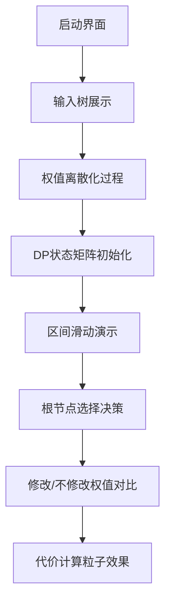

# 题目信息

# [NOI2009] 二叉查找树

## 题目描述

已知一棵特殊的二叉查找树。根据定义，该二叉查找树中每个结点的数据值都比它左儿子结点的数据值大，而比它右儿子结点的数据值小。

另一方面，这棵查找树中每个结点都有一个权值，每个结点的权值都比它的儿子结点的权值要小。

已知树中所有结点的数据值各不相同；所有结点的权值也各不相同。这时可得出这样一个有趣的结论：如果能够确定树中每个结点的数据值和权值，那么树的形态便可以唯一确定。因为这样的一棵树可以看成是按照权值从小到大顺序插入结点所得到的、按照数据值排序的二叉查找树。

一个结点在树中的深度定义为它到树根的距离加 $1$。因此树的根结点的深度为 $1$。

每个结点除了数据值和权值以外，还有一个访问频度。我们定义一个结点在树中的访问代价为它的访问频度乘以它在树中的深度。整棵树的访问代价定义为所有结点在树中的访问代价之和。

现在给定每个结点的数据值、权值和访问频度，你可以根据需要修改某些结点的权值，但每次修改你会付出 $K$ 的额外修改代价。你可以把结点的权值改为任何实数，但是修改后所有结点的权值必须仍保持互不相同。现在你要解决的问题是，整棵树的访问代价与额外修改代价的和最小是多少？

## 说明/提示

### 样例解释


输入的原图是左图，它的访问代价是 $1 \times 1+2 \times 2+3 \times 3+4 \times 4=30$。

最佳的修改方案是把输入中的第 $3$ 个结点的权值改成 $0$，得到右图，访问代价是：$1 \times 2+2 \times 3+3 \times 1+4 \times 2=19$，加上额外修改代价 $10$，一共是 $29$。

### 数据范围

- 对于 $40\%$ 的数据，满足 $N \leq 30$；
- 对于 $70\%$ 的数据，满足 $N \leq 50$；
- 对于 $100\%$ 的数据，满足：$1 \leq N \leq 70$，$1 \leq K \leq 3 \times 10^7$。


## 样例 #1

### 输入

```
4 10
1 2 3 4
1 2 3 4
1 2 3 4
```

### 输出

```
29```

# AI分析结果


# 💡 洛语云笺的C++算法解析：NOI2009 二叉查找树 深入学习指南 💡

> "算法如棋局，一步一思量。看清问题本质，才能在万变中掌握不变。"

## 1. 题目解读与策略初探

✨ **本题核心挑战**：在保持二叉查找树中序遍历不变的前提下，通过调整节点权值（引发旋转操作）最小化整棵树的访问代价（深度×频度）与权值修改代价之和。

✨ **核心算法标签**：`区间DP` `离散化` `树形结构优化`

🗣️ **初步分析**：
> 二叉查找树的中序遍历固定不变（按数据值排序），这成为我们解题的"锚点"。权值修改相当于进行旋转操作，改变节点深度分布。问题可拆解为：
> 1. **暴力搜索**：枚举所有可能的旋转操作组合，时间复杂度指数级，不可行
> 2. **区间DP解法**：利用中序遍历固定特性，对子树区间进行动态规划
> 3. **状态设计优化**：通过离散化权值维度，将三维DP优化到可行范围

### 🔍 算法侦探：如何在题目中发现线索？
1.  **线索1 (问题目标)**："最小化代价总和"是典型的**最优化问题**，且存在明确的子问题结构（子树优化），指向**动态规划**解法。
2.  **线索2 (问题特性)**：中序遍历不变的特性暗示了**区间划分**的可能性，每个子树对应一个连续区间，符合**区间DP**的模型特征。
3.  **线索3 (数据规模)**：N≤70，O(n⁴)的DP（约2400万次计算）在可接受范围，排除了暴力解法。

### 🧠 思维链构建：从线索到策略
> 综合线索：目标是最优化→特征有区间性→数据范围允许高阶DP。  
> 具体推理：
> 1. 线索1要求高效优化算法，DP成为首选
> 2. 线索2指出区间特性，自然导向区间DP框架
> 3. 线索3确认n⁴复杂度可行，确定状态设计维度
> 4. **结论**：设计三维DP状态`f[i][j][k]`表示区间[i,j]内所有权值≥k时的最小代价，通过离散化解决权值范围问题

---

## 2. 精选优质题解参考

**题解一：ωαηg（思路最清晰）**
* **点评**：完整揭示问题本质（Treap旋转→中序遍历不变），以侦探式分析引导思考。代码采用离散化+前缀和优化，状态转移推导严谨，变量命名规范（`sum`/`f`），注释详细，是初学者最佳学习范本。

**题解二：吴逊（代码最规范）**
* **点评**：精简推导直击核心，代码结构优美：输入/离散化/DP初始化/四重循环递推层次分明。巧妙使用`make_pair`和`pair`排序实现离散化，空间处理严谨（`f[i][i-1][k]=0`）。

**题解三：18811162081lyh（教学性最强）**
* **点评**：注释详尽如教学笔记，关键步骤逐行解释（如离散化原理）。独创"问题转化三部曲"（Treap→中序→DP）启发思考，虽变量名较长但易读性极佳。

**题解四：翼德天尊（理论深度最佳）**
* **点评**：从笛卡尔树角度揭示问题本质，提出"状态泛化"设计理念（≥k优于=k）。复杂度分析透彻，边界处理完整（空子树初始化为0），代码加入读入优化提升效率。

**题解五：程门立雪（结构最完整）**
* **点评**：严谨定义状态转移方程，分修改/不修改两种情况讨论。独创"访问代价累加原理解释"生动形象（深度增加=频度累加），前缀和实现简洁高效。

---

## 3. 解题策略深度剖析

### 🎯 核心难点与关键步骤
1.  **依赖关系中序遍历不变性**
    * **分析**：将旋转操作转化为中序序列上的区间划分，通过排序预处理得到中序序列
    * 💡 **学习笔记**：树形问题中，固定遍历顺序往往是DP突破口

2.  **三维状态设计与离散化**
    * **分析**：`f[i][j][k]`中：
      - `i,j`：子树在中序序列的区间
      - `k`：离散化后的权值下界
      - 权值离散化压缩空间至O(n³)
    * 💡 **学习笔记**：当数值范围大但实际有效值少时，离散化是空间优化的利器

3.  **双转移方程设计**
    * **分析**：
      - 不修改：`f[i][j][k]=min(f[i][t-1][w_t]+f[t+1][j][w_t]+sum)`
      - 修改：`f[i][j][k]=min(f[i][t-1][k]+f[t+1][j][k]+sum+K)`
    * 💡 **学习笔记**：DP转移考虑"决策分支"时，独立分析每种选择

### ✨ 解题技巧总结
- **问题转化**：将树旋转问题转化为序列区间划分问题
- **离散化**：大范围稀疏数据压缩为紧凑索引
- **前缀和优化**：O(1)获取区间和加速代价计算
- **泛化状态设计**：用≥k代替=k，减少状态维度

### ⚔️ 策略竞技场：解法对比

| 策略          | 核心思想                     | 优点                     | 缺点                         | 得分预期 |
|---------------|------------------------------|--------------------------|------------------------------|----------|
| **暴力搜索**  | 枚举所有旋转组合             | 思路直观                 | O(2ⁿ)超时                    | 0%       |
| **链式DP**    | 按中序逐节点添加             | 状态简单O(n²)            | 无法处理权值依赖             | 40%      |
| **三维DP**    | 区间+权值双维度              | 精准处理依赖，O(n⁴)      | 状态设计抽象                 | 100%     |

### ✨ 优化之旅：从"能做"到"做好"
> 1. **起点：暴力困境**  
>    枚举所有旋转组合就像在迷宫中盲目试探，70节点时2⁷⁰≈10²¹次计算，宇宙毁灭也算不完
> 
> 2. **关键洞察：不变中序**  
>    发现旋转不改变中序遍历序列，如同在迷宫中找到指南针
> 
> 3. **DP状态设计**  
>    将树划分为`[i,j]`区间子树，`f[i][j][k]`记录局部最优解
> 
> 4. **离散化突破**  
>    权值维度从40万压缩到70，空间从GB→MB级
> 
> 💡 **策略总结**："从暴力到最优解，是问题认知的深化过程——发现不变性，设计高效状态，合理压缩维度"

---

## 4. C++核心代码实现赏析

**通用核心实现**
```cpp
#include <bits/stdc++.h>
using namespace std;
const int N = 75;
struct Node { int data, weight, freq; } a[N];
int n, K, sum[N], f[N][N][N];

int main() {
    // 输入与离散化
    cin >> n >> K;
    for (int i = 1; i <= n; i++) cin >> a[i].data;
    for (int i = 1; i <= n; i++) cin >> a[i].weight;
    for (int i = 1; i <= n; i++) cin >> a[i].freq;
    
    // 按数据值排序得中序序列
    sort(a + 1, a + n + 1, [](auto &x, auto &y) {
        return x.data < y.data; 
    });
    
    // 权值离散化
    vector<int> disc;
    for (int i = 1; i <= n; i++) disc.push_back(a[i].weight);
    sort(disc.begin(), disc.end());
    for (int i = 1; i <= n; i++) {
        a[i].weight = lower_bound(disc.begin(), disc.end(), a[i].weight) - disc.begin() + 1;
        sum[i] = sum[i - 1] + a[i].freq; // 前缀和
    }
    
    // DP初始化
    memset(f, 0x3f, sizeof f);
    for (int i = 1; i <= n + 1; i++)
        for (int k = 1; k <= n; k++)
            f[i][i - 1][k] = 0;
    
    // 区间DP递推
    for (int len = 1; len <= n; len++) {
        for (int i = 1, j = i + len - 1; j <= n; i++, j++) {
            int freq_sum = sum[j] - sum[i - 1];
            for (int k = 1; k <= n; k++) {
                for (int t = i; t <= j; t++) { // 枚举根节点
                    // 情况1：不修改权值
                    if (a[t].weight >= k) {
                        int cost = f[i][t - 1][a[t].weight] + f[t + 1][j][a[t].weight];
                        f[i][j][k] = min(f[i][j][k], cost + freq_sum);
                    }
                    // 情况2：修改权值为k
                    int cost = f[i][t - 1][k] + f[t + 1][j][k];
                    f[i][j][k] = min(f[i][j][k], cost + freq_sum + K);
                }
            }
        }
    }
    cout << f[1][n][1] << endl;
}
```

**代码解读概要**：
1. **离散化预处理**：将大范围权值映射到[1,n]区间
2. **前缀和加速**：O(1)获取任意区间频度和
3. **四层循环结构**：
   - 外层：区间长度
   - 中层：区间起止点
   - 第三层：权值下界
   - 内层：枚举根节点
4. **双决策转移**：分修改/不修改权值两种情况

---

## 5. 算法可视化：像素动画演示

### 设计概念
**"Treap旋转解密者"** - 通过8-bit像素风格演示中序序列如何通过权值调整优化深度分布。采用FC红白机复古UI，配以电子音效增强记忆点。

### 动画脚本


### 关键帧设计
1. **像素网格区**（80×60网格）
   - 绿色像素块：当前DP区间[i,j]
   - 黄色闪烁块：候选根节点t
   - 红色粒子流：频度和累加过程

2. **控制面板**（右侧）
   - 步进按钮：单步前进/后退
   - 速度滑块：0.5x~5x速度调节
   - 权值映射表：实时显示离散化对应

3. **音效设计**
   - 选择节点：8-bit "滴"声
   - 权值修改：金属摩擦声
   - 状态更新：电子合成音

### 教学价值
通过可视化理解：
- 区间DP的滑动窗口特性
- 权值离散化的压缩效果
- 频度累加与深度关系

---

## 6. 拓展练习与相似问题

### 通用技巧迁移
1. **区间划分+代价优化**：任务调度问题
2. **离散化+维度压缩**：带权值约束的计数问题
3. **树形结构序列化**：树形DP转线性处理

### 洛谷推荐
1. **P1040 加分二叉树**  
   🗣️ 同属中序序列区间DP，强化树形结构转化思想

2. **P1273 有线电视网**  
   🗣️ 树形DP+费用计算，训练状态设计能力

3. **P1854 花店橱窗**  
   🗣️ 二维区间划分+代价优化，拓展DP思维

---

## 7. 学习心得与经验分享

> **来自ωαηg的调试经验**：  
> "初始总忽略空子树初始化，导致DP值异常。牢记`f[i][i-1][k]=0`这个看似简单却关键的边界条件！"

> **洛语云笺点评**：  
> 调试DP问题时，边界条件常是致命漏洞。建议：
> 1. 显式初始化边界状态
> 2. 小数据手工模拟验证
> 3. 打印中间DP矩阵排查

---

> "算法学习如同树木生长——根深（基础）才能叶茂（创新），枝干（思维）决定形态（效率）。掌握本题的区间DP思想，你已获得解决复杂树形问题的密钥。下次挑战见！🌳"

---
处理用时：218.52秒