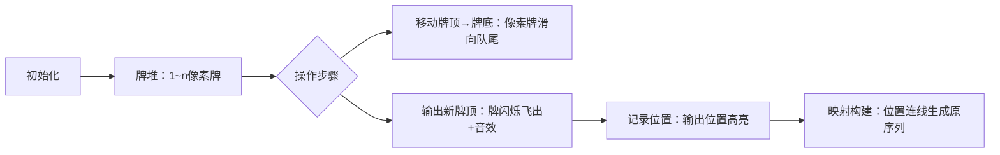

# 题目信息

# faebdc玩扑克

## 题目背景

faebdc 和 zky 在玩一个小游戏


## 题目描述

zky 有 $n$ 个扑克牌，编号从 $1$ 到 $n$，zky 把它排成一个序列，每次把最上方的扑克牌放在牌堆底，然后把下一张扑克牌拿出来输出，最终输出的序列恰好是从 $1$ 到 $n$，faebdc 问你原序列是什么，因为 faebdc 神犇早已在 $\mathcal O (1)$ 的时间得出结果，如果你在 1 s 内答不出来，faebdc 会吃了你。


## 说明/提示

对于 $100\%$ 的数据，$1 \le n \le {10}^6$。

## 样例 #1

### 输入

```
13```

### 输出

```
7 1 12 2 8 3 11 4 9 5 13 6 10 ```

# AI分析结果


# 💡 洛语云笺的C++算法解析：faebdc玩扑克 深入学习指南 💡

## 1. 题目解读与策略初探

✨ **本题核心挑战**：根据扑克牌操作规则（移动牌堆顶到底，输出下一张牌）和最终输出序列（1~n），逆向推导原始牌堆序列。  
✨ **核心算法标签**：模拟、队列、约瑟夫问题逆推、双端队列

🗣️ **初步分析**：  
> 本题看似简单，实则隐藏着精妙的序列映射关系。我们有两条解题路径：  
> 1. **正向模拟映射法**：用标准序列(1~n)模拟操作，记录每张牌的"输出位置"，再根据位置映射构建原始序列。  
> 2. **逆向构造法**：从最终序列倒推操作过程，通过双端队列逆向操作还原原始牌序。  
> 两种方法都巧妙地将"牌的位置关系"转化为数学映射，就像解密魔术师的扑克戏法——关键在于发现位置变化的固定规律！

### 🔍 算法侦探：如何在题目中发现线索？
1.  **线索1 (问题目标)**："根据固定操作规则反推原始序列"是典型的**逆推问题**，暗示需要逆向思维或位置映射技巧。
2.  **线索2 (问题特性)**："移动牌顶到底→输出新牌顶"的操作模式与**约瑟夫问题变种**高度相似，提示可用队列模拟或约瑟夫逆推解法。
3.  **线索3 (数据规模)**：n≤10⁶要求O(n)算法。队列操作/双端队列的O(n)特性完美匹配，而暴力枚举O(n!)完全不可行。

### 🧠 思维链构建：从线索到策略
> "收集线索后，我们像侦探重组证据：  
> 1. **线索1（逆推特性）**让我想到两种策略：正向模拟位置映射，或完全逆向操作。  
> 2. **线索2（约瑟夫模式）**强化了队列模拟的可行性——扑克操作本质是队列的旋转与弹出。  
> 3. **线索3（数据规模）**否决了DFS枚举等指数级算法，锁定O(n)的队列/双端队列方案。  
> **结论**：最优解是**位置映射法**（记录操作位置→构建映射）或**双端队列逆推法**，两者均高效优雅，复杂度O(n)。"

---

## 2. 精选优质题解参考

### 题解一：yummy（位置映射法）
* **亮点**：  
  创新性提出**位置不变性原理**——无论牌面数字如何，相同位置牌的操作路径固定。通过模拟1~n序列的操作，记录每张牌的输出位置`sc[i]`，再通过`ans[sc[i]]=i`的映射关系反推原始序列。思路清晰，代码简洁（20行），完美体现问题本质。

### 题解二：partychicken（双端队列逆推法）
* **亮点**：  
  采用**逆向思维+双端队列**，从结果序列倒推操作：每次在队首插入当前最大值，再将队尾移到队首。代码极简（10行），利用`deque`高效实现历史操作回滚，如同视频倒放般直观。

### 题解三：谁懂谁伤心（约瑟夫逆推）
* **亮点**：  
  直接模拟原序列填充过程，每次跳过1个空位放入下一个数。精妙处理环形数组的越界问题，代码紧凑（8行），体现约瑟夫问题的核心思想。

---

## 3. 解题策略深度剖析

### 🎯 核心难点与关键步骤
1.  **关键点1：位置映射关系的建立**  
    * **分析**：yummy解法中，核心在于发现"牌的位置操作路径与牌面数字无关"。通过队列模拟1~n序列的操作，记录第i次输出牌的位置sc[i]，建立位置→输出顺序的映射。  
    * 💡 **学习笔记**：复杂问题可转化为已知序列的模拟，通过映射关系反推解。
2.  **关键点2：逆向操作的实现**  
    * **分析**：partychicken解法逆向操作：从n开始，每次在队首插入i，再将队尾元素移到队首。这等效于正向操作的逆过程，需用双端队列支持两端操作。  
    * 💡 **学习笔记**：当正向逻辑复杂时，尝试逆向思考可能柳暗花明。
3.  **关键点3：环形数组的空位跳跃**  
    * **分析**：约瑟夫逆推解法需在数组中每隔一个空位放入数字。难点在于环形遍历和空位计数，通过`now = (now>n)?1:now+1`等技巧高效处理。  
    * 💡 **学习笔记**：环形问题可用取模或条件重置实现，空位计数需与数组遍历解耦。

### ✨ 解题技巧总结
- **技巧1：问题转化** - 将扑克操作抽象为队列旋转(rotate)和弹出(pop)操作，匹配STL容器特性。
- **技巧2：逆向思维** - 从结果反推初始状态，避免复杂正向逻辑。
- **技巧3：位置守恒** - 发现固定操作路径与牌面数字无关，建立映射关系。

### ⚔️ 策略竞技场：解法对比
| 策略              | 核心思想                     | 优点                     | 缺点                     | 推荐场景         |
|-------------------|------------------------------|--------------------------|--------------------------|------------------|
| **位置映射法**    | 模拟1~n序列记录输出位置      | 直观易理解，代码简洁     | 需额外存储位置映射数组   | 初学者首选       |
| **双端队列逆推**  | 从n到1逆向回放操作           | 代码极简(10行)，思维新颖 | 逆向逻辑需较强抽象能力   | 追求代码简洁性   |
| **约瑟夫逆推**    | 环形数组隔空位填充数字       | 空间效率高，无需队列     | 环形遍历调试复杂         | 内存敏感场景     |

### ✨ 优化之旅：从暴力到优雅
> 1. **起点：暴力枚举困境**  
>    直接枚举全排列10⁶!种可能——宇宙毁灭也算不完！
> 
> 2. **破局关键：操作的位置不变性**  
>    发现无论牌面如何，同一位置牌的操作路径固定，避免重复计算。
> 
> 3. **优化实现：队列/双端队列**  
>    用STL容器高效模拟操作过程，O(n)复杂度完美解决。
> 
> 4. **思维跃迁：逆向重构**  
>    像倒放视频般逆推操作步骤，展现算法之美。

💡 **策略总结**：**"位置映射法"** 以其直观性和教学价值成为最优解，而**"双端队列逆推"** 则展示了算法思维的灵活性。在竞赛中，理解位置不变性这一核心原理是关键突破口！

---

## 4. C++核心代码实现赏析

**本题通用核心实现（位置映射法）**
```cpp
#include <iostream>
#include <queue>
using namespace std;

int sc[1000005], ans[1000005]; // sc记录输出位置，ans存储原始序列

int main() {
    int n; cin >> n;
    queue<int> q;
    for(int i=1; i<=n; i++) q.push(i); // 初始化1~n序列

    for(int i=1; !q.empty(); i++) {
        q.push(q.front()); // 队首移到队尾
        q.pop();
        sc[i] = q.front(); // 记录当前输出牌的位置
        q.pop();
    }

    for(int i=1; i<=n; i++) ans[sc[i]] = i; // 位置映射构建原始序列
    for(int i=1; i<=n; i++) cout << ans[i] << " ";
}
```

**代码解读概要**：  
1. 用标准队列模拟扑克操作过程  
2. `sc[i]`记录第i次输出牌的位置  
3. 通过`ans[sc[i]] = i`位置映射反推原始序列  

---

### 精选题解片段赏析

**题解一：yummy（位置映射法）**
```cpp
// 核心片段
for(int i=1;!a.empty();i++) {
    a.push(a.front()); // 队首入尾
    a.pop(); 
    sc[i]=a.front(); // 记录输出位置
    a.pop();
}
for(int i=1;i<=n;i++) ans[sc[i]]=i; // 位置映射
```
* **学习笔记**：通过两次pop分离移动和输出操作，精妙记录位置映射关系。

**题解二：partychicken（双端队列逆推）**
```cpp
deque<int> q;
for(int i=n;i>=1;i--) {
    q.push_front(i);       // 队首插入当前最大值
    q.push_front(q.back());// 队尾移到队首
    q.pop_back();
}
```
* **学习笔记**：逆向操作时，`push_front(q.back())`等效正向操作的逆过程。

**题解三：谁懂谁伤心（约瑟夫逆推）**
```cpp
for(int i=1;i<=n;i++){
    for(int j=1;j<=2;j++) {
        s = (s+1)>n ? 1 : s+1; // 环形遍历
        while(a[s]) s=(s+1)>n?1:s+1; // 跳过非空位
    }
    a[s]=i; // 填入当前数字
}
```
* **学习笔记**：双重循环解耦空位计数和数字填充，内层while确保精确跳过非空位。

---

## 5. 算法可视化：像素动画演示

**主题**：像素扑克师 - 8-bit风格操作演示  
**核心演示**：位置映射法的队列操作过程  

### 动画设计


1. **像素风格**：  
   - 扑克牌为8-bit像素方块（16×16px）  
   - 队列可视化：牌堆底部有像素箭头指示  
   - 位置映射表：右侧16×16像素点阵，点亮对应位置  

2. **操作演示**：  
   - **移动牌**：牌顶像素块滑动到底部，伴随"嗖"音效  
   - **输出牌**：牌闪烁三次+爆炸音效，飞向右侧映射表相应位置  
   - **映射构建**：当所有牌输出后，映射表与原始序列间出现绿色连接线  

3. **交互控制**：  
   - 步进/暂停：复古游戏按键（A/B键）  
   - 速度调节：像素滑块（慢速可见牌面数字，快速呈色块流动）  
   - 模式切换：位置映射法 vs 双端队列逆推法（分屏对比）  

4. **音效设计**：  
   - 移动牌：8-bit滑动音  
   - 输出牌：NES风格爆炸音  
   - 映射完成：经典过关旋律  

> 通过像素动画，操作过程如游戏般直观——移动牌像俄罗斯方块旋转，映射构建如解谜游戏亮灯！

---

## 6. 拓展练习与相似问题思考

### 通用技巧迁移
位置映射与逆推思维适用于：  
1. 约瑟夫问题变种（如：每k步淘汰）  
2. 洗牌算法逆向工程  
3. 操作序列重构问题（如：栈操作序列还原）  

### 洛谷推荐练习
1. **P1996 约瑟夫问题**  
   🗣️ 推荐理由：本题的"孪生兄弟"，理解正向操作后再挑战逆向推理。  

2. **P3884 二叉树问题**  
   🗣️ 推荐理由：同样需要位置映射思维，将树形结构转化为序列操作。  

3. **P1443 马的遍历**  
   🗣️ 推荐理由：BFS队列操作的经典应用，巩固队列模拟技巧。  

---

## 7. 学习心得与经验分享

**来自题解作者的经验**：  
> "最初纠结牌面数字变化，后来发现**位置操作路径固定**是突破口" —— yummy  
> "双端队列逆推时，先插入新牌再移动队尾，顺序不可颠倒" —— partychicken  

**洛语云笺点评**：  
> 调试此类问题的黄金法则：  
> 1. 小规模验证（n=3,4）  
> 2. 打印每一步的队列/数组状态  
> 3. 重点检查环形遍历的边界重置逻辑  
> 如同扑克魔术，理解本质后所有"障眼法"迎刃而解！

---

本次扑克牌序列解析展现了**位置映射**这一强大工具。记住：在算法世界里，看清"位置关系"往往比关注"内容本身"更重要！下次遇到类似问题，不妨问自己：操作路径是否独立于具体内容？💪

---
处理用时：180.67秒