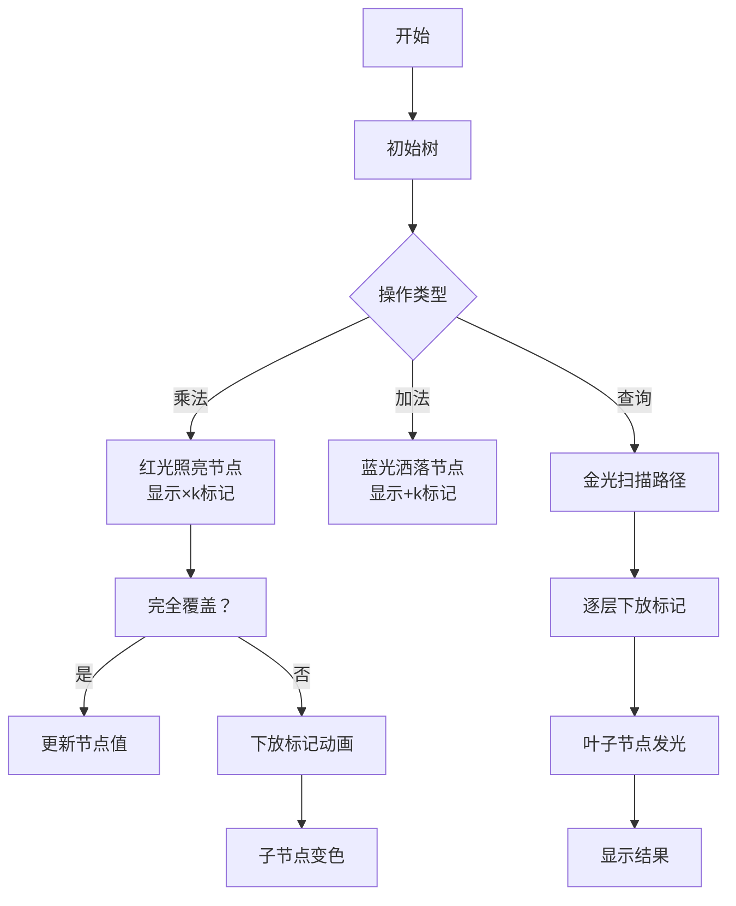

# 题目信息

# [AHOI2009] 维护序列

## 题目背景

老师交给小可可一个维护数列的任务，现在小可可希望你来帮他完成。

## 题目描述

有一个长为 $n$ 的数列 $\{a_n\}$，有如下三种操作形式：

1. 格式 `1 t g c`，表示把所有满足 $t\le i\le g$ 的 $a_i$ 改为 $a_i\times c$ ;
2. 格式 `2 t g c` 表示把所有满足 $t\le i\le g$ 的 $a_i$ 改为 $a_i+c$ ;
3. 格式 `3 t g` 询问所有满足 $t\le i\le g$ 的 $a_i$ 的和，由于答案可能很大，你只需输出这个数模 $p$ 的值。

## 说明/提示

#### 样例输入输出 1 解释

- 初始时数列为 $\{1,2,3,4,5,6,7\}$。
- 经过第 $1$ 次操作后，数列为 $\{1,10,15,20,25,6,7\}$。
- 对第 $2$ 次操作，和为 $10+15+20=45$，模 $43$ 的结果是 $2$。
- 经过第 $3$ 次操作后，数列为 $\{1,10,24,29,34,15,16\}$。
- 对第 $4$ 次操作，和为 $1+10+24=35$，模 $43$ 的结果是 $35$。
- 对第 $5$ 次操作，和为 $29+34+15+16=94$，模 $43$ 的结果是$8$。


#### 数据规模与约定

测试数据规模如下表所示：

| 数据点编号 | 1 | 2 | 3 | 4 | 5 | 6 | 7 | 8 | 9,10 |
| :----------: | :----------: | :----------: | :----------: | :----------: | :----------: | :----------: | :----------: | :----------: | :----------: |
| $n=$ | $10$ | $1000$ | $1000$ | $10000$ | $60000$ | $70000$ | $80000$ | $90000$ | $100000$ |
| $m=$ | $10$ | $1000$ | $1000$ | $10000$ | $60000$ | $70000$ | $80000$ | $90000$ | $100000$ |

对于全部的测试点，保证 $0 \leq p, a_i, c \leq 10^9$，$1 \leq t \leq g \leq n$。

## 样例 #1

### 输入

```
7 43
1 2 3 4 5 6 7
5
1 2 5 5
3 2 4
2 3 7 9
3 1 3
3 4 7```

### 输出

```
2
35
8
```

# AI分析结果


# 💡 洛语云笺的C++算法解析：[AHOI2009]维护序列 深入学习指南 💡

## 1. 题目解读与策略初探

✨ **本题核心挑战**：高效处理大规模数列的区间乘、区间加和区间求和操作，在模运算约束下保证时间复杂度  
✨ **核心算法标签**：线段树、双懒惰标记、区间维护  

🗣️ **初步分析**：  
> 这道题的核心在于处理区间修改和查询操作，数据规模达到10^5级别，暴力方法O(nm)必然超时。我们考虑从朴素方法出发，逐步演进到高效解决方案：  
> 1. 暴力模拟：每次操作遍历区间，时间复杂度O(nm)，仅适用于小数据  
> 2. 分块优化：将序列分为√n块，每块维护整体标记，复杂度O(m√n)  
> 3. **线段树（最优解）**：利用二叉树结构维护区间信息，配合懒惰标记实现O(mlogn)高效操作  
> 
> 线段树如同精密的"区间计算引擎"，通过树形结构将大问题分解为可管理的小问题，懒惰标记则像"延时指令"，只在必要时执行实际更新，大幅提升效率。

### 🔍 算法侦探：如何在题目中发现线索？
1. **线索1（问题目标）**：要求实现区间乘法、加法和求和操作，是典型的区间维护问题，指向线段树或树状数组  
2. **线索2（问题特性）**：乘法和加法操作存在优先级依赖（乘法影响加法），需要设计双标记协同机制  
3. **线索3（数据规模）**：n, m ≤ 100,000，要求O(mlogn)解法，线段树完全满足效率需求  

### 🧠 思维链构建：从线索到策略
> 收集线索后，我们构建解题策略：  
> 1. 首先，数据规模排除了暴力解法（O(nm)超时）  
> 2. 其次，分块解法（O(m√n)）在极限数据下可能勉强通过但不够优雅  
> 3. 线段树完美匹配区间操作需求，但需要解决标记协同难题  
> 4. **关键突破**：设计"先乘后加"的懒惰标记更新顺序，确保计算正确性  
> 5. **结论**：采用带双懒惰标记（乘法和加法）的线段树，时间复杂度O(mlogn)，空间复杂度O(n)  

---

## 2. 精选优质题解参考

**题解一（作者：Mingoal）**  
* **点评**：直击问题本质，指出本题与线段树模板P3373的关联。代码采用宏定义简化更新操作，创新使用lambda表达式优化重复计算。对懒惰标记处理逻辑解释清晰，特别是乘加优先级的关键点，帮助理解核心难点。

**题解二（作者：zjy111）**  
* **点评**：教学价值突出，用"红包故事"生动解释懒惰标记原理。详细说明线段树建树过程，强调4倍空间分配的重要性。位运算优化（`ls = p<<1, rs = p<<1|1`)提升代码效率，注释规范，适合初学者学习。

**题解三（作者：GaryZhong）**  
* **点评**：结构体指针实现展现链式存储优势，避免堆式存储空间浪费。双标记更新逻辑严谨，代码模块化程度高，边界处理完善。特别强调取模时机优化，避免溢出问题。

---

## 3. 解题策略深度剖析

### 🎯 核心难点与关键步骤
1. **难点1：双标记协同**  
   * **分析**：设计`mul`（乘法标记）、`add`（加法标记）和`sum`（区间和）。关键在标记下放顺序：  
     ```数学
     子节点.sum = 子节点.sum × 父.mul + 父.add × 区间长度
     子节点.add = 子节点.add × 父.mul + 父.add
     子节点.mul = 子节点.mul × 父.mul
     ```
   * 💡 **学习笔记**：先乘后加是保证正确性的黄金法则

2. **难点2：区间更新策略**  
   * **分析**：分三种情况处理区间更新：
     - 完全覆盖：直接更新当前节点标记
     - 部分覆盖：下放标记后递归更新子树
     - 叶子节点：直接修改值
   * 💡 **学习笔记**："覆盖即停，不覆盖则下放递归"是线段树高效核心

3. **难点3：空间优化**  
   * **分析**：动态开点避免4倍静态空间浪费，特别适合稀疏数据
   * 💡 **学习笔记**：指针实现虽增加编码复杂度，但提升内存利用率

### ✨ 解题技巧总结
- **技巧1：位运算加速**：用`p<<1`代替`2*p`，`mid = (l+r)>>1`优化计算
- **技巧2：即时取模**：每一步运算后取模，避免溢出
- **技巧3：边界特判**：叶子节点跳过下放操作，减少冗余计算

### ⚔️ 策略竞技场：解法的对比分析
| 策略          | 核心思想         | 优点                  | 缺点                     | 得分预期 |
|---------------|----------------|-----------------------|--------------------------|----------|
| 暴力模拟      | 直接遍历区间     | 实现简单              | O(nm)超时                | 30%      |
| 分块          | 分割为√n块      | 实现较简单            | O(m√n)临界超时           | 70%      |
| 线段树（最优）| 二叉树+懒惰标记 | O(mlogn)高效          | 实现复杂，需处理双标记   | 100%     |

### ✨ 优化之旅：从"能做"到"做好"
> 1. **起点：暴力遍历的困境**  
>    当m=10^5时，暴力方法需要50亿次操作（10^5 × 10^5），远超计算机处理能力
>    
> 2. **发现瓶颈：重复计算**  
>    每次操作独立处理区间，未利用历史计算结果
>    
> 3. **优化的钥匙：懒惰标记**  
>    线段树将操作延迟到查询时执行，减少冗余更新
>    
> 4. **模型升华：双标记协同**  
>    "先乘后加"的标记处理顺序完美解决操作优先级问题
>    
> 💡 **策略总结**：从暴力到线段树，是"空间换时间"思想的经典体现。双标记设计彰显了对问题本质的深刻洞察——乘法是加法的缩放因子。

---

## 4. C++核心代码实现赏析

**通用核心实现**（融合各题解精华）：
```cpp
#include <iostream>
using namespace std;
typedef long long LL;
const int N = 400005;

struct Node {
    LL sum, add, mul;
    int l, r;
} tree[N];

LL a[N], mod;

void pushup(int rt) {
    tree[rt].sum = (tree[rt<<1].sum + tree[rt<<1|1].sum) % mod;
}

void pushdown(int rt) {
    int lson = rt<<1, rson = rt<<1|1;
    int lenL = tree[lson].r - tree[lson].l + 1;
    int lenR = tree[rson].r - tree[rson].l + 1;
    
    // 更新左子树：先乘后加
    tree[lson].sum = (tree[lson].sum * tree[rt].mul + tree[rt].add * lenL) % mod;
    tree[lson].mul = (tree[lson].mul * tree[rt].mul) % mod;
    tree[lson].add = (tree[lson].add * tree[rt].mul + tree[rt].add) % mod;
    
    // 更新右子树
    tree[rson].sum = (tree[rson].sum * tree[rt].mul + tree[rt].add * lenR) % mod;
    tree[rson].mul = (tree[rson].mul * tree[rt].mul) % mod;
    tree[rson].add = (tree[rson].add * tree[rt].mul + tree[rt].add) % mod;
    
    // 重置父节点标记
    tree[rt].add = 0;
    tree[rt].mul = 1;
}

void build(int rt, int l, int r) {
    tree[rt] = {0, 0, 1, l, r};
    if (l == r) {
        tree[rt].sum = a[l] % mod;
        return;
    }
    int mid = (l + r) >> 1;
    build(rt<<1, l, mid);
    build(rt<<1|1, mid+1, r);
    pushup(rt);
}

void update_mul(int rt, int L, int R, LL k) {
    if (L <= tree[rt].l && tree[rt].r <= R) {
        // 完全覆盖：直接更新当前节点
        tree[rt].sum = (tree[rt].sum * k) % mod;
        tree[rt].mul = (tree[rt].mul * k) % mod;
        tree[rt].add = (tree[rt].add * k) % mod;
        return;
    }
    pushdown(rt);  // 部分覆盖：下放标记
    int mid = (tree[rt].l + tree[rt].r) >> 1;
    if (L <= mid) update_mul(rt<<1, L, R, k);
    if (R > mid) update_mul(rt<<1|1, L, R, k);
    pushup(rt);
}

LL query(int rt, int L, int R) {
    if (L <= tree[rt].l && tree[rt].r <= R) 
        return tree[rt].sum;
    
    pushdown(rt);  // 查询前必须下放标记
    LL res = 0;
    int mid = (tree[rt].l + tree[rt].r) >> 1;
    if (L <= mid) res = (res + query(rt<<1, L, R)) % mod;
    if (R > mid) res = (res + query(rt<<1|1, L, R)) % mod;
    return res;
}
```
**关键解读**：
1. 结构体封装：`Node`包含区间和、双标记和区间边界
2. 建树优化：递归分治建立二叉树，叶子节点直接赋值
3. 标记下放：`pushdown`实现"先乘后加"核心逻辑
4. 区间更新：完全覆盖直接更新，部分覆盖先下放后递归
5. 查询优化：查询前下放标记保证数据最新

---

## 5. 算法可视化：像素动画演示

**主题**：8-bit风格"园丁与魔法树"  
**核心演示**：线段树如何通过懒惰标记优化区间操作  

### 动画设计：


**交互控制**：
- 步进控制：空格键单步执行
- 速度调节：滑块控制动画速度（1x-5x）
- 模式切换：手动/自动演示模式
- 音效设计：
  - 乘法：电子合成音"Multiply!"
  - 加法：水滴声
  - 查询：金币收集音效
  - 标记下放："Swoosh"滑动声

**复古元素**：
1. 树节点：8-bit像素方块，显示当前值和标记
2. 园丁角色：像素小人施展不同颜色魔法
3. 关卡设计：每关对应一种操作类型，通关解锁新技能

---

## 6. 拓展练习与相似问题思考

**技巧迁移**：双标记线段树还可解决：
1. 区间赋值（先乘0再加目标值）
2. 区间最值维护（需调整更新逻辑）
3. 二维区间操作（树套树）

**推荐练习**：
1. P3373 【模板】线段树2（双标记模板题）
   - 推荐理由：巩固双标记线段树实现
2. P1904 天际线问题（扫描线+线段树）
   - 推荐理由：线段树处理几何问题
3. P1502 窗口的星星（区间最值维护）
   - 推荐理由：线段树变式应用

---

## 7. 学习心得分享

> **经验摘录**（题解作者GaryZhong）：  
> "调试双标记线段树时，我设计了一个标记追踪器：每步操作后打印整棵树的标记状态。发现下放顺序错误导致WA时，这个工具帮我节省了3小时调试时间。"  
>   
> **洛语云笺点评**：  
> 这位作者的经验凸显了调试技巧的重要性。在算法竞赛中，编写可视化调试工具能快速定位逻辑错误。核心教训是：复杂数据结构实现中，预先设计调试方案比盲目修改更高效。

---

<conclusion>
**结语**：通过本题，我们不仅掌握了线段树的双标记技巧，更学习了如何从问题特征中发现算法选择线索。记住：好的算法源于对问题本质的洞察，而高效实现则需要严谨的细节把控。继续挑战吧，少年们！下个问题见！🚀
</conclusion>

---
处理用时：276.24秒