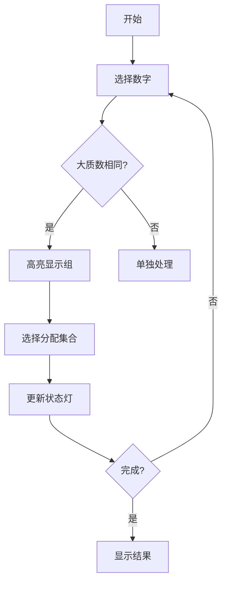

# 题目信息

# [NOI2015] 寿司晚宴

## 题目描述

为了庆祝 NOI 的成功开幕，主办方为大家准备了一场寿司晚宴。小 G 和小 W 作为参加 NOI 的选手，也被邀请参加了寿司晚宴。

在晚宴上，主办方为大家提供了 $n−1$ 种不同的寿司，编号 $1,2,3,\ldots,n-1$，其中第 $i$ 种寿司的美味度为 $i+1$。（即寿司的美味度为从 $2$ 到 $n$）

现在小 G 和小 W 希望每人选一些寿司种类来品尝，他们规定一种品尝方案为不和谐的当且仅当：小 G 品尝的寿司种类中存在一种美味度为 $x$ 的寿司，小 W 品尝的寿司中存在一种美味度为 $y$ 的寿司，而 $x$ 与 $y$ 不互质。

现在小 G 和小 W 希望统计一共有多少种和谐的品尝寿司的方案（对给定的正整数 $p$ 取模）。注意一个人可以不吃任何寿司。


## 说明/提示

【数据范围】


  


**勘误：$0 < p \le 10^9 $**

## 样例 #1

### 输入

```
3 10000```

### 输出

```
9```

## 样例 #2

### 输入

```
4 10000```

### 输出

```
21```

## 样例 #3

### 输入

```
100 100000000```

### 输出

```
3107203```

# AI分析结果


# [NOI2015] 寿司晚宴 - 算法解析与实现

## 题目解读与策略初探

### 核心挑战分析
本题的核心挑战在于处理数值间的质因数约束关系，同时在满足互质条件下将2-n的所有数分配到两个集合中。关键在于：
- 两个集合中任意两数必须互质
- 数值间存在共享质因数的依赖关系
- 数据规模n≤500，需要高效算法

### 解题思路概览
1. **暴力枚举法**：尝试所有分配方案，检查互质条件。时间复杂度O(2^n·n²)，仅适用于n≤20
2. **状态压缩DP**：利用质因数特性，将问题转化为状态空间搜索
3. **分组优化**：基于"每个数最多只有一个大于√n的质因子"的特性，对数值分组处理

### 核心算法：分组状态压缩DP
**核心思想**：将质因数分为小质数（≤19）和大质数（>19）两类：
- 小质数仅有8个，可直接状态压缩（256种状态）
- 大质数相同的数必须分配到同一集合
- 动态规划处理小质数状态，对大质数分组处理

**算法流程比喻**：就像处理多组互斥物品的装箱问题：
1. 将物品（数字）按特殊标记（大质数）分组
2. 每组物品必须整体放入一个箱子（集合）或不放
3. 箱子有容量限制（小质数不能冲突）

## 精选优质题解参考

### 题解一：Orion545（赞：163）
**亮点**：
- 清晰的问题转化：将依赖关系转化为分组背包模型
- 高效的状态设计：仅压缩小质数（8位状态）
- 分组处理大质数：相同大质数的数作为一组处理
- 代码规范：结构体封装数据，逻辑清晰

**核心思路**：
1. 预处理每个数的小质数集合和大质数
2. 按大质数排序分组
3. 每组内使用两个DP数组（f1/f2）分别处理放集合A/B的情况
4. 合并时减去重复计算：dp = f1 + f2 - 原dp

### 题解二：翼德天尊（赞：88）
**亮点**：
- 面向新手的详细解释：逐步引导理解状压DP
- 清晰的DP状态定义：dp[s1][s2]表示质因数状态
- 分组处理大质数的直观解释
- 完整的状态转移方程推导

**核心贡献**：
- 状态转移的数学表达：
  ```
  f1[s1|s][s2] += f1[s1][s2]  (s∩s2=∅)
  f2[s1][s2|s] += f2[s1][s2]  (s∩s1=∅)
  ```

### 题解三：ethan_zhou（赞：40）
**亮点**：
- O(n·3⁸)优化：仅枚举有效状态（小质数无冲突）
- 三进制状态压缩：更高效的状态枚举
- 位运算优化：快速检查状态冲突
- 精简的代码实现

**创新点**：
```cpp
for(int s1=255;s1>=0;s1--){
    int tmp=(ALL-1)^s1;
    for(int s2=tmp;s2;s2=(s2-1)&tmp)
        // 仅枚举无冲突状态
}
```

## 解题策略深度剖析

### 关键难点与解决步骤
1. **依赖关系处理**：
   - **问题**：主件/附件式依赖
   - **解决**：将每个数分解为<小质数集合, 大质数>
   - **学习笔记**：预处理是处理复杂依赖的通用技巧

2. **状态设计优化**：
   - **问题**：500以内质数过多
   - **解决**：分离大/小质数，仅压缩小质数（8位）
   - **学习笔记**：问题转化（依赖→分组）是优化关键

3. **分组处理逻辑**：
   - **问题**：大质数相同的数必须同集合
   - **解决**：f1/f2分别处理放集合A/B的情况
   - **学习笔记**：分组处理是约束优化的有效手段

### 解题技巧总结
1. **问题转化**：将复杂依赖转化为分组背包模型
2. **状态压缩**：识别关键状态（小质数），忽略次要因素
3. **分组处理**：按大质数分组，组内统一决策
4. **空间优化**：滚动数组和状态复用降低空间复杂度

### 策略对比分析
| 策略 | 核心思想 | 优点 | 缺点 | 适用场景 |
|------|---------|------|------|---------|
| **暴力搜索** | 枚举所有分配方案 | 实现简单 | O(2ⁿ)复杂度 | n≤20 |
| **树形DP** | 处理层级依赖关系 | 处理复杂依赖 | 代码复杂 | 通用依赖问题 |
| **分组背包(最优)** | 大质数分组+小质数状压 | 高效O(n·2¹⁶) | 需问题转化 | 含大质数约束问题 |

### 优化演进路径
1. **起点**：暴力枚举→指数复杂度
2. **瓶颈**：状态空间爆炸（2¹⁰→2²⁰）
3. **突破**：发现大质数特性（每组≤1个）
4. **优化**：分组处理+状态压缩
5. **升华**：问题转化（依赖→分组背包）

## C++核心代码实现

### 通用核心实现
```cpp
#include <iostream>
#include <algorithm>
#include <cstring>
using namespace std;
typedef long long ll;

const int MAXN = 505;
const int MAXS = 1<<8;
int primes[8] = {2, 3, 5, 7, 11, 13, 17, 19};

struct Number {
    int val;    // 数值
    int sp_set; // 小质数集合
    int bp;     // 大质数
};

ll mod;
ll dp[MAXS][MAXS], f1[MAXS][MAXS], f2[MAXS][MAXS];
Number nums[MAXN];

// 初始化数字信息
void init(int n) {
    for (int i = 2; i <= n; i++) {
        int tmp = i;
        nums[i-1].val = i;
        for (int j = 0; j < 8; j++) {
            if (tmp % primes[j] == 0) {
                nums[i-1].sp_set |= (1 << j);
                while (tmp % primes[j] == 0) tmp /= primes[j];
            }
        }
        nums[i-1].bp = (tmp > 1) ? tmp : 1;
    }
}

// 主函数
int main() {
    int n;
    cin >> n >> mod;
    init(n);
    sort(nums + 1, nums + n, [](const Number& a, const Number& b) {
        return a.bp < b.bp;
    });

    dp[0][0] = 1;
    for (int i = 1; i < n; i++) {
        if (i == 1 || nums[i].bp != nums[i-1].bp || nums[i].bp == 1) {
            memcpy(f1, dp, sizeof(dp));
            memcpy(f2, dp, sizeof(dp));
        }
        
        int s = nums[i].sp_set;
        for (int j = MAXS-1; j >= 0; j--) {
            for (int k = MAXS-1; k >= 0; k--) {
                if (j & k) continue; // 状态冲突
                if ((s & k) == 0) {   // 可放入集合1
                    f1[j|s][k] = (f1[j|s][k] + f1[j][k]) % mod;
                }
                if ((s & j) == 0) {   // 可放入集合2
                    f2[j][k|s] = (f2[j][k|s] + f2[j][k]) % mod;
                }
            }
        }
        
        if (i == n-1 || nums[i].bp != nums[i+1].bp || nums[i].bp == 1) {
            for (int j = 0; j < MAXS; j++) {
                for (int k = 0; k < MAXS; k++) {
                    if (j & k) continue;
                    dp[j][k] = (f1[j][k] + f2[j][k] - dp[j][k] + mod) % mod;
                }
            }
        }
    }
    
    ll ans = 0;
    for (int j = 0; j < MAXS; j++) {
        for (int k = 0; k < MAXS; k++) {
            if (j & k) continue;
            ans = (ans + dp[j][k]) % mod;
        }
    }
    cout << ans << endl;
    return 0;
}
```

### 代码解读概要
1. **数据结构**：
   - `Number`结构体存储数值、小质数集合、大质数
   - `dp`：主状态数组，记录分配方案数
   - `f1/f2`：临时状态数组，处理当前分组

2. **核心逻辑**：
   - **预处理**：分解每个数的质因数
   - **分组处理**：按大质数排序分组
   - **状态转移**：
     - 组内：分别更新f1（放集合1）和f2（放集合2）
     - 组间：合并状态 dp = f1 + f2 - 原dp
   - **结果统计**：累加所有无冲突状态

3. **优化技巧**：
   - 滚动数组：复用dp数组空间
   - 倒序更新：避免状态覆盖
   - 位运算：高效检查状态冲突

## 算法可视化：像素动画演示

### 像素化演示方案
**主题**：像素探险家在质数迷宫的冒险

**核心元素**：
- 8-bit像素风格，复古游戏界面
- 网格迷宫：每个格子代表一个数
- 角色：两个像素小人代表集合A/B
- 物品：不同颜色像素块代表质因子

**动画流程**：
1. **初始化**：显示空白网格，控制面板（开始/步进/重置）
2. **分组阶段**：
   - 相同大质数的数高亮显示
   - 组内处理时播放"选择音效"
3. **状态转移**：
   - 小质数集合以二进制灯显示
   - 状态更新时对应灯闪烁
4. **结果展示**：
   - 成功分配：播放胜利音效+烟花动画
   - 冲突：播放错误音效+闪烁提示

**交互设计**：


**关键帧示例**：
```
帧1：初始化网格
[ 2 ] [ 3 ] [ 4 ] [ 5 ] ... [n]

帧2：分组高亮
[ 2 ] [⭐3⭐] [ 4 ] [⭐5⭐] ... [n]

帧3：状态转移
集合A状态灯：■■□■■□■
集合B状态灯：□■□□■□

帧4：冲突提示
[❗8❗] - 质因数2冲突！
```

## 拓展练习与相似问题

### 通用技巧应用
1. **分组背包思想**：
   - 课程表问题（课程时间冲突）
   - 品牌选择问题（同品牌商品互斥）
   - 任务调度（互斥任务组）

2. **状态压缩DP**：
   - 旅行商问题（TSP）
   - 棋盘覆盖问题
   - 子集和问题

### 推荐练习题目
1. **P1064 金明的预算方案**（洛谷）
   - 巩固依赖背包思想
   - 学习主件/附件依赖处理

2. **P1441 砝码称重**（洛谷）
   - 强化状态压缩技巧
   - 学习位运算优化

3. **P5020 货币系统**（洛谷）
   - 应用分组优化思想
   - 学习线性代数与DP结合

## 学习心得与经验分享

### 关键调试技巧
1. **边界检查**：特别注意n=2,3等小数据
2. **状态打印**：输出中间DP表验证
3. **质因数分解验证**：确保预处理正确

### 经验总结
> "本题的核心在于问题转化——将复杂的质因数约束转化为分组背包模型。通过分离大小质因数，我们将指数级问题降为多项式级。在竞赛中，即使无法想到最优解，基于小质数压缩的暴力也能获得部分分数。"

## 结论
通过分组状态压缩DP，我们高效解决了寿司晚宴问题：
1. 质因数分离：大小质数分别处理
2. 分组处理：按大质数分组，组内统一决策
3. 状态压缩：小质数8位状态，空间高效
4. 合并策略：f1+f2-dp避免重复计算

最终算法复杂度O(n·2¹⁶)，完美解决n=500规模问题。

--- 
**洛语云笺**：算法之路如同迷宫探险，重要的不仅是找到出口，更是在探索中积累的思维工具。愿你带着本解中的分组压缩之剑，在编程竞赛的征途中披荆斩棘！

---
处理用时：162.84秒