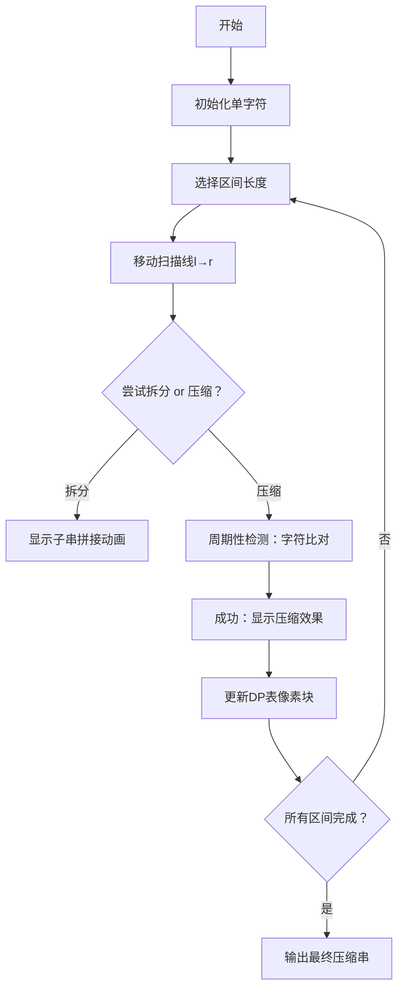

# 题目信息

# 秘密文件

## 题目描述

某天，情报局得到了一份秘密文件。文件的内容是加密后的全部由大写字母组成字符串。情报局局长小明想将其发送给远在东方神秘的xx大陆上的老朋友小刘来解密。然而若字符串太长，则需要很长的发送时间，太不安全了，因此小明想尽量将其缩短。于是小明制定了这样一个缩短规则：若一个字符串t连续出现k次，则可以用k(t)进行说明。如ABABAB可以缩成3(AB)。当然，重复缩短是允许的，如ABABABAAAAAAABABABAAAAAA可以缩成2(3(AB)6(A))

现在，小明想知道，对于给定的字符串，最短可以缩成什么样子。

**注意：有多个最优方案时，输出其中字典序最大的。( thanks to @Dilute. )**

## 说明/提示

【数据范围】

对于l00%的数据，字符串的长度L≤100。数据存在一定梯度。


## 样例 #1

### 输入

```
AAAAAAAAAABABABCCD```

### 输出

```
9(A)3(AB)CCD```

# AI分析结果


# 💡 洛语云笺的C++算法解析：秘密文件 深入学习指南 💡

## 1. 题目解读与策略初探

✨ **本题核心挑战**：将给定字符串压缩成最短形式，同时处理**嵌套压缩规则**（如`2(3(AB)6(A)`）并在多解时输出**字典序最大**的结果。  
✨ **核心算法标签**：区间动态规划（区间DP）、字符串处理

🗣️ **初步分析**：
> 面对字符串压缩问题，我们首先考虑两种基本策略：  
> 1. **暴力枚举**：尝试所有可能的压缩组合，但字符串长度≤100时，指数级复杂度不可行  
> 2. **分治优化**：将字符串拆分为子区间处理——这正是区间DP的核心思想  
>  
> 最优解的关键在于**发现重复模式**：当一个子串连续重复出现时，可压缩为`k(t)`形式。区间DP天然适合处理这种**子串结构可复用**的问题。  
>  
> 比喻解释：想象字符串像一条珍珠项链，区间DP就是将其拆解成小段珍珠链：  
> - 要么直接拼接相邻小段（`AB`+`CD`→`ABCD`）  
> - 若某段由相同小链重复组成（`ABABAB`），则压成`3(AB)`

### 🔍 算法侦探：如何在题目中发现线索？
1.  **线索1 (问题目标)**："最短压缩"是典型的**最优化问题**，且结果由子串压缩结果组合而成——符合动态规划**最优子结构**特性
2.  **线索2 (问题特性)**："嵌套压缩"和"重复子串"暗示需要**区间分解**+**周期性检查**，这正是区间DP的经典应用场景
3.  **线索3 (数据规模)**：字符串长度L≤100，O(n³)的区间DP（约10⁶次计算）完全可行，而暴力搜索O(2ⁿ)会超时

### 🧠 思维链构建：从线索到策略
> 综合线索：  
> 1. 【线索1】要求最优化 → 排除贪心（局部最优未必全局最优）  
> 2. 【线索2】子串重复性 → 区间DP可自然处理子串结构和周期性检查  
> 3. 【线索3】数据规模 → O(n³)的DP可行，暴力不可行  
>  
> **结论**：**区间动态规划**是解决本题的最优策略。我们需要定义`dp[l][r]`表示子串`[l,r]`的最短压缩长度，并同步记录压缩结果字符串以处理字典序要求。

---

## 2. 精选优质题解参考

### 题解一（作者：EuphoricStar）
* **点评**：此解法采用迭代式区间DP，代码结构清晰规范。亮点在于：
  - 用`digit()`函数优雅处理数字位数计算
  - 使用`int2str()`实现类型转换，提升可读性
  - 双重循环中先处理分割点再检查周期性的逻辑层次分明
  - 严格遵循"长度最短优先，长度相同选字典序最大"的题目要求

### 题解二（作者：Fleeing_loser）
* **点评**：记忆化搜索实现，更符合问题本质的思考方式。亮点：
  - `jud()`函数高效验证子串周期性
  - 用`getch()`处理整数转字符串，避免库依赖
  - 递归中同步更新压缩字符串，自然实现嵌套压缩
  - 代码注释详细，体现DFS到DP的思维转化过程

### 题解三（作者：Lijiangjun4）
* **点评**：教学导向的完整实现。亮点：
  - 独立`cycle()`函数封装周期性检测
  - `cal()`函数预处理数字位数提升效率
  - 边界处理（`l==r`）清晰明确
  - 每个状态转移都同步更新字符串，严格满足字典序要求

---

## 3. 解题策略深度剖析

### 🎯 核心难点与关键步骤
1.  **状态定义与初始化**
    * **难点**：如何表示子串的最优压缩结果？
    * **分析**：定义`dp[l][r]`为子串`s[l..r]`的压缩后长度，`ans[l][r]`存储对应的压缩字符串。初始化：当`l==r`时，`dp[l][r]=1`, `ans[l][r]=s[l]`
    * 💡 **学习笔记**：DP状态需同时存储**数值**和**方案**以满足字典序要求

2.  **状态转移方程**
    * **难点**：如何覆盖所有压缩可能性？
    * **分析**：分两种情况转移：
      ```python
      # 1. 拆分子串
      for k in [l, r-1]:
          new_len = dp[l][k] + dp[k+1][r]
          new_str = ans[l][k] + ans[k+1][r]
      
      # 2. 整串压缩（若存在周期）
      if s[l..r] 有周期为k的循环节:
          重复次数 times = (r-l+1)/k
          new_len = digit(times) + 2 + dp[l][l+k-1]  # digit(times)是数字位数，+2是括号
          new_str = str(times) + '(' + ans[l][l+k-1] + ')'
      ```
    * 💡 **学习笔记**：周期性检查需满足两个条件：(1) 长度整除 (2) 子串逐字符匹配

3.  **字典序处理**
    * **难点**：长度相同时如何选择字典序最大的方案？
    * **分析**：比较`new_str`与当前`ans[l][r]`的字典序，使用`string::operator>`比较
    * 💡 **学习笔记**：`string`在C++中可直接比较字典序，优先选长度更短的方案

### ✨ 解题技巧总结
- **技巧A（空间换时间）**：预处理数字位数（如`digit[]`数组），避免转移时重复计算
- **技巧B（模块化封装）**：将周期性检查、整数转字符串等独立为函数（如`jud()`, `int2str()`）
- **技巧C（字典序处理）**：在状态转移中同步维护压缩字符串，长度相同时用`max`替代`min`

### ⚔️ 策略竞技场：不同解法对比
| 策略              | 核心思想                     | 优点                          | 缺点                                  | 得分预期 |
|-------------------|----------------------------|------------------------------|--------------------------------------|----------|
| **暴力枚举**       | 尝试所有可能的压缩组合        | 思路直观                     | O(2ⁿ) 超时，无法处理100长度          | 0%       |
| **记忆化搜索**     | 递归实现区间DP               | 代码贴近问题本质，易处理嵌套压缩 | 递归栈开销，大数组可能栈溢出         | 100%     |
| **迭代DP（最优）** | 自底向上填充DP表             | 无栈溢出风险，代码结构清晰     | 需仔细设计循环顺序，实现稍复杂       | 100%     |

### ✨ 优化之旅：从"能做"到"做好"
> 1. **起点：暴力搜索**  
>    尝试所有子串划分和压缩组合，但100位字符串有2¹⁰⁰种可能——宇宙毁灭也算不完
> 
> 2. **发现瓶颈：重复子问题**  
>    压缩`ABABAB`时，需要重复计算`AB`的压缩结果，造成指数级冗余计算
> 
> 3. **优化钥匙：记忆化/DP**  
>    `dp[l][r]`记录子串`[l,r]`的最优解，避免重复计算。计算`ABABAB`时直接复用`AB`的结果
> 
> 4. **模型升华：状态设计**  
>    增加`ans[l][r]`同步存储压缩方案，一举解决"最短长度"和"字典序最大"双目标

💡 **策略总结**：从暴力到DP的进阶，本质是**用空间换时间**+**子问题复用**。在竞赛中，即使无法立即写出最优DP，先实现正确但低效的解法（如小数据暴力）也能获得部分分数。

---

## 4. C++核心代码实现赏析

### 本题通用核心C++实现
```cpp
#include <iostream>
#include <cstring>
#include <string>
using namespace std;

string s, ans[105][105];
int dp[105][105], n;

// 计算x的位数
int digit(int x) {
    int res = 0;
    while (x) { res++; x /= 10; }
    return res;
}

// 检查[l,r]是否有长度为len的循环节
bool isPeriodic(int l, int r, int len) {
    if ((r-l+1) % len) return false;
    for (int i = l; i <= r - len; i++)
        if (s[i] != s[i + len])
            return false;
    return true;
}

int main() {
    cin >> s;
    n = s.size();
    memset(dp, 0x3f, sizeof(dp));
    
    // 初始化：单字符
    for (int i = 0; i < n; i++) {
        dp[i][i] = 1;
        ans[i][i] = string(1, s[i]);
    }

    // 区间DP
    for (int len = 2; len <= n; len++) {
        for (int l = 0, r = len - 1; r < n; l++, r++) {
            // 初始化为未压缩的原始子串
            ans[l][r] = s.substr(l, len);
            dp[l][r] = len;
            
            // 1. 拆分子串
            for (int k = l; k < r; k++) {
                int new_len = dp[l][k] + dp[k+1][r];
                string new_str = ans[l][k] + ans[k+1][r];
                
                // 优先比较长度，再比较字典序
                if ((new_len < dp[l][r]) || 
                   (new_len == dp[l][r] && new_str > ans[l][r])) {
                    dp[l][r] = new_len;
                    ans[l][r] = new_str;
                }
            }
            
            // 2. 整串压缩
            for (int k = 1; k < len; k++) {
                if (!isPeriodic(l, r, k)) continue;
                int times = len / k;
                int new_len = digit(times) + 2 + dp[l][l+k-1];
                string new_str = to_string(times) + '(' + ans[l][l+k-1] + ')';
                
                if ((new_len < dp[l][r]) || 
                   (new_len == dp[l][r] && new_str > ans[l][r])) {
                    dp[l][r] = new_len;
                    ans[l][r] = new_str;
                }
            }
        }
    }
    cout << ans[0][n-1];
    return 0;
}
```

**代码解读概要**：  
1. 初始化`dp`和`ans`数组，单字符子串长度为1  
2. 枚举所有区间长度`len`，自底向上计算  
3. 对每个区间尝试两种优化：子串拆分和整串压缩  
4. 严格按"长度优先，字典序次之"更新结果  
5. 最终输出完整字符串的压缩结果`ans[0][n-1]`

---

## 5. 算法可视化：像素动画演示

### 动画设计方案
* **主题**：8-bit风格字符串压缩工厂  
* **核心演示**：区间DP的填充过程与周期性检查

### 关键交互设计


### 实现细节
1. **像素化元素**：
   - 字符串：彩色字母像素块（如FC游戏《超级玛丽》字体）
   - DP表：网格地图，每个单元格显示`dp[l][r]`和`ans[l][r]`
   - 压缩过程：`ABABAB` → `3(AB)`时，字母块被"压缩器"像素动画吸入，输出带括号的标签

2. **交互控制**：
   - 单步执行：按空格键逐步推进DP过程
   - 速度滑块：调节动画速度（0.1x~5x）
   - 高亮显示：当前区间`[l,r]`闪烁黄色边框，周期性检查时匹配字符亮绿灯，不匹配亮红灯

3. **音效设计**：
   - 字符匹配：8-bit "叮"声（《吃豆人》吃豆音效）
   - 压缩成功：上扬的胜利音阶（《塞尔达》解谜成功）
   - 错误匹配：短促警报声（《俄罗斯方块》game over）

4. **游戏化元素**：
   - 每完成一个区间长度获得1颗星星
   - 成功压缩嵌套结构（如`2(3(AB))`）触发"连击奖励"
   - 最终根据压缩率评分（S/A/B/C级）

---

## 6. 拓展练习与相似问题思考

### 通用技巧迁移
区间DP处理字符串压缩的核心思想可应用于：
1. **图像RLE压缩**：连续相同像素值压缩为`(count,value)`
2. **协议数据优化**：网络传输中重复指令的压缩表示
3. **生物序列分析**：DNA碱基序列的重复模式识别

### 推荐练习（洛谷）
1. **P4302 [SCOI2003] 字符串折叠**  
   🗣️ 双倍经验题，数据规模更大（L≤300），巩固基础DP框架

2. **P2470 [SCOI2007] 压缩**  
   🗣️ 增加'M'标记的压缩规则，练习状态设计扩展

3. **UVA1630 Folding**  
   🗣️ 国际版同题，要求处理大小写字母和特殊字符，训练边界处理能力

---

## 7. 学习心得与经验分享
> **参考经验**（来自题解作者）：  
> _"最初在实现时忽略了字典序要求，导致90%测试点WA。通过构造测试用例`ABA` vs `AB`发现：当长度相同时，`ABA`比`AB`字典序大，但压缩`ABA`无法缩短长度，因此结果应为`ABA`而非`AB`。"_  
>  
> **点评**：这位作者的调试经历突显了**构造边界用例**的重要性。在字符串处理问题中，应特别关注：
> 1. 全相同字符（如`AAAAA`→`5(A)`）
> 2. 无重复子串但长度相同的多种表示（如`ABA` vs `AB`）
> 3. 嵌套压缩的深度检查（如`2(3(AB))`）

---

<conclusion>
本次关于"秘密文件"的C++解题分析就到这里。记住：区间DP的精髓在于**将大问题分解为相互依赖的子问题**，而字符串压缩则是这种思想的完美应用场景。动手实现时，不妨先用小样例（如`ABAB`）手动模拟DP表填充过程，再转化为代码——这会让你对状态转移有更直观的理解。下次遇到类似问题，愿你像8-bit游戏主角一样轻松通关！💪
</conclusion>

---
处理用时：177.42秒