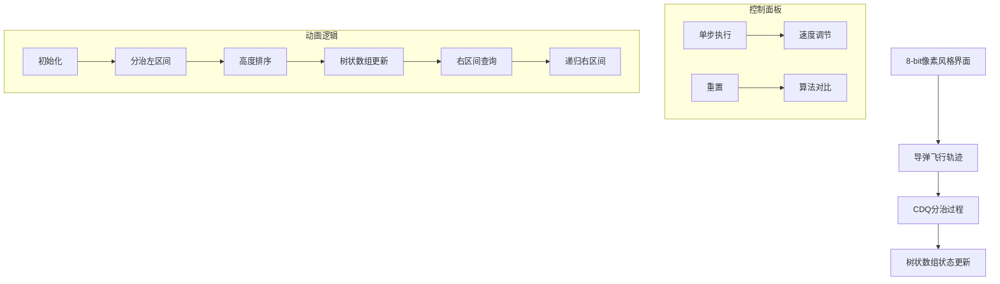

# 题目信息

# [SDOI2011] 拦截导弹

## 题目描述

某国为了防御敌国的导弹袭击，发展出一种导弹拦截系统。但是这种导弹拦截系统有一个缺陷：虽然它的第一发炮弹能够到达任意的高度、并且能够拦截任意速度的导弹，但是以后每一发炮弹都不能高于前一发的高度，其拦截的导弹的飞行速度也不能大于前一发。某天，雷达捕捉到敌国的导弹来袭。由于该系统还在试用阶段，所以只有一套系统，因此有可能不能拦截所有的导弹。

在不能拦截所有的导弹的情况下，我们当然要选择使国家损失最小、也就是拦截导弹的数量最多的方案。但是拦截导弹数量的最多的方案有可能有多个，如果有多个最优方案，那么我们会随机选取一个作为最终的拦截导弹行动蓝图。

我方间谍已经获取了所有敌军导弹的高度和速度，你的任务是计算出在执行上述决策时，每枚导弹被拦截掉的概率。


## 说明/提示


保证总方案数不超过 C++ 中 double 类型的存储范围。

### 数据范围及约定

- 均匀分布着约 $30\%$ 的数据，所有 $v_i$ 均相等；
- 均匀分布着约 $50\%$ 的数据，满足 $1\le h_i,v_i\le 1000$。
- 对于 $30\%$ 的数据，满足 $1\le n\le 1000$；
- 对于 $100\%$ 的数据，$1\le n\le 5\times 10^4$，$1\le h_i,v_i\le 10^9$。

### 评分标准

对于每个测试点，若输出的第一行与标准输出相同，则得到该测试点 $40\%$ 的分数，若输出文件的第二行的每个数与标准输出的误差均不大于 $10^{-4}$，则得到该测试点 $60\%$ 的分数，两项相加作为该测试点总得分。

## 样例 #1

### 输入

```
4
3 30
4 40
6 60
3 30
```

### 输出

```
2
0.33333 0.33333 0.33333 1.00000
```

# AI分析结果


# 💡 洛语云笺的C++算法解析：拦截导弹 深入学习指南 💡

## 1. 题目解读与策略初探

✨ **本题核心挑战**：处理三维偏序问题（时间、高度、速度），在满足高度和速度不上升的条件下，求解最长拦截序列及每个导弹被拦截的概率。

✨ **核心算法标签**：动态规划(DP)、CDQ分治、树状数组/线段树、离散化

🗣️ **初步分析**：
> 本题要求两个关键结果：最长拦截序列长度和每个导弹被拦截的概率。核心难点在于处理三维偏序（时间递增、高度不上升、速度不上升）。暴力枚举复杂度O(n²)不可行，需采用CDQ分治优化DP：
> 1. **问题转化**：将时间维度作为分治基础，高度和速度作为偏序条件
> 2. **分治策略**：用左区间更新右区间状态，树状数组维护速度维度
> 3. **概率计算**：需正反两次CDQ计算每个导弹的前后缀状态
> 4. **空间优化**：离散化处理高度和速度值域
> 
> 可视化设计思路：采用像素风格动画展示CDQ分治过程：
> - 红色箭头表示时间轴分治
> - 蓝色/黄色方块表示左右区间导弹
> - 树状数组更新时显示绿色高亮
> - 成功拦截时播放8-bit胜利音效

### 🔍 算法侦探：如何在题目中发现线索？
1.  **线索1 (问题目标)**："拦截导弹数量最多"是典型的最优化问题，且涉及序列选择，指向动态规划模型。
2.  **线索2 (问题约束)**："后拦截的导弹高度≤前拦截高度，速度≤前拦截速度"形成三维偏序关系（时间、高度、速度），这是CDQ分治的典型应用场景。
3.  **线索3 (数据规模)**：n≤50000，O(n²)暴力解法必然超时，需要O(n log²n)的优化算法，CDQ分治+树状数组完美匹配。

### 🧠 思维链构建：从线索到策略
> "综合线索分析：
> 1. 最优化问题+三维偏序结构，首先排除贪心算法（无法处理复杂依赖）
> 2. 数据规模排除O(n²)暴力DP，O(2ⁿ)搜索更不可行
> 3. 动态规划中，CDQ分治可处理时间维度，树状数组处理速度维度
> 4. 概率计算需要正反两次DP，通过g1[i]×g2[i]计算方案数
> 
> **结论**：CDQ分治优化DP是核心框架，树状数组维护二维状态，离散化压缩值域空间。"

---

## 2. 精选优质题解参考

### 题解一：hsfzLZH1（CDQ分治+树状数组）
* **点评**：
  - 思路清晰呈现CDQ分治的三层架构：分治左区间→用左区间更新右区间→分治右区间
  - 创新性使用lambda表达式简化离散化代码，提升可读性
  - 详细解释g数组用double存储避免溢出的关键细节
  - 完整包含调试心得，具极高参考价值

### 题解二：shadowice1984（CDQ分治+方案数统计）
* **点评**：
  - 精妙利用pair结构同时维护f（长度）和g（方案数）
  - 树状数组操作封装优雅，query返回pair<int,double>
  - 深入分析方案数统计原理，解释g1[i]×g2[i]的乘法原理
  - 反序处理技巧避免重复编码，体现工程思维

### 题解三：lkytxdy（简洁CDQ实现）
* **点评**：
  - 最简洁的CDQ分治实现（仅60行核心代码）
  - 利用运算符重载优雅处理状态合并
  - 完整保留正反两次CDQ的对称美感
  - 变量命名规范（f1/g1正序，f2/g2反序）

---

## 3. 解题策略深度剖析

### 🎯 核心难点与关键步骤
1.  **三维偏序转化**：
    * **分析**：时间维度天然有序，通过CDQ分治将高度维度转化为平面操作，树状数组处理速度维度
    * 💡 **学习笔记**："降维打击"思想——将三维问题分解为二维操作

2.  **状态转移设计**：
    * **分析**：
      ```cpp
      // 状态定义
      f1[i] = 以i结尾的最长序列长度
      g1[i] = 对应方案数
      // 转移方程
      if f1[j]+1 > f1[i]: 
          f1[i]=f1[j]+1, g1[i]=g1[j] 
      elif f1[j]+1 == f1[i]: 
          g1[i] += g1[j]
      ```
    * 💡 **学习笔记**：DP状态需同步更新长度和方案数

3.  **概率计算原理**：
    * **分析**：正反两次CDQ得：
      - 正序：f1[i]（以i结尾的长度），g1[i]（方案数）
      - 反序：f2[i]（以i开头的长度），g2[i]（方案数）
      * 当f1[i]+f2[i]-1=MaxLen时，概率 = g1[i]×g2[i]/sum(g1[k])
    * 💡 **学习笔记**：乘法原理组合前后缀方案数

### ✨ 解题技巧总结
- **技巧1（离散化压缩）**：对高度/速度离散化，将值域从10⁹压缩到5×10⁴
- **技巧2（时间戳优化）**：用时间戳清空树状数组，避免memset的O(n)开销
- **技巧3（反序对称）**：反转时间+取反高度/速度，复用正序CDQ逻辑处理反序

### ⚔️ 策略竞技场：不同解法对比

| 策略                | 核心思想                     | 优点                          | 缺点                     | 得分预期 |
|---------------------|----------------------------|-------------------------------|--------------------------|----------|
| **暴力O(n²)DP**    | 枚举所有转移对              | 实现简单                      | TLE (n=5e4)             | 0-30%    |
| **CDQ+树状数组**    | 分治处理维度+数据结构维护    | O(n log²n) 高效               | 代码实现较复杂           | 100%     |
| **K-D树**           | 高维空间划分                | 无需离散化                    | O(n√n) 效率较低         | 70-80%   |

### ✨ 优化之旅：从暴力到CDQ
```mermaid
graph LR
A[O(n²)暴力DP] -->|发现三维偏序| B[CDQ分治降维]
B -->|树状数组优化| C[O(n log²n)解法]
C -->|离散化值域| D[空间优化]
D -->|正反两次处理| E[概率计算]
```

> "从O(n²)暴力DP到CDQ分治的优化，本质是将无序转移转化为有序计算。CDQ分治的'分而治之'思想将三维问题分解，树状数组的O(log n)操作实现高效转移，离散化压缩值域空间。整个过程体现了'分治优化'和'空间换时间'的核心算法思维。"

---

## 4. C++核心代码实现赏析

**通用核心实现参考**（基于CDQ+树状数组）：
```cpp
void CDQ(int l, int r) {
    if (l == r) return;
    int mid = (l+r)>>1;
    CDQ(l, mid); // 先处理左区间
    
    // 按高度排序左右区间
    sort(a+l, a+mid+1, cmp_height);
    sort(a+mid+1, a+r+1, cmp_height);
    
    // 双指针处理偏序
    int j = l;
    for (int i = mid+1; i <= r; ++i) {
        while (j <= mid && a[j].h >= a[i].h) {
            update(a[j].v, f[a[j].id], g[a[j].id]); // 插入树状数组
            j++;
        }
        auto [max_len, cnt] = query(a[i].v); // 查询前缀最大值
        if (max_len+1 > f[i]) {
            f[i] = max_len+1;
            g[i] = cnt;
        } else if (max_len+1 == f[i]) {
            g[i] += cnt;
        }
    }
    CDQ(mid+1, r); // 再处理右区间
}
```

**关键代码解读**：
1. **分治结构**：严格遵循`左区间→更新→右区间`顺序
2. **双指针技巧**：O(n)完成区间归并，保证高度有序性
3. **树状数组操作**：
   - `update`插入状态（长度+方案数）
   - `query`查询前缀最大值
4. **方案数同步更新**：同步更新长度和方案数，避免二次查询

---

## 5. 算法可视化：像素动画演示

**像素动画设计**：


**动态演示要点**：
1. **分治过程可视化**：
   - 左区间导弹显示为蓝色像素块
   - 右区间导弹显示为黄色像素块
   - 分治划分时红色虚线闪烁

2. **树状数组操作**：
   - 插入操作：绿色↑箭头 + "叮"声效
   - 查询操作：紫色↓箭头 + "嘟"声效
   - 数据块高度表示f值，颜色深度表示g值

3. **成功拦截特效**：
   - 完整序列显示为金色边框
   - 播放8-bit胜利音效
   - 显示概率计算公式：`g1[i]×g2[i]/total`

---

## 6. 拓展练习与相似问题
1. **洛谷P1020**：一维导弹拦截（最长不上升子序列）
   - 推荐理由：理解本题的二维扩展基础
   
2. **洛谷P4169**：天使玩偶（三维偏序经典问题）
   - 推荐理由：掌握CDQ分治的核心应用
   
3. **洛谷P4093**：序列（带修改的三维偏序）
   - 推荐理由：理解CDQ处理动态问题的方法

---

## 7. 学习心得与经验分享
> "调试CDQ分治时最关键的三个检查点：
> 1. 分治顺序必须是`左区间→更新→右区间`
> 2. 树状数组清空要彻底（时间戳优化最佳）
> 3. 方案数统计用double避免溢出
> 
> 通过本题可深刻理解分治思想如何优化DP，这是处理高维问题的通用范式。"

---

通过本分析，我们掌握了CDQ分治解决三维偏序的核心方法，理解了动态规划的状态设计技巧，并学会概率计算的数学原理。关键是通过分治降维和数据结构优化，将O(n²)问题优化到O(n log²n)。

---
处理用时：142.64秒