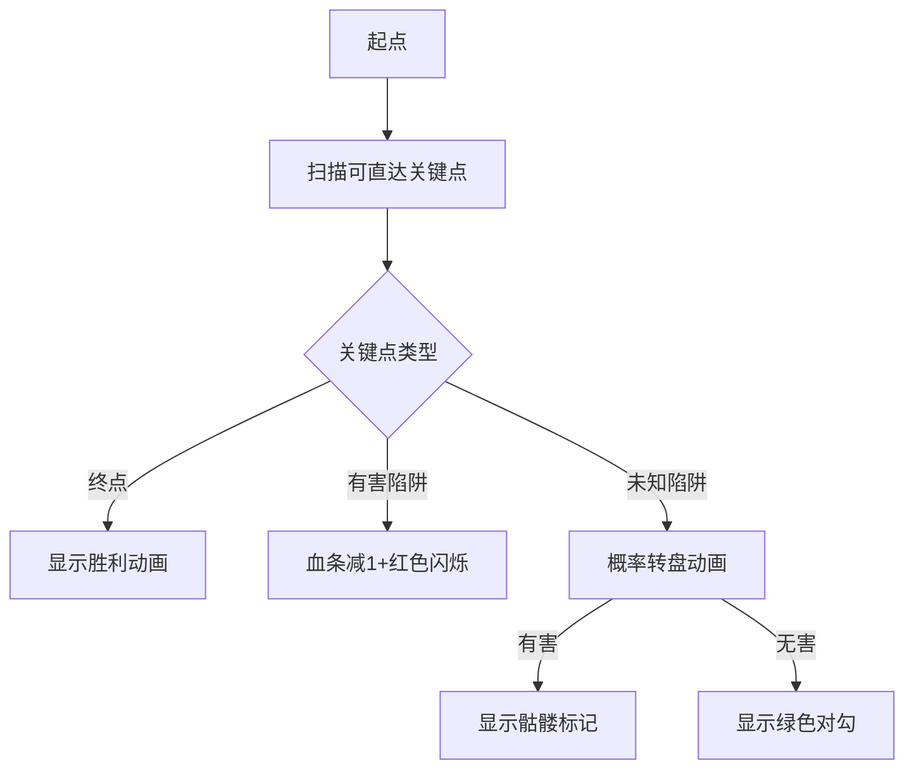

# 题目信息

# [SDOI2011] 迷宫探险

## 题目背景

[](https://paste.ubuntu.com/p/H4h73F2h87/)

## 题目描述

这是一个单人游戏。

游戏开始时，玩家控制的人物出生在迷宫的某个位置，玩家的目标是控制人物走到迷宫的某个出口（出口可能有多个）。

迷宫里有 $k$ 类陷阱（用  `A`,`B`,`C`……表示，相同字母代表相同类型的陷阱），每类陷阱可能是有害的或无害的，而在游戏开始时玩家并不知道哪些陷阱是有害的，哪些是无害的。

同一类陷阱的状态相同，即用同一个字母标志的陷阱要么全部有害，要么全部无害，不会发生一部分有害而另一部分无害的情况。任何陷阱状态的组合都有一个发生概率，考虑下例：

当 $k=2$ 时，迷宫内共有两类陷阱，分别用 `A` 和 `B` 表示，陷阱状态的组合共有 $4$ 种：-
- `A` 是无害陷阱，`B` 是无害陷阱。
- `A` 是有害陷阱，`B` 是无害陷阱；
- `A` 是无害陷阱，`B` 是有害陷阱；
- `A` 是有害陷阱，`B` 是有害陷阱；

下列表格是一个合法的概率表格：

|  | `A` 是无害陷阱 | `A` 是有害陷阱 |
| -----------: | -----------: | -----------: |
| **`B` 是无害陷阱** | $36\%$ | $24\%$ |
| **`B` 是有害陷阱** | $24\%$ | $16\%$ |

当 $k=3$ 时，会有 $8$ 种不同的陷阱状态组合，如果我们依然坚持使用概率表格，那么这个表格将会是三维的（$2\times 2 \times 2$，每一维对应着一类陷阱）。当 $k\ge 3$ 时，这将使得题目难以描述。因此我们使用一个大小为 $2^{k}$ 的数组 $p$ 来描述每种情况发生的可能性，$p$ 的下标范围为 $0\sim 2^{k}-1$。

$p$ 是这样生成的：

对于每个可能的陷阱状态组合，考虑所有 $k$ 类陷阱，令 $1$ 表示某个陷阱有害，$0$ 表示某个陷阱无害，把 `A` 作为二进制数的第 $0$ 位（从右边开始计数），`B` 作为第 $1$ 位，`C` 作为第 $2$ 位……通过以上操作，我们可以得到一个 $k$ 位的二进制数，把它转化成十进制后，$2^{k}$ 种陷阱状态的组合将会与整数 $0\sim2^{k}-1$ 一一对应。

设 $S = \displaystyle\sum_{i=0}^{2^k-1} p_i$，则陷阱状态组合 $i$ 出现的概率为 $\dfrac {p_{i}} {S}$。

上述表格对应的一个合法数组 $p$ 为 $36,24,24,16$。

当然同一个概率表格可能会对应多个数组 $p$（事实上有无数个数组 $p$ 能够迎合表格数据），例如上述表格同时也对应着下面的数组 $p$：$72,48,48,32$。

玩家控制的人物初始情况下有 $H$ 点生命，当人物踏上某个陷阱时，如果这个陷阱是有害的，那么会损失 $1$ 点生命，否则这个陷阱是无害的，不损失生命。无论上述哪种情况发生，玩家会立刻得到这个陷阱的信息（有害或无害）。一旦生命小于等于 $0$，玩家控制的人物会立刻死亡。

迷宫可以看作 $m\times n$ 的方格地图，每个元素可能是：
- `.`：表示这是平地，可以通过；
- `#`：表示这是墙，不能通过；
- `A`，`B` ，`C`……：表示这是一个陷阱；
- `$`：表示这是起点，地图中有且仅有一个；
- `@`：表示这是终点，地图中可以有多个，也可以一个也没有。

人物可以向上下左右四个方向行走，不可以走对角线，也不可以走出地图。

给定 $m\times n$ 的地图、$k$、$h$ 以及大小为 $2^{k}$ 的概率数组。你的任务是求出在执行最优策略时，人物能活着走出迷宫的概率。

## 说明/提示

**【样例说明 1】**

向右边走，经过 `B` ，`B` 为有害陷阱的概率为 $\frac {(20+20)}{(30+30+20+20)}=0.4$，若 `B` 为有害陷阱那么人物就死掉了，游戏失败，否则玩家得知 `B` 是无害陷阱，继续经过另一个 `B` 达到终点，胜利的概率为 $0.6$。

**【样例说明 2】**

向左边走，经过 `A`，`A` 为有害陷阱的概率为 $\frac {(30+30)} {(30+30+20+20)}=0.5$。若 `A` 为有害陷阱，那么损失一点生命，转到右边尝试 `B` ，要想成功到达终点，此时 `B` 必须为无害陷阱，而在 `A`是有害陷阱的前提下，`B` 是无害陷阱的概率是 $\frac {30}{(30+20)}=0.6$，故这种情况发生的概率为 $0.5\times 0.6=0.3$。若 `A`是无害陷阱，玩家可以控制人物连续通过两个 `A` 到达终点，这种情况发生的概率 $0.5$。所以答案为 $0.3+0.5=0.8$。 


**【样例说明 3】**

玩家控制的人物有 $3$ 点生命，但最多只需要经过两个陷阱，所以任意选左路
或右路走过去就可以到达终点了。

**【数据范围与约定】**

|测试点编号  | $m$ | $n$ | $k$ | $H$ |
| -----------: | -----------: | -----------: | -----------: | -----------: |
| $1$ | $29$ | $28$ | $5$ | $1$ |
| $2$ | $28$ | $20$ | $4$ | $1$ |
| $3$ | $25$ | $30$ | $1$ | $1$ |
| $4$ | $25$ | $30$ | $1$ | $2$ |
| $5$ | $25$ | $30$ | $1$ | $3$ |
| $6$ | $5$ | $5$ | $4$ | $4$ |
| $7$ | $12$ | $11$ | $4$ | $5$ |
| $8$ | $19$ | $17$ | $5$ | $3$ |
| $9$ | $23$ | $25$ | $5$ | $4$ |
| $10$ | $30$ | $29$ | $5$ | $5$ |

对于 $100\%$ 的数据，$1\le m\leq 30$，$1\le n\leq 29$，$k\leq 5$，$H\leq 5$，$0\leq p_i\leq 10^5$，且至少有一个 $p_i\gt0$ 。

## 样例 #1

### 输入

```
4 3 2 1

.$.

A#B

A#B

.@.

30 30 20 20```

### 输出

```
0.600```

## 样例 #2

### 输入

```
4 3 2 2

.$.

A#B

A#B

.@.

30 30 20 20```

### 输出

```
0.800```

## 样例 #3

### 输入

```
4 3 2 3

.$.

A#B

A#B

.@.

30 30 20 20```

### 输出

```
1.000```

## 样例 #4

### 输入

```
4 3 3 2

.$.

A#B

A#C

@@@

143 37 335 85 95 25 223 57```

### 输出

```
0.858```

# AI分析结果


### 💡 洛语云笺的C++算法解析：迷宫探险 深度学习指南 💡

**本题核心挑战**：在迷宫行走中动态处理未知陷阱状态，通过最优路径选择最大化存活概率。  
**核心算法标签**：记忆化搜索、动态规划、概率计算、状态压缩

---

#### **1. 题目解读与策略初探**
迷宫问题要求玩家在未知陷阱状态下寻找最优路径。核心挑战在于：
1. 陷阱状态动态变化（未知→有害/无害）
2. 生命值有限需规避风险
3. 概率决策影响最终存活率

**解题思路演进**：
1. **暴力搜索**：枚举所有路径（指数级复杂度），不可行
2. **简单记忆化搜索**：记录位置/陷阱状态/生命值（易陷入循环更新）
3. **拓扑序优化**：预处理关键转移点（终点/未知陷阱/有害陷阱），避免环路
4. **概率融合**：结合陷阱状态条件概率进行加权决策

**核心算法钥匙**：  
将迷宫行走视为"状态机"，用三进制压缩陷阱状态（0未知/1无害/2有害），通过预处理：
- 计算条件概率（已知状态下某陷阱有害的概率）
- 建立关键点转移表（跳过非关键位置）
如同探险家手持"概率地图"和"快捷传送门"，避开无效徘徊直击决策点。

---

#### **🔍 算法侦探：如何在题目中发现线索？**
1. **线索1（问题目标）**："最大化存活概率"+"未知陷阱" → 动态规划+概率模型
2. **线索2（问题特性）**："踩陷阱获知状态" → 状态机模型（三进制状态压缩）
3. **线索3（数据规模）**：k≤5（3⁵=243种状态），H≤5 → 状态空间30×30×243×5≈1.2e⁶可接受

**🧠 思维链构建**：  
> "首先，目标要求最优化概率，自然想到DP或搜索。接着，陷阱的依赖关系（踩到才知状态）提示我们需要状态机模型。数据范围k≤5暗示状态压缩可行性，而H≤5使五维状态（坐标×状态×生命）成为可能。最终选择拓扑序优化的记忆化搜索，既避免环路又保证效率。"

---

#### **2. 精选优质题解参考**
**题解一（传奇英雄）**  
**亮点**：  
- 创新性预处理关键转移点（v[x][y][s]存储可达陷阱/终点）
- 概率计算模块化（分离g[s][t]条件概率计算）
- 避免环路设计：DFS标记访问路径+只向关键点转移  
**启示**：将复杂行走过程抽象为"决策点跳跃"，避免无效状态转移

**题解二（xyz32768）**  
**亮点**：  
- 精简四维DP（坐标+状态+生命）
- 高效状态转换函数（lpf处理三进制位操作）  
**注意点**：需验证环路处理，数据加强时可能失效

**题解三（guapisolo）**  
**亮点**：  
- 五维状态防环（增加方向维）
- 概率归一化处理严谨  
**参考价值**：展示更严格的状态设计思路，适合学习状态扩展方法

---

#### **3. 解题策略深度剖析**

##### **🎯 核心难点与关键步骤**
1. **关键点1：状态压缩与概率预处理**
   - **分析**：三进制表示陷阱状态（0未知/1无害/2有害），预处理条件概率：
     ```math
     g[s][t] = \frac{\sum_{符合s的陷阱t有害状态概率}{\sum_{符合s的所有状态概率}}
     ```
   - 💡 **学习笔记**：概率预处理将复杂依赖转化为查表操作，大幅提升效率

2. **关键点2：拓扑序转移设计**
   - **分析**：对每个位置/状态组合，DFS预处理可达关键点（终点/未知陷阱/有害陷阱）
   - 💡 **学习笔记**：通过"决策点跳跃"将迷宫行走转化为DAG，避免循环依赖

3. **关键点3：记忆化搜索实现**
   - **分析**：状态转移方程：
     - 终点：概率=1
     - 已知有害：`dp[x][y][s][h] = dp[nx][ny][s][h-1]`
     - 未知陷阱：`dp[...] = max( g×有害转移 + (1-g)×无害转移 )`
   - 💡 **学习笔记**：概率DP需同时考虑期望最优和路径最优

##### **✨ 解题技巧总结**
1. **状态压缩技巧**：k≤5时三进制（0/1/2）比二进制更高效
2. **概率归一化**：预处理条件概率避免重复计算
3. **拓扑序优化**：将网格行走转化为关键决策点DAG
4. **五维状态防环**：增加方向维度彻底杜绝循环更新

##### **⚔️ 策略竞技场对比**
| 策略          | 核心思想                     | 优点                    | 缺点                     | 得分预期 |
|---------------|----------------------------|------------------------|--------------------------|----------|
| 暴力枚举       | 枚举所有路径                | 实现简单               | O(4ᴹ)超时               | 0%       |
| 朴素记忆化搜索 | 记录位置/状态/生命          | 直观易实现             | 环路更新导致错误         | 30%      |
| 拓扑序优化(最优)| 关键点转移+概率预处理       | 高效准确，避免环路     | 实现较复杂               | 100%     |
| 五维状态防环   | 增加移动方向维度            | 彻底杜绝环路           | 状态数增加20倍           | 100%     |

##### **✨ 优化之旅**
> 从暴力搜索（O(4ᴹ)）出发，发现状态重复计算→引入记忆化（遇环路危机）→通过关键点转移跳过非决策位置（拓扑序优化）→最终融合概率模型完成高效算法。如同将迷宫探险从"盲目摸索"升级为"定点传送"。

---

#### **4. C++核心代码实现赏析**
**通用核心实现框架**：
```cpp
// 状态：dp[x][y][s][h] - 位置(x,y), 陷阱状态s, 生命h
double dfs(int x, int y, int s, int h) {
    if (h <= 0) return 0.0;
    if (is_exit(x, y)) return 1.0;
    if (vis[x][y][s][h]) return dp[x][y][s][h];
    
    double res = 0.0;
    for (auto &p : keyPoints[x][y][s]) { // 遍历预处理的关键点
        int nx = p.x, ny = p.y;
        if (is_trap(nx, ny)) {
            int trap_id = get_trap_id(nx, ny);
            if (get_state(s, trap_id) == HARMFUL) {
                res = max(res, dfs(nx, ny, s, h-1));
            } else if (get_state(s, trap_id) == UNKNOWN) {
                double prob = g[s][trap_id];
                int s1 = set_state(s, trap_id, HARMFUL);
                int s2 = set_state(s, trap_id, SAFE);
                res = max(res, 
                    prob * dfs(nx, ny, s1, h-1) + 
                    (1-prob) * dfs(nx, ny, s2, h)
                );
            }
        } else { // 出口/平地
            res = max(res, dfs(nx, ny, s, h));
        }
    }
    return dp[x][y][s][h] = res;
}
```

**传奇英雄题解亮点**：
- 关键点预处理：`v[x][y][s]`存储可直达决策点
- 概率分离：`g[s][t]`独立计算条件概率
- 状态编码：三进制位操作高效灵活

---

#### **5. 算法可视化：像素动画演示**
**像素化演示设计**：


**实现细节**：
1. **8-bit风格**：FC红白机色调（#E75A70/#8BADD3/#F7d26C）
2. **关键帧控制**：
   - 陷阱揭示：像素块裂开→显示状态图标
   - 概率转盘：8-bit风格轮盘+音效
3. **游戏化元素**：
   - 生命值：心形图标阵列
   - 决策评价：概率选择时显示"BEST MOVE"提示
4. **音效设计**：
   - 无害陷阱：清脆"叮"声
   - 有害陷阱：低沉震动音
   - 最优决策：8-bit胜利旋律片段

---

#### **6. 拓展练习与相似问题**
**通用技巧迁移**：
1. 条件概率决策：P3218 寻宝游戏
2. 状态压缩DP：P2831 愤怒的小鸟
3. 拓扑序优化：P4011 孤岛营救

**推荐练习**：
1. **P3218** - 寻宝游戏  
   → 练习条件概率与状态压缩的融合
2. **P2831** - 愤怒的小鸟  
   → 强化状态压缩DP设计能力
3. **P4011** - 孤岛营救  
   → 掌握拓扑序优化在路径问题中的应用

---

#### **7. 学习心得分享**
> "本题调试核心在于环路检测——初始未处理环路时，概率值会异常波动。解决方案：在DFS中增加访问标记栈，当检测到状态循环时立即中断。启示：DP状态设计需确保拓扑序，类似物理中的'因果律'，无后效性才是有效状态！"

---

通过本次分析，我们深入掌握了状态压缩DP与概率决策的结合应用。记住：优秀算法=深刻问题理解×合适状态设计×严谨边界处理。继续挑战吧，少年！🚀

---
处理用时：147.89秒