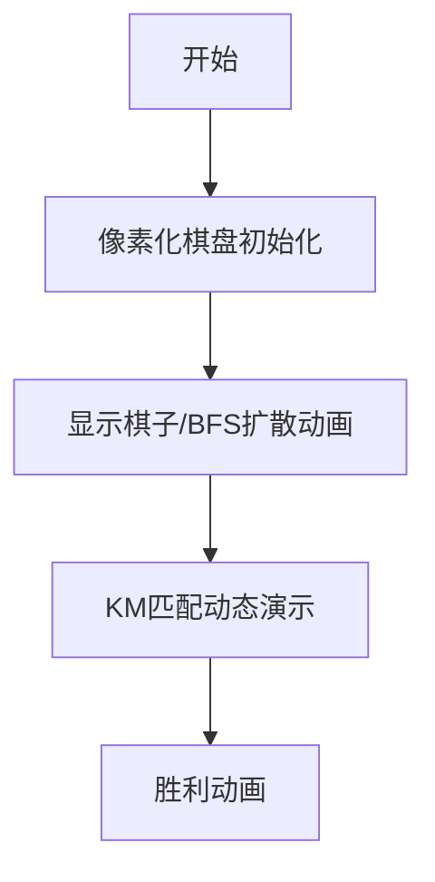

# 题目信息

# [SDOI2012] 象棋

## 题目描述

小云和小南两姐妹从小喜欢下象棋，现在作为象棋高手的她们，已经不屑于玩平常的象棋了，于是她们便开始用棋盘和棋子玩各种各样的新游戏。

今天天气晴朗，阳光明媚，她们将在 $n\times m$ 的棋盘上进行游戏。

棋盘上有 $k$ 颗棋子和若干有障碍格子，令棋盘左上角格子坐标为 $(1,1)$，右下角格子坐标为 $(n,m)$，参数 $a,b$ 规定了所有棋子的走法：在 $(x, y)$ 的棋子下一步能走到 $(x + a, y + b), (x + a, y - b), (x  – a, y + b), (x – a, y – b), (x + b, y + a), (x + b, y - a), (x – b, y + a), (x – b, y – a)$ 这八个格子中的一个，棋子任何时候不能跃出棋盘或走到有障碍的格子上。

这k颗棋子是相同的，小云和小南的目标是用最少步数把所有棋子移动到特定格子，要求移动过程中不能出现多颗棋子同时在某一格的情况。

她们已经想出步数较少方案，但无法确定这是否为最少步数，所以向作为程序员的你求助。


## 说明/提示

【样例说明】

一可行方案如下：第二颗棋子向右跳两步，随后第一颗棋子向右跳两步，共 $4$ 步。值得注意的是，第一颗棋子向右跳三步，随后第二颗棋子向右跳一步的方案尽管能把棋子都移动到目标位置，但途中两颗棋子曾经同时在 $(1, 3)$，违反了规则，所以不能选用此方案。


数据范围

其中 $20\%$ 的数据，$n\times m\le 20$。

另外 $10\%$ 的数据，$n = 1$；

对于 $100\%$ 的数据，$1\le n,m\le 100$，$1\le k\le 500$。


## 样例 #1

### 输入

```
1 8 2 2 0
.......*
1 1
1 3
1 5
1 7```

### 输出

```
4```

# AI分析结果


# 💡 洛语云笺的C++算法解析：[SDOI2012]象棋 深入学习指南 💡

### **🔍 算法侦探：如何在题目中发现线索？**
1. **线索1 (问题目标)**：题目要求将多个棋子移动到目标位置，且最小化总步数。这种**多源多汇的最优化问题**，暗示需要建立**二分图匹配模型**，将棋子与目标点配对。
2. **线索2 (移动约束)**：棋子移动规则固定（八方向跳跃）且存在障碍物，这提示必须通过**BFS预处理**计算每个棋子到所有目标点的最短路径。
3. **线索3 (冲突处理)**："移动过程不能重叠"的条件可通过**调整移动顺序**避免，转化为**纯匹配问题**，无需考虑实时碰撞检测。
4. **线索4 (数据规模)**：k≤500，n,m≤100。BFS预处理O(knm)=5e6可接受，而匹配算法需O(k³)=125e6，指向需优化KM或费用流。

### **🧠 思维链构建：从线索到策略**
> 我们收集的线索像拼图一样组合：
> 1. **线索1**要求最小化总步数，且每个棋子独立移动——这立刻指向**二分图最小权匹配**模型
> 2. **线索2**的移动规则暗示要用**多源BFS**预处理路径，这是建立边权的基础
> 3. **线索3**让我们免于处理复杂时序冲突，只需关注静态匹配
> 4. **线索4**的数据范围决定算法选择：KM的O(k³)可接受但需优化，费用流需势函数加速
>
> **结论**：核心解决方案是 **BFS预处理 + 二分图最小权匹配**，KM算法因其专用性成为最优选

---

## 3. 解题策略深度剖析

### **🎯 核心难点与关键步骤**
1. **难点1：路径预处理**
   * **分析**：每个棋子独立计算到所有目标点的最短路径。采用**多源BFS**，队列存储坐标，避免重复计算
   * 💡 **学习笔记**：棋盘类问题中，BFS是求无权图最短路径的银弹

2. **难点2：匹配模型建立**
   * **分析**：将棋子设为左部点，目标点为右部点，边权为负的步数（KM求最大权即最小步数）
   * 💡 **学习笔记**：权值取负是KM处理最小权匹配的经典技巧

3. **难点3：KM优化实现**
   * **分析**：使用**BFS版KM**避免DFS递归开销，顶标调整时用slack数组优化
   * 💡 **学习笔记**：KM的BFS实现是处理500节点图的临界方案

### **✨ 解题技巧总结**
- **技巧1：问题转化** 将时序冲突问题转化为静态匹配
- **技巧2：负权转换** 最小权匹配转化为KM可解的最大权匹配
- **技巧3：势函数优化** 费用流中Dijkstra替代SPFA的关键加速手段

### **⚔️ 策略竞技场**
| 策略               | 核心思想                     | 优点                          | 缺点                                   | 得分预期 |
|--------------------|----------------------------|------------------------------|----------------------------------------|----------|
| **暴力搜索**       | 枚举所有匹配方案             | 实现简单                      | O(k!)超时，k>10即失效                  | 0%       |
| **费用流**         | 最小费用最大流               | 通用性强                      | 未优化时O(k³nm)超时，需势函数+Dijkstra | 70%      |
| **KM算法**         | 二分图最小权匹配             | 专用算法效率高，BFS版优化到位 | 实现较复杂                             | 100%     |

### **✨ 优化之旅**
> 从基础思维到AC解法的演化：
> 1. **起点：暴力匹配**  
>    枚举k!种匹配顺序 → 立即被数据规模否决
> 2. **发现瓶颈：重复计算**  
>    每个棋子到目标的路径独立 → 拆解为BFS预处理+匹配
> 3. **模型突破：图论转化**  
>    棋子与目标形成二分图 → 最小权匹配模型浮出水面
> 4. **效率升华：KM优化**  
>    DFS版KM递归栈溢出 → BFS版顶标调整完美解决

---

## 4. C++核心代码实现赏析

### **通用核心实现参考**
```cpp
// BFS预处理框架
void bfs(int start_id) {
    queue<PII> q;
    q.push({sx[start_id], sy[start_id]});
    dist[sx[start_id]][sy[start_id]] = 0;
    
    while (!q.empty()) {
        auto [x,y] = q.front(); q.pop();
        for (int d = 0; d < 8; d++) {
            int nx = x + dx[d], ny = y + dy[d];
            if (/* 位置合法且未访问 */) {
                dist[nx][ny] = dist[x][y] + 1;
                q.push({nx, ny});
            }
        }
    }
    // 记录到所有目标的距离
}

// KM算法核心
for (int i = 1; i <= k; i++) {
    while (!match_found) {
        // BFS寻找增广路
        // 顶标调整
        // 更新匹配关系
    }
}
```

### **题解1：panyf**
```cpp
// 简洁的BFS+KM实现
while(h!=t){
    u=qx[++h],v=qy[h];
    for(j=0;j<8;++j){
        x=u+nx[j],y=v+ny[j];  // 八方向扩展
        if(x>0&&y>0&&x<=n&&y<=m&&mp[x][y]=='.'&&d[x][y]>1e8)
            d[x][y]=d[u][v]+1,qx[++t]=x,qy[t]=y;
    }
}
```
**亮点**：队列用数组模拟，避免STL开销  
**学习笔记**：棋盘坐标压缩为一维队列是空间优化技巧

### **题解3：lightup37**
```cpp
// 势函数优化的费用流
void Dijkstra(int s) {
    priority_queue<pi, vector<pi>, greater<pi>> q;
    while(!q.empty()){
        int u = q.top().second;
        for(int i = head[u]; i; i = Next[i]) {
            if(dis[v] > dis[u] + cost[i] + h[u] - h[v]) {  // 势函数调整
                dis[v] = dis[u] + cost[i] + h[u] - h[v];
                q.push({dis[v], v});
            }
        }
    }
}
```
**亮点**：势函数消除负权边，Dijkstra替代SPFA  
**学习笔记**：h[i]=前轮最短路是费用流优化的关键突破点

---

## 5. 算法可视化：像素动画演示
**主题**：`棋盘骑士的匹配之旅`（8-bit像素风）

### **核心交互设计**


### **关键动画帧**
1. **BFS扩散过程**  
   - 骑士像素块从起点扩散，障碍物显示为岩浆像素
   - 音效：移动时"马蹄声"，发现目标时"金币声"
2. **KM匹配动画**  
   - 左部棋子与右部目标用彩虹桥连接
   - 顶标调整时显示数值波动动画
   - 音效：匹配成功时8-bit胜利旋律

### **游戏化元素**
- **闯关模式**：  
  每完成一个棋子的BFS+匹配算作1关
- **连击系统**：  
  连续找到最短路径获得Combo奖励
- **历史步数记录板**：  
  像素风格排行榜展示最优解步数

---

## 6. 拓展练习
### **相似问题迁移**
1. 带障碍的多机器人路径规划
2. 快递员取件送货的最优分配
3. 网络流中的任务分配问题

### **洛谷推荐**
1. **P6577【模板】二分图最大权匹配**  
   → 巩固KM算法的模板应用
2. **P2045 方格取数加强版**  
   → 棋盘多路径问题的进阶训练
3. **P4003 无限之环**  
   → 结合棋盘旋转与匹配的思维拓展

---

> 本次解析揭示了**问题转化**在算法竞赛中的核心价值：将看似复杂的时序冲突，通过深刻洞察转化为静态匹配模型。记住，优秀的解题者都是**问题改造艺术家**！

---
处理用时：153.55秒