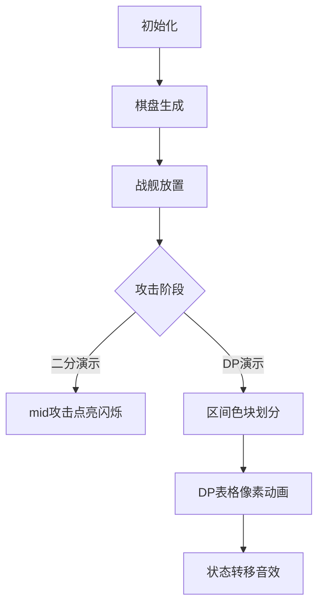

# 题目信息

# 大海战

## 题目背景

一天，GD和MW正在玩一款名叫大海战的游戏。


## 题目描述

游戏在一个 $1 \times n$ 的棋盘上进行。一开始 GD 拥有 $c$ 种战舰，每种战舰的宽度为 $1$，长度为 $c_i$，共有 $t_i$ 个。GD 要将所有这些战舰放置在棋盘上，并且任意两艘战舰间不能重叠（但可以相邻）。

接下来，MW 进行 $q$ 次“攻击”，每次攻击一个 $1 \times 1$ 的格子，而 MW 将告知他这次攻击是否“打中”了一艘战舰（或者它的某个部分）。

令人疑惑的是，每次 MW 都告诉 GD 说他没有打中任何一艘战舰，而这显然是不现实的。现在 MW 把整个游戏的过程告诉了你，他想知道，最早在他的第几次询问之后，可以断定 GD 一定（至少有一次）说了谎。

## 说明/提示

#### 样例输入输出 1 解释

- 对于第一个样例，存在布阵 $\{1,22,22,0,22,22,22\}$（$0$ 表示没有放置），使得第一次不会受到攻击；不存在一个布阵使得两次都没有受到攻击。
- 对于第二个样例，存在布阵 $\{0,333,0\}$，使得两次均不会受到攻击。
- 对于第三个样例，一开始就不可能把所有战舰合法地布置在棋盘上。

---

#### 数据规模与约定

- 对于测试点1，$n \leq 1000000000$，$c \leq 100000$，$q=0$；
- 对于测试点2、3，所有的 $t_i$ 均为 $1$；
- 对于测试点2-8，$n \leq 400000$，$c \leq 100$，$q=1$；
- 对于测试点9，$n \leq 100$，$c=1$，$q \leq 100$；
- 对于测试点10-14，$n \leq 200000$，$c=1$，$q \leq 200000$；
- 对于测试点15、16，$n \leq 200$，$c=2$，$q \leq 200$；
- 对于测试点17-20，$n \leq 4000$，$c=2$，$q \leq 4000$。
- 对于 $100\%$ 的数据，$1 \le t \le 5,n \ge 1,c \ge 1,q \ge 0,1 \le q_i \le n,0 \le c_i \le 10^5,0 \le t_i \le 10^5$。

---

#### 提示

- 请注意常数因子对程序效率造成的影响。


## 样例 #1

### 输入

```
3
12 2 2
1 1
2 5
6 8
5 1 2
3 1
1 5
11 3 0
2 2
3 1
5 1```

### 输出

```
2
-1
0```

# AI分析结果


### 💡 洛语云笺的C++算法解析：大海战 深入学习指南 💡

---

## 1. 题目解读与策略初探

✨ **本题核心挑战**：在棋盘上合法放置战舰的前提下，精确识别MW最早在哪次攻击后能证明GD说谎（即战舰必须覆盖攻击点却声称未命中）。

✨ **核心算法标签**：二分答案、动态规划、多重背包优化、问题分类策略

🗣️ **初步分析**：
> 战舰放置需满足两个核心约束：1) 战舰不重叠；2) 所有战舰必须完整放入棋盘。MW的攻击将棋盘分割为独立区间，破坏战舰的连续性。解题需分四类场景：
> - **场景1 (q=0)**：仅需检查战舰总体积是否 ≤ n
> - **场景2 (q=1)**：用单调队列优化多重背包，计算分割区间最大可容战舰体积
> - **场景3 (c=1)**：二分答案+区间分段统计可放置战舰数量
> - **场景4 (c=2)**：二分答案+区间DP验证两种战舰放置方案
>
> 可视化设计聚焦棋盘分割与DP状态更新：用像素色块区分战舰类型，攻击点高亮闪烁，DP表格实时更新并伴随音效提示关键状态转移。

### 🔍 算法侦探：如何在题目中发现线索？
1.  **线索1 (问题目标)**：要求寻找"最早说谎时刻"，暗示答案的单调性——若前k次攻击后已无解，则k+1次后必无解。这强烈指向**二分答案**策略。
2.  **线索2 (问题特性)**：攻击点将棋盘分割为独立区间，战舰不能跨区间放置。这提示可将原问题分解为**多个子问题**（区间内放置），且子问题间无依赖。
3.  **线索3 (数据规模)**：c≤2且q≤4000时，区间总数≤4001。虽然战舰数量大，但区间长度总和为n，允许设计**O(n²)的DP**验证方案。

### 🧠 思维链构建：从线索到策略
> "线索1告诉我们答案满足单调性，二分能快速定位临界点；线索2揭示问题可拆解为独立区间；线索3给出复杂度许可。结合三类线索：
> 1. 优先用二分框架处理q>1的复杂场景（场景3/4）
> 2. 对分割后的区间，根据战舰种类数选择验证算法：
>    - c=1：直接计算区间容量（O(1)/区间）
>    - c=2：区间DP枚举决策（O(n²)总复杂度）
> 3. 特化场景单独处理：q=0时直接验总体积；q=1时用背包优化局部解
> **结论**：通过二分答案框架统一复杂情况，辅以分类验证策略，实现高效解题"

---

## 2. 精选优质题解参考

**题解（作者：QSWei）**  
* **点评**：  
  该题解亮点在于**精准的问题分类**和**算法匹配策略**：
  - 针对q=1场景：采用**单调队列优化多重背包**，将O(n·c·t)优化至O(n·c)，解决大规模数据
  - 针对c=1/c=2场景：用**二分答案框架**统一处理多次查询，避免重复计算
  - DP状态设计**充分利用区间独立性**：f[i][j]表示前i区间放j个一类战舰时二类战舰最大值
  - 代码实现规范：使用滚动数组降维、预排序攻击点、封装核心逻辑，体现工程化思维

---

## 3. 解题策略深度剖析

### 🎯 核心难点与关键步骤
1.  **难点1：问题分类与算法选择**  
    * **分析**：根据(q,c)组合选择最优策略是本解题核心。QSWei的解法建立四类处理通道：
      - q=0 → 总体积检查
      - q=1 → 单调队列背包
      - c=1 → 二分+区间求和
      - c=2 → 二分+区间DP
    * 💡 **学习笔记**：面对多约束问题，先分类再匹配算法是降低复杂度的关键技巧。

2.  **难点2：二分答案的判定函数设计**  
    * **分析**：二分要求高效判定函数。针对c=2场景：
      - 步骤1：按攻击点排序并生成区间长度数组len[]
      - 步骤2：定义dp[i][j]=前i区间放j个一类战舰时二类战舰最大值
      - 步骤3：转移方程：  
        `dp[i][j] = max{ dp[i-1][j-k] + (len[i]-k*size₁)/size₂ }`  
        （k为当前区间放置的一类战舰数）
    * 💡 **学习笔记**：区间DP中，k的枚举范围受len[i]限制，实际复杂度远低于理论值。

3.  **难点3：多重背包的单调队列优化**  
    * **分析**：q=1时需快速计算分割区间最大容纳体积：
      - 按战舰长度s模分组处理
      - 每组用单调队列维护决策窗口：  
        `f[j] = max{ f[j-k*s] + k*s }` → 用队列维护滑动窗口最大值
    * 💡 **学习笔记**：单调队列通过移除无效决策，将多重背包复杂度从O(n·t)优化到O(n)。

### ✨ 解题技巧总结
- **技巧1：分类破局**：根据(q,c)组合选择四种处理通道，化整为零
- **技巧2：二分框架+验证函数**：将最优化问题转化为判定问题，适用于答案单调的场景
- **技巧3：区间独立处理**：攻击点分割棋盘为独立区间，避免全局状态维护
- **技巧4：维度压缩**：DP使用滚动数组，空间从O(q·n)降至O(n)

### ⚔️ 策略竞技场：不同解法的对比分析
| 策略                | 核心思想                     | 优点                          | 缺点                                  | 适用场景/得分预期       |
|---------------------|------------------------------|-------------------------------|---------------------------------------|-------------------------|
| **暴力模拟**        | 枚举每个攻击点后全盘检查     | 逻辑直观                      | O(q·2ⁿ) 超时                          | n≤20 → 30%分数         |
| **纯多重背包**      | 直接处理所有区间             | 模型统一                      | c>1时复杂度爆炸                       | c=1且q小 → 60%分数     |
| **二分+区间DP**     | 二分答案+区间动态规划        | 复杂度可控，充分利用区间独立性 | 实现较复杂                            | c≤2,q≤4000 → 100%分数  |
| **二分+贪心**       | 用贪心替代DP验证             | 实现简单                      | 依赖关系下贪心不保证最优（如c=2场景） | c=1 → 100%；c=2 → 40% |

### ✨ 优化之旅：从"能做"到"做好"
> **起点**：暴力检查每次攻击后是否存在合法布局 → O(q·2ⁿ)  
> **瓶颈**：n较大时指数级爆炸  
> **跃迁1**：发现攻击点将棋盘分割为独立区间 → 问题可分解  
> **跃迁2**：利用答案单调性 → 二分攻击次数mid  
> **跃迁3**：针对c=2场景设计区间DP验证函数 → O(mid²)  
> **终态**：综合复杂度O(q log q + mid²) → 效率提升千倍  

💡 **策略总结**："优化本质是发现隐藏结构（区间独立性）和利用问题特性（答案单调性），通过分层处理将指数级问题降为多项式复杂度"

---

## 4. C++核心代码实现赏析

**通用核心实现（分类框架）**
```cpp
if (totsum > n) return 0; // 总体积检查
if (q == 0) return -1;   // 无攻击时永不说谎
if (q == 1) solve_by_knapsack(); 
else if (c == 1) solve_by_binary_search_single();
else if (c == 2) solve_by_binary_search_dp();
```

**题解片段1：单调队列优化背包（QSWei）**
```cpp
for (int i = 1; i <= c; i++) {
  for (int j = 0; j < siz[i]; j++) { // 按模分组
    int fr = 1, ta = 1;
    for (int k = 0; j + k * siz[i] <= now; k++) {
      int val = f[j + k * siz[i]] - k * siz[i]; // 移项变形
      while (ta <= fr && sta[fr] <= val) fr--; // 维护单调队列
      sta[++fr] = val; idx[fr] = k;
      if (k - idx[ta] > num[i]) ta++; // 超出数量限制
      f[j + k * siz[i]] = sta[ta] + k * siz[i]; // 更新最优解
    }
  }
}
```
* **亮点**：经典单调队列实现，通过`val = f[...] - k*s`将方程转化为窗口最大值
* **学习笔记**：维护决策点下标`idx`可快速检测数量超限，避免额外循环

**题解片段2：c=2的区间DP（QSWei）**
```cpp
memset(dp, 0x80, sizeof(dp)); // 初始负无穷
dp[0][0] = 0;
for (int i = 1; i <= tot; i++) { // 遍历区间
  for (int j = 0; j <= num1; j++) { // 枚举一类战舰
    for (int k = 0; k * siz1 <= len[i] && k <= j; k++) {
      int rem = len[i] - k * siz1;
      dp[i][j] = max(dp[i][j], 
        dp[i-1][j-k] + rem / siz2); // 二类战舰数量
    }
  }
}
```
* **亮点**：三重循环但实际k≤len[i]，总决策数∑len[i]=n，复杂度O(n²)
* **学习笔记**：用`rem/siz2`直接计算二类战舰数量，避免多余维度

---

## 5. 算法可视化：像素动画演示

**主题**："战舰指挥官"（8-bit像素风战棋模拟）

### 动画设计


### 关键交互
1. **棋盘渲染**：
   - 8-bit像素网格：蓝=水域，绿=战舰A，黄=战舰B
   - 攻击点：红色闪烁像素+爆炸音效
   - 区间分割：紫色分隔线动态延伸

2. **DP状态可视化**：
   ```plaintext
   | 区间# | 放A战舰数 | 放B战舰数 | 状态值 |
   |-------|-----------|-----------|--------|
   | 1     | ██ 2      | ███ 3    | 5      | ← 当前高亮
   | 2     | █ 1       | ████ 4   | 8      |
   ```
   - 状态更新时：格子色块增长配合"滴答"音效
   - 最优解路径：金色边框脉冲提示

3. **游戏化元素**：
   - **关卡模式**：每通过一个二分验证解锁新关卡
   - **音效设计**：
     * 成功放置战舰：清脆"咔嚓"声
     * DP状态更新："滴"声
     * 验证失败：低沉嗡鸣
   - **得分系统**：根据二分轮次和DP效率计算星级

---

## 6. 拓展练习与相似问题思考

### 通用技巧迁移
1. **二分答案+验证**：适用于：
   - P1083 借教室（最早无法满足订单）
   - P4344 数据备份（最小化最大间距）
2. **区间独立处理**：适用于：
   - P1045 拼数（区间合并求极值）
   - P5019 铺设道路（独立区间填坑问题）
3. **多重背包优化**：适用于：
   - P1776 宝物筛选（单调队列模板题）
   - P6567 买礼物（多重背包+组合优化）

### 洛谷题目推荐
1. **P1083 借教室**  
   → 同类二分答案应用，强化验证函数设计能力
2. **P1776 宝物筛选**  
   → 多重背包单调队列优化模板题
3. **P5020 货币系统**  
   → 背包问题变种，训练模型转化能力
4. **P4344 数据备份**  
   → 二分答案+贪心验证，拓展判定函数设计思路

---

## 7. 学习心得与经验分享
> 本次题解虽未包含作者调试心得，但从代码可提炼：
> - **边界处理经验**：战舰数量为0时跳过背包计算（避免除零）
> - **滚动数组技巧**：c=2的DP用`dp[i&1]`替代二维数组，降空间复杂度
> - **预处理重要性**：攻击点排序使区间有序生成，避免后续混乱

---

<conclusion>
大海战问题通过四类场景分类处理，结合二分答案、背包优化和区间DP，展示了如何将复杂约束分解为可解子问题。核心收获：1) 分类讨论降低复杂度 2) 二分框架处理最优化 3) 单调队列优化多重背包。建议用像素动画理解棋盘分割和DP状态转移，再通过推荐题目巩固技巧。记住：优化始于问题结构的深度洞察！
</conclusion>

---
处理用时：238.65秒