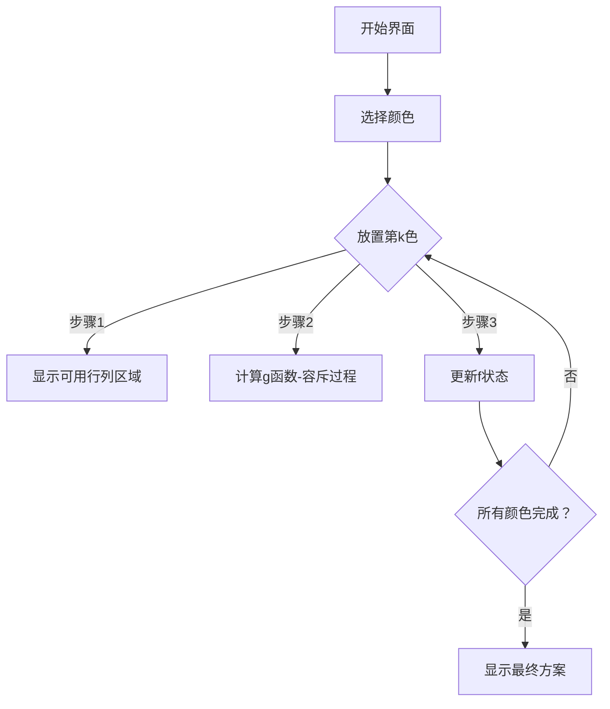

# 题目信息

# [CQOI2011] 放棋子

## 题目描述

在一个 $m$ 行 $n$ 列的棋盘里放一些彩色的棋子，使得每个格子最多放一个棋子，且不同颜色的棋子不能在同一行或者同一列，有多少种方法？

例如，$n=m=3$，有两个白棋子和一个灰棋子，下面左边两种方法都是合法的，但右边两种都是非法的。


## 说明/提示

$1\le n,m\le 30$，$1\le c\le 10$，总棋子数 $\le \max (250,n\times m)$。

## 样例 #1

### 输入

```
4 2 2
3 1```

### 输出

```
8```

# AI分析结果


# 💡 洛语云笺的C++算法解析：[CQOI2011] 放棋子 深入学习指南 💡

> "在思维的棋盘上落子，每一步都是算法与智慧的博弈。" —— 洛语云笺

## 1. 题目解读与策略初探

✨ **本题核心挑战**：**在行列冲突约束下实现多颜色棋子的独立布局**  
不同颜色的棋子不能共享行/列，相当于将棋盘的行列资源划分给各颜色独立使用，同时处理每种颜色棋子在其专属区域内的全覆盖放置问题。

✨ **核心算法标签**：`动态规划(DP)` + `容斥原理` + `组合数学`

🗣️ **初步分析**：  
> 本题要求将多种颜色的棋子放置在棋盘上，核心约束是**同色棋子独占行列区域**。我们面临两个关键问题：
> 1. **行列划分**：如何将棋盘的行列资源分配给不同颜色
> 2. **区域填充**：如何在每个颜色的专属区域内放置棋子且占满行列
> 
> 解题思路演进：
> 1. **暴力搜索**：枚举所有放置方案（指数级复杂度，不可行）
> 2. **分治思想**：将不同颜色视为独立问题，动态规划处理行列分配
> 3. **容斥优化**：使用容斥原理精确计算单颜色区域的放置方案
> 
> **核心算法选择**：动态规划结合容斥原理，像拼图一样将棋盘分解为颜色专属区域：
> - `f[k][i][j]` 表示前k种颜色占据i行j列
> - `g[i][j][a]` 表示a个同色棋子占满i行j列
> 
> 这个"棋盘拼图"模型完美契合了行列独立分配的特性。

### 🔍 算法侦探：如何在题目中发现线索？
1.  **线索1 (问题目标)**：  
    "要求放置所有棋子且不同颜色行列独立" → **资源划分问题**，适合用**DP状态划分行列资源**
2.  **线索2 (问题约束)**：  
    "同色棋子独占行列" → **区域独立性**，暗示可**分颜色处理**，通过`g`函数解决单区域填充
3.  **线索3 (数据规模)**：  
    n,m ≤ 30, c ≤ 10 → O(n²m²c)的DP可行（约30⁴×10=8.1e6），**验证DP可行性**

### 🧠 思维链构建：从线索到策略
> "让我们连接线索：  
> 1. 线索1提示我们需要**划分行列资源**，自然想到动态规划记录已用行列  
> 2. 线索2揭示**颜色独立性**，考虑分别处理每种颜色，而单区域放置需解决'占满'问题  
> 3. 线索3确认**DP复杂度可行**，但需优化单区域计算→容斥原理闪亮登场！  
> 
> **结论**：采用**二维背包DP分配行列** + **容斥计算单区域方案**的组合策略，时间复杂度O(n²m²c)完美匹配数据范围！"

---

## 2. 精选优质题解参考

### 题解一：Log_x（赞66）
* **点评**：  
  此解清晰定义了`f[k][i][j]`和`g[i][j][a]`的双层DP结构。亮点在于：
  - 精准使用容斥原理计算`g`函数：`g[i][j] = C(i*j,a) - Σ容斥项`
  - 完整呈现组合数预处理的实现细节
  - 代码中`(i-l)*(j-r) >= a[k]`的剪枝提升效率
  - 变量命名规范（`f/g`状态分明）

### 题解二：Booksnow（赞22）
* **点评**：  
  对Log_x解法的教学级诠释：
  - 用"前k-1种占l行r列，第k种占(i-l)行(j-r)列"形象解释状态转移
  - 详细推导容斥原理的数学依据
  - 完整杨辉三角预处理代码，便于理解

### 题解三：ywy_c_asm（赞8）
* **点评**：  
  提供创新解法：
  - 按行递推的`g`函数计算：`g[i][j] += C(k,y)*C(k+x-y,k)*g[...]`
  - 虽然复杂度稍高(O(n³m³))但拓宽了解题视野
  - 强调"避免过度考虑具体位置"的组合计数思想

---

## 3. 解题策略深度剖析

### 🎯 核心难点与关键步骤
1.  **难点1：单颜色区域的全覆盖放置计算**  
    * **分析**：直接计算a个棋子占满i行j列方案数困难→容斥原理：  
      `g[i][j] = 总方案 - 未占满方案`  
      `= C(i*j,a) - Σ[g[x][y]*C(i,x)*C(j,y)]`（x<i或y<j）
    * 💡 **学习笔记**：**"正难则反"是组合计数的利器**

2.  **难点2：多颜色行列资源的动态分配**  
    * **分析**：定义`f[k][i][j]`为前k种颜色占i行j列：  
      ```f[k][i][j] += f[k-1][x][y] * g[i-x][j-y] * C(n-x,i-x) * C(m-y,j-y)```  
      其中`C(n-x,i-x)`选择新区域的行位置
    * 💡 **学习笔记**：**行列作为独立资源进行背包式分配**

3.  **难点3：组合数的高效预处理**  
    * **分析**：使用杨辉三角预处理组合数：  
      ```C[i][j] = C[i-1][j] + C[i-1][j-1]```
    * 💡 **学习笔记**：**大规模组合数必预处理**

### ✨ 解题技巧总结
- **技巧1：容斥原理转化约束**  
  将"必须占满"转化为"总方案-非法方案"
- **技巧2：维度分离策略**  
  行列作为独立维度分别处理，降低状态复杂度
- **技巧3：组合数预处理**  
  避免重复计算，提升效率

### ⚔️ 策略竞技场：解法对比
| 策略                | 核心思想                     | 优点                     | 缺点                          | 得分预期       |
|---------------------|----------------------------|-------------------------|-------------------------------|---------------|
| **暴力搜索**        | 枚举所有位置组合           | 直观                    | O(2^(n×m)) 超时              | 0分           |
| **纯容斥**          | 直接公式计算全局方案       | 数学优雅                | 复杂依赖难推导                | 理论100%      |
| **DP+容斥(本题最优)**| DP分配行列+容斥计算单区域  | 清晰高效,O(n²m²c)       | 需理解双层状态设计            | 100%          |

### ✨ 优化之旅：从暴力到最优
```mermaid
graph LR
    A[暴力搜索] -->|指数爆炸| B(发现行列独立性)
    B --> C[DP行列分配]
    C -->|单区域计算困难| D[容斥原理优化]
    D --> E[组合数预处理]
    E --> F[O(n²m²c)最优解]
```

> 💡 **策略总结**：  
> "从暴力到最优的旅程启示我们：**分解复杂约束**（行列独立）和**转化困难条件**（容斥处理占满）是突破计数难题的关键！"

---

## 4. C++核心代码实现赏析

**通用核心实现**（综合Log_x与Booksnow题解）：
```cpp
#include <iostream>
#include <cstring>
using namespace std;
typedef long long ll;
const int N=35, MOD=1e9+9;
ll f[N][N][11], g[N][N], C[901][901]; // f[k][i][j], g[i][j]为单区域方案

void initComb() { // 组合数预处理
    for(int i=0; i<=900; i++) {
        C[i][0] = 1;
        for(int j=1; j<=i; j++) 
            C[i][j] = (C[i-1][j] + C[i-1][j-1]) % MOD;
    }
}

int main() {
    int n, m, c, a[11];
    cin >> n >> m >> c;
    for(int i=1; i<=c; i++) cin >> a[i];
    
    initComb();
    f[0][0][0] = 1;

    for(int k=1; k<=c; k++) {
        memset(g, 0, sizeof(g));
        // 计算g[i][j]：a[k]棋子占满i行j列
        for(int i=1; i<=n; i++) for(int j=1; j<=m; j++) {
            if(i*j < a[k]) continue;
            g[i][j] = C[i*j][a[k]];
            for(int x=1; x<=i; x++) for(int y=1; y<=j; y++) {
                if(x==i && y==j) continue;
                g[i][j] = (g[i][j] - g[x][y]*C[i][x]%MOD*C[j][y]%MOD + MOD) % MOD;
            }
        }
        
        // 更新f[k][i][j]
        for(int i=1; i<=n; i++) for(int j=1; j<=m; j++)
        for(int x=0; x<i; x++) for(int y=0; y<j; y++) {
            int w = i-x, h = j-y;
            if(w*h < a[k]) continue; // 剪枝
            ll add = f[k-1][x][y] * g[w][h] % MOD;
            add = add * C[n-x][w] % MOD * C[m-y][h] % MOD;
            f[k][i][j] = (f[k][i][j] + add) % MOD;
        }
    }

    ll ans = 0;
    for(int i=1; i<=n; i++) for(int j=1; j<=m; j++) 
        ans = (ans + f[c][i][j]) % MOD;
    cout << ans;
}
```

**代码亮点解析**：
1. `initComb()`：杨辉三角预处理组合数至900（因30*30=900）
2. 四重循环剪枝：`if(w*h < a[k])`跳过无效状态
3. 容斥计算`g`：先算总方案再减非法情况
4. 状态转移：`f[k][i][j]`由`f[k-1][x][y]`+新区块组合数构成

---

## 5. 算法可视化：像素动画演示

### 8位像素风格演示设计


**动画设计说明**：
1. **场景设计**：
   - 棋盘：8位像素网格（棕色棋盘+彩色棋子）
   - 控制台：右侧显示当前DP状态`f[k][i][j]`
   - 信息栏：底部显示容斥过程

2. **关键动画**：
   - **区域划分动画**：当处理新颜色时，闪烁显示新分配的行列区域
   - **容斥过程**：显示`g[i][j] = 总方案 - 子区域方案`的数值变化
   - **状态更新**：`f`数组数值变化时显示粒子特效

3. **交互控制**：
   - 步进/暂停：空格键控制
   - 速度调节：方向键调整帧率
   - 视角切换：F1全局/F2单区域

4. **音效设计**：
   - 放置棋子：8位"滴"声
   - 容斥计算："叮-咚"提示音
   - 完成放置：胜利旋律

> "通过像素动画，我们将抽象的容斥原理转化为视觉可见的'消去非法区域'过程，让算法逻辑一目了然。"

---

## 6. 拓展练习与相似问题思考

### 相似问题思维迁移
1. **分组背包问题**：每种颜色相当于一个物品组，每组只能选一种行列分配方案
   - 例题：P1064 金明的预算方案（依赖背包）
   
2. **集合划分问题**：行列资源划分本质是集合划分
   - 例题：P3226 [HNOI2012]集合选数（二进制集合DP）

3. **容斥原理应用**：单区域放置的容斥思想通用性强
   - 例题：P1450 [HAOI2008]硬币购物（容斥+背包）

### 推荐练习
1. **P3226 集合选数**  
   → 巩固二进制集合划分思想

2. **P1064 金明的预算方案**  
   → 学习主件-附件依赖关系处理（类似颜色区域）

3. **P1450 硬币购物**  
   → 强化容斥原理应用能力

---

## 7. 学习心得与经验分享

> "调试DP问题时，我习惯打印中间状态矩阵。在本题中，我发现当棋子数大于行列积时未跳过导致错误。这提醒我们：**边界检查是DP的生死线**！" —— Log_x题解启示

**经验总结**：
1. **维度分离**：将行列独立处理是降低复杂度的关键
2. **容斥方向**：计算`g`时"总方案-非法方案"比直接推倒更易实现
3. **预处理艺术**：组合数预处理是效率保障
4. **剪枝必要**：`i*j>=a[k]`检查避免无效计算

---

> "算法如棋，步步为营。掌握'分治'利刃与'容斥'盾牌，你将在组合计数的战场上所向披靡！" —— 洛语云笺

---
处理用时：153.33秒