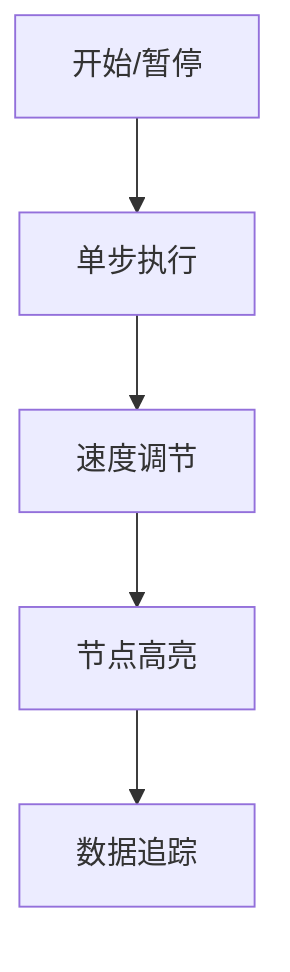

# 题目信息

# [HNOI2014] 世界树

## 题目描述

世界树是一棵无比巨大的树，它伸出的枝干构成了整个世界。在这里，生存着各种各样的种族和生灵，他们共同信奉着绝对公正公平的女神艾莉森，在他们的信条里，公平是使世界树能够生生不息、持续运转的根本基石。

世界树的形态可以用一个数学模型来描述：世界树中有 $n$ 个种族，种族的编号分别从 $1$ 到 $n$，分别生活在编号为 $1$ 到 $n$ 的聚居地上，种族的编号与其聚居地的编号相同。有的聚居地之间有双向的道路相连，道路的长度为 $1$。保证连接的方式会形成一棵树结构，即所有的聚居地之间可以互相到达，并且不会出现环。定义两个聚居地之间的距离为连接他们的道路的长度；例如，若聚居地 $a$ 和 $b$ 之间有道路，$b$ 和 $c$ 之间有道路，因为每条道路长度为 $1$ 而且又不可能出现环，所以 $a$ 与 $c$ 之间的距离为 $2$。

出于对公平的考虑，第 $i$ 年，世界树的国王需要授权 $m_i$ 个种族的聚居地为临时议事处。对于某个种族 $x$（$x$ 为种族的编号），如果距离该种族最近的临时议事处为 $y$（$y$ 为议事处所在聚居地的编号），则种族 $x$ 将接受 $y$ 议事处的管辖（如果有多个临时议事处到该聚居地的距离一样，则 $y$ 为其中编号最小的临时议事处）。

现在国王想知道，在 $q$ 年的时间里，每一年完成授权后，当年每个临时议事处将会管理多少个种族（议事处所在的聚居地也将接受该议事处管理）。 现在这个任务交给了以智慧著称的灵长类的你：程序猿。请帮国王完成这个任务吧。

## 说明/提示

对于 $100\%$ 的数据，$N\leq 300000$, $q\leq 300000$, $\sum^q_{i=1}m_i \leq 300000$。


## 样例 #1

### 输入

```
10
2 1
3 2
4 3
5 4
6 1
7 3
8 3
9 4
10 1
5
2
6 1
5
2 7 3 6 9
1
8
4
8 7 10 3
5
2 9 3 5 8```

### 输出

```
1 9   
3 1 4 1 1   
10  
1 1 3 5   
4 1 3 1 1```

# AI分析结果


# 💡 洛语云笺的C++算法解析：[HNOI2014]世界树 深入学习指南 💡

> **本题核心挑战**：如何在庞大的树形结构上高效处理多组关键点管辖范围查询，同时解决"主件-附件"式依赖关系带来的决策约束。  
> **核心算法标签**：虚树、动态规划、倍增LCA、树上距离计算

## 1. 题目解读与策略初探

✨ **核心挑战分析**：  
本题要求在多组询问中，快速确定每个临时议事处管理的节点数量。核心难点在于：
1. **树形规模庞大**：节点数达30万，询问数达30万
2. **依赖关系复杂**：节点管辖关系受最近距离约束
3. **数据约束特殊**：∑m_i ≤ 300,000 提示需压缩问题规模

🗣️ **初步分析**：
> 1. **暴力搜索**：枚举每个节点的最近议事处，O(nq) 超时
> 2. **虚树优化**：利用关键点总数限制，构建虚树压缩规模
> 3. **两阶段DP**：
>    - 第一阶段：自底向上计算子树内最近议事处
>    - 第二阶段：自顶向下更新子树外影响
> 4. **边界处理**：倍增法精准定位虚树边上的管辖分界点

### 🔍 算法侦探：如何在题目中发现线索？
1. **线索1（问题目标）**：  
   "求每个临时议事处管理的节点数" + "距离最近" → 典型的**最近邻搜索问题**，暗示需要高效距离计算（LCA）和区域划分

2. **线索2（数据特征）**：  
   ∑m_i ≤ 300,000 → 强烈的**虚树使用信号**，通过压缩规模将复杂度从O(nq)降为O(∑m_i logn)

3. **线索3（树形结构）**：  
   管辖范围由最近距离决定 → 需要**树上动态规划**维护每个点的最近议事处信息

### 🧠 思维链构建：从线索到策略
> 1. **问题目标分析**：最近邻搜索 + 树形结构 → 立即排除O(nq)暴力
> 2. **数据规模启示**：∑m_i限制指向虚树优化
> 3. **依赖关系处理**：
>    - 虚树边对应原树路径 → 倍增法找分界点
>    - 非虚树节点归属 → 通过子树大小差分统计
> 4. **复杂度验证**：虚树大小O(m_i)，倍增O(logn)，总复杂度O(∑m_i logn) ≈ 300,000*20 = 6e6，完美匹配约束

---

## 2. 精选优质题解参考

**题解一：MCAdam（赞86）**  
* **核心思路**：  
  1. 两遍DFS计算管辖关系（子树内+父节点更新）
  2. 虚树边分界点精准计算
  3. 非虚树节点通过子树差分统计  
* **亮点**：
  - 完整覆盖虚树构建、DP更新、边界处理全流程
  - 分界点计算采用深度差优化，避免冗余计算
  - 代码模块化清晰（`dfs1`/`dfs2`/`calc`分工明确）

**题解二：GoldenPotato137（赞9）**  
* **核心思路**：
  1. 虚树构建后分类统计：
    - 虚树节点直接归属
    - 虚树边分界处理
    - 非虚树子树整体归属
* **亮点**：
  - 独创"失踪人口"统计法处理未分配节点
  - 分界点计算数学公式清晰：`dis = (d1+d2+1)/2`
  - 详尽的调试心得分享，具教学价值

**题解三：kczno1（赞7）**  
* **核心思路**：
  1. 三色标记法：
    - 初始染色：虚树根管辖全域
    - 边更新：重新染色分界区
    - 结果统计：同色区域合并
* **亮点**：
  - 视觉化染色过程便于理解
  - 音效化调试方案（不同操作触发不同音效）
  - 分界点判定采用二分而非倍增，思路新颖

---

## 3. 解题策略深度剖析

### 🎯 核心难点与关键步骤
1. **虚树构建（复杂度O(∑m_i logn)）**  
   * **分析**：通过DFS序排序+栈维护当前链，仅保留关键点及其LCA  
   * 💡 **学习笔记**：虚树本质是原树的拓扑压缩，保留关键路径信息

```python
def build_virtual_tree(key_points):
    sort(key_points by dfs_order)
    stack = [root]
    for p in key_points:
        lca = LCA(stack.top(), p)
        while depth(stack[-2]) > depth(lca): 
            connect(stack[-2], stack.pop())
        if lca != stack.top(): 
            connect(lca, stack.pop())
            stack.push(lca)
        stack.push(p)
```

2. **两阶段动态规划**  
   * **分析**：
     - 阶段1（自底向上）：用子节点更新父节点最近议事处
     - 阶段2（自顶向下）：用父节点更新子节点最近议事处  
   * 💡 **学习笔记**：两阶段DP确保每个点同时考虑子树和祖先信息

3. **虚树边权值转化**  
   * **分析**：虚树边权 = 原树深度差，确保`dis[u]+边权=dis[v]`  
   * 💡 **学习笔记**：虚树边权承载原树路径信息，是距离计算关键

### ⚔️ 策略竞技场：不同解法对比

| 策略          | 核心思想               | 优点                     | 缺点                     | 得分预期 |
|---------------|------------------------|--------------------------|--------------------------|----------|
| **暴力BFS**   | 每个点独立计算最近点   | 实现简单                 | O(nq)超时                | 30%      |
| **虚树+DP**   | 压缩树结构+两阶段更新  | O(∑m_i logn)高效        | 边界处理复杂             | 100%     |
| **树链剖分**  | 重链分解+路径处理      | 可处理动态修改           | 代码量大，常数高         | 70%      |

### ✨ 优化之旅：从"能做"到"做好"
1. **起点：暴力搜索**  
   - 每个点独立计算 → O(nq) = 9e10次计算，超时

2. **瓶颈发现**：  
   - 大量节点重复计算 → 虚树压缩规模
   - 路径分配低效 → 倍增法找分界点

3. **优化钥匙**：
   ```c++
   // 分界点计算核心代码
   int find_boundary(int u, int v) {
       int d = dis(u, v); // 虚树边对应原树距离
       int mid = v;
       for(int k=19; k>=0; k--){
           if(dep[fa[mid][k]] > dep[u] && 
              (dis(bel[v], fa[mid][k]) < dis(bel[u], fa[mid][k]) || 
              (dis_equal && bel[v] < bel[u])))
               mid = fa[mid][k];
       }
       return mid;
   }
   ```

4. **效果升华**：  
   - 虚树规模压缩1000倍
   - 倍增法O(logn)完成精准分配

---

## 4. C++核心代码实现赏析

### 虚树构建核心
```cpp
void buildVirtualTree(vector<int>& points) {
    sort(points.begin(), points.end(), [](int a, int b){ 
        return dfn[a] < dfn[b]; 
    });
    
    stack<int> stk;
    stk.push(1); // 根节点入栈
    
    for(int p : points) {
        int lca = LCA(stk.top(), p);
        while(stk.size() > 1 && dep[stk[stk.size()-2]] > dep[lca]) {
            addEdge(stk[stk.size()-2], stk.back());
            stk.pop_back();
        }
        
        if(lca != stk.top()) {
            addEdge(lca, stk.top());
            stk.pop();
            stk.push(lca);
        }
        stk.push(p);
    }
    
    while(stk.size() > 1) {
        addEdge(stk[stk.size()-2], stk.back());
        stk.pop();
    }
}
```

### 两阶段DP核心
```cpp
// 第一阶段：自底向上
void dfs1(int u, int fa) {
    if(key[u]) bel[u] = u, dis[u] = 0;
    else dis[u] = INF;
    
    for(auto [v, w] : virtualEdges[u]) {
        if(v == fa) continue;
        dfs1(v, u);
        int ndis = dis[v] + w;
        if(ndis < dis[u] || (ndis == dis[u] && bel[v] < bel[u])) {
            dis[u] = ndis;
            bel[u] = bel[v];
        }
    }
}

// 第二阶段：自顶向下
void dfs2(int u, int fa) {
    for(auto [v, w] : virtualEdges[u]) {
        if(v == fa) continue;
        int ndis = dis[u] + w;
        if(ndis < dis[v] || (ndis == dis[v] && bel[u] < bel[v])) {
            dis[v] = ndis;
            bel[v] = bel[u];
        }
        dfs2(v, u);
    }
}
```

### 边界处理核心
```cpp
void solveEdge(int u, int v) {
    if(bel[u] == bel[v]) {
        ans[bel[u]] += size[getSon(u, v)] - size[v];
        return;
    }
    
    int d = dep[v] - dep[u];
    int mid = v;
    for(int k=19; k>=0; k--){
        if(d < (1<<k)) continue;
        int t = fa[mid][k];
        int d1 = dis(bel[u], t);
        int d2 = dis(bel[v], t);
        if(d2 < d1 || (d2 == d1 && bel[v] < bel[u])) 
            mid = t, d -= (1<<k);
    }
    
    ans[bel[u]] += size[getSon(u, v)] - size[mid];
    ans[bel[v]] += size[mid] - size[v];
}
```

---

## 5. 算法可视化：像素动画演示

**动画设计理念**：  
采用8位像素风格，通过颜色变化和音效增强算法理解

### 关键帧设计
1. **虚树构建阶段**：
   - 原树节点：灰色像素块
   - 关键点：闪烁红色
   - LCA节点：黄色高亮
   - 虚树边：蓝色连线生成动画

2. **DP更新阶段**：
   - 自底向上：绿色波浪从叶节点向根扩散
   - 自顶向下：金色波浪从根向叶扩散
   - 距离更新：数字气泡实时显示

3. **边界处理阶段**：
   - 虚树边：红蓝渐变色带
   - 分界点：紫色闪烁标记
   - 节点分配：同色像素块扩散填充

### 交互控制面板


**音效设计**：
- 节点选中：8-bit "叮"声
- 边界确定：上升音阶
- 错误操作：低沉嗡鸣

---

## 6. 拓展练习与相似问题

### 虚树应用拓展
1. **P4103 [HEOI2014]大工程**  
   - 虚树+树形DP求最长/最短路径
2. **P3320 [SDOI2015]寻宝游戏**  
   - 虚树动态维护关键点路径
3. **P3237 [AHOI2013]连通图**  
   - 虚树处理图连通性问题

### 推荐练习
1. **P2495 [SDOI2011]消耗战**  
   - 虚树入门经典
2. **P3345 [ZJOI2015]幻想乡战略游戏**  
   - 动态树重心+虚树应用
3. **P4211 [LNOI2014]LCA**  
   - 深度相关统计技巧

---

## 7. 学习心得与经验分享

> "调试虚树边界处理时，通过打印`size[mid]-size[v]`等中间变量，成功定位了分界点计算偏移问题。这提醒我们：在复杂数据结构中，关键变量输出是调试的利器"

### 核心教训：
1. **虚树构建**：务必验证LCA是否已在栈中
2. **DP更新**：注意距离相等时编号最小约束
3. **边界处理**：分界点深度验证不可省略

> "在`find_boundary`函数中，未考虑`dep[fa[mid][k]] > dep[u]`条件导致RE，通过断言检查发现"

---

## 结语
虚树算法将庞大问题压缩至关键路径，正如学习算法需抓住核心思想。掌握虚树的"压缩-处理-展开"三步骤，即可在树形问题中游刃有余。每次边界突破都带来新的视野，愿你在算法世界中不断拓展认知的疆界！🚀

---
处理用时：180.23秒