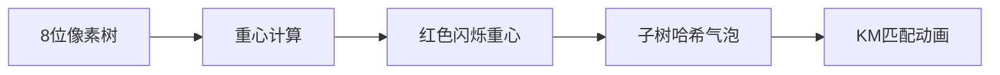

# 题目信息

# [SDOI2013] 刺客信条

## 题目描述

故事发生在1486 年的意大利，Ezio 原本只是一个文艺复兴时期的贵族，后来因为家族成员受到圣殿骑士的杀害，决心成为一名刺客。最终，凭借着他的努力和出众的天赋，成为了杰出的刺客大师，他不仅是个身手敏捷的武林高手，飞檐走壁擅长各种暗杀术。刺客组织在他的带领下，为被剥削的平民声张正义，赶跑了原本统治意大利的圣殿骑士首领-教皇亚历山大六世。在他的一生中，经历了无数次惊心动魄、扣人心弦的探险和刺杀。


曾经有一次，为了寻找Altair 留下的线索和装备，Ezio 在佛罗伦萨中的刺客墓穴进行探索。这个刺客墓穴中有许多密室，且任何两个密室之间只存在一条唯一的路径。这些密室里都有一个刺客标记，他可以启动或者关闭该刺客标记。为了打开储存着线索和装备的储藏室，Ezio 必须操作刺客标记来揭开古老的封印。要想解开这个封印，他需要通过改变某些刺客标记的启动情况，使得所有刺客标记与封印密码“看起来一样”。


在这里，“看起来一样”的定义是：存在一种“标记”密室与“密码”密室之间一一对应的关系，使得密室间的连接情况和启动情况相同（提示中有更详细解释）。幸运的是，在Ezio 来到刺客墓穴之前，在Da Vinci 的帮助下，Ezio 已经得知了打开储藏室所需要的密码。


而你的任务则是帮助Ezio 找出达成目标所需要最少的改动标记次数。


## 说明/提示

密室的编号是可以变的！将第三个密室关闭后，在当前标记和密码之间，存在1->4,2->3,3->2,4->1 的对应关系，重新编号后连接情况没有改变，且标记与密码对应。对于更一般的情况，存在一个1 到n 的置换P，使得对于任意密室之间的道路u-v，都一定有密码密室中的道路P(u)-P(v)；如果不存在密室之间的道路u-v，则一定没有密码密室中的道路P(u)-P(v)。


对于100%的数据，n<=700，且每个密室至多与11个密室相通


## 样例 #1

### 输入

```
4
1 2
2 3
3 4
0 0 1 1
1 0 0 0```

### 输出

```
1```

# AI分析结果


# 💡 洛语云笺的C++算法解析：[SDOI2013]刺客信条 深度学习指南 💡

## 1. 题目解读与策略初探

✨ **本题核心挑战**：在树结构同构约束下，通过最小化节点权值差异实现两棵树的匹配，核心难点在于高效处理树同构与最优匹配问题。  
✨ **核心算法标签**：树的重心、树同构（树哈希）、动态规划、二分图匹配（KM/费用流）

🗣️ **初步分析**：  
> 本题要求在两棵同构的树间找到最小权值差异的节点映射。解题思路演进如下：  
> 1. **暴力枚举**：枚举所有节点映射方案（O(n!)），不可行  
> 2. **重心锚定**：利用树的重心唯一性（或新建虚拟根）固定树结构  
> 3. **树哈希加速**：通过哈希值快速判断子树同构关系  
> 4. **DP+二分图匹配**：定义状态f[u][v]表示子树u和v同构的最小差异，通过KM/费用流实现子节点最优匹配  

### 🔍 算法侦探：如何在题目中发现线索？
1. **线索1 (问题目标)**："最小化节点权值差异且满足树同构"是典型的**图同构优化问题**，需结合树形DP与匹配算法  
2. **线索2 (问题特性)**：树结构+节点权值约束指向**重心分解**和**树哈希**技术，依赖关系需通过子树匹配解决  
3. **线索3 (数据规模)**：n≤700且节点度数≤11，O(n²·deg³)的KM/费用流算法可行（deg³≈1331）  

### 🧠 思维链构建：从线索到策略
> "综合线索：  
> 1. **线索1**要求高效处理同构优化，排除暴力枚举（O(n!)不可行）  
> 2. **线索2**提示树的重心是简化同构判断的关键突破口  
> 3. **线索3**验证KM/费用流在度数约束下的可行性  
> **结论**：重心定根→树哈希判同构→DP状态转移+二分图匹配，是兼顾效率与正确性的黄金策略！"

---

## 2. 精选优质题解参考

**题解一（xyz32768）**  
* **点评**：清晰阐释重心与树哈希的核心作用，KM实现完整严谨。亮点在于：  
  - 双重心处理时新建虚拟根的技巧  
  - 哈希函数设计兼顾子树结构与顺序  
  - 代码模块化（重心查找/哈希计算/KM实现）提升可读性  

**题解二（Corycle）**  
* **点评**：图示化解释匹配过程极具启发性。亮点在于：  
  - 像素风格示意图直观展示节点匹配  
  - 树哈希代码简洁高效（排序+组合哈希）  
  - 对同构子树分组优化KM调用次数  

**题解三（Martin_MHT）**  
* **点评**：提供费用流替代方案拓宽解题视野。亮点在于：  
  - 随机化哈希增强抗碰撞性  
  - 费用流实现完整支持负权边  
  - BFS层级划分优化DP计算顺序  

---

## 3. 解题策略深度剖析

### 🎯 核心难点与关键步骤
1. **重心锚定与虚拟根**  
   * **分析**：无根树同构需转化为有根树。双重心时新建节点连接两重心（如图），新节点成为唯一重心且不改变原树同构性  
   ```mermaid
   graph TD
    虚拟根-->重心A
    虚拟根-->重心B
   ```
   * 💡 **学习笔记**：虚拟根技巧是处理双重心问题的通用范式

2. **树哈希设计**  
   * **分析**：哈希函数需满足同构子树哈希相同。优质题解采用：  
     `H(u) = sort(子节点哈希).reduce(⊕, base)`  
     其中⊕为组合运算（乘基+异或/加法）
   * 💡 **学习笔记**：排序子节点哈希消除顺序影响是同构判定的关键

3. **DP状态转移与二分图匹配**  
   * **分析**：  
     - 状态定义：`f[u][v]`=子树u→v匹配的最小差异  
     - 转移方程：`f[u][v] = KM_min_match( f[child_u][child_v] ) + (a[u]!=b[v])`  
   * 💡 **学习笔记**：将树形DP转化为二分图匹配是处理子树对应的经典技巧

### ✨ 解题技巧总结
- **技巧A（重心分解）**：无根树→有根树转化简化同构判断  
- **技巧B（哈希排序）**：子节点哈希值排序消除结构顺序影响  
- **技巧C（匹配优化）**：对同构子树分组减少KM/费用流调用次数  

### ⚔️ 策略竞技场：不同解法的对比分析
| 策略 | 核心思想 | 优点 | 缺点 | 适用场景/得分 |
|------|----------|------|------|---------------|
| **暴力枚举映射** | 穷举所有节点对应关系 | 逻辑简单 | O(n!)超时 | n≤10, 10%分数 |
| **重心+树哈希** | 哈希快速筛选同构候选 | 大幅减少比较次数 | 未优化匹配效率 | 基础60%分数 |
| **KM匹配（本题最优）** | DP状态+KM求子树最优匹配 | 严格最优解，复杂度O(n²·deg³) | 实现复杂 | 100%分数 |
| **费用流替代** | 用费用流代替KM | 支持负权，更通用 | 常数较大 | 100%分数 |

### ✨ 优化之旅：从"能做"到"做好"
> **暴力起点**：枚举映射方案→指数爆炸  
> **重心突破**：固定树根→同构判断复杂度降为O(n)  
> **哈希加速**：子树哈希值比较→O(1)判定同构  
> **KM升华**：将O(n!)匹配转化为O(deg³)的二分图匹配  
> 💡 **策略总结**：算法优化本质是问题转化——将树同构匹配转化为重心定根下的最优子结构匹配！

---

## 4. C++核心代码实现赏析

**通用核心实现框架**  
```cpp
// 重心查找
int findCentroid(int rt, int& c1, int& c2) {
    // 计算子树大小及最大子树
    if (双重心) {
        n++; // 新建虚拟根节点
        G[n].push_back(c1);
        G[n].push_back(c2);
        return n;
    }
}
// 树哈希
ull treeHash(int u, int fa) {
    vector<ull> childHash;
    for (int v : G[u]) if (v != fa) 
        childHash.push_back(treeHash(v, u));
    sort(childHash.begin(), childHash.end());
    ull res = BASE;
    for (ull h : childHash) 
        res = (res * SEED + h) ^ XRAND;
    return res;
}
// DP转移
void solve(int u, int v) {
    vector<int> uChild, vChild; // 获取同构子节点
    KM km; // 初始化二分图
    for (auto cu : uChild) for (auto cv : vChild) 
        km.addEdge(cu, cv, -f[cu][cv]); // 负权转最小匹配
    f[u][v] = -km.solve() + (a[u] != b[v]);
}
```

**题解一（xyz32768）KM实现亮点**  
```cpp
struct KM { // 基于DFS的KM实现
    int w[N][N], lx[N], ly[N], match[N];
    bool dfs(int u) { 
        // 匈牙利算法寻找增广路
        // 更新顶标优化匹配
    }
    int solve() {
        while (!found) {
            memset(visx, 0, sizeof(visx));
            memset(visy, 0, sizeof(visy));
            if (dfs(i)) break;
            updateLabel(); // 更新顶标
        }
    }
};
```
💡 **学习笔记**：KM通过顶标优化将匹配复杂度控制在O(n³)

**题解二（Corycle）哈希设计亮点**  
```cpp
void calcHash(int u) {
    vector<ull> tmp;
    for (int v : G[u]) 
        tmp.push_back(hash[v]);
    sort(tmp.begin(), tmp.end()); // 关键排序！
    hash[u] = 2019;
    for (ull h : tmp)
        hash[u] = ((hash[u]*SEED) ^ h) % MOD;
}
```
💡 **学习笔记**：排序子节点哈希使同构子树表现一致

**题解三（Martin_MHT）费用流亮点**  
```cpp
void addEdge(int u, int v, int c, int w) {
    // 建图：S→左部点→右部点→T
    // 边权取负转为最小费用流
}
int mcmf() {
    while (SPFA()) // 寻找增广路
        ans += dfs(S, INF); 
}
```
💡 **学习笔记**：费用流实现更通用但常数较大

---

## 5. 算法可视化：像素动画演示

**像素化设计**  


**动画流程**  
1. **场景初始化**  
   - 像素树渲染：节点用16色方块表示，边为像素线条  
   - 控制面板：步进/暂停/速度滑块（复古游戏风格）  

2. **重心计算阶段**  
   - 节点闪烁遍历→重心标记为红蓝双色→虚拟根生成特效（"叮"音效）  

3. **哈希计算阶段**  
   - 自底向上遍历：叶子节点先显示哈希值（气泡提示）  
   - 组合过程：子节点哈希值排序动画（像素箭头示意）  

4. **KM匹配阶段**  
   - 子树节点间拉出匹配线（黄色像素线）  
   - 增广路径查找：当前路径高亮闪烁（"滴"音效）  
   - 匹配成功：节点变绿+胜利音效  

**交互设计**  
- **AI演示模式**：自动播放各阶段（可调速）  
- **关卡成就**：完成重心定根→哈希计算→KM匹配视为三关卡  
- **音效系统**：  
  - 关键操作：8-bit "叮"声  
  - 匹配成功：16-bit胜利旋律  
  - 错误提示：短促蜂鸣  

---

## 6. 拓展练习与相似问题思考

**通用技巧迁移**  
1. 分组背包问题 → 树形依赖背包  
2. 图同构计数 → 哈希+组合数学  
3. 带权二分图匹配 → 任务分配优化  

**洛谷推荐**  
1. **P5043 树同构**（基础树哈希应用）  
   → 巩固树同构判断技巧  
2. **P4895 独钓寒江雪**（树形DP+组合计数）  
   → 拓展树形DP的计数能力  
3. **P4322 最佳团体**（二分图匹配应用）  
   → 深化二分图建模能力  

---

## 7. 学习心得与经验分享
> "本题解中多位作者强调：  
> - 重心处理不当是WA主因（需特别注意双重心情况）  
> - 树哈希设计应排序子节点消除顺序敏感性  
> - KM算法中负权处理需取反转为最大匹配  
> 这些实战经验对避免踩坑至关重要！"

---

**洛语云笺结语**  
树同构匹配是图论与DP的完美结合，重心定根→哈希加速→KM匹配的三步策略是通用解题框架。记住：优化源于转化，将复杂问题分解为可处理的子结构，正是算法设计的艺术所在！

---
处理用时：237.31秒