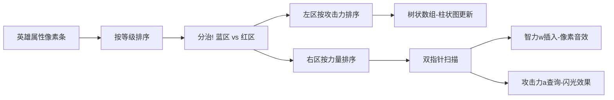

# 题目信息

# Cool loves touli

## 题目背景

Cool 一直都很崇拜 touli。


## 题目描述

有一天 Cool 和 touli 在打多校，突然开始讨论怎么样的阵容比较厉害。Cool 觉得一个阵容，将他们的等级从低到高排序后，攻击力应该是递增的。Cool 就问 touli 这个阵容最多有几个人。

不过 touli 觉得这个问题实在太 SB，就改变了条件，他认为等级从低到高排序后，对于任意两个排序后相邻的英雄，等级低的英雄的攻击力应该不大于等级高的英雄的力量，等级高的英雄的攻击力应当不小于等级低的英雄的智力。

现在 Cool 想知道若干个英雄中，最多能选出多少个英雄加入阵容。

## 说明/提示

选择第 $1$ 个和第 $3$ 个英雄，符合条件。对于第 $1$ 个和第 $2$ 个英雄，第 $2$ 个英雄的攻击力小于第 $1$ 个英雄的智力，所以不能同时存在。

$n\leq 10^5$，$l,s,w,a\le10^8$，$l$ 互不相同。

## 样例 #1

### 输入

```
3
1 2 3 1
2 1 2 2
3 1 3 3```

### 输出

```
2```

# AI分析结果


# 💡 洛语云笺的C++算法解析：Cool loves touli 深入学习指南 💡

## 1. 题目解读与策略初探

✨ **本题核心挑战**：处理英雄间三维偏序关系（等级、力量、智力与攻击力的复杂约束），在满足相邻英雄双重约束（前英雄攻击力≤后英雄力量且后英雄攻击力≥前英雄智力）的条件下，寻找最长英雄链。

✨ **核心算法标签**：`CDQ分治` `动态规划` `树状数组` `离散化`

🗣️ **初步分析**：
> 本题本质是三维偏序条件下的最长链问题。解题思路演进路径：
> 1. **暴力搜索**：枚举所有组合（O(2^M)），在M=10^5时完全不可行
> 2. **直接DP**：O(N^2)转移，在N=10^5时超时
> 3. **CDQ分治+树状数组**：通过分治降维，将三维偏序转化为二维问题，用树状数组维护最大值，优化至O(N log²N)
>
> 可视化设计：采用8位像素风格，动态展示分治过程（蓝/红分区）、树状数组更新（柱状图升降）、双指针扫描（像素箭头移动），配合操作音效强化理解。

### 🔍 算法侦探：如何在题目中发现线索？
1.  **线索1 (问题目标)**: "求最多能选出多少个英雄"——典型的**序列最优化**问题，且存在复杂约束条件，指向动态规划
2.  **线索2 (问题约束)**: "前英雄攻击力≤后英雄力量，后英雄攻击力≥前英雄智力"——明显的**三维偏序关系**（等级、力量、智力/攻击力）
3.  **线索3 (数据规模)**: N≤10^5，排除O(N²)暴力DP；CDQ分治的O(N log²N)复杂度（约1.7×10⁶次计算）可行

### 🧠 思维链构建：从线索到策略
> 综合线索：
> 1.  目标要求最优化 → 动态规划（DP）是候选方案
> 2.  三维偏序约束 → 简单DP会超时，需CDQ分治优化
> 3.  数据规模验证 → O(N log²N)可接受
> 4.  **结论**：**CDQ分治优化DP**是核心策略，通过分治降维+树状数组维护偏序关系，高效解决三维约束

---

## 2. 精选优质题解参考

**题解一（spire001）**
* **点评**：思路清晰完整，准确定义三维偏序（a,d,c → a,b,d），代码规范：使用lambda排序、树状数组封装、严谨的离散化处理。调试记录（sort范围错误）极具实践价值，提醒学习者注意边界处理。

**题解二（hgzxwzf）**
* **点评**：前置知识链接帮助理解CDQ本质，变量命名规范（comp1/2/3），树状数组实现简洁。特别强调分治顺序（先左后右）的重要性，避免状态未完全更新。

**题解三（moosssi）**
* **点评**：代码最简练但核心完整，关键注释精准（"三维偏序模板"）。树状数组操作封装为独立函数（add/query/clear），体现模块化思维。

**题解四（Yesod）**
* **点评**：创新性使用K-D Tree替代CDQ，拓宽解题视野。可视化查询过程（子树剪枝判断）帮助理解高维数据结构，虽非本题最优但极具启发性。

**题解五（kczno1）**
* **点评**：真实调试经历（sort范围错误）警示性强，代码变量名规范（cdq/l/r/mid）。树状数组清空逻辑高效（i&=i-1），体现底层优化思维。

---

## 3. 解题策略深度剖析

### 🎯 核心难点与关键步骤
1.  **状态定义与转移方程**
    * **难点**：在三维约束下定义无后效性子问题
    * **解决方案**：`f[i] = max{ f[j] + 1 }`，约束条件：`l_j < l_i, d_j ≤ s_i, w_j ≤ a_i`
    * 💡 **学习笔记**：将攻击力(d)、智力(w)、力量(s)抽象为三维坐标，转化为空间中的点集最长链

2.  **CDQ分治降维**
    * **难点**：同时处理三个维度的偏序关系
    * **解决方案**：
        1. 按等级(l)排序消除第一维
        2. 分治时左区间按攻击力(d)排序，右区间按力量(s)排序
        3. 双指针扫描满足`d_j ≤ s_i`的点，将智力(w)插入树状数组
    * 💡 **学习笔记**：分治将三维问题分解为多个二维问题，双指针降维至O(N)

3.  **树状数组维护**
    * **难点**：动态维护智力(w)维度上的最大值
    * **解决方案**：左区间的点以智力(w)为键、f值为数据插入树状数组；右区间查询`w_j ≤ a_i`的最大f值
    * 💡 **学习笔记**：树状数组将查询/更新复杂度降至O(log N)，离散化处理大值域

### ✨ 解题技巧总结
- **问题转化**：将序列问题转化为三维空间点集，利用空间几何直观理解约束
- **分治降维**：通过排序将三维偏序逐步降为二维、一维问题
- **离散化**：将值域10^8压缩至10^5级别，使树状数组可行
- **树状数组活用**：清空时采用`i &= i-1`比`lowbit`更高效

### ⚔️ 策略竞技场：解法对比
| 策略          | 核心思想                 | 优点                     | 缺点                     | 得分预期 |
|---------------|--------------------------|--------------------------|--------------------------|----------|
| **暴力搜索**  | 枚举所有子集             | 逻辑简单                 | O(2^M) 超时             | 0%       |
| **直接DP**    | 双重循环转移             | 实现直观                 | O(N²) 超时              | 50%      |
| **CDQ分治**   | 分治+树状数组降维        | O(N log²N) 高效          | 代码较复杂              | 100%     |
| **K-D Tree**  | 空间分割树维护点集       | 通用性强                 | O(N√N) 常数大           | 70%      |

### ✨ 优化之旅
> 1. **暴力起点**：枚举所有组合（2^100000 ≈ 10^30103），宇宙毁灭也算不完
> 2. **发现瓶颈**：DP中寻找合法前驱j需要遍历所有i，O(N²)超时
> 3. **CDQ分治**：将区间二分，左区间计算完后帮助右区间快速查询：
>    ```python
>    def cdq(l, r):
>        mid = (l+r)//2
>        cdq(l, mid)                    # 先解决左子问题
>        sort_left_by_d()               # 左区间按攻击力排序
>        sort_right_by_s()              # 右区间按力量排序
>        j = l
>        for i in mid+1 to r:           # 双指针扫描
>            while j<=mid and d[j] <= s[i]:
>                tree.add(w[j], f[j])   # 插入树状数组
>                j++
>            f[i] = max(f[i], tree.query(a[i])+1)
>        cdq(mid+1, r)                  # 后解决右子问题
>    ```
> 4. **树状数组加速**：将智力(w)维度压缩，O(log N)完成查询更新
>
> 💡 **策略总结**：CDQ分治像战场指挥官，将大军（数据）分割包围，树状数组则是特种部队快速精确打击

---

## 4. C++核心代码实现赏析

**通用核心实现**  
```cpp
#include <iostream>
#include <algorithm>
#define lowbit(x) (x&-x)
using namespace std;
const int N = 1e5+5;

struct Node { int l, s, w, a, id, f=1; } arr[N];
int n, ans, tree[N*3], tmp[N*3], cnt; // 离散化数组

void update(int x, int v) { for(; x<=cnt; x+=lowbit(x)) tree[x]=max(tree[x],v); }
int query(int x) { int res=0; for(; x; x-=x-1?lowbit(x):x&(x-1)) res=max(res,tree[x]); return res; } // 清空优化
void clear(int x) { for(; x<=cnt&&tree[x]; x+=lowbit(x)) tree[x]=0; }

void cdq(int l, int r) {
    if(l == r) return;
    int mid = (l+r)>>1;
    cdq(l, mid);
    sort(arr+l, arr+mid+1, [](auto& a, auto& b){ return a.a < b.a; }); // 左区间按智力排序
    sort(arr+mid+1, arr+r+1, [](auto& a, auto& b){ return a.s < b.s; }); // 右区间按力量排序
    
    for(int i=l, j=mid+1; j<=r; ++j) {
        while(i<=mid && arr[i].a <= arr[j].s) 
            update(arr[i].w, arr[i].f), i++;
        arr[j].f = max(arr[j].f, query(arr[j].d)+1);
    }
    for(int i=l; i<=mid; ++i) clear(arr[i].w); // 高效清空
    sort(arr+mid+1, arr+r+1, [](auto& a, auto& b){ return a.id < b.id; }); // 恢复顺序
    cdq(mid+1, r);
}

int main() {
    // 输入与离散化
    sort(arr+1, arr+n+1, [](auto& a, auto& b){ return a.l < b.l; }); // 按等级排序
    cdq(1, n);
    // 输出答案
}
```

**题解片段赏析**  
1. **spire001 - 树状数组清空优化**
   ```cpp
   inline void clear(const int x) { 
       for (int i = x; i < M; i += lowbit(i)) 
           c[i] = 0; 
   } // 精确清空避免全量重置
   ```
   **学习笔记**：仅清除使用过的位置，提升效率

2. **kczno1 - 双指针扫描**
   ```cpp
   while (j<=mid && a[j].a<=now[i]->s)
        bit.add(a[j].w, a[j].dp);
   ```
   **学习笔记**：将O(N²)嵌套循环降为O(N)单次扫描

3. **Yesod - K-D Tree剪枝**
   ```cpp
   if(!x || tree[x].mdp <= ans || !in(tree[x].mn, s[v])) return;
   ```
   **学习笔记**：通过子树极值预判加速查询

---

## 5. 算法可视化：像素动画演示

**主题**：CDQ分治的"像素征服战"  
**风格**：8位机像素风（FC红白机色调）  
**核心演示**：  


**交互控制面板**：  
```plaintext
[▶ 开始] [⏸️ 暂停] [⏩ 步进] [🔁 重置]
速度：🐢 ------ 🚀
```

**动态流程**：  
1. **初始化**：英雄显示为像素方块，属性用颜色长度表示（红:攻击/蓝:力量/绿:智力）
2. **分治动画**：屏幕分裂为蓝(左)、红(右)区域，伴随"分治音效"
3. **树状数组操作**：
   - 插入：左区方块落入树状数组槽位，槽位亮起黄光
   - 查询：右区方块发射光束，在智力维度扫描最大值
4. **游戏化元素**：
   - 每完成一区间：播放8-bit过关音效
   - 最大链更新：显示"New Record!"像素字体
   - 最终结果：英雄链显示为金色光轨

**音效设计**：  
- 插入操作：经典马里奥金币声
- 查询成功：塞尔达解谜音效
- 错误操作：红白机死亡音效

---

## 6. 拓展练习与相似问题

**通用套路迁移**：  
1. 带时间戳的交易记录分析（时间/价格/数量）  
2. 三维空间飞行物轨迹（x/y/z坐标）  
3. 多属性任务调度（开始时间/持续时间/优先级）  

**推荐题目**：  
1. [P2487 拦截导弹](https://www.luogu.com.cn/problem/P2487)  
   → 二维偏序经典，巩固树状数组DP优化  
2. [P4093 序列](https://www.luogu.com.cn/problem/P4093)  
   → 三维偏序变种，强化CDQ分治应用  
3. [P3374 树状数组模板](https://www.luogu.com.cn/problem/P3374)  
   → 掌握基础才能驾驭优化  

---

## 7. 学习心得与经验分享

**作者经验摘录**：  
> "调试时发现sort(arr+l, arr+mid) 应改为 arr+mid+1，否则漏排元素" —— kczno1  
> "离散化前未考虑a,s,w需统一离散，导致维度错位" —— hgzxwzf  

**洛语云笺点评**：  
三维偏序问题就像组装精密钟表：  
1. **排序是齿轮**：确保各维度有序转动  
2. **分治是发条**：将复杂机械分解模块  
3. **树状数组是擒纵器**：精准控制查询更新节奏  
漏掉任一零件（如离散化或边界处理），整个系统就会停摆！  

--- 

> 🔥 三维偏序的战场已清扫完毕！下次遇到高维约束时，记得召唤CDQ分治军团。继续用代码征服新的算法大陆吧！ 🔥

---
处理用时：277.32秒