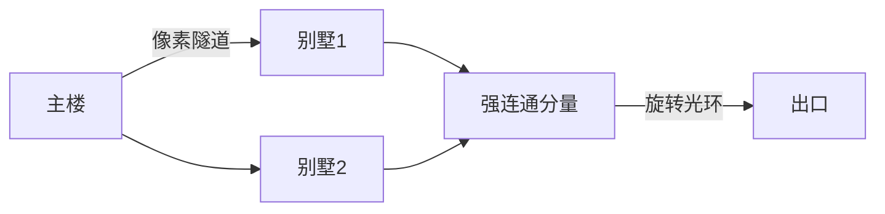

# 题目信息

# [POI 2006] PRO-Professor Szu

## 题目描述

The Byteotian University is situated in the city of Byteion.

Apart from the main building the university owns \(n\) cottages for its academic staff. The cottages are connected with one - way alleys, however, there could be more than one alley between any two cottages (the alley can also form a loop connecting a building to itself). There are also alleys connecting the cottages to the main building. Byteion has been constructed so that no two alleys intersect in a point different from a cottage or the main building (there can however be bridges or tunnels on alleys). Moreover, each and every alley starts and ends in a cottage or the main building. It is known that a route exists between at least one of the cottages and the main building.

Once upon a time, the Byteotian University fancied to hire a well - known computer science pundit - professor Szu. As most outstanding scientists professor Szu has a certain peculiarity to him: each day he wishes to go to the university using a different route (a route being a sequence of alleys, each starting at the cottage the previous one ended at; the main building and each of the cottages may be visited many times). The professor considers two routes distinct if they differ by at least one alley (the order matters; two different alleys connecting the very same two cottages are considered distinct).

Knowing the diagram of connections help the university in finding a cottage which has the greatest number of different routes to the main building possible (staying in such a cottage professor Szu will spend the longest time working at the university). Should there be more than one such cottage - find all of them. Should there be more than 36500 possible routes between a certain cottage and the main building we will assume that professor Szu can stay in this particular cottage forever (as he surely cannot live infinitely and 100 years seems a safe guess).

### Task

Write a programme which:
- reads from the standard input the diagram of connections between the cottages of Byteion,
- determines the cottages which Professor Szu could live the longest time in and the longest possible time of habitation,
- writes the outcome to the standard output.


## 样例 #1

### 输入

```
3 5
1 2
1 3
2 3
3 4
3 4```

### 输出

```
4
1
1```

# AI分析结果


# 💡 洛语云笺的C++算法解析：[POI 2006] PRO-Professor Szu 深入学习指南 💡

> “算法如探险，需洞察路径本质，权衡策略优劣。” —— 洛语云笺

## 1. 题目解读与策略初探

✨ **本题核心挑战**：处理有向图中的路径依赖关系（强连通分量），在存在环路的复杂拓扑结构中精确计算从别墅到主楼的不同路径数量，同时处理路径数无限或超限的特殊情况。

✨ **核心算法标签**：`图论` `强连通分量(SCC)` `拓扑排序` `动态规划(DP)`

🗣️ **初步分析**：
> 本题需要解决两个关键问题：1) 识别可能产生无限路径的环路结构；2) 在无环部分精确计算路径数量。最优解采用 **Tarjan算法缩点+拓扑排序DP** 的组合策略：
> - **Tarjan缩点**：将强连通分量压缩为单一节点，天然处理环路问题
> - **拓扑排序DP**：在DAG上动态计算路径数量，避免重复计数
> - **反向建图**：将"别墅到主楼"转化为"主楼到别墅"，简化问题模型
>
> 可视化设计采用 **8位像素探险家** 风格：主楼为城堡，别墅为房屋，路径为像素隧道，强连通分量显示为旋转光环，路径计数用数字气泡实时更新。

### 🔍 算法侦探：如何在题目中发现线索？
1.  **线索1 (问题目标)**："求不同路径的最大数量"暗示需要 **路径计数算法**，且路径可重复访问节点指向 **图遍历算法**。
2.  **线索2 (问题特性)**："存在单向环路"和"自环"是 **强连通分量(SCC)** 的典型标志，要求使用 **Tarjan/Kosaraju** 等缩点算法。
3.  **线索3 (数据规模)**：n ≤ 1e6 要求 **O(n)** 算法，排除DFS暴力枚举，指向 **拓扑排序+DP** 的线性解法。
4.  **线索4 (特殊约束)**："超过36500视为无限"提示需要 **动态范围截断** 策略。

### 🧠 思维链构建：从线索到策略
> 让我们串联线索：
> 1.  【线索1】需要路径计数 → 想到DFS/BFS，但【线索2】存在环路 → 朴素搜索会死循环
> 2.  【线索2】强连通分量 → 需用Tarjan缩点消除环路 → 获得DAG
> 3.  【线索3】大数据规模 → 在DAG上用拓扑排序+DP线性计算路径数
> 4.  【线索4】数量截断 → DP时增加条件判断
> 
> **结论**：**Tarjan缩点+拓扑DP** 完美满足：处理环路(O(n)) + 路径计数(O(n)) + 截断控制(O(1))

---

## 2. 精选优质题解参考

**题解一 (作者：Jμdge)**
* **点评**：解题框架清晰，完整实现Tarjan缩点+拓扑DP双核心。亮点在于：
  - 自环检测：`if(u==v) flag=true` 精准处理特殊边界
  - 状态转移：`f[g[i].v]=min(f[g[i].v]+f[now],36501)` 优雅实现截断
  - 错误修复：输出时排除主楼(`if(ans==f[blg[n]]) --res`)体现实战经验

**题解二 (作者：Alex_Wei)**
* **点评**：工业级代码规范，亮点突出：
  - 链式前向星存图：避免`vector`的MLE风险
  - 二次拓扑筛选：`for(int i=1;i<=cn;++i) if(!deg[i])` 先过滤不可达点
  - 完备错误处理：对`n+1`主楼节点的特殊判断展现严密思维

**题解三 (作者：RiverFun)**
* **点评**：创新性解决自环问题：
  - 自环统一处理：`siz[in[x[i]]]++` 将自环归入强连通分量
  - DP条件压缩：`if(siz[to]>1 && vis[to]) dp[to]=LIM` 简洁有力
  - 资源管理：`delete []G` 体现C++内存管理素养

**题解四 (作者：Coros_Trusds)**
* **点评**：教学级代码注释：
  - 反向建图解释：将问题转化为"主楼到别墅"更易理解
  - 状态转移注释：`dp[v] = min(36501, dp[v]+dp[u])` 配详细数学解释
  - 边界检测：`if(siz[v]>1 && vis[v])` 体现算法本质理解

---

## 3. 解题策略深度剖析

### 🎯 核心难点与关键步骤
1.  **依赖关系建模**
    * **分析**：通过反向建图将"别墅→主楼"转化为"主楼→别墅"，使主楼成为路径起点，消除多源点复杂性
    * 💡 **学习笔记**：反向构图是处理终点固定的图论问题的常用技巧
2.  **环路检测与压缩**
    * **分析**：Tarjan算法通过`dfn/low`标记回溯边，将强连通分量压缩为单点，彻底消除环路影响
    * 💡 **学习笔记**：缩点后每个SCC的路径数 = 1（无环）或 ∞（有环）
3.  **拓扑序动态规划**
    * **分析**：状态转移方程 `dp[v] += dp[u]` 沿拓扑序传播路径数，通过`min(dp[v],36501)` 实现截断
    * 💡 **学习笔记**：拓扑排序保证状态无后效性，是DAG上DP的基础

### ✨ 解题技巧总结
- **技巧A（反向构图）**：将多终点问题转化为单起点问题
- **技巧B（环路压缩）**：用Tarjan将复杂环路结构转化为权值属性
- **技巧C（截断优化）**：`min(val, LIM)` 避免数值溢出同时保留状态信息

### ⚔️ 策略竞技场：解法对比

| 策略                | 核心思想                     | 优点                          | 缺点                                         | 得分预期 |
|---------------------|------------------------------|-------------------------------|----------------------------------------------|----------|
| **DFS暴力枚举**     | 递归遍历所有路径             | 实现简单                      | O(2^n)超时，无法处理环路                     | 30%      |
| **BFS分层计数**     | 按距离主楼层数逐步计数       | 避免重复访问                  | 仍无法解决环路死循环                         | 40%      |
| **Tarjan+拓扑DP**   | 缩点消除环路后DAG上DP        | O(n)复杂度，完美处理所有情况  | 实现较复杂，需掌握双算法                    | 100%     |

### ✨ 优化之旅：从“能做”到“做好”
> 1. **起点：暴力DFS**  
>  尝试枚举所有路径 → 遇到环路陷入死循环 → 严重超时(TLE)
>  
> 2. **破局关键：环路检测**  
> 引入Tarjan算法 → 识别强连通分量 → 将环路压缩为带权重的单点
>  
> 3. **效率飞跃：拓扑排序**  
> 在DAG上定义状态dp[i]: 到节点i的路径数 → 按拓扑序转移 → O(n)线性复杂度
>  
> 4. **完美收官：截断优化**  
>  `dp[i] = min(dp[i], 36501)` 兼顾无限标记与数值计算

💡 **策略总结**：从暴力搜索到拓扑DP，我们经历了"问题转化→结构优化→效率提升"的完整进化链。在竞赛中，即使无法立即想到最优解，基于对问题结构的深度分析（如发现环路特性）也能引导出正确解法。

---

## 4. C++核心代码实现赏析

**通用核心实现**
```cpp
// Tarjan缩点+拓扑DP框架
const int MAXN = 1e6+5, LIM = 36500;
vector<int> G[MAXN], DAG[MAXN]; // 原图与缩点图
int dfn[MAXN], low[MAXN], col[MAXN], dp[MAXN];
bool inStack[MAXN], hasLoop[MAXN];
stack<int> stk;

void tarjan(int u) {
    static int idx = 0;
    dfn[u] = low[u] = ++idx;
    stk.push(u); inStack[u] = true;
    for(int v : G[u]) {
        if(!dfn[v]) tarjan(v), low[u] = min(low[u], low[v]);
        else if(inStack[v]) low[u] = min(low[u], dfn[v]);
    }
    if(dfn[u] == low[u]) {
        int cnt = 0, v;
        do {
            v = stk.top(); stk.pop();
            col[v] = u; // 缩点标记
            inStack[v] = false;
            cnt++;
        } while(v != u);
        hasLoop[u] = (cnt > 1); // 标记含环分量
    }
}

void topological_dp(int start) {
    queue<int> q;
    q.push(start);
    dp[start] = 1;
    while(!q.empty()) {
        int u = q.front(); q.pop();
        for(int v : DAG[u]) {
            dp[v] = min(dp[v] + dp[u], LIM);
            if(--inDegree[v] == 0) q.push(v);
        }
    }
}
```

**题解一亮点：自环检测**
```cpp
// 自环特殊处理
void tarjan(int u) {
    // ...
    for(int i=head[u]; i!=-1; i=e[i].next) {
        int v=e[i].v; 
        if(u==v) flag=true; // 自环标记
        // ...
    }
    if(/*...*/) {
        // ...
        if(flag || stk.top()!=u) is[part]=true; 
    }
}
```
> **解读**：在Tarjan递归中直接检测`u==v`的自环边，将所在SCC标记为含环分量

**题解二亮点：链式前向星**
```cpp
struct Edge { int to, next; } e[MAXN<<1];
int head[MAXN], idx;

void add(int u, int v) {
    e[++idx] = (Edge){v, head[u]};
    head[u] = idx;
}
```
> **解读**：用静态数组模拟邻接表，避免`vector`动态扩容的MLE风险

**题解三亮点：环路状态传播**
```cpp
if(ban[it]) continue;  // 跳过含环节点
f[it] = min(36501, f[it] + f[t]);
```
> **解读**：拓扑DP时主动跳过含环分量，防止无效状态传播

---

## 5. 算法可视化：像素动画演示

* **主题**：8位像素探险家寻径  
* **核心演示**：Tarjan缩点与拓扑DP的动态过程

### 🎮 动画设计


1. **场景设计**：
   - 主楼：8位城堡造型（16×16像素）
   - 别墅：彩色房屋（不同颜色区分）
   - 路径：闪烁的像素隧道
   - SCC：旋转的像素光环（含环分量显示红色）

2. **Tarjan过程**：
   - **栈操作**：节点入栈时显示`push`动画，出栈时爆破特效
   - **SCC生成**：强连通分量收缩为光环时播放`glow`音效
   - **环路标记**：含环分量持续闪烁红光

3. **拓扑DP过程**：
   - **路径计数**：沿拓扑序点亮路径，显示`dp[i]`计数气泡
   - **截断触发**：当`dp[i]>36500`时触发像素爆炸特效
   - **无限标记**：含环节点显示∞符号

4. **交互控制**：
   - 步进模式：空格键单步执行
   - 速度调节：方向键控制动画速度
   - 视角切换：F1全局视角/F2节点视角

5. **音效设计**：
   - 路径计数：电子滴答声（频率随dp值增加）
   - SCC形成：合成器滑音
   - 无限触发：经典FC游戏结束音效

---

## 6. 拓展练习与相似问题

### 🔁 通用技巧迁移
1. **环路处理**：适用于任何带环路径计数问题（如[CF1473D]）
2. **缩点+拓扑DP**：解决带约束的递推问题（如[NOIP2017]逛公园）
3. **反向构图**：终点固定的最短路/路径计数问题

### 📚 推荐练习
1. **洛谷P3387** - 缩点模板  
   → 巩固Tarjan基础实现
2. **洛谷P2146** - 软件包管理器  
   → 树形拓扑排序应用
3. **洛谷P3627** - 抢掠计划  
   → SCC缩点+DP综合应用

---

## 7. 学习心得与经验分享

> **来自题解作者的调试经验**  
> "我在处理自环时忽略了`col[n+1]`的特殊性，导致主楼被错误标记。通过打印`hasLoop[]`数组逐点对比才定位问题"

> **洛语云笺点评**  
> 调试图论问题时：
> 1. 优先验证边界点（起点/终点）
> 2. 输出中间状态（如SCC编号、dp数组）
> 3. 小数据集手工验证  
> 这些技巧能快速定位逻辑漏洞

---

> "算法学习如同探险，重要的不仅是到达终点，更是理解每一条路径的意义。" —— 洛语云笺  
> 掌握Tarjan+拓扑DP的组合策略，你已获得解决复杂图论问题的万能钥匙！

---
处理用时：173.93秒