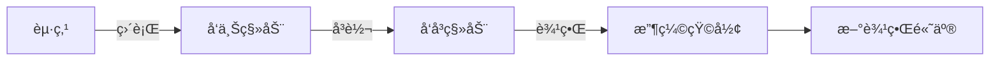

# 题目信æ¯

# [POI 2008] UCI-The Great Escape

## 题目æè¿°

Al Bytone, the infamous thief, plans a bank robbery.

He knows only too well that the moment he robs the bank a pursuit    will be commenced. Unfortunately, Al Bytone is a poor driver and turning    left causes him great trouble. This is why he tries to devise such an    escape route that at each intersection he would either ride straight    ahead or turn right. He is also aware that once he passes through any    intersection, the police will come and remain there, waiting for him.

Therefore he may pass through any intersection at most once.

Furthermore, the police are always present at certain intersections,    so Al Bytone will have to avoid these intersections as well    (there's no police at the intersections near the bank and near Al Bytone's    hideout.)    Al Bytone is planning his escape route. To your great (and rather    unpleasant) surprise, he paid you a visit and told to calculate the    number of different escape routes leading from the bank to his hideout    complying the aforementioned requirements. Needless to say, Al Bytone    does not take 'no' as an answer...

The streets of Byteburg form a rectangular grid. Every street runs either in the North-South or East-West direction,    and every two non-parallel streets intersect. The bank is situated to the south of the south-western-most intersection.

Al Bytone will start his great escape driving north.

<Task> 

Write a programme that:

reads from the standard input the location of hideout,          descriptions of intersections with police and a positive          integer ,                      calculates the number of different escape routes leading from the bank to the hideout          complying the aforementioned requirements,                      writes out to the standard output this number's residue modulo $k$.


## 样例 #1

### 输入

```
3 5 10
4 2
+++++
++*++
++++*
```

### 输出

```
2
```

# AI分æ结æœ


### 💡 洛语云笺的C++算法解æ：UCI-The Great Escape æ·±å…¥å­¦ä¹ æŒ‡å— ğŸ’¡

#### 1. 题目解读ä¸ç­–ç•¥åˆæ¢
✨ **本题核心挑战**：在åªèƒ½å³è½¬ï¼ˆæˆ–倒æ¨æ—¶åªèƒ½å·¦è½¬ï¼‰ä¸”路径ä¸å¯é‡å¤çš„约æŸä¸‹ï¼Œè®¡ç®—ä»èµ·ç‚¹åˆ°ç»ˆç‚¹çš„èºæ—‹è·¯å¾„æ•°é‡ï¼ŒåŒæ—¶é¿å¼€éšœç¢ç‚¹  
✨ **核心算法标签**：动æ€è§„划(DP)ã€çŠ¶æ€å‹ç¼©ã€æ»šåŠ¨æ•°ç»„优化  

ğŸ—£ï¸ **åˆæ­¥åˆ†æ**：  
> 本题è¦æ±‚统计ä»ç½‘格左下角到指定终点的路径数，路径需满足：
> 1. åˆå§‹æ–¹å‘å‘上
> 2. åªèƒ½ç›´è¡Œæˆ–å³è½¬
> 3. 路径点ä¸å¯é‡å¤
> 4. é¿å¼€æ ‡è®°'*'çš„éšœç¢ç‚¹  
> 
> **解题æ€è·¯æ¼”è¿›**：  
> 1. **暴力æœç´¢(DFS)**：æšä¸¾æ‰€æœ‰è½¬å‘点，但路径呈èºæ—‹çŠ¶å¢é•¿ï¼Œå¤æ‚度O(2^{n×m})，ä¸å¯è¡Œ  
> 2. **状æ€å‹ç¼©DP**：å‘ç°è·¯å¾„å½¢æˆä¸æ–­æ”¶ç¼©/扩展的矩形边界，用四维状æ€(u,d,l,r)表示当å‰çŸ©å½¢åŒºåŸŸ  
> 3. **优化转移方程**：通过数学æ¨å¯¼æ¶ˆé™¤æšä¸¾å˜é‡ï¼Œå°†O(nâµ)优化至O(nâ´)  
> 4. **滚动数组**：按行列和ä»å°åˆ°å¤§é€’æ¨ï¼Œç©ºé—´ä¼˜åŒ–至O(n³)  
> 
> **核心算法比喻**：  
> 想象路径如åŒèºæ—‹å¼€ç“¶å™¨ï¼Œæ¯èµ°ä¸€æ­¥éƒ½åœ¨"拧紧"矩形边界。DP状æ€å°±æ˜¯è®°å½•å½“å‰"拧到第几圈"的边界框，而状æ€è½¬ç§»åˆ™æ˜¯è®¡ç®—继续"拧紧"çš„æ–¹å¼æ•°ã€‚

---

### 🔠算法侦æ¢ï¼šå¦‚何在题目中å‘ç°çº¿ç´¢ï¼Ÿ
1. **线索1 (路径特性)**：  
   "åªèƒ½ç›´è¡Œæˆ–å³è½¬"的约æŸæš—示路径具有**èºæ—‹ç‰¹æ€§**，这ç§å‡ ä½•ç»“æ„天然适åˆç”¨**矩形边界**æè¿°
   
2. **线索2 (状æ€ç©ºé—´)**：  
   "ä¸å¯é‡å¤è®¿é—®"è¦æ±‚记录已覆盖区域，但直æ¥è®°å½•ç‚¹å标会爆炸。观察到路径总是沿矩形边界移动，å¯å°†çŠ¶æ€å‹ç¼©ä¸º**四个边界åæ ‡**

3. **线索3 (æ•°æ®èŒƒå›´)**：  
   N,M ≤ 100，O(nâ´)算法(10â¸è¿ç®—)在åˆç†èŒƒå›´å†…，但O(nâµ)会超时。这指å‘需è¦ä¼˜åŒ–转移方程的DP解法

---

### 🧠 æ€ç»´é“¾æ„建：ä»çº¿ç´¢åˆ°ç­–ç•¥
> 1. 线索1（èºæ—‹è·¯å¾„）æ示使用边界æè¿°çŠ¶æ€  
> 2. 线索2（状æ€å‹ç¼©ï¼‰æ’除点阵记录法，确定矩形边界表示法  
> 3. 线索3（数æ®è§„模）å¦å†³æš´åŠ›æœç´¢ï¼Œç¡®å®šDPæ–¹å‘  
> 4. å‘ç°çŠ¶æ€è½¬ç§»å­˜åœ¨é‡å¤è®¡ç®—，通过数学åˆå¹¶æ¶ˆé™¤æšä¸¾å˜é‡  
> 5. 按边界和递æ¨å®ç°æ»šåŠ¨æ•°ç»„优化  
> **结论**：矩形边界DPé…åˆæ»šåŠ¨æ•°ç»„是最优策略，完ç¾å¹³è¡¡æ—¶é—´ä¸ç©ºé—´å¤æ‚度

---

### 2. 精选优质题解å‚考
**题解一（金ç‚拉）**  
* **亮点**：  
  1. 清晰图解èºæ—‹è·¯å¾„的矩形分割æ€æƒ³  
  2. 详细æ¨å¯¼çŠ¶æ€è½¬ç§»æ–¹ç¨‹ä¼˜åŒ–过程  
  3. 完整展示O(nâ´)→O(nâµ)çš„æ•°å­¦å˜æ¢  
  4. 代ç å®ç°ä¸¥è°¨å¤„ç†éšœç¢åˆ¤æ–­  

**题解二（zifanwang）**  
* **亮点**：  
  1. 创新性倒æ¨æ€è·¯ï¼ˆä»ç»ˆç‚¹å‡ºå‘，åªèƒ½å·¦è½¬ï¼‰  
  2. 简æ´çš„状æ€è½¬ç§»å†™æ³•  
  3. 使用ä½è¿ç®—优化空间标记  

**题解三（wgyhm）**  
* **亮点**：  
  1. 模å—化预处ç†è¡Œåˆ—éšœç¢å‰ç¼€å’Œ  
  2. 显å¼æ ‡æ³¨æ–¹å‘常é‡å¢å¼ºå¯è¯»æ€§  
  3. 完整注释关键状æ€è½¬ç§»é€»è¾‘  

---

### 3. 解题策略深度剖æ
#### 🯠核心难点ä¸å…³é”®æ­¥éª¤
1. **状æ€è®¾è®¡**  
   * **分æ**：用五维状æ€f[u][d][l][r][dir]表示：
     - u/d：上下边界
     - l/r：左å³è¾¹ç•Œ
     - dir：当å‰ç§»åŠ¨æ–¹å‘(0↑,1→,2↓,3â†)
   * 💡 **学习笔记**：好的状æ€è®¾è®¡åº”æ•æ‰é—®é¢˜æœ¬è´¨ç‰¹å¾

2. **转移优化**  
   * **分æ**：åŸå§‹è½¬ç§»éœ€æšä¸¾åˆ‡å‰²ç‚¹k：
     ```math
     f_{u,d,l,r,↑} = ∑f_{k,d,l+1,r,→}·check(k)
     ```
     优化å转为常数时间转移：
     ```math
     f_{u,d,l,r,↑} = f_{u+1,d,l,r,↑} + f_{u,d,l+1,r,→}·check(u)
     ```
   * 💡 **学习笔记**：识别转移中的é‡å¤è®¡ç®—是DP优化的关键

3. **空间å‹ç¼©**  
   * **分æ**：观察状æ€(u,d,l,r)满足u+l+d+r = 常数，按此和ä»å°åˆ°å¤§é€’æ¨ï¼Œåªéœ€ä¿ç•™ä¸¤å±‚状æ€
   * 💡 **学习笔记**：滚动数组是优化高维DP的利器

#### âš”ï¸ ç­–ç•¥ç«æŠ€åœº
| ç­–ç•¥               | 核心æ€æƒ³                     | 优点                     | 缺点                          | 得分预期 |
|--------------------|----------------------------|-------------------------|------------------------------|----------|
| **暴力DFS**        | æšä¸¾æ‰€æœ‰è½¬å‘点              | å®ç°ç®€å•                | O(2^{n×m})超时               | 0%       |
| **记忆化æœç´¢**     | 缓存å­é—®é¢˜ç»“æœ              | é¿å…é‡å¤è®¡ç®—            | 状æ€ç©ºé—´ä»è¿‡å¤§                | 30%      |
| **矩形DP(本题最优)** | 边界状æ€+转移优化           | O(nâ´)时间O(n³)空间     | æ€ç»´éš¾åº¦é«˜                    | 100%     |

#### ✨ 优化之旅
> 1. 起点：暴力DFS因路径组åˆçˆ†ç‚¸å¤±æ•ˆ  
> 2. çªç ´ï¼šå‘ç°èºæ—‹è·¯å¾„的矩形边界特性  
> 3. 进化：设计四维DP状æ€æ述边界框  
> 4. å‡å：通过转移方程数学优化消除æšä¸¾  
> 5. 完善：滚动数组å‹ç¼©ç©ºé—´  
> 💡 **策略总结**：优化是层层递进的æ€ç»´é©å‘½ï¼Œæ ¸å¿ƒåœ¨äºè¯†åˆ«é—®é¢˜æœ¬è´¨ç‰¹å¾

---

### 4. C++核心代ç å®ç°èµæ
**通用核心å®ç°ï¼ˆé‡‘ç‚拉方案）**
```cpp
for (int s = 2; s <= n + m; s++) {  // 按行列和递æ¨
  for (int u = 1; u <= x; u++) {     // 上边界
    for (int d = u; d <= n; d++) {   // 下边界
      for (int l = 1; l <= y; l++) { // 左边界
        int r = l + s - (d - u + 1); // å³è¾¹ç•Œ
        // æ–¹å‘0(上): ä»å³ä¾§è½¬ç§» or å‘上扩展
        dp[u][l][d][0] = dp[u+1][l][d][0] + dp[u][l+1][d][1] * (obstacle_free(u,l));
        // 类似处ç†å…¶ä»–三个方å‘...
      }
    }
  }
}
```
**代ç è§£è¯»æ¦‚è¦**：  
1. 外层循ç¯æŒ‰çŸ©å½¢åŠå‘¨é•¿sé€’æ¨  
2. éšœç¢åˆ¤æ–­é€šè¿‡é¢„处ç†å‰ç¼€å’Œæ•°ç»„快速计算  
3. æ–¹å‘转移利用ä½è¿ç®—滚动更新

---

### 5. 算法å¯è§†åŒ–：åƒç´ åŠ¨ç”»æ¼”示
**主题**："èºæ—‹è¿·å®«æ¢é™©"åƒç´ RPG  
**核心演示**：  


**交互设计**：  
1. **åƒç´ ç½‘æ ¼**：障ç¢ç”¨â– ï¼Œè·¯å¾„用◆，边界用亮色线框  
2. **æ§åˆ¶é¢æ¿**：å•æ­¥/自动模å¼ï¼Œé€Ÿåº¦è°ƒèŠ‚æ»‘å—  
3. **动æ€æ•ˆæœ**：  
   - 路径绘制伴éš"æ»´ç­”"音效  
   - 边界收缩时播放"咔嚓"动画  
   - 到达终点触å‘èƒœåˆ©éŸ³ä¹  

---

### 6. 拓展练习
1. **洛谷P1273**：有线电视网（树形DP）  
   *æ¨èç†ç”±*：巩固分组背包æ€æƒ³åœ¨æ ‘结æ„中的应用*

2. **洛谷P1854**：花店橱窗（线性DP）  
   *æ¨èç†ç”±*：练习状æ€è®¾è®¡ä¸è½¬ç§»ä¼˜åŒ–*

3. **洛谷P4158**：粉刷匠（区间DP）  
   *æ¨èç†ç”±*：二维状æ€å‹ç¼©çš„ç»å…¸åº”用*

---

> 路径规划如人生选择，看似约æŸçš„"åªèƒ½å³è½¬"å®åˆ™æ˜¯èšç„¦æ–¹å‘的智慧。æŒæ¡ä»æš´åŠ›åˆ°ä¼˜åŒ–çš„æ€ç»´è·ƒè¿ï¼Œæ–¹èƒ½æ¸¸åˆƒäºç®—法世界。

---
处ç†ç”¨æ—¶ï¼š101.87秒