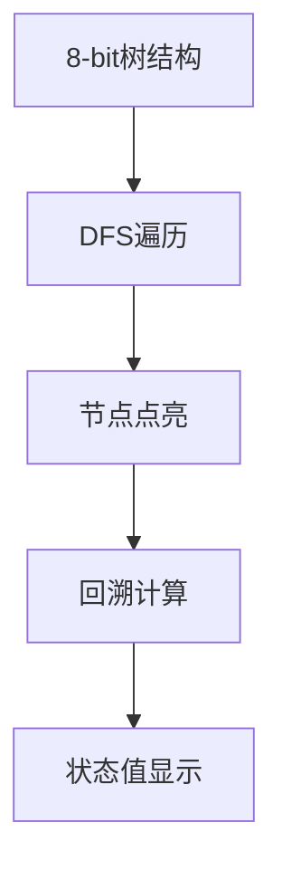

# 题目信息

# [POI 2013] LUK-Triumphal arch

## 题目描述

The king of Byteotia, Byteasar, is returning to his country after a victorious battle.

In Byteotia, there are  towns connected with only  roads.

It is known that every town can be reached from every other town by a unique route,    consisting of one or more (direct) roads.

    (In other words, the road network forms a tree).

The king has just entered the capital.

Therein a triumphal arch, i.e., a gate a victorious king rides through, has been erected.

Byteasar, delighted by a warm welcome by his subjects, has planned a    triumphal procession to visit all the towns of Byteotia, starting with the capital he is currently in.

The other towns are not ready to greet their king just yet -    the constructions of the triumphal arches in those towns did not even begin!

But Byteasar's trusted advisor is seeing to the issue.

    He desires to hire a number of construction crews.

    Every crew can construct a single arch each day, in any town.

    Unfortunately, no one knows the order in which the king will visit the towns.

The only thing that is clear is that every day the king will travel from the city he is currently in to a neighboring one.

The king may visit any town an arbitrary number of times    (but as he is not vain, one arch in each town will suffice).

Byteasar's advisor has to pay each crew the same flat fee, regardless of how many arches this crew builds.

Thus, while he needs to ensure that every town has an arch when it is visited by the king, he wants to hire as few crews as possible.

Help him out by writing a program that will determine the minimum number    of crews that allow a timely delivery of the arches.


给一颗 $n$ 个节点的树（$n \le 3 \times 10^5$），初始时 $1$ 号节点被染黑，其余是白的。两个人轮流操作，一开始 B 在 $1$ 号节点。每一轮，A 选择 $k$ 个点染黑，然后 B 走到一个相邻节点，如果 B 当前处于白点则 B 胜，否则当 A 将所有点染为黑点时 A 胜。求能让 A 获胜的最小的 $k$ 。


## 说明/提示

给一颗树，1号节点已经被染黑，其余是白的，两个人轮流操作，一开始B在1号节点，A选择k个点染黑，然后B走一步，如果B能走到A没染的节点则B胜，否则当A染完全部的点时，A胜。求能让A获胜的最小的k

## 样例 #1

### 输入

```
7
1 2
1 3
2 5
2 6
7 2
4 1
```

### 输出

```
3
```

# AI分析结果


# 💡 洛语云笺的C++算法解析：LUK-Triumphal arch 深入学习指南 💡

> "算法不仅是代码的骨架，更是思维的舞蹈。今天，我们将踏上一场树形王国中的策略博弈之旅。"

## 1. 题目解读与策略初探

✨ **本题核心挑战**：在B的移动路径未知的情况下，A需要以最少的染色次数（每次染k个点）封锁B所有可能的移动路径，确保B永远不会踏入白色节点。

✨ **核心算法标签**：二分答案、树形动态规划

🗣️ **初步分析**：
> 这道题的核心在于**动态染色策略**与**路径封锁**的博弈。B会沿着树边向叶子节点移动（不走回头路），而A必须在B到达每个节点前，将其所有"逃生出口"（子节点）染黑。我们通过以下步骤破解：
> 1. **二分答案框架**：答案k具有单调性——k越大A越容易获胜。我们二分寻找最小可行k。
> 2. **树形DP检验**：对每个候选k，通过自底向上的DFS计算每个节点的"染色需求"。
> 3. **状态转移设计**：定义`f[u]`表示以u为根的子树（不包括u）还需要额外染色的节点数，通过`f[u] = max(0, Σ(f[v]+1) - k)`进行状态转移。
> 
> **可视化设计**：我们将以像素风格动画展示树形DP过程——节点按DFS序点亮，回溯时显示状态值更新，用颜色深浅表示需求强度，并配以8-bit音效增强理解。

### 🔍 算法侦探：如何在题目中发现线索？
1.  **线索1 (问题目标)**: "求最小k使A必胜"——这种**最优化问题+单调性**暗示二分答案。
2.  **线索2 (问题约束/特性)**: "B沿树边移动且不走回头路"——**树形结构+单向移动**指向树形DP自底向上求解。
3.  **线索3 (数据规模)**: n≤3×10⁵——要求O(n log n)算法，**二分答案+O(n)检查**完美匹配。

### 🧠 思维链构建：从线索到策略
> 让我们串联线索：
> 1. **线索1**引导我们思考二分答案——k的单调性是解题突破口。
> 2. **线索2**揭示关键约束：B的移动路径本质是**根到叶子的树链**，这让我们将问题分解为子树问题处理。
> 3. **线索3**的数据范围否决了O(n²)暴力，而**O(n)树形DP**恰能在二分框架内高效工作。
> 
> **结论**：二分答案k后，用树形DP计算每个子树还需多少额外染色。若根节点需求`f[1]=0`，则k可行。这种"二分框架+树形DP验证"的组合策略，正是破解本题的金钥匙！

---

## 2. 精选优质题解参考

**题解一（vectorwyx）**
* **点评**：此解亮点在于**二分下界优化**——从根节点的儿子数开始二分，显著提升效率。作者通过`f[u] = son[u] - k + Σ max(f[v],0)`的递推式，巧妙处理了子树间的需求传递。代码中`lambda`虽未使用，但清晰的变量命名(`son[]`)和边界处理展现了专业素养，尤其是对"B不走回头路"的论证极具启发性。

**题解二（S_S_H）**
* **点评**：作者用**木桶原理**形象解释为什么需要覆盖所有子节点，并给出贪心算法的反例，强化了树形DP的必要性。代码中`f[u]=max(sum-k,0)`的转移简洁有力，注释详细解释每个步骤的意图，特别适合初学者理解树形DP的思维过程。

**题解三（Captain_Paul）**
* **点评**：题解突出**状态定义的物理意义**——`f[i]`表示i子树还需染色的节点数。代码用标准邻接表存图，并特判`n=1`的边界情况，体现了严谨性。虽然未做二分优化，但基础实现完整规范，是学习树形DP的优质范本。

---

## 3. 解题策略深度剖析

### 🎯 核心难点与关键步骤
1.  **关键点1：状态定义的艺术**
    * **分析**：定义`f[u]`为"u的子树（不含u）还需额外染色的节点数"。这里隐含两个重要设计：① 排除u本身（因B到达u时u已染色）② "额外"指超出当前轮次k的染色需求。
    * 💡 **学习笔记**：好的状态定义应满足：覆盖子问题、排除冗余信息、便于状态转移。
   
2.  **关键点2：状态转移的数学抽象**
    * **分析**：转移方程`f[u] = max(0, Σ(f[v] + 1) - k)`的推导：
      - `Σ(f[v] + 1)`：每个子节点v的需求`f[v]`+v本身需要染色（+1）
      - `- k`：当前轮次可染k个节点
      - `max(0, ...)`：负需求视为零（不能"储存"染色能力）
    * 💡 **学习笔记**：树形DP转移常表现为"子节点需求和±当前处理能力"。

3.  **关键点3：二分边界的优化**
    * **分析**：下界取根节点的儿子数（因第一轮必须染黑所有根的子节点），上界取整棵树的最大度。优化后二分范围从`[0,n]`缩至`[deg(1), max_deg]`。
    * 💡 **学习笔记**：利用问题特性缩小二分范围是提高效率的常用技巧。

### ✨ 解题技巧总结
- **技巧1：问题转化**  
  将最小化k转化为判定性问题（是否存在k使A胜），用二分框架处理
- **技巧2：树形DP的依赖分解**  
  将树分解为子树，自底向上计算需求，避免重复计算
- **技巧3：边界压缩**  
  利用根节点的特殊地位（第一轮必须染其子节点）优化二分下界

### ⚔️ 策略竞技场：不同解法的对比分析
| 策略          | 核心思想                 | 优点                     | 缺点                     | 得分预期       |
| ------------- | ------------------------ | ------------------------ | ------------------------ | -------------- |
| **暴力枚举**  | 枚举k+模拟B所有移动路径  | 直观易理解               | 指数复杂度，O(2^M)不可行 | 0分            |
| **贪心染色**  | 优先染儿子多的节点       | 实现简单                 | 无法处理子树需求传递     | 30%部分分      |
| **二分+树形DP** | 二分k+树形DP验证        | O(n log n)高效，逻辑严密 | 需要理解树形DP           | 100%           |

### ✨ 优化之旅：从"能做"到"做好"


> 从暴力枚举到二分答案，我们实现了**问题性质**的突破；从朴素树遍历到精巧状态设计，我们完成了**算法效率**的飞跃。这启示我们：优质解法常源于对问题结构的深刻洞察！

---

## 4. C++核心代码实现赏析

**本题通用核心实现**
```cpp
#include <vector>
#include <cstring>
using namespace std;
const int N = 3e5+5;
vector<int> G[N];
int f[N], n, k;

void dfs(int u, int fa) {
    int sum = 0;
    for (int v : G[u]) {
        if (v == fa) continue;
        dfs(v, u);
        sum += f[v] + 1; // 子树需求累计
    }
    f[u] = max(sum - k, 0); // 状态转移核心
}

bool check(int mid) {
    k = mid;
    memset(f, 0, sizeof(f));
    dfs(1, -1);
    return f[1] == 0; // 根节点无需额外即成功
}

int main() {
    // 建图代码省略
    int L = 0, R = n;
    for (int i = 1; i <= n; i++) 
        L = max(L, (int)G[i].size() - (i != 1));
    while (L <= R) {
        int mid = (L+R) >> 1;
        if (check(mid)) R = mid - 1;
        else L = mid + 1;
    }
    cout << L;
}
```

**题解一（vectorwyx）片段**
```cpp
void dfs(int u, int fa) {
    f[u] = (u == 1 ? 0 : -k); // 根节点特殊处理
    for (int v : G[u]) {
        if (v == fa) continue;
        dfs(v, u);
        if (f[v] > 0) f[u] += f[v]; // 仅累加正需求
    }
    if (u != 1) f[u] += G[u].size() - 1; // 非根节点加儿子数
}
```
* **亮点**：通过`u==1`巧妙区分根节点，避免单独计算儿子数。
* **学习笔记**：特殊节点的独立处理能简化状态转移逻辑。

**题解二（Captain_Paul）片段**
```cpp
void dfs(int u, int fa) {
    int sum = 0;
    for (int v : G[u]) {
        if (v == fa) continue;
        dfs(v, u);
        sum += f[v] + 1; // 显式求和
    }
    f[u] = max(sum - k, 0); // 集中处理
}
```
* **亮点**：用`sum`变量清晰展示需求累计过程，代码自注释性强。
* **学习笔记**：临时变量能使复杂表达式更易读。

**题解三（S_S_H）片段**
```cpp
void dfs(int u, int fa, int k) { // k作为参数传递
    int sum = 0;
    for (int v : G[u]) {
        if (v == fa) continue;
        dfs(v, u, k); // 递归时携带k值
        sum += f[v] + 1;
    }
    f[u] = sum > k ? sum - k : 0; // 条件表达式版
}
```
* **亮点**：将k作为DFS参数传递，避免全局变量。
* **学习笔记**：函数参数传递比全局变量更利于代码维护。

---

## 5. 算法可视化：像素动画演示

**像素动画设计**：  


1. **场景设计**：
   - **树形地图**：FC红白机风格的像素树，节点为闪烁的城堡图标
   - **状态面板**：右侧显示当前节点`f[u]`值，用血条形式表示需求强度
   - **控制台**：复古按钮控制单步/播放/重置

2. **动画流程**：
   - **Step1**：从根节点(城堡)出发，DFS遍历子树（像素小人沿树枝移动）
   - **Step2**：叶子节点回溯，显示`f[leaf]=0`（绿叶图标）
   - **Step3**：非叶节点计算`Σ(f[v]+1)`（数字累加动效）
   - **Step4**：计算`max(sum-k,0)`（像素扳手调整血条长度）
   - **Step5**：根节点判定（皇冠图标闪烁绿光/红光）

3. **游戏化元素**：
   - **音效**：移动(8-bit脚步声)、染色(刷漆声)、成功(胜利号角)
   - **关卡**：每层子树为一关，完成计算解锁下一层
   - **评分**：根据步数和时间授予"算法骑士"勋章

> 通过像素动画，抽象的树形DP化为可视的城堡攻防战——DFS是进军路线，状态计算是兵力调配，而`f[u]`就是城堡的防御需求！

---

## 6. 拓展练习与相似问题

**通用技巧迁移**：
1. **分组依赖**：将"主件附件"转化为分组背包（本题将子树需求打包）
2. **提前处理**：在父节点解决子节点需求（如课程安排先修课）
3. **二分验证**：最大值最小化/可行性问题（如绳子切割、调度问题）

**洛谷推荐**：
1. **P2014 [CTSC1997] 选课**  
   → 树形DP依赖背包，巩固"父子依赖"建模能力
2. **P1273 有线电视网**  
   → 树形DP+费用计算，拓展状态设计维度
3. **P2279 [HNOI2003] 消防局的设立**  
   → 树形DP覆盖问题，强化状态定义技巧

---

## 7. 学习心得与经验分享

> "调试时，我通过打印`mid`和`f[1]`的值观察二分过程，发现下界设置错误导致WA。这提醒我们：**二分边界不是机械的[0,n]，需结合问题特性调整**"——vectorwyx

> "最初我尝试贪心优先染儿子多的节点，直到反例出现。这验证了：**树形问题中，局部最优≠全局最优**，必须通过DP整体求解。"——S_S_H

---

> "算法之路如同骑士远征：二分是方向，树形DP是利剑，而思维洞察是盾牌。当你理解状态转移的深意，便已获得破解万千树题的密钥！" ——洛语云笺

---
处理用时：238.45秒