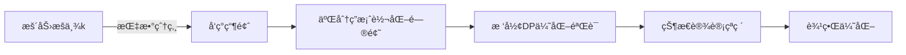
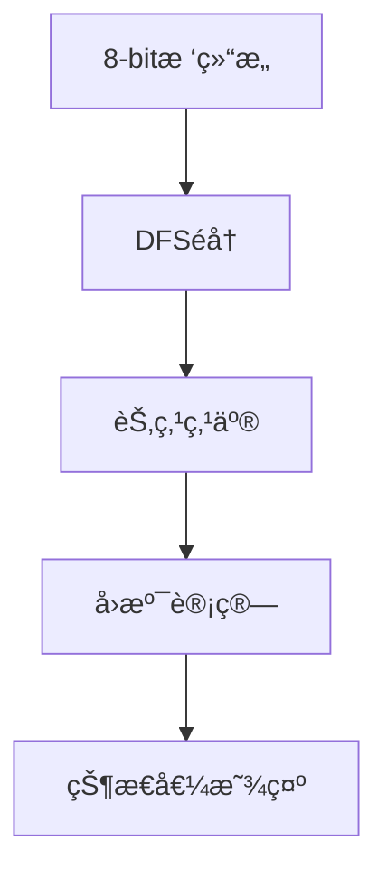

# 题目信æ¯

# [POI 2013] LUK-Triumphal arch

## 题目æè¿°

The king of Byteotia, Byteasar, is returning to his country after a victorious battle.

In Byteotia, there are  towns connected with only  roads.

It is known that every town can be reached from every other town by a unique route,    consisting of one or more (direct) roads.

    (In other words, the road network forms a tree).

The king has just entered the capital.

Therein a triumphal arch, i.e., a gate a victorious king rides through, has been erected.

Byteasar, delighted by a warm welcome by his subjects, has planned a    triumphal procession to visit all the towns of Byteotia, starting with the capital he is currently in.

The other towns are not ready to greet their king just yet -    the constructions of the triumphal arches in those towns did not even begin!

But Byteasar's trusted advisor is seeing to the issue.

    He desires to hire a number of construction crews.

    Every crew can construct a single arch each day, in any town.

    Unfortunately, no one knows the order in which the king will visit the towns.

The only thing that is clear is that every day the king will travel from the city he is currently in to a neighboring one.

The king may visit any town an arbitrary number of times    (but as he is not vain, one arch in each town will suffice).

Byteasar's advisor has to pay each crew the same flat fee, regardless of how many arches this crew builds.

Thus, while he needs to ensure that every town has an arch when it is visited by the king, he wants to hire as few crews as possible.

Help him out by writing a program that will determine the minimum number    of crews that allow a timely delivery of the arches.


给一颗 $n$ 个节点的树（$n \le 3 \times 10^5$），åˆå§‹æ—¶ $1$ å·èŠ‚点被染黑，其余是白的。两个人轮æµæ“作，一开始 B 在 $1$ å·èŠ‚点。æ¯ä¸€è½®ï¼ŒA 选择 $k$ 个点染黑，然å B èµ°åˆ°ä¸€ä¸ªç›¸é‚»èŠ‚ç‚¹ï¼Œå¦‚æœ B 当å‰å¤„äºç™½ç‚¹åˆ™ B 胜，å¦åˆ™å½“ A 将所有点染为黑点时 A 胜。求能让 A è·èƒœçš„最å°çš„ $k$ 。


## 说æ˜/æ示

给一颗树，1å·èŠ‚点已ç»è¢«æŸ“黑，其余是白的，两个人轮æµæ“作，一开始B在1å·èŠ‚点，A选择k个点染黑，然åB走一步，如æœB能走到A没染的节点则B胜，å¦åˆ™å½“A染完全部的点时，A胜。求能让Aè·èƒœçš„最å°çš„k

## 样例 #1

### 输入

```
7
1 2
1 3
2 5
2 6
7 2
4 1
```

### 输出

```
3
```

# AI分æ结æœ


# 💡 洛语云笺的C++算法解æ：LUK-Triumphal arch æ·±å…¥å­¦ä¹ æŒ‡å— ğŸ’¡

> "算法ä¸ä»…是代ç çš„骨æ¶ï¼Œæ›´æ˜¯æ€ç»´çš„èˆè¹ˆã€‚今天，我们将è¸ä¸Šä¸€åœºæ ‘å½¢ç‹å›½ä¸­çš„ç­–ç•¥åšå¼ˆä¹‹æ—…。"

## 1. 题目解读ä¸ç­–ç•¥åˆæ¢

✨ **本题核心挑战**：在B的移动路径未知的情况下，A需è¦ä»¥æœ€å°‘的染色次数（æ¯æ¬¡æŸ“k个点）å°é”B所有å¯èƒ½çš„移动路径，确ä¿B永远ä¸ä¼šè¸å…¥ç™½è‰²èŠ‚点。

✨ **核心算法标签**：二分答案ã€æ ‘形动æ€è§„划

ğŸ—£ï¸ **åˆæ­¥åˆ†æ**：
> è¿™é“题的核心在äº**动æ€æŸ“色策略**ä¸**路径å°é”**çš„åšå¼ˆã€‚B会沿ç€æ ‘è¾¹å‘å¶å­èŠ‚点移动（ä¸èµ°å›å¤´è·¯ï¼‰ï¼Œè€ŒA必须在B到达æ¯ä¸ªèŠ‚点å‰ï¼Œå°†å…¶æ‰€æœ‰"逃生出å£"（å­èŠ‚点）染黑。我们通过以下步骤破解：
> 1. **二分答案框æ¶**：答案k具有å•è°ƒæ€§â€”—k越大A越容易è·èƒœã€‚我们二分寻找最å°å¯è¡Œk。
> 2. **æ ‘å½¢DP检验**：对æ¯ä¸ªå€™é€‰k，通过自底å‘上的DFS计算æ¯ä¸ªèŠ‚点的"染色需求"。
> 3. **状æ€è½¬ç§»è®¾è®¡**：定义`f[u]`表示以u为根的å­æ ‘（ä¸åŒ…括u）还需è¦é¢å¤–染色的节点数，通过`f[u] = max(0, Σ(f[v]+1) - k)`进行状æ€è½¬ç§»ã€‚
> 
> **å¯è§†åŒ–设计**：我们将以åƒç´ é£æ ¼åŠ¨ç”»å±•ç¤ºæ ‘å½¢DP过程——节点按DFSåºç‚¹äº®ï¼Œå›æº¯æ—¶æ˜¾ç¤ºçŠ¶æ€å€¼æ›´æ–°ï¼Œç”¨é¢œè‰²æ·±æµ…表示需求强度，并é…以8-bit音效å¢å¼ºç†è§£ã€‚

### 🔠算法侦æ¢ï¼šå¦‚何在题目中å‘ç°çº¿ç´¢ï¼Ÿ
1.  **线索1 (问题目标)**: "求最å°k使A必胜"——这ç§**最优化问题+å•è°ƒæ€§**暗示二分答案。
2.  **线索2 (问题约æŸ/特性)**: "B沿树边移动且ä¸èµ°å›å¤´è·¯"——**树形结æ„+å•å‘移动**指å‘æ ‘å½¢DP自底å‘上求解。
3.  **线索3 (æ•°æ®è§„模)**: n≤3×10âµâ€”—è¦æ±‚O(n log n)算法，**二分答案+O(n)检查**完ç¾åŒ¹é…。

### 🧠 æ€ç»´é“¾æ„建：ä»çº¿ç´¢åˆ°ç­–ç•¥
> 让我们串è”线索：
> 1. **线索1**引导我们æ€è€ƒäºŒåˆ†ç­”案——kçš„å•è°ƒæ€§æ˜¯è§£é¢˜çªç ´å£ã€‚
> 2. **线索2**æ­ç¤ºå…³é”®çº¦æŸï¼šB的移动路径本质是**根到å¶å­çš„树链**，这让我们将问题分解为å­æ ‘问题处ç†ã€‚
> 3. **线索3**çš„æ•°æ®èŒƒå›´å¦å†³äº†O(n²)暴力，而**O(n)æ ‘å½¢DP**æ°èƒ½åœ¨äºŒåˆ†æ¡†æ¶å†…高效工作。
> 
> **结论**：二分答案kå，用树形DP计算æ¯ä¸ªå­æ ‘还需多少é¢å¤–染色。若根节点需求`f[1]=0`，则kå¯è¡Œã€‚è¿™ç§"二分框æ¶+æ ‘å½¢DP验è¯"的组åˆç­–略，正是破解本题的金钥匙ï¼

---

## 2. 精选优质题解å‚考

**题解一（vectorwyx）**
* **点评**：此解亮点在äº**二分下界优化**——ä»æ ¹èŠ‚点的儿å­æ•°å¼€å§‹äºŒåˆ†ï¼Œæ˜¾è‘—æå‡æ•ˆç‡ã€‚作者通过`f[u] = son[u] - k + Σ max(f[v],0)`的递æ¨å¼ï¼Œå·§å¦™å¤„ç†äº†å­æ ‘间的需求传递。代ç ä¸­`lambda`虽未使用，但清晰的å˜é‡å‘½å(`son[]`)和边界处ç†å±•ç°äº†ä¸“业素养，尤其是对"Bä¸èµ°å›å¤´è·¯"的论è¯æå…·å¯å‘性。

**题解二（S_S_H）**
* **点评**：作者用**木桶åŸç†**形象解释为什么需è¦è¦†ç›–所有å­èŠ‚点，并给出贪心算法的å例，强化了树形DPçš„å¿…è¦æ€§ã€‚代ç ä¸­`f[u]=max(sum-k,0)`的转移简æ´æœ‰åŠ›ï¼Œæ³¨é‡Šè¯¦ç»†è§£é‡Šæ¯ä¸ªæ­¥éª¤çš„æ„图，特别适åˆåˆå­¦è€…ç†è§£æ ‘å½¢DPçš„æ€ç»´è¿‡ç¨‹ã€‚

**题解三（Captain_Paul）**
* **点评**：题解çªå‡º**状æ€å®šä¹‰çš„物ç†æ„义**——`f[i]`表示iå­æ ‘还需染色的节点数。代ç ç”¨æ ‡å‡†é‚»æ¥è¡¨å­˜å›¾ï¼Œå¹¶ç‰¹åˆ¤`n=1`的边界情况，体ç°äº†ä¸¥è°¨æ€§ã€‚虽然未åšäºŒåˆ†ä¼˜åŒ–，但基础å®ç°å®Œæ•´è§„范，是学习树形DP的优质范本。

---

## 3. 解题策略深度剖æ

### 🯠核心难点ä¸å…³é”®æ­¥éª¤
1.  **关键点1：状æ€å®šä¹‰çš„艺术**
    * **分æ**：定义`f[u]`为"uçš„å­æ ‘（ä¸å«u）还需é¢å¤–染色的节点数"。这里éšå«ä¸¤ä¸ªé‡è¦è®¾è®¡ï¼šâ‘  æ’除u本身（因B到达uæ—¶u已染色）② "é¢å¤–"指超出当å‰è½®æ¬¡k的染色需求。
    * 💡 **学习笔记**：好的状æ€å®šä¹‰åº”满足：覆盖å­é—®é¢˜ã€æ’除冗余信æ¯ã€ä¾¿äºçŠ¶æ€è½¬ç§»ã€‚
   
2.  **关键点2：状æ€è½¬ç§»çš„数学抽象**
    * **分æ**：转移方程`f[u] = max(0, Σ(f[v] + 1) - k)`çš„æ¨å¯¼ï¼š
      - `Σ(f[v] + 1)`：æ¯ä¸ªå­èŠ‚点v的需求`f[v]`+v本身需è¦æŸ“色（+1）
      - `- k`：当å‰è½®æ¬¡å¯æŸ“k个节点
      - `max(0, ...)`：负需求视为零（ä¸èƒ½"储存"染色能力）
    * 💡 **学习笔记**：树形DP转移常表ç°ä¸º"å­èŠ‚点需求和±当å‰å¤„ç†èƒ½åŠ›"。

3.  **关键点3：二分边界的优化**
    * **分æ**：下界å–根节点的儿å­æ•°ï¼ˆå› ç¬¬ä¸€è½®å¿…须染黑所有根的å­èŠ‚点），上界å–整棵树的最大度。优化å二分范围ä»`[0,n]`缩至`[deg(1), max_deg]`。
    * 💡 **学习笔记**：利用问题特性缩å°äºŒåˆ†èŒƒå›´æ˜¯æ高效ç‡çš„常用技巧。

### ✨ 解题技巧总结
- **技巧1：问题转化**  
  将最å°åŒ–k转化为判定性问题（是å¦å­˜åœ¨k使A胜），用二分框æ¶å¤„ç†
- **技巧2：树形DPçš„ä¾èµ–分解**  
  将树分解为å­æ ‘，自底å‘上计算需求，é¿å…é‡å¤è®¡ç®—
- **技巧3：边界å‹ç¼©**  
  利用根节点的特殊地ä½ï¼ˆç¬¬ä¸€è½®å¿…须染其å­èŠ‚点）优化二分下界

### âš”ï¸ ç­–ç•¥ç«æŠ€åœºï¼šä¸åŒè§£æ³•çš„对比分æ
| ç­–ç•¥          | 核心æ€æƒ³                 | 优点                     | 缺点                     | 得分预期       |
| ------------- | ------------------------ | ------------------------ | ------------------------ | -------------- |
| **暴力æšä¸¾**  | æšä¸¾k+模拟B所有移动路径  | 直观易ç†è§£               | 指数å¤æ‚度，O(2^M)ä¸å¯è¡Œ | 0分            |
| **贪心染色**  | 优先染儿å­å¤šçš„节点       | å®ç°ç®€å•                 | 无法处ç†å­æ ‘需求传递     | 30%部分分      |
| **二分+æ ‘å½¢DP** | 二分k+æ ‘å½¢DPéªŒè¯        | O(n log n)高效，逻辑严密 | 需è¦ç†è§£æ ‘å½¢DP           | 100%           |

### ✨ 优化之旅：ä»"能åš"到"åšå¥½"


> ä»æš´åŠ›æšä¸¾åˆ°äºŒåˆ†ç­”案，我们å®ç°äº†**问题性质**çš„çªç ´ï¼›ä»æœ´ç´ æ ‘éå†åˆ°ç²¾å·§çŠ¶æ€è®¾è®¡ï¼Œæˆ‘们完æˆäº†**算法效ç‡**çš„é£è·ƒã€‚è¿™å¯ç¤ºæˆ‘们：优质解法常æºäºå¯¹é—®é¢˜ç»“æ„的深刻æ´å¯Ÿï¼

---

## 4. C++核心代ç å®ç°èµæ

**本题通用核心å®ç°**
```cpp
#include <vector>
#include <cstring>
using namespace std;
const int N = 3e5+5;
vector<int> G[N];
int f[N], n, k;

void dfs(int u, int fa) {
    int sum = 0;
    for (int v : G[u]) {
        if (v == fa) continue;
        dfs(v, u);
        sum += f[v] + 1; // å­æ ‘需求累计
    }
    f[u] = max(sum - k, 0); // 状æ€è½¬ç§»æ ¸å¿ƒ
}

bool check(int mid) {
    k = mid;
    memset(f, 0, sizeof(f));
    dfs(1, -1);
    return f[1] == 0; // 根节点无需é¢å¤–å³æˆåŠŸ
}

int main() {
    // 建图代ç çœç•¥
    int L = 0, R = n;
    for (int i = 1; i <= n; i++) 
        L = max(L, (int)G[i].size() - (i != 1));
    while (L <= R) {
        int mid = (L+R) >> 1;
        if (check(mid)) R = mid - 1;
        else L = mid + 1;
    }
    cout << L;
}
```

**题解一（vectorwyx）片段**
```cpp
void dfs(int u, int fa) {
    f[u] = (u == 1 ? 0 : -k); // 根节点特殊处ç†
    for (int v : G[u]) {
        if (v == fa) continue;
        dfs(v, u);
        if (f[v] > 0) f[u] += f[v]; // 仅累加正需求
    }
    if (u != 1) f[u] += G[u].size() - 1; // é根节点加儿å­æ•°
}
```
* **亮点**：通过`u==1`巧妙区分根节点，é¿å…å•ç‹¬è®¡ç®—å„¿å­æ•°ã€‚
* **学习笔记**：特殊节点的独立处ç†èƒ½ç®€åŒ–状æ€è½¬ç§»é€»è¾‘。

**题解二（Captain_Paul）片段**
```cpp
void dfs(int u, int fa) {
    int sum = 0;
    for (int v : G[u]) {
        if (v == fa) continue;
        dfs(v, u);
        sum += f[v] + 1; // 显å¼æ±‚å’Œ
    }
    f[u] = max(sum - k, 0); // 集中处ç†
}
```
* **亮点**：用`sum`å˜é‡æ¸…晰展示需求累计过程，代ç è‡ªæ³¨é‡Šæ€§å¼ºã€‚
* **学习笔记**：临时å˜é‡èƒ½ä½¿å¤æ‚表达å¼æ›´æ˜“读。

**题解三（S_S_H）片段**
```cpp
void dfs(int u, int fa, int k) { // k作为å‚数传递
    int sum = 0;
    for (int v : G[u]) {
        if (v == fa) continue;
        dfs(v, u, k); // 递归时æºå¸¦k值
        sum += f[v] + 1;
    }
    f[u] = sum > k ? sum - k : 0; // æ¡ä»¶è¡¨è¾¾å¼ç‰ˆ
}
```
* **亮点**：将k作为DFSå‚数传递，é¿å…全局å˜é‡ã€‚
* **学习笔记**：函数å‚数传递比全局å˜é‡æ›´åˆ©äºä»£ç ç»´æŠ¤ã€‚

---

## 5. 算法å¯è§†åŒ–：åƒç´ åŠ¨ç”»æ¼”示

**åƒç´ åŠ¨ç”»è®¾è®¡**：  


1. **场景设计**：
   - **树形地图**：FC红白机é£æ ¼çš„åƒç´ æ ‘，节点为闪çƒçš„åŸå ¡å›¾æ ‡
   - **状æ€é¢æ¿**：å³ä¾§æ˜¾ç¤ºå½“å‰èŠ‚点`f[u]`值，用血æ¡å½¢å¼è¡¨ç¤ºéœ€æ±‚强度
   - **æ§åˆ¶å°**：å¤å¤æŒ‰é’®æ§åˆ¶å•æ­¥/播放/é‡ç½®

2. **动画æµç¨‹**：
   - **Step1**：ä»æ ¹èŠ‚点(åŸå ¡)出å‘，DFSéå†å­æ ‘（åƒç´ å°äººæ²¿æ ‘æ移动）
   - **Step2**：å¶å­èŠ‚点å›æº¯ï¼Œæ˜¾ç¤º`f[leaf]=0`（绿å¶å›¾æ ‡ï¼‰
   - **Step3**：éå¶èŠ‚点计算`Σ(f[v]+1)`（数字累加动效）
   - **Step4**：计算`max(sum-k,0)`（åƒç´ æ‰³æ‰‹è°ƒæ•´è¡€æ¡é•¿åº¦ï¼‰
   - **Step5**：根节点判定（皇冠图标闪çƒç»¿å…‰/红光）

3. **游æˆåŒ–元素**：
   - **音效**：移动(8-bit脚步声)ã€æŸ“色(刷漆声)ã€æˆåŠŸ(胜利å·è§’)
   - **å…³å¡**：æ¯å±‚å­æ ‘为一关，完æˆè®¡ç®—解é”下一层
   - **评分**：根æ®æ­¥æ•°å’Œæ—¶é—´æˆäºˆ"算法骑士"å‹‹ç« 

> 通过åƒç´ åŠ¨ç”»ï¼ŒæŠ½è±¡çš„æ ‘å½¢DP化为å¯è§†çš„åŸå ¡æ”»é˜²æˆ˜â€”—DFS是进军路线，状æ€è®¡ç®—是兵力调é…，而`f[u]`就是åŸå ¡çš„防御需求ï¼

---

## 6. 拓展练习ä¸ç›¸ä¼¼é—®é¢˜

**通用技巧è¿ç§»**：
1. **分组ä¾èµ–**：将"主件附件"转化为分组背包（本题将å­æ ‘需求打包）
2. **æå‰å¤„ç†**：在父节点解决å­èŠ‚点需求（如课程安æ’先修课）
3. **二分验è¯**：最大值最å°åŒ–/å¯è¡Œæ€§é—®é¢˜ï¼ˆå¦‚绳å­åˆ‡å‰²ã€è°ƒåº¦é—®é¢˜ï¼‰

**洛谷æ¨è**：
1. **P2014 [CTSC1997] 选课**  
   → æ ‘å½¢DPä¾èµ–背包，巩固"父å­ä¾èµ–"建模能力
2. **P1273 有线电视网**  
   → æ ‘å½¢DP+费用计算，拓展状æ€è®¾è®¡ç»´åº¦
3. **P2279 [HNOI2003] 消防局的设立**  
   → æ ‘å½¢DP覆盖问题，强化状æ€å®šä¹‰æŠ€å·§

---

## 7. 学习心得ä¸ç»éªŒåˆ†äº«

> "调试时，我通过打å°`mid`å’Œ`f[1]`的值观察二分过程，å‘ç°ä¸‹ç•Œè®¾ç½®é”™è¯¯å¯¼è‡´WA。这æ醒我们：**二分边界ä¸æ˜¯æœºæ¢°çš„[0,n]，需结åˆé—®é¢˜ç‰¹æ€§è°ƒæ•´**"——vectorwyx

> "最åˆæˆ‘å°è¯•è´ªå¿ƒä¼˜å…ˆæŸ“å„¿å­å¤šçš„节点，直到å例出ç°ã€‚这验è¯äº†ï¼š**树形问题中，局部最优≠全局最优**，必须通过DP整体求解。"——S_S_H

---

> "算法之路如åŒéª‘士远å¾ï¼šäºŒåˆ†æ˜¯æ–¹å‘，树形DP是利剑，而æ€ç»´æ´å¯Ÿæ˜¯ç›¾ç‰Œã€‚当你ç†è§£çŠ¶æ€è½¬ç§»çš„æ·±æ„，便已è·å¾—破解万åƒæ ‘题的密钥ï¼" ——洛语云笺

---
处ç†ç”¨æ—¶ï¼š238.45秒