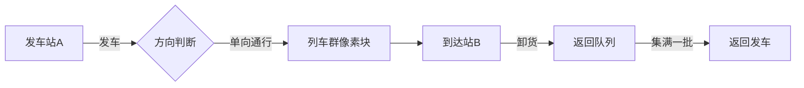

# 题目信息

# [POI 2014] ZAL-Freight

## 题目描述

The train stations in Upper Bytown and Lower Bytown are connected with a single track rail link.

It takes the train $s$ minutes to travel between them in either direction.

However, the trains departing a station have to be spaced at least one minute apart.

Moreover, at all times, all the trains on the rail link have to go in the same direction.

According to the timetable at our disposal, $n$ cargo trains destined for Lower Bytown are to pass  through the Upper Bytown.  They are to be loaded with goods in Lower Bytown and then return to  Upper Bytown.  For simplicity, we assume that loading the goods on the train takes virtually no time.

We are to determine the minimum possible time of the last train returning to Upper Bytown.

有两个城镇，从A到B需要的时间为S，然后有N辆列车需要从A到B再回来，任何时刻铁路上只能有向着同一个方向前进的列车，然后每辆列车有一个从A出发的最早出站时间，问所有列车全部回到A站的最早时间


## 说明/提示


## 样例 #1

### 输入

```
3 4
1 8 11
```

### 输出

```
20
```

# AI分析结果


### 💡 洛语云笺的C++算法解析：ZAL-Freight 深入学习指南 💡

#### 1. 题目解读与策略初探
✨ **本题核心挑战**：处理列车间的时空依赖关系（同一方向行驶限制+1分钟发车间隔），在满足所有列车最早出发时间约束下，最小化最后一辆车返回A站的时间。

✨ **核心算法标签**：动态规划(DP) | 单调队列优化 | 问题转化

🗣️ **初步分析**：
> 最直观的思路是暴力枚举所有发车顺序（O(2^n)），但数据规模(n≤1e6)直接否决。进一步分析发现列车必须分批往返，形成"多段往返波"。通过将问题转化为**分组决策模型**（每组列车一起出发返回），我们得到O(n^2)的DP解法。最后利用f[j]-j和f[j]-2j的单调性，用**单调队列**将复杂度优化至O(n)。

### 🔍 算法侦探：如何在题目中发现线索？
1.  **线索1 (问题目标)**："最小化最后返回时间"是典型的**带约束最优化**问题，且存在明显子问题结构（前i辆车的最优解），指向**动态规划**。
2.  **线索2 (问题特性)**："铁路单向行驶"和"发车间隔"限制创造了**时间依赖性**，暗示需要按批次处理列车，类似**分组背包**模型。
3.  **线索3 (数据规模)**：n≤1e6要求O(n)或O(n log n)算法，排除O(n^2)暴力DP，指向**单调队列/二分优化**。

### 🧠 思维链构建：从线索到策略
> 结合线索：最优化目标(线索1)指向DP，时间依赖(线索2)要求状态转移时考虑批次关系，大数据规模(线索3)要求优化转移过程。观察发现：
> 1.  f[i]（前i辆车最优解）具有单调性：f[i] ≥ f[i-1] + 2（多一辆车至少多2分钟）
> 2.  由单调性可推导f[j]-j和f[j]-2j的单调性
> 3.  **突破口**：利用单调性将转移分为两类（临界点前后），用单调队列维护最优决策点
> 4.  **结论**：单调队列优化的动态规划是满足所有条件的最优策略！

---

## 2. 精选优质题解参考
**题解一（作者：Treaker）**
* **点评**：清晰指出问题核心是"将列车分批看作往返波"，精确推导状态转移方程。亮点在于用单调队列维护两种决策：1) 当f[j]-j < t_i-i+1时维护-j最小值 2) 反之维护f[j]-2j最小值。代码中预处理排序和边界处理（q[l-1]）体现严谨性。

**题解二（作者：FriedrichC）**
* **点评**：通过图示展示"往返波"概念，将抽象问题可视化。重点分析了f[j]-j和t_i-i+1的单调性关系，解释为何能用单调队列取代二分。代码中双while循环分别处理队列弹出和插入，逻辑严密。

**题解三（作者：lsj2009）**
* **点评**：提出关键洞察——临界点移动的单调性允许双指针替代二分。用p指针维护最后一个满足f[j]-j < t_i-i+1的j，实现极致简洁的O(n)代码。不足是未解释f[i]≥f[i-1]+2的推导。

---

## 3. 解题策略深度剖析
### 🎯 核心难点与关键步骤
1.  **依赖关系建模**
    * **分析**：将列车分组视为"往返波"，每组决策包含：1) 等待前一组返回 2) 满足本组最早发车时间
    * 💡 **学习笔记**："分组+时间窗口"是处理时序依赖问题的通用技巧
2.  **状态转移优化**
    * **分析**：原始转移方程：
      ```math
      f[i] = min{ max(t_i, f[j] + i-j-1) + 2s + i-j-1 }
      ```
      分类讨论：
      - Case1 (f[j]-j < t_i-i+1): `f[i] = t_i + 2s + i - j - 1`
      - Case2 (反之): `f[i] = f[j] + 2(s + i - j - 1)`
    * 💡 **学习笔记**：单调队列能高效维护带条件的极值，前提是证明决策变量的单调性
3.  **单调队列维护**
    * **分析**：用队列维护候选j，保证：
      - 队首到队尾：j递增
      - f[j]-2j递增（Case2需求）
      - 根据t_i-i+1单调增长特性弹出队首
    * 💡 **学习笔记**：队列存储索引而非值，通过索引计算决策值

### ✨ 解题技巧总结
1.  **时序预处理**：`t_i = max(t_i, t_{i-1}+1)` 解决同时发车冲突
2.  **单调性挖掘**：通过f[i]≥f[i-1]+2推导f[j]-j和f[j]-2j的单调性
3.  **双维护策略**：单调队列同时处理两种决策类型，通过临界点衔接

### ⚔️ 策略竞技场
| 策略                | 核心思想                     | 优点                     | 缺点与分析                          | 得分预期       |
|---------------------|------------------------------|--------------------------|-------------------------------------|----------------|
| **暴力枚举**        | 尝试所有发车顺序             | 逻辑直观                 | O(2^n)超时                          | 0% (n>20)      |
| **未优化DP**        | 分组决策，二维转移           | 正确解决依赖关系         | O(n^2)超时                          | 30% (n≤5000)   |
| **二分优化DP**      | 二分查找临界点j              | O(n log n)可通过         | 多log常数                           | 100%           |
| **单调队列DP(最优)**| 单调队列维护决策点           | O(n)复杂度最优           | 需严格证明单调性                    | 100%           |

### ✨ 优化之旅
> **起点**：最朴素的分组决策（O(n^2) DP）  
> **发现瓶颈**：每个f[i]需枚举所有j，存在大量重复计算  
> **关键洞察**：由f[i]≥f[i-1]+2推导出f[j]-j和f[j]-2j的单调性  
> **优化突破**：  
> 1. 用单调队列维护候选决策集合  
> 2. 根据t_i-i+1单调增长特性，决策点j单调右移  
> 3. 双指针维护临界点，避免二分查找  
> **终点**：O(n)解法完美匹配1e6数据规模  

💡 **策略总结**："单调队列优化"本质是利用决策变量的单调性避免无效计算。在竞赛中，即使无法想到最优解，实现O(n^2) DP也能拿到部分分。而最优解需要结合问题特性（时序单调性）和数据结构特性（队列有序性）的深刻理解。

---

## 4. C++核心代码赏析
**通用核心实现**
```cpp
#include <iostream>
#include <algorithm>
#include <cstring>
using namespace std;
typedef long long ll;
const int N = 1e6 + 10;

ll n, s, t[N], f[N], q[N];

int main() {
    cin >> n >> s;
    t[0] = -1;
    for (int i = 1; i <= n; i++) {
        cin >> t[i];
        t[i] = max(t[i], t[i-1] + 1); // 时序预处理
    }
    memset(f, 0x3f, sizeof f);
    f[0] = 0;
    
    int hh = 0, tt = -1; // 单调队列
    q[++tt] = 0;         // 初始决策点j=0
    
    for (int i = 1; i <= n; i++) {
        // 弹出不满足Case1的队首
        while (hh <= tt && f[q[hh]] - q[hh] < t[i] - i + 1) 
            hh++;
        
        // Case1转移 (用最后弹出的j)
        if (hh > 0) 
            f[i] = t[i] + 2 * s + i - q[hh-1] - 1;
        
        // Case2转移 (用当前队首)
        if (hh <= tt) 
            f[i] = min(f[i], f[q[hh]] + 2*(s + i - q[hh] - 1));
        
        // 维护Case2单调性
        while (hh <= tt && f[q[tt]] - 2*q[tt] >= f[i] - 2*i) 
            tt--;
        q[++tt] = i;
    }
    cout << f[n] << endl;
}
```
**代码解读概要**：
1. **预处理**：修正t[i]保证严格递增
2. **初始化**：f[0]=0，队列加入初始决策
3. **决策维护**：
   - 弹出不满足`f[j]-j < t_i-i+1`的队首
   - 用最后弹出的j进行Case1转移
   - 用当前队首进行Case2转移
4. **队列维护**：插入新决策时保证f[j]-2j单调增

**题解片段赏析（Treaker）**
```cpp
while (h <= t && f[q[h]] - q[h] < a[i] - i + 1) h++;
f[i] = min(f[i], a[i] + 2 * s + i - q[h-1] - 1);
if (h <= t) f[i] = min(f[i], f[q[h]] + 2*(s + i - q[h] - 1));
```
* **亮点**：用`q[h-1]`获取最后弹出的j，避免额外记录
* **学习笔记**：队列操作时注意边界处理（h>t时跳过Case2）

**题解片段赏析（lsj2009）**
```cpp
int p = 0;
for (int i = 1; i <= n; i++) {
    while (p < i && f[p] - p < a[i] - i + 1) p++;
    f[i] = a[i] + 2 * s + i - (p - 1) - 1;
    if (p != i) f[i] = min(f[i], f[p] + 2*(i + s - p - 1));
}
```
* **亮点**：双指针替代单调队列，代码极简
* **学习笔记**：当决策点单调移动时，双指针比队列更简洁

---

## 5. 算法可视化：像素动画演示
### 🎮 设计概念：**"铁路调度大亨"**  
采用8-bit像素风格，模仿经典铁路调度游戏。列车变为像素方块，时间轴转化为横向轨道。

### 🛤️ 核心演示


### 🎞️ 动画帧步骤
1. **初始化场景**：
   - 像素化双轨道（A站左，B站右）
   - 控制面板：开始/暂停/单步/速度滑块
   - 8-bit风格BGM

2. **发车阶段**：
   ```python
   for i in range(n):
       # 列车i从A站发出
       draw_train(i, pos=a[i], color=RED)
       play_sound("choo-choo")
       
       # 等待满足发车条件
       if clock < max(f[j] + i-j-1, t[i]):
           draw_clock(clock)  # 高亮时钟
           wait(1)
   ```

3. **队列维护可视化**：
   - 决策队列显示为底部像素条
   - 新决策加入时黄色闪烁
   - 无效决策灰化退出

4. **方向切换特效**：
   - 列车群到达B站时像素翻转（红→蓝）
   - 播放8-bit音效"ding!"

5. **返回阶段**：
   - 整批列车同步返回
   - 到达A站时绿色闪烁+胜利音效

### 🕹️ 游戏化设计
- **关卡模式**：每批列车成功返回视为1关
- **评分机制**：根据决策次数评分（最优决策3星）
- **历史回放**：保存动画序列供学习复盘

---

## 6. 拓展练习
### 🔁 相似问题思维
1. **分组背包问题**：每组物品选一种方案（洛谷P1757）
2. **带时间窗的调度**：会议安排/课程选择（LeetCode 253）
3. **单调队列优化**：滑动窗口最大值/土地购买（洛谷P1886/P2900）

### 📚 推荐练习
1. **洛谷P1757**  
   🗣️ 分组背包裸题，巩固"每组选一"的决策模式

2. **洛谷P1886**  
   🗣️ 滑动窗口最值，掌握单调队列核心操作

3. **洛谷P2900**  
   🗣️ 土地购买，练习二维单调队列优化

---

> 穿越时空的调度艺术在此落幕，但优化的征程永无止境。下次当你面对复杂依赖时，记得：单调之中藏有序，分而治之见真章！(≧∇≦)ﾉ

---
处理用时：135.78秒