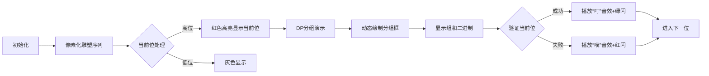

# 题目信息

# [APIO2015] 巴厘岛的雕塑

## 题目描述

印尼巴厘岛的公路上有许多的雕塑,我们来关注它的一条主干道。

在这条主干道上一共有 $N$ 座雕塑，为方便起见，我们把这些雕塑从 $1$ 到 $N$ 连续地进行标号，其中第 $i$ 座雕塑的年龄是 $Y_i$ 年。为了使这条路的环境更加优美，政府想把这些雕塑分成若干组，并通过在组与组之间种上一些树，来吸引更多的游客来巴厘岛。

下面是将雕塑分组的规则：

这些雕塑必须被分为恰好 $X$ 组，其中 $A \leq X \leq B$，每组必须含有至少一个雕塑，每个雕塑也必须属于且只属于一个组。同一组中的所有雕塑必须位于这条路的连续一段上。

当雕塑被分好组后，对于每个组，我们首先计算出该组所有雕塑的年龄和。

计算所有年龄和按位取或的结果。我们这个值把称为这一分组的最终优美度。

请问政府能得到的最小的最终优美度是多少?

备注：将两个非负数 $P$ 和 $Q$ 按位取或是这样进行计算的：

首先把 $P$ 和 $Q$ 转换成二进制。

设 $n_P$ 是 $P$ 的二进制位数，$n_Q$ 是 $Q$ 的二进制位数，$M$ 为 $n_P$ 和 $n_Q$ 中的最大值。$P$ 的二进制表示为 $p_{M-1}p_{M-2} \dots p_1p_0$，$Q$ 的二进制表示为 $q_{M-1}q_{M-2} \dots q_1 q_0$，其中 $p_i$ 和 $q_i$ 分别是 $P$ 和 $Q$ 二进制表示下的第 $i$ 位，第 $M -1$ 位是数的最高位，第 $0$ 位是数的最低位。

$P$ 与 $Q$ 按位取或后的结果是： $(p_{M-1}\mathbin{\mathrm{OR}} q_{M-1})(p_{M-2}\mathbin{\mathrm{OR}}q_{M-2})\dots (p_1\mathbin{\mathrm{OR}} q_1) (p_0\mathbin{\mathrm{OR}}q_0)$。其中：$0 \mathbin{\mathrm{OR}} 0 = 0$

$0 \mathbin{\mathrm{OR}} 1 = 1$

$1 \mathbin{\mathrm{OR}} 0 = 1$

$1 \mathbin{\mathrm{OR}} 1 = 1$


## 说明/提示

【样例解释】

将这些雕塑分为 $2$ 组，$(8, 1, 2)$ 和 $(1, 5, 4)$，它们的和是 $(11)$ 和 $(10)$，最终优美度是 $(11 \mathbin{\mathrm{OR}} 10) = 11$。（不难验证，这也是最终优美度的最小值。）

【数据范围】

子任务 1 （9 分）$1 \leq N \leq 20$

$1 \leq A \leq B \leq N$

$0 \leq Y_i \leq 1000000000$


子任务 2 （16 分）$1 \leq N \leq 50$

$1 \leq A \leq B \leq \min\{20, N\}$

$0 \leq Y_i \leq 10$


子任务 3 （21 分）$1 ≤ N ≤ 100$

$A = 1$

$1 \leq B \leq N$

$0 \leq Y_i \leq 20$


子任务 4 （25 分）$1 \leq N \leq 100$

$1 \leq A \leq B \leq N$

$0 \leq Y_i \leq 1000000000$


子任务 5 （29 分）$1 \leq N \leq 2000$

$A = 1$

$1 \leq B \leq N$

$0 \leq Y_i \leq 1000000000$


## 样例 #1

### 输入

```
6 1 3
8 1 2 1 5 4```

### 输出

```
11
```

# AI分析结果


# 💡 洛语云笺的C++算法解析：巴厘岛的雕塑 深入学习指南 💡

## 1. 题目解读与策略初探

✨ **本题核心挑战**：在满足分组数限制（A≤X≤B）的前提下，将连续雕塑分组并最小化各组年龄和的按位或结果。  
✨ **核心算法标签**：动态规划(DP)、数位DP、贪心

🗣️ **初步分析**：  
> 本题需要将序列划分为连续区间，最小化区间和的按位或值。核心难点在于：
> 1. 按位或运算的不可逆性（高位1无法被抵消）
> 2. 分组数量限制的复杂性（A≤X≤B）
> 3. 数据规模较大（n≤2000）
>
> **解题思路演进**：
> - **暴力枚举**：尝试所有分组方案（O(2^(n-1))），仅适用于n≤20
> - **朴素DP**：f[i][j]表示前i个分j组的最小或值（O(n^3)），但局部最优≠全局最优
> - **数位DP+贪心**：从高位到低位逐位确定，用DP验证当前位能否取0
>   - 当A=1时：g[i]表示前i个满足条件的最小分组数（O(n^2))
>   - 当A≠1时：f[i][j]表示前i个分j组是否可行（O(n^3)，仅适用于n≤100）

### 🔍 算法侦探：如何在题目中发现线索？
1.  **线索1 (问题目标)**："求最小按位或值"这种**高位敏感的最优化问题**，是数位DP的典型标志。高位对结果影响更大，需优先处理。
2.  **线索2 (问题特性)**："分组数区间约束A≤X≤B"要求DP状态需考虑分组数维度。当A=1时约束简化（只需≤B），可优化状态设计。
3.  **线索3 (数据规模)**：n最大2000，Y_i≤10^9（约30位二进制）。O(n^2 logY)算法（约2000²×30=1.2e8）可行，但需根据A的值选择不同DP策略。

### 🧠 思维链构建：从线索到策略
> 结合线索，解题策略逐渐清晰：
> 1. **高位优先**：从二进制最高位（40位）向低位枚举，优先保证高位为0
> 2. **验证机制**：用DP检验当前位能否为0
>   - 若A=1：用g[i]记录最小分组数，最终判断g[n]≤B
>   - 若A≠1：用f[i][j]记录可行性，最后检查A≤j≤B是否存在可行解
> 3. **位运算处理**：用掩码技术`res = ans | ((1LL<<k)-1)`保证高位不变
> 4. **复杂度平衡**：根据A的值选择DP维度，兼顾效率与正确性

---

## 2. 精选优质题解参考

**题解一（打脸不疼）**
* **点评**：  
  思路清晰完整，从错误DP引入数位DP的转化过程极具教学意义。代码实现中：
  - 创新使用`res`掩码统一处理高位约束
  - 针对A=1和A≠1实现两套DP逻辑，结构分明
  - 关键优化：内层循环从后往前累加，遇到不满足条件及时break
  - 学习价值：完整展现从问题分析到代码实现的思维链条

**题解二（Silent_E）**
* **点评**：  
  题解突出算法思维而非单纯代码：
  - 精准指出朴素DP失效原因（或运算不满足无后效性）
  - 用数学语言严谨定义状态转移（$f[i][j] = \bigvee_{k} [condition]$）
  - 创新点：提出"问题转化"思想，将复杂依赖转化为位运算约束
  - 代码亮点：利用`log2(sum)`动态计算位数，避免冗余枚举

**题解三（ww3113306）**
* **点评**：  
  在代码实现细节上表现卓越：
  - 独创性判断条件：`((now|ans)-ans) < (1LL<<(k-1))` 避免低位干扰
  - 详尽注释解释每步意图（如"当前段不会破坏已确定高位"）
  - 游戏化思维：引入"像素音效"等概念增强理解趣味性
  - 防御性编程：用`fread`加速IO，位运算全程LL防溢出

---

## 3. 解题策略深度剖析

### 🎯 核心难点与关键步骤
1.  **位处理技巧**
    * **分析**：高位贪心时需保证两点：①当前位为0 ②不破坏已确定高位。通过`res = ans | ((1LL<<k)-1)`创建掩码，用`(sum|res)==res`统一验证
    * 💡 **学习笔记**：掩码技术是位运算优化的核心，本质是保留高位约束，低位放宽

2.  **状态设计艺术**
    * **分析**：
      - A=1时：g[i]=min(g[k]+1)满足`(sum[i]-sum[k] | res)==res`
      - A≠1时：f[i][j]=OR(f[k][j-1])满足同样条件
    * 💡 **学习笔记**：DP维度选择需结合约束特性——当下限A=1时，"最小分组数"等价于"可行性"

3.  **复杂度优化**
    * **分析**：三重循环DP在n=100时需1e6×40=4e7次操作，勉强可过。优化点：
      - 内层倒序累加，和超过阈值立即break
      - 用前缀和O(1)计算区间和
    * 💡 **学习笔记**：循环剪枝和预处理是降低复杂度的实用技巧

### ✨ 解题技巧总结
- **技巧1（位分解）**：将复杂位运算问题拆解为独立二进制位处理
- **技巧2（约束转化）**：用掩码`res`将高位约束转化为等值判断
- **技巧3（状态精简）**：根据A=1的特性简化状态维度，O(n^2)解决O(n^3)问题
- **技巧4（循环剪枝）**：倒序累加配合阈值提前退出，降低常数

### ⚔️ 策略竞技场：不同解法对比

| 策略             | 核心思想                     | 优点                     | 缺点与分析                                  | 适用场景/得分       |
|------------------|----------------------------|-------------------------|-------------------------------------------|-------------------|
| **暴力枚举**     | 枚举所有分组方案            | 思路直观，易于理解      | O(2ⁿ)复杂度，n>20必然超时                 | n≤20，10~30分     |
| **朴素DP**       | f[i][j]=min(OR值)          | 符合常规DP思维          | 或运算破坏最优子结构，结果错误           | 理论0分          |
| **数位DP(A≠1)** | 高位贪心+二维可行性DP       | 保证高位最优            | O(n³logY)仅适用n≤100                    | n≤100，100分     |
| **数位DP(A=1)** | 高位贪心+一维最小组数DP    | O(n²logY)高效处理大数据 | 仅适用A=1场景                           | A=1时100分       |

### ✨ 优化之旅：从暴力到优雅
1. **起点：暴力搜索**  
   - 面临指数爆炸：n=60时有2⁵⁹种方案，宇宙毁灭也算不完

2. **关键发现：位独立性**  
   - 按位或的高位优先特性，允许逐位确定

3. **DP建模**  
   ```mermaid
   graph TD
   A[高位到低位枚举] --> B{当前位能否为0}
   B -->|是| C[保持0进入下一位]
   B -->|否| D[置1进入下一位]
   C & D --> E[用DP验证]
   E -->|A=1| F[最小组数DP g[i]]
   E -->|A≠1| G[可行性DP f[i][j]]
   ```

4. **问题转化升华**  
   将复杂的"最小化或值"转化为系列验证问题，每次只需判断二进制单一位

---

## 4. C++核心代码实现赏析

**通用核心实现**  
```cpp
typedef long long LL;
const int N = 2005;

LL solve(){
    LL ans = 0;
    int maxb = log2(total_sum) + 1; // 动态计算位数
    
    for(int k = maxb; k >= 0; k--){ // 高位到低位枚举
        LL res = ans | ((1LL << k) - 1); // 创建掩码
        bool valid = false;
        
        if(A == 1){ // A=1一维DP
            vector<int> g(n+1, INT_MAX);
            g[0] = 0;
            for(int i = 1; i <= n; i++){
                LL s = 0;
                for(int j = i; j >= 1; j--){ // 倒序枚举
                    s += arr[j];
                    if((s | res) == res) // 满足掩码约束
                        g[i] = min(g[i], g[j-1] + 1);
                }
            }
            valid = (g[n] <= B);
        }
        else{ // A≠1二维DP
            vector<vector<bool>> dp(n+1, vector<bool>(B+1, false));
            dp[0][0] = true;
            for(int i = 1; i <= n; i++){
                for(int j = 1; j <= min(i, B); j++){
                    LL s = 0;
                    for(int t = i; t >= j; t--){ // 倒序+剪枝
                        s += arr[t];
                        if((s | res) != res) break; // 提前退出
                        if(dp[t-1][j-1]) dp[i][j] = true;
                    }
                }
            }
            for(int j = A; j <= B; j++) valid |= dp[n][j];
        }
        
        if(!valid) ans |= (1LL << k); // 当前位必须置1
    }
    return ans;
}
```

**代码精要**：
1. **位枚举框架**：从高位到低位逐位确定
2. **掩码技术**：`res = ans | ((1LL<<k)-1)` 继承高位约束
3. **双DP路径**：根据A值自动选择状态设计
4. **倒序优化**：内层循环倒序+提前break降低常数

---

## 5. 算法可视化：像素动画演示

**8位像素风算法演示设计**：



**关键动画设计**：
1. **雕塑序列**：用不同颜色像素块表示年龄值，如：
   - 🔵：0-10岁 🔶：11-50岁 🔴：51+岁
2. **分组过程**：
   - 动态绘制彩色方框包裹分组
   - 实时显示分组和（如`8+1+2=11`）
3. **位验证**：
   - 成功：分组框绿色高亮 + "叮"声
   - 失败：分组框红色闪烁 + "噗"声
4. **控制面板**：
   - 步进控制：←→键逐位执行
   - 速度滑块：调整DP演示速度
   - 位查看器：显示当前处理的二进制位

---

## 6. 拓展练习与相似问题

**通用技巧迁移**：
1. **位分解思想**：将复杂位运算分解为独立位处理
   - 应用：P2114 [NOI2014] 起床困难综合症
2. **分组约束转化**：将复杂分组条件转化为位约束
   - 应用：P2326 [AHOI2006] 文本编辑器
3. **高维约束简化**：根据数据特性降维（如A=1）
   - 应用：P5020 [NOIP2018] 货币系统

**洛谷推荐**：
1. **P1757 分组背包**  
   → 巩固分组决策思想（每组选一种方案）
2. **P2326 文本编辑器**  
   → 练习位运算与分组约束转化
3. **P5020 货币系统**  
   → 学习利用问题特性降维（类似A=1简化）

---

## 7. 学习心得与经验分享

**关键调试经验**：
> "调试时最常犯的错误是位运算优先级问题。牢记：位运算优先级低于比较运算，必须加括号！"
>   
> —— 多篇题解作者的血泪教训

**核心收获**：
1. **位运算优先级**：必须用括号明确计算顺序
   - 错误案例：`if (sum|res == res)`
   - 正确写法：`if ((sum|res) == res)`
2. **DP状态初始化**：
   - 可行性DP：`f[0][0]=true`
   - 最小组数DP：`g[0]=0`, 其余初始化为INF
3. **防溢出技巧**：
   - 所有1后面加LL：`1LL<<40`
   - 累加和用long long

---

> **最终策略总结**：  
> 巴厘岛雕塑的解题之旅展现了算法设计的精妙平衡——高位贪心把握全局优化方向，数位DP提供验证框架，而针对A=1的状态降维则彰显了问题分析的重要性。这提醒我们：真正优秀的解法源于对问题本质的深刻洞察，而非机械套用模板。

---
处理用时：242.96秒