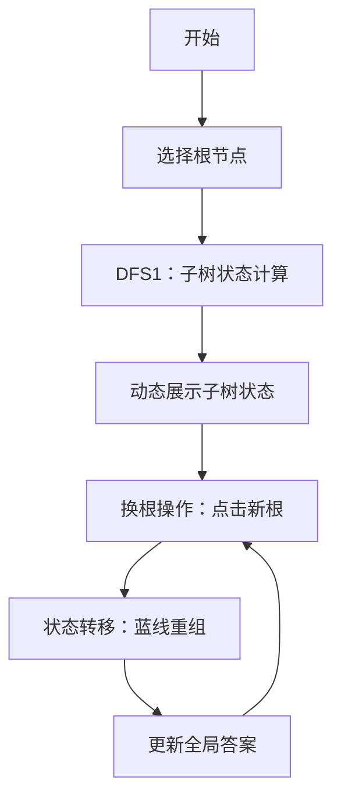

# 题目信息

# [APIO2014] 连珠线

## 题目描述

在达芬奇时代，有一个流行的儿童游戏称为连珠线。当然，这个游戏是关于珠子和线的。线是红色或蓝色的，珠子被编号为 $1$ 到 $n$。这个游戏从一个珠子开始，每次会用如下方式添加一个新的珠子：

`Append(w, v)`：一个新的珠子 $w$ 和一个已经添加的珠子 $v$ 用红线连接起来。

`Insert(w, u, v)`：一个新的珠子 $w$ 插入到用红线连起来的两个珠子 $u, v$ 之间。具体过程是删去 $u, v$ 之间红线，分别用蓝线连接 $u, w$ 和 $w, v$。

每条线都有一个长度。游戏结束后，你的最终得分为蓝线长度之和。

给你连珠线游戏结束后的游戏局面，只告诉了你珠子和链的连接方式以及每条线的长度，没有告诉你每条线分别是什么颜色。

你需要写一个程序来找出最大可能得分。即，在所有以给出的最终局面结束的连珠线游戏中找出那个得分最大的，然后输出最大可能得分。


## 说明/提示

【样例描述1】

可以通过如下方式获得 $60$ 分：首先从 $3$ 号珠子开始。

把 $5$ 和 $3$ 连起来。（线长度任意）

在 $3$ 和 $5$ 之间插入 $1$。（线长分别为 $40$ 和 $20$）。

把 $2$ 和 $1$ 用长度为 $10$ 的线连起来。

把 $4$ 和 $1$ 用长度为 $15$ 的线连起来。


【限制与约定】

第一个子任务共 13 分，满足 $1 \leq n \leq 10$。

第二个子任务共 15 分，满足 $1 \leq n \leq 200$。

第三个子任务共 29 分，满足 $1 \leq n \leq 10000$。

第四个子任务共 43 分，满足 $1 \leq n \leq 200000$。


## 样例 #1

### 输入

```
5
1 2 10
1 3 40
1 4 15
1 5 20```

### 输出

```
60```

## 样例 #2

### 输入

```
10
4 10 2
1 2 21
1 3 13
6 7 1
7 9 5
2 4 3
2 5 8
1 6 55
6 8 34```

### 输出

```
140```

# AI分析结果


### 题目解读与策略初探

✨ **本题核心挑战**：在满足蓝线连接规则的前提下（蓝线必须连接三个连续节点，形式为“爷爷-父亲-儿子”或“儿子-父亲-兄弟”），最大化蓝边权值和。关键在于处理蓝线连接的依赖关系，并通过换根DP统一蓝线形式。

✨ **核心算法标签**：动态规划、换根DP、树形结构

🗣️ **初步分析**：
> 蓝线的两种连接形式增加了问题复杂度，但通过换根操作可将所有蓝线统一为“爷爷-父亲-儿子”结构。我们定义状态：
> - `f[u][0]`：节点u不作为蓝线中点时的最大蓝边权和
> - `f[u][1]`：节点u作为蓝线中点时的最大蓝边权和
> 
> **关键转移方程**：
> 1. `f[u][0] = Σ max(f[v][0], f[v][1] + w)` （子节点v可选择是否作为中点）
> 2. `f[u][1] = f[u][0] + max{ f[v][0] + w - max(f[v][0], f[v][1] + w) }` （选取最优子节点v作为蓝线下端）
>
> **换根优化**：通过维护最大值/次大值或前缀/后缀信息，实现O(1)换根转移。可视化方案采用8位像素风格，动态展示状态转移和蓝线选择过程。

### 🔍 算法侦探：题目中的线索
1. **线索1 (问题目标)**：要求最大化蓝边权值和，蓝线连接三个连续节点（中点称为“父亲”）。这种带限制的最优化问题指向动态规划，特别是树形DP模型。
2. **线索2 (问题约束)**：蓝线连接规则暗示了父子依赖关系。通过换根可将“兄弟型”转化为“祖孙型”，统一问题模型。
3. **线索3 (数据规模)**：n ≤ 200,000，要求O(n)或O(n log n)算法。换根DP的O(n)复杂度完美匹配此约束。

### 🧠 思维链构建：从线索到策略
> 1. 问题目标（最优化）指向DP/贪心/搜索，但数据规模排除搜索（O(2^n)）。
> 2. 问题特性（树结构+蓝线规则）适合树形DP。蓝线形式的可转换性（换根）指向换根DP。
> 3. 数据规模验证：换根DP的O(n)满足要求。
> 4. **结论**：换根DP是核心策略。定义状态`f[u][0/1]`，通过两次DFS（预处理子树信息+换根更新）高效求解。

---

## 2. 精选优质题解参考

**题解一（作者：fighter）**  
* **点评**：思路清晰抓住核心（统一蓝线形式），状态转移推导严谨。代码规范：使用lambda表达式简化计算，维护前缀/后缀数组实现高效换根。亮点在于将复杂依赖转化为分组决策，体现动态规划本质。

**题解二（作者：tommymio）**  
* **点评**：图示直观展示蓝线形态，换根DP实现规范。代码可读性强：维护最大值/次大值避免复杂预处理。亮点在于用`val/mx`数组高效处理换根时的状态更新。

**题解三（作者：cmd2001）**  
* **点评**：状态定义简洁（`dp[u][0/1]`），换根逻辑直接。亮点在于用vector动态存储子树信息，代码紧凑（仅60行）。适合初学者理解换根DP基础框架。

---

## 3. 解题策略深度剖析

### 🎯 核心难点与关键步骤
1. **状态定义与初始化**  
   * **难点**：准确覆盖所有蓝线连接情况（中点/非中点）
   * **解决方案**：  
     - `f[u][0]`：u不作为中点，子节点自由选择  
     - `f[u][1]`：u作为中点，需选一个子节点作为下端  
   * 💡 **学习笔记**：好的状态定义是DP基石，需兼顾完备性和高效性。

2. **状态转移方程**  
   * **难点**：处理子节点间的决策依赖  
   * **解决方案**：  
     ```math
     \begin{aligned} 
     f[u][0] &= \sum_{\text{v∈son(u)}} \max(f[v][0], f[v][1] + w) \\
     f[u][1] &= f[u][0] + \max_{\text{v∈son(u)}} \{ f[v][0] + w - \max(f[v][0], f[v][1] + w) \}
     \end{aligned}
     ```
   * 💡 **学习笔记**：转移方程体现子问题组合思想，通过差值计算优化决策。

3. **换根更新机制**  
   * **难点**：换根时高效更新父子状态  
   * **解决方案**：  
     - 维护最大值/次大值（如`mx1[u]`, `mx2[u]`)  
     - 或预处理前缀/后缀数组  
   * 💡 **学习笔记**：换根DP本质是信息复用，预处理避免重复计算。

### ✨ 解题技巧总结
- **技巧1（模型转化）**：将蓝线的“兄弟型”通过换根转化为“祖孙型”，统一决策模式。
- **技巧2（最值维护）**：换根时用`mx1/mx2`或前缀/后缀数组实现O(1)状态更新。
- **技巧3（边界处理）**：叶子节点初始化`f[u][1] = -INF`，避免非法状态转移。

### ⚔️ 策略竞技场：解法对比
| 策略         | 核心思想                     | 优点               | 缺点                | 得分预期 |
|--------------|------------------------------|--------------------|---------------------|----------|
| 暴力枚举根   | 对每个根单独做树形DP         | 直观易懂           | O(n²)超时           | 30%      |
| 换根DP       | 两次DFS+状态复用             | O(n)高效           | 实现较复杂          | 100%     |
| 树形DP+贪心  | 尝试贪心选择最优边            | 简单快速           | 无法保证最优解      | 50%      |

### ✨ 优化之旅：从暴力到换根
1. **起点（暴力枚举）**：枚举每个根节点单独计算，O(n²)不可行。
2. **发现重复子问题**：换根时大部分子树信息不变，仅路径节点需更新。
3. **换根DP框架**：第一次DFS计算子树状态，第二次DFS动态更新根节点状态。
4. **优化升华**：维护最大值/次大值（或前缀/后缀），避免全子树重新计算。

> 💡 **策略总结**：换根DP的核心在于“问题转化”和“信息复用”。即使无法想到最优解，基于树形DP的暴力也能获得部分分，而最优解则需深刻理解问题结构的转化技巧。

---

## 4. C++核心代码实现

### 通用核心实现（基于换根DP）
```cpp
#include <bits/stdc++.h>
using namespace std;
const int N = 2e5 + 5, INF = 0x3f3f3f3f;

int n, ans;
vector<pair<int, int>> G[N];
int f[N][2]; // f[u][0]: u非中点, f[u][1]: u中点
int mx1[N], mx2[N]; // 最大值/次大值

void dfs1(int u, int fa) {
    f[u][0] = 0;
    mx1[u] = mx2[u] = -INF;
    for (auto [v, w] : G[u]) {
        if (v == fa) continue;
        dfs1(v, u);
        int val = max(f[v][0], f[v][1] + w);
        f[u][0] += val;
        
        int delta = f[v][0] + w - val; // 作为蓝线下端的增益
        if (delta >= mx1[u]) mx2[u] = mx1[u], mx1[u] = delta;
        else if (delta > mx2[u]) mx2[u] = delta;
    }
    f[u][1] = f[u][0] + mx1[u]; // 最佳增益
}

void dfs2(int u, int fa) {
    ans = max(ans, f[u][0]); // 更新答案
    for (auto [v, w] : G[u]) {
        if (v == fa) continue;
        
        // 备份原始值
        int f0 = f[u][0], f1 = f[u][1];
        int m1 = mx1[u], m2 = mx2[u];
        
        // 从u中移除v的贡献
        int val_v = max(f[v][0], f[v][1] + w);
        f[u][0] -= val_v;
        int delta_v = f[v][0] + w - val_v;
        f[u][1] = f[u][0] + (delta_v == m1 ? m2 : m1);
        
        // 更新v的状态（将u作为子节点）
        int val_u = max(f[u][0], f[u][1] + w);
        f[v][0] += val_u;
        int delta_u = f[u][0] + w - val_u;
        if (delta_u >= mx1[v]) {
            mx2[v] = mx1[v];
            mx1[v] = delta_u;
        } else if (delta_u > mx2[v]) mx2[v] = delta_u;
        f[v][1] = f[v][0] + mx1[v];
        
        dfs2(v, u); // 递归换根
        
        // 回溯状态
        f[u][0] = f0; f[u][1] = f1;
        mx1[u] = m1; mx2[u] = m2;
    }
}

int main() {
    cin >> n;
    for (int i = 1; i < n; i++) {
        int u, v, w; cin >> u >> v >> w;
        G[u].push_back({v, w});
        G[v].push_back({u, w});
    }
    dfs1(1, 0);
    dfs2(1, 0);
    cout << ans << endl;
}
```

### 代码要点解析
1. **状态初始化**：`dfs1`自底向上计算子树状态，维护`mx1/mx2`实现最优决策。
2. **换根更新**：`dfs2`中：
   - 先备份状态（避免污染）
   - 移除子节点`v`的贡献
   - 将`u`作为`v`的子节点更新状态
   - 递归前恢复状态（回溯）
3. **时间复杂度**：每个节点访问两次，O(n)。

---

## 5. 算法可视化：像素动画演示

### 设计概念
- **主题**：像素风换根DP探险
- **视觉风格**：8-bit复古游戏（类似FC塞尔达）
- **核心元素**：
  - 节点：不同颜色像素方块（蓝边中点闪烁）
  - 边：红线/蓝线（蓝线高亮动态连接）
  - 状态值：头顶显示`f[u][0]/f[u][1]`

### 动画流程


### 交互控制面板
| 功能         | 按键      | 效果                     |
|--------------|-----------|--------------------------|
| 单步执行     | [→]       | 逐步展示DFS/换根过程     |
| 自动播放     | [A]       | 按设定速度自动执行       |
| 速度调节     | [↑]/[↓]   | 加快/减慢播放速度       |
| 重置动画     | [R]       | 返回初始状态            |

### 音效设计
- **蓝线连接**：清脆“叮”声（8-bit音效）
- **状态更新**：电子音效（不同音高表示值变化）
- **错误操作**：低沉警告音

> 💡 **设计意图**：通过像素风格和游戏化交互，将抽象的换根DP具象化。单步执行和速度控制帮助理解状态转移，音效强化关键操作记忆。

---

## 6. 拓展练习
1. **相似问题**：
   - **P1352 没有上司的舞会**：树形DP基础（状态设计）
   - **P2986 [USACO10MAR] Great Cow Gathering**：换根DP经典题
   - **P3047 [USACO12FEB] Nearby Cows**：换根DP+树形前缀和

2. **变形训练**：
   ```markdown
   - 若蓝线可连接任意三个节点（不连续），如何修改算法？
   - 若要求蓝线互不相交，状态设计如何调整？
   ```

---

## 7. 学习心得
> “调试时重点关注最大值/次大值的更新——这是换根DP最容易出错的部分。建议在状态转移时打印中间变量验证。” —— fighter的调试经验  
> 💡 **学习笔记**：换根DP的本质是信息复用，理解父子状态如何通过局部更新传递，是掌握此类问题的关键。

---

<conclusion>
**最终结论**：通过换根DP将蓝线统一为“祖孙型”，结合最值维护实现O(n)解法。关键在于状态设计`f[u][0/1]`和换根时的信息复用。算法思想可扩展到各类树形依赖问题。</conclusion>

---
处理用时：220.24秒